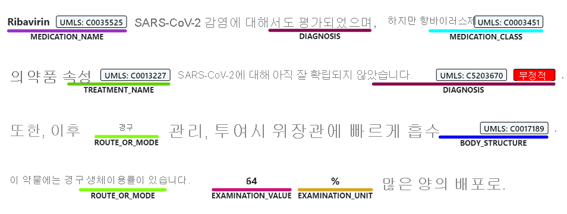
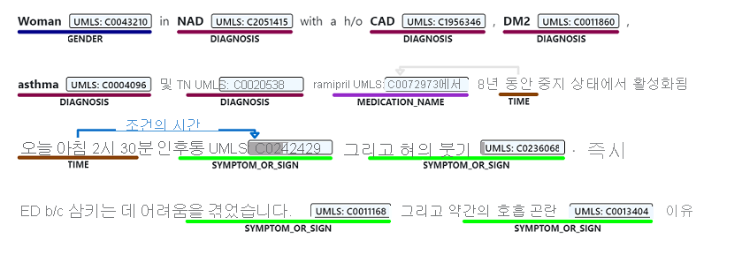
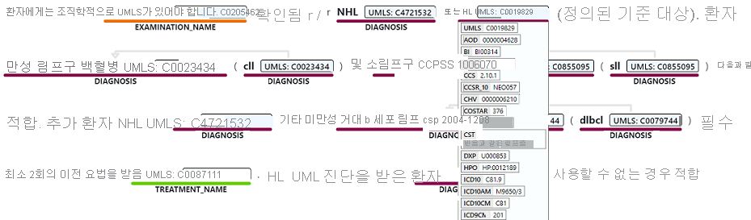
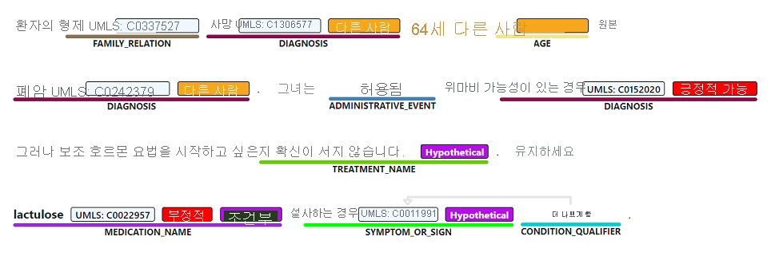

# [명명된 엔터티 인식](#tab/ner)

명명된 엔터티 인식은 진단, 처방약 이름, 증상/징후 또는 연령과 같은 하나 이상의 의미 체계와 연관될 수 있는 비구조적 텍스트에 언급된 단어 및 구를 검색합니다.

> [!div class="mx-imgBorder"]
> 

# [관계 추출](#tab/relation-extraction)

관계 추출은 텍스트에 언급된 개념 간의 의미 있는 연결을 식별합니다. 예를 들어, "조건 시간" 관계는 조건 이름을 시간에 연결하여 찾거나 약어와 전체 설명 사이에서 찾습니다.  

> [!div class="mx-imgBorder"]
> 

# [엔터티 연결](#tab/entity-linking)

엔터티 링크 설정은 텍스트에 언급된 명명된 엔터티를 UMLS(통합 의료 언어 시스템)를 포함하여 사전 정의된 개념 데이터베이스에 있는 개념에 연결하여 고유한 엔터티를 구분합니다. 의료 개념에는 추가 정규화 형식으로 선호하는 이름이 지정됩니다.

> [!div class="mx-imgBorder"]
> 

의료 분야 Text Analytics는 [UMLS](https://www.nlm.nih.gov/research/umls/sourcereleasedocs/index.html)(Unified Modeling Language) Metathesaurus 기술 자료에 있는 상태 및 생명 공학 어휘에 연결하는 것을 지원합니다.

# [어설션 검색](#tab/assertion-detection) 

의료 콘텐츠의 의미는 부정적 또는 조건적 어설션과 같은 한정자에 의해 크게 영향을 받습니다. 이러한 어설션이 잘못 표현될 경우 중대한 영향을 미칠 수 있습니다. 의료 분야 Text Analytics는 텍스트의 엔터티에 대한 세 가지 범주의 어설션 검색을 지원합니다. 

* 확신도
* 조건부
* 연결

> [!div class="mx-imgBorder"]
> 

---
