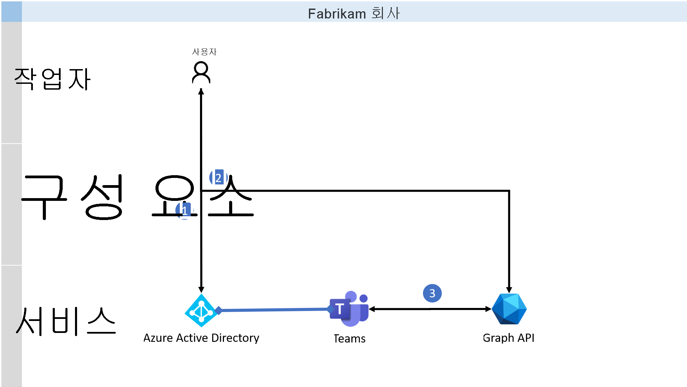

# 사용자 지정 Teams 엔드포인트

> [!IMPORTANT]
> 사용자 지정 Teams 엔드포인트 환경을 사용하거나 사용하지 않도록 설정하려면 [이 양식](https://forms.office.com/r/B8p5KqCH19)을 작성합니다.

Azure Communication Services를 사용하여 Microsoft Teams 클라이언트 또는 다른 사용자 지정 Teams 엔드포인트와 통신하는 사용자 지정 Teams 엔드포인트를 빌드할 수 있습니다. 사용자 지정 Teams 엔드포인트를 사용하면 Teams 사용자에 대한 음성, 비디오, 채팅 및 화면 공유 환경을 사용자 지정할 수 있습니다.

Azure Communication Services ID SDK를 사용하여 Teams의 액세스 토큰에 대한 AAD 사용자 토큰을 교환할 수 있습니다. 다음 다이어그램에서는 Contoso 회사의 고객인 Fabrikam이 다중 테넌트 사용 사례를 보여줍니다.

## 호출 

음성, 비디오 및 화면 공유 기능은 Azure Communication Services Calling SDK를 통해 제공됩니다. 다음 다이어그램은 통화 환경을 사용자 지정 Teams 엔드포인트와 통합할 때 따라야 하는 프로세스의 개요를 보여줍니다.

## 채팅

사용자 지정 Teams 엔드포인트를 사용하여 필요에 따라 Graph API를 통해 채팅 기능을 통합할 수도 있습니다. [설명서](https://docs.microsoft.com/graph/api/channel-post-messages)에서 Graph API에 대해 자세히 알아보세요. 

## 다음 단계

> [!div class="nextstepaction"]
> [Teams 액세스 토큰 발급](../quickstarts/manage-teams-identity.md)

다음 문서는 사용자에게 유용할 수 있습니다.

- [Teams 상호 운용성](./teams-interop.md)에 대해 알아보기
