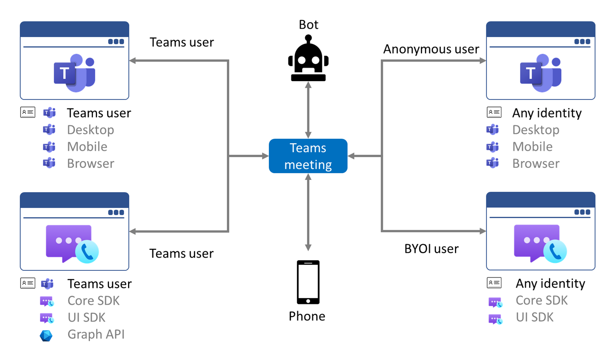
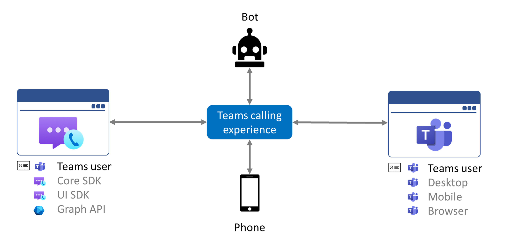

# Teams 상호 운용성

> [!IMPORTANT]
> BYOI(사용자 고유의 ID 가져오기) 상호 운용성은 공개 미리 보기로 제공되며 모든 Communication Services 애플리케이션 및 Teams 조직에서 사용할 수 있습니다.
>
> Teams ID 상호 운용성은 프라이빗 미리 보기로 제공되며, 서비스 제어 사용을 Azure Communication Services 얼리어답터로 제한합니다. 미리 이용 프로그램에 참가하려면 [이 양식](https://forms.office.com/Pages/ResponsePage.aspx?id=v4j5cvGGr0GRqy180BHbR8MfnD7fOYZEompFbYDoD4JUMkdYT0xKUUJLR001ODdQRk1ITTdOMlRZNSQlQCN0PWcu)을 작성하세요.
>
> 미리 보기 API 및 SDK는 서비스 수준 계약 없이 제공되며, 프로덕션 워크로드에는 추천되지 않습니다. 특정 기능이 지원되지 않거나 기능이 제한될 수 있습니다. 자세한 내용은 [Microsoft Azure Preview에 대한 추가 사용 약관](https://azure.microsoft.com/support/legal/preview-supplemental-terms/)을 참조하세요.

Azure Communication Services는 음성, 비디오, 채팅 및 화면 공유를 통해 Microsoft Teams 사용자와 상호 작용할 수 있도록 하는 사용자 지정 애플리케이션 및 환경을 빌드하는 데 사용할 수 있습니다. [Communication Services UI 라이브러리](ui-library/ui-library-overview.md)는 이러한 애플리케이션에 쉽게 추가할 수 있는 사용자 지정 가능한 프로덕션 준비 UI 구성 요소를 제공합니다. 다음 비디오는 Teams 상호 운용성의 몇 가지 기능을 보여줍니다.

 

> [!VIDEO https://www.microsoft.com/en-us/videoplayer/embed/RWGTqQ]

## 사용자 ID 모델

Azure Communication Services는 최종 사용자의 ID에 따라 다음 두 가지 유형의 Teams 상호 운용성을 지원합니다.

- **[BYOI(사용자 고유의 ID 가져오기)](#bring-your-own-identity).** 사용자 인증을 제어할 수 있으며, 사용자 지정 애플리케이션의 사용자는 Azure Active Directory ID 또는 Teams 라이선스를 보유할 필요가 없습니다. 이 모델을 사용하면 Teams 없는 사용자를 위한 사용자 지정 프로그램을 빌드하여 Teams 사용자와 연결하고 통신할 수 있습니다.
- **[Teams ID](#teams-identity).** 사용자 인증은 Azure Active Directory에 의해 제어되며 사용자 지정 애플리케이션의 사용자는 Teams 라이선스를 보유해야 합니다. 이 모델을 사용하면 Teams 사용자에 대한 사용자 지정 애플리케이션을 빌드하여 표준 Teams 클라이언트에서는 불가능한 특수 워크플로 또는 환경을 사용할 수 있습니다.

애플리케이션은 두 인증 모델을 모두 구현하고 최종 사용자에게 인증 선택을 맡길 수 있습니다. 다음 표에서는 두 모델을 비교하는 방법을 보여줍니다.

|기능|사용자 고유의 ID 가져오기| Teams ID|
|---|---|---|
|ID 공급자|모두|Azure Active Directory|
|인증 및 권한 부여|사용자 지정*| Azure Active Directory 및 사용자 지정*|
|통화에 사용 가능한 수단 | Azure Communication Services 통화 SDK | Azure Communication Services 통화 SDK |
|채팅에 사용 가능한 수단 | Communication Services 채팅 SDK | 그래프 API |
|Teams 모임 참가 | 예 | 예 |
|Teams 사용자와 통화 및 받기 | 아니요 | 예 |
|PSTN 지원| Teams 모임의 Communication Services 사용자에게는 지원되지 않음 | Teams ID에 할당된 인바운드 통화, 통화 플랜을 사용하는 아웃바운드 통화|

\* 액세스 토큰을 발급하는 서버 논리는 요청의 모든 사용자 지정 인증 및 권한 부여를 수행할 수 있습니다.

## 사용자 고유의 ID 가져오기

BYOI(사용자 고유의 ID 가져오기) 인증 모델을 사용하면 Teams 없는 사용자를 위한 사용자 지정 애플리케이션을 빌드하여 Teams 사용자와 연결하고 통신할 수 있습니다. 사용자 인증을 제어할 수 있으며, 사용자 지정 애플리케이션의 사용자는 Azure Active Directory ID 또는 Teams 라이선스를 보유할 필요가 없습니다. 사용된 첫 번째 시나리오를 통해 애플리케이션의 사용자가 Teams 웹 애플리케이션을 사용하여 [회의에 조인하는 익명 사용자](/microsoftteams/meeting-settings-in-teams#allow-anonymous-users-to-join-meetings)와 유사하게 Microsoft Teams 회의에 외부 계정으로 조인할 수 있습니다. 직원(Teams에 익숙함)과 외부 사용자(사용자 지정 애플리케이션 사용)를 모임 환경에 결합하는 B2C(business-to-customer) 애플리케이션에 적합합니다. 향후에는 애플리케이션에서 Teams 회의의 컨텍스트 외부에서 Teams 사용자와 통화 및 채팅을 시작할 수 있도록 하는 직접 호출 및 채팅을 비롯한 추가 시나리오를 지원할 예정입니다.

자세한 내용은 [Teams 모임 조인](join-teams-meeting.md)을 참조하세요.

현재 Teams 사용자는 Azure Communication Services Calling SDK를 사용하여 시작된 호출에 조인할 수 없습니다.

## Teams ID

Azure Communication Services Calling SDK를 Teams ID와 함께 사용하여 Teams 사용자를 위한 사용자 지정 애플리케이션을 빌드하여 표준 Teams 클라이언트에서 가능하지 않은 특수한 워크플로 또는 환경을 사용할 수 있습니다. Teams ID는 Azure Active Directory에 의해 인증되며 사용자에 대한 모든 특성과 세부 정보는 Azure Active Directory 계정에 바인딩됩니다.

Teams ID 모델은 사용자 지정 사용자 인터페이스가 필요하거나, 플랫폼에서 Teams 클라이언트를 사용할 수 없거나, Teams 클라이언트에서 충분한 수준의 사용자 지정을 지원하지 않는 사용 사례에 적합합니다. 예를 들어 애플리케이션을 사용하여 Teams에서 프로비전한 최종 사용자의 PSTN 번호를 대신하여 전화 통화에 응답하고, 접수원 또는 콜 센터 비즈니스 프로세스에 최적화된 사용자 인터페이스를 포함할 수 있습니다.

Communication Services 엔드포인트가 Teams ID를 사용하여 Teams 모임 또는 통화에 연결하면 엔드포인트는 BYOI 사용자보다 더 많은 기능에 액세스할 수 있는 Teams 클라이언트가 있는 Teams 사용자처럼 처리됩니다. Teams 사용자는 Teams 회의에 참여하고, 다른 Teams 사용자를 호출하고, 전화번호로 오는 통화를 수신하고, 진행 중인 통화를 Teams 통화 대기열로 전송할 수 있습니다.

통화 및 화면 공유 기능은 Communication Services 통화 SDK를 통해 사용할 수 있습니다. 통화 관리는 Graph API, Teams 클라이언트의 구성 또는 Teams 관리 포털을 통해 사용할 수 있습니다. 채팅 기능은 Graph API를 통해 사용할 수 있습니다.

Teams 사용자는 MSAL 라이브러리를 통해 클라이언트 애플리케이션의 Azure Active Directory에 대해 인증됩니다. Azure Active Directory에서 받은 인증 토큰은 Communication Services ID SDK를 통해 Communication Services 액세스 토큰으로 교환됩니다. 교환 요청이 Azure Communication Services에 대한 자격 증명으로 서명되므로 백 엔드 서비스에서 토큰 교환을 구현하는 것이 좋습니다. 백 엔드 서비스에서는 추가 인증을 요구할 수 있습니다.

기능에 대해 자세히 알아보려면 [이 양식](https://forms.office.com/Pages/ResponsePage.aspx?id=v4j5cvGGr0GRqy180BHbR8MfnD7fOYZEompFbYDoD4JUMkdYT0xKUUJLR001ODdQRk1ITTdOMlRZNSQlQCN0PWcu)을 작성하여 미리 이용하기 위한 TAP 프로그램에 참가하세요.

## Teams 모임 및 통화 환경

사용자가 Teams 모임에 조인할 수 있는 몇 가지 방법이 있습니다.

- Teams 클라이언트를 통해 인증된 **Teams 사용자** 로 여기에는 데스크톱, 모바일 및 웹 Teams 클라이언트가 포함됩니다.
- Teams 클라이언트를 통해 인증되지 않은 **익명 사용자** 로 
- 사용자 지정 Communication Services 애플리케이션을 통해 **BYOI 사용자** 로 사용자 고유의 ID 인증 모델 가져오기를 사용하세요. 
- 사용자 지정 Communication Services 애플리케이션을 통해 **Teams 사용자** 로 Teams ID 인증 모델을 사용하세요.

Teams ID 인증 모델을 통해 Communication Services 애플리케이션을 사용하면 **Teams 사용자** 가 Teams 클라이언트를 사용하는 다른 **Teams 사용자** 와의 통화에 조인할 수 있습니다. 

## 개인 정보 취급 방침
Azure Communication Services와 Microsoft Teams 간의 상호 운용성을 통해 애플리케이션과 사용자가 Teams 통화, 회의 및 채팅에 참여할 수 있습니다. Teams 통화 또는 회의에서 기록 또는 전사를 사용하도록 설정할 때 애플리케이션 사용자에게 알림을 제공하는 것은 귀하의 책임입니다.

Microsoft는 기록 또는 전사가 시작되었음을 Azure Communication Services API를 통해 사용자에게 알리며, 애플리케이션의 사용자 인터페이스 내에서 사용자에게 실시간으로 이 사실을 전달해야 합니다. 귀하는 이 의무를 준수하지 않아 발생한 모든 비용 및 손해에 대해 Microsoft를 면책하는 데 동의합니다.

## 가격 책정
Azure Communication Service API 및 SDK의 모든 사용량은 [Azure Communication Service 청구 미터](https://azure.microsoft.com/pricing/details/communication-services/)를 증가시킵니다. 모임에 참가하거나 할당된 번호를 사용하여 전화 통화를 시작하는 것과 같은 Microsoft Teams와의 상호 작용은 이러한 미터를 증가시키지만, Teams 상호 운용성 기능 자체에 대한 추가 요금이 없으며 BYOI와 Microsoft 365 인증 옵션 간에 가격 책정 차이가 없습니다.

Azure 애플리케이션에서 최종 사용자가 Microsoft Teams 사용자와의 모임에서 10분을 소비하는 경우 이 두 사용자를 합쳐 20분의 통화가 소요되었습니다. Azure API 및 SDK를 사용하여 사용자 지정 애플리케이션을 통해 10분 동안 연습한 경우 리소스에 대한 요금이 청구됩니다. 그러나 기본 Teams 애플리케이션에서 최종 사용자가 소비하는 10분은 해당 Teams 라이선스의 적용을 받으며 Azure에서 계량되지 않습니다.

## 정부 클라우드(GCC)의 팀
Azure Communication Services 상호 운영성은 현재 [Microsoft 365 정부 클라우드(GCC)](/MicrosoftTeams/plan-for-government-gcc)를 사용하는 Teams 배포와 호환되지 않습니다.

## 다음 단계

> [!div class="nextstepaction"]
> [Teams 액세스 토큰 사용](../quickstarts/manage-teams-identity.md)
