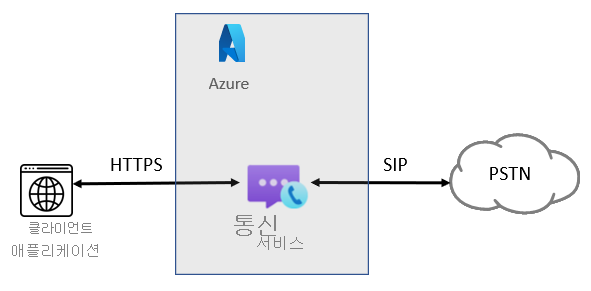
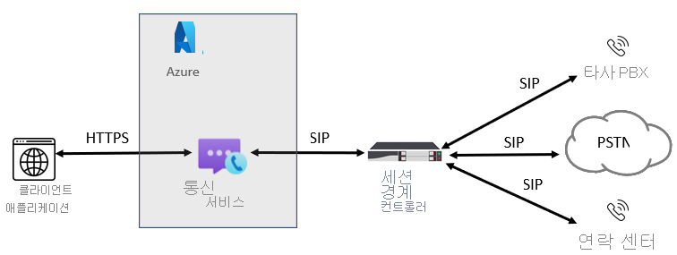

# 전화 통신 개념

[!INCLUDE [Regional Availability Notice](../../includes/regional-availability-include.md)]

Azure Communication Services Calling SDK를 사용하여 전화 통신 및 공중 전화망 액세스를 애플리케이션에 추가할 수 있습니다. 이 페이지에는 주요 전화 통신 개념 및 기능이 요약되어 있습니다. 특정 SDK 언어 및 기능에 대해 자세히 알아보려면 [통화 라이브러리](../../quickstarts/voice-video-calling/calling-client-samples.md)를 참조하세요.

## 전화 통신 개요
사용자가 기존 전화 번호와 상호 작용할 때마다 PSTN(공중 교환 전화망) 음성 통화를 통해 통화가 지원됩니다. PSTN 호출을 수행 및 수신하려면 Azure Communication Services 리소스에 전화 통신 기능을 추가해야 합니다. 이 경우 신호와 미디어는 IP 기반 및 PSTN 기반 기술의 조합을 사용하여 사용자를 연결합니다. Communication Services는 PSTN 네트워크에 연결하는 두 가지 방법, 즉 음성 통화(PSTN) 및 Azure 직접 라우팅을 제공합니다.

### 음성 통화(PSTN)

앱 또는 서비스에 PSTN 연결을 추가하는 쉬운 방법입니다. 이 경우 Microsoft가 telco 공급자입니다. Microsoft에서 직접 번호를 구입할 수 있습니다. Azure Cloud Calling은 Communication Services에 대한 클라우드 간 전화 통신 솔루션입니다. 이 옵션은 전 세계 유선전화 및 휴대폰으로 전화를 걸 수 있도록 Communication Services를 PSTN(공중 전화망)에 연결하는 가장 간단한 옵션입니다. 다음 다이어그램에 표시된 것처럼 Microsoft가 PSTN 이동 통신 사업자 역할을 합니다.

다음에 ‘예’라고 대답하는 경우 음성 통화(PSTN)가 사용자에게 적합한 솔루션입니다.
- 음성 통화(PSTN)는 해당 지역에서 사용할 수 있습니다.
- 현재 PSTN 이동 통신 사업자를 유지할 필요가 없는 경우
- Microsoft에서 관리하는 PSTN 액세스를 사용하려는 경우

이 옵션을 사용하여:
- Microsoft에서 직접 번호를 받고 전 세계에 전화를 걸 수 있습니다.
- 음성 통화(PSTN)는 Azure Communication Services 외부에서 작동하기 때문에 배포 또는 온-프레미스 배포의 유지 관리가 필요하지 않습니다.
- 참고: 필요한 경우 타사 PBX, 아날로그 디바이스 및 SBC에서 지원되는 기타 타사 전화 통신 장비와의 상호 운용성을 위해 지원되는 SBC(세션 경계 컨트롤러)를 Azure 직접 라우팅을 통해 연결하도록 선택할 수 있습니다.

이 옵션을 사용하려면 Azure Communication Services에 대한 무중단 연결이 필요합니다.  

클라우드 통화의 경우 아웃바운드 통화는 국가에 따라 분당 요금으로 청구됩니다. [PSTN 통화에 대한 현재 요금 목록](https://github.com/Azure/Communication/blob/master/pricing/communication-services-pstn-rates.csv)을 참조하세요.

### Azure 직접 라우팅

[!INCLUDE [Public Preview](../../includes/public-preview-include-document.md)]

이 옵션을 사용하여 레거시 온-프레미스 전화 통신 및 선택한 이동 통신 사업자를 Azure Communication Services에 연결할 수 있습니다. 해당 국가/지역에서 음성 통화(PSTN)를 사용할 수 없는 경우에도 Communication Services 애플리케이션에 PSTN 통화 기능을 제공합니다. 

다음 질문 중 하나에 ‘예’라고 대답하는 경우 Azure 직접 라우팅이 사용자에게 적합한 솔루션입니다.

- PSTN 통화 기능이 포함된 Communication Services를 사용하려는 경우
- 현재 PSTN 이동 통신 사업자를 유지해야 하는 경우
- 일부 통화는 음성 통화(PSTN)를 통과하고, 일부 통화는 이동 통신 사업자를 통과하는 혼합 라우팅을 사용하려는 경우
- 타사 PBX 및/또는 장비(예: 천장 호출기, 아날로그 디바이스 등)와 상호 운용해야 하는 경우

이 옵션을 사용하여:

- 추가 온-프레미스 소프트웨어를 설치할 필요 없이 지원되는 자체 SBC를 Azure Communication Services에 연결합니다.
- 말 그대로 모든 전화 통신 사업자를 Communication Services와 함께 사용할 수 있습니다.
- 이 옵션을 직접 구성하고 관리하도록 선택할 수 있습니다. 또는 이동 통신 사업자 또는 파트너가 구성하고 관리할 수 있습니다(이동 통신 사업자 또는 파트너가 이 옵션을 제공하는지 문의).
- 타사 PBX 및 아날로그 디바이스와 같은 전화 통신 장비와 Communication Services 간 상호 운용성을 구성할 수 있습니다.

이 옵션에는 다음이 필요합니다.

- Azure에 대한 무중단 연결
- 지원되는 SBC 배포 및 유지 관리
- 타사 이동 통신 사업자와의 계약 (Communication Services에 있는 사용자에게 타사 PBX, 아날로그 디바이스 또는 기타 전화 통신 장비에 대한 연결을 제공하기 위한 옵션으로 배포되지 않은 경우)

## 다음 단계

### 개념 설명서

- [Azure Communication Services의 전화 번호 유형](./plan-solution.md)
- [Azure 직접 라우팅 계획](./direct-routing-infrastructure.md)
- [Azure Communication Services 직접 라우팅에 대해 인증된 Session Border Controller](./certified-session-border-controllers.md)
- [가격](../pricing.md)

### 빠른 시작

- [전화 번호 받기](../../quickstarts/telephony-sms/get-phone-number.md)
- [휴대폰에 전화 걸기](../../quickstarts/voice-video-calling/pstn-call.md)
