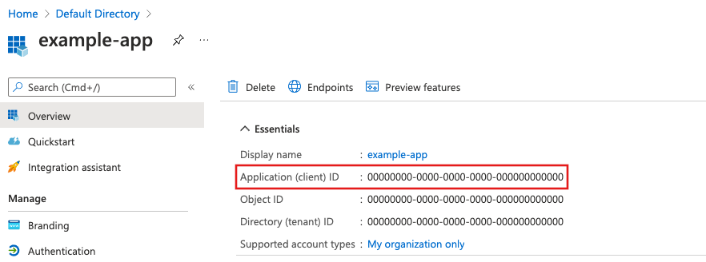
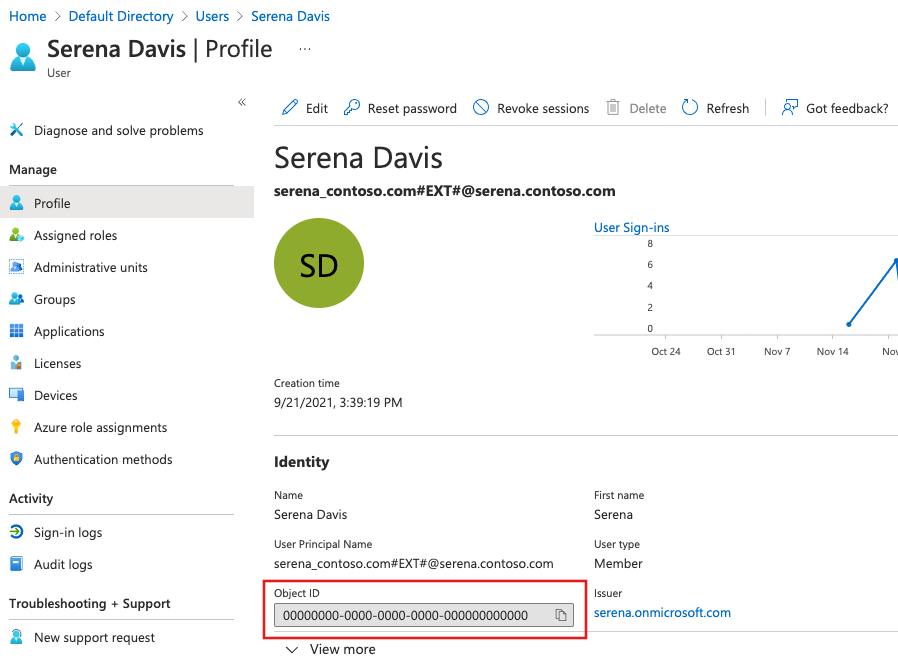

# <a name="troubleshooting-in-azure-communication-services"></a>Azure Communication Services의 문제 해결

이 문서는 Communication Services 솔루션에서 발생할 수 있는 문제를 해결하는 데 도움이 됩니다. SMS 문제를 해결하는 경우 [Event Grid를 통해 전달 보고를 사용](../quickstarts/telephony-sms/handle-sms-events.md)하여 SMS 전달 세부 정보를 캡처할 수 있습니다.

## <a name="getting-help"></a>도움말 보기

개발자는 질문을 제출하고, 기능을 제안하고, 문제를 보고하는 것이 좋습니다. 이를 지원하기 위해 지원 옵션이 나열된 [전용 지원 및 도움말 옵션 페이지](../support.md)가 있습니다.

특정 유형의 문제를 해결하는 데 도움이 되도록 다음 정보 중 하나를 입력하라는 메시지가 표시될 수 있습니다.

* **MS-CV ID**: 이 ID는 호출 및 메시지 문제를 해결하는 데 사용됩니다.
* **호출 ID**: 이 ID는 Communication Services 호출을 식별하는 데 사용됩니다.
* **SMS 메시지 ID**: 이 ID는 SMS 메시지를 식별하는 데 사용됩니다.
* **통화 로그**: 이러한 로그에는 통화 및 네트워크 문제를 해결하는 데 사용할 수 있는 자세한 정보가 포함되어 있습니다.


## <a name="access-your-ms-cv-id"></a>MS CV ID에 액세스

MS-CV ID는 SDK를 초기화할 때 `clientOptions` 개체 인스턴스에서 진단을 구성하여 액세스할 수 있습니다. 채팅, ID 및 VoIP 호출을 비롯한 모든 Azure SDK에 대해 진단을 구성할 수 있습니다.

### <a name="client-options-example"></a>클라이언트 옵션 예제

다음 코드 조각에서는 진단 구성을 보여줍니다. 진단이 활성화된 SDK를 사용하는 경우 진단 세부 정보가 구성된 이벤트 수신기로 내보내집니다.

# <a name="c"></a>[C#](#tab/csharp)
```
// 1. Import Azure.Core.Diagnostics
using Azure.Core.Diagnostics;

// 2. Initialize an event source listener instance
using var listener = AzureEventSourceListener.CreateConsoleLogger();
Uri endpoint = new Uri("https://<RESOURCE-NAME>.communication.azure.net");
var (token, communicationUser) = await GetCommunicationUserAndToken();
CommunicationUserCredential communicationUserCredential = new CommunicationUserCredential(token);

// 3. Setup diagnostic settings
var clientOptions = new ChatClientOptions()
{
    Diagnostics =
    {
        LoggedHeaderNames = { "*" },
        LoggedQueryParameters = { "*" },
        IsLoggingContentEnabled = true,
    }
};

// 4. Initialize the ChatClient instance with the clientOptions
ChatClient chatClient = new ChatClient(endpoint, communicationUserCredential, clientOptions);
ChatThreadClient chatThreadClient = await chatClient.CreateChatThreadAsync("Thread Topic", new[] { new ChatThreadMember(communicationUser) });
```

# <a name="python"></a>[Python](#tab/python)
```
from azure.communication.chat import ChatClient, CommunicationUserCredential
endpoint = "https://communication-services-sdk-live-tests-for-python.communication.azure.com"
chat_client = ChatClient(
    endpoint,
    CommunicationUserCredential(token),
    http_logging_policy=your_logging_policy)
```
---

## <a name="access-your-server-call-id"></a>서버 호출 ID에 액세스
통화 녹음/녹화 및 통화 관리 문제와 같은 통화 자동화 SDK 문제를 해결할 때 서버 통화 ID를 수집해야 합니다. 이 ID는 ```getServerCallId``` 메서드를 사용하여 수집할 수 있습니다.

#### <a name="javascript"></a>JavaScript
```
callAgent.on('callsUpdated', (e: { added: Call[]; removed: Call[] }): void => {
    e.added.forEach((addedCall) => {
        addedCall.on('stateChanged', (): void => {
            if (addedCall.state === 'Connected') {
                addedCall.info.getServerCallId().then(result => {
                    dispatch(setServerCallId(result));
                }).catch(err => {
                    console.log(err);
                });
            }
        });
    });
});
```


## <a name="access-your-client-call-id"></a>클라이언트 호출 ID에 액세스

음성 또는 화상 통화 문제를 해결할 때 `call ID`를 제공하라는 메시지가 표시될 수 있습니다. 이는 `call` 개체의 `id` 속성을 통해 액세스할 수 있습니다.

# <a name="javascript"></a>[JavaScript](#tab/javascript)
```javascript
// `call` is an instance of a call created by `callAgent.startCall` or `callAgent.join` methods
console.log(call.id)
```

# <a name="ios"></a>[iOS](#tab/ios)
```objc
// The `call id` property can be retrieved by calling the `call.getCallId()` method on a call object after a call ends
// todo: the code snippet suggests it's a property while the comment suggests it's a method call
print(call.callId)
```

# <a name="android"></a>[Android](#tab/android)
```java
// The `call id` property can be retrieved by calling the `call.getCallId()` method on a call object after a call ends
// `call` is an instance of a call created by `callAgent.startCall(…)` or `callAgent.join(…)` methods
Log.d(call.getCallId())
```
---

## <a name="access-your-sms-message-id"></a>SMS 메시지 ID에 액세스

SMS 문제의 경우 응답 개체에서 메시지 ID를 수집할 수 있습니다.

# <a name="net"></a>[.NET](#tab/dotnet)
```
// Instantiate the SMS client
const smsClient = new SmsClient(connectionString);
async function main() {
  const result = await smsClient.send({
    from: "+18445792722",
    to: ["+1972xxxxxxx"],
    message: "Hello World 👋🏻 via Sms"
  }, {
    enableDeliveryReport: true // Optional parameter
  });
console.log(result); // your message ID will be in the result
}
```
---

## <a name="enable-and-access-call-logs"></a>통화 로그 활성화 및 액세스

# <a name="javascript"></a>[JavaScript](#tab/javascript)

Azure Communication Services Calling SDK는 내부적으로 [@azure/logger](https://www.npmjs.com/package/@azure/logger) 라이브러리를 사용하여 로깅을 제어합니다.
`@azure/logger` 패키지의 `setLogLevel` 메서드를 사용하여 로그 출력을 구성합니다.

```javascript
import { setLogLevel } from '@azure/logger';
setLogLevel('verbose');
const callClient = new CallClient();
```

AzureLogger를 사용해 `AzureLogger.log` 메서드를 재정의하여 Azure SDK에서 로깅 출력을 리디렉션할 수 있습니다. 이는 로그를 콘솔 이외의 위치로 리디렉션하는 경우에 유용할 수 있습니다.

```javascript
import { AzureLogger } from '@azure/logger';
// redirect log output
AzureLogger.log = (...args) => {
  console.log(...args); // to console, file, buffer, REST API..
};
```

# <a name="ios"></a>[iOS](#tab/ios)

iOS용으로 개발할 때 로그는 `.blog` 파일에 저장됩니다. 로그는 암호화되어 있으므로 직접 볼 수 없습니다.

Xcode를 열어 액세스할 수 있습니다. Windows > 디바이스 및 시뮬레이터 > 디바이스로 이동합니다. 디바이스를 선택합니다. 설치된 앱에서 애플리케이션을 선택하고 "컨테이너 다운로드"를 클릭합니다.

그러면 `xcappdata` 파일이 제공됩니다. 이 파일을 마우스 오른쪽 단추로 클릭하고 “패키지 내용 표시”를 선택합니다. 그러면 Azure 지원 요청에 첨부할 수 있는 `.blog` 파일이 표시됩니다.

# <a name="android"></a>[Android](#tab/android)

Android용으로 개발할 때 로그는 `.blog` 파일에 저장됩니다. 로그는 암호화되어 있으므로 직접 볼 수 없습니다.

Android Studio의 경우 시뮬레이터와 디바이스 모두에서 보기 > 도구 창 > 디바이스 파일 탐색기를 선택하여 디바이스 파일 탐색기로 이동합니다. `.blog` 파일은 `/data/data/[app_name_space:com.contoso.com.acsquickstartapp]/files/acs_sdk.blog`와 같이 표시되는 애플리케이션의 디렉터리 내에 위치합니다. 이 파일을 지원 요청에 첨부할 수 있습니다.

---

## <a name="enable-and-access-call-logs-windows"></a>통화 로그 활성화 및 액세스(Windows)

Windows용으로 개발할 때 로그는 `.blog` 파일에 저장됩니다. 로그는 암호화되어 있으므로 직접 볼 수 없습니다.

앱에서 로컬 데이터를 보관하는 위치를 확인하면 로그에 액세스할 수 있습니다. UWP 앱에서 로컬 데이터를 보관하는 위치를 파악하는 방법은 여러 가지가 있으며, 다음 단계는 이러한 방법 중 하나일 뿐입니다.
1. Windows 명령 프롬프트를 엽니다(Windows 키 + R).
2. `cmd.exe` 입력
3. `where /r %USERPROFILE%\AppData acs*.blog` 입력
4. 애플리케이션의 앱 ID가 이전 명령에서 반환된 ID와 일치하는지 확인합니다.
5. `start `를 입력한 다음 3단계에서 반환된 경로를 입력하여 로그가 포함된 폴더를 엽니다. 예: `start C:\Users\myuser\AppData\Local\Packages\e84000dd-df04-4bbc-bf22-64b8351a9cd9_k2q8b5fxpmbf6`
6. 모든 `*.blog` 및 `*.etl` 파일을 Azure 지원 요청에 첨부합니다.

## <a name="finding-azure-active-directory-information"></a>Azure Active Directory 정보 찾기

* **디렉터리 ID 가져오기**
* **애플리케이션 ID 가져오기**
* **사용자 ID 가져오기**

## <a name="getting-directory-id"></a>디렉터리 ID 가져오기 
디렉터리(테넌트) ID를 찾으려면 아래에 나열된 단계를 수행합니다.

1. [Azure Portal](https://portal.azure.com)로 이동하고 자격 증명을 사용하여 Azure Portal에 로그인합니다.
1. 왼쪽 창에서 Azure Active Directory를 선택합니다.
1. Azure AD의 **개요** 페이지에서 디렉터리(테넌트 ID)를 복사하여 애플리케이션 코드에 저장합니다.

    

## <a name="getting-application-id"></a>애플리케이션 ID 가져오기 
애플리케이션 ID를 찾으려면 아래에 나열된 단계를 수행합니다.

1. [Azure Portal](https://portal.azure.com)로 이동하고 자격 증명을 사용하여 Azure Portal에 로그인합니다.
1. 왼쪽 창에서 Azure Active Directory를 선택합니다.
1. Azure AD의 **앱 등록** 에서 애플리케이션을 선택합니다.
1. **애플리케이션 ID** 를 복사하고 애플리케이션 코드에 저장합니다.

   

   디렉터리(테넌트) ID는 애플리케이션 개요 페이지에서도 찾을 수 있습니다.

## <a name="getting-user-id"></a>사용자 ID 가져오기
사용자 ID를 찾으려면 아래에 나열된 단계를 수행합니다.

1. [Azure Portal](https://portal.azure.com)로 이동하고 자격 증명을 사용하여 Azure Portal에 로그인합니다.
1. 왼쪽 창에서 Azure Active Directory를 선택합니다.
1. Azure AD의 **사용자** 에서 사용자를 선택합니다.
1. Azure AD 사용자의 **프로필** 페이지에서 **개체 ID** 를 복사하여 애플리케이션 코드에 저장합니다.

   

## <a name="calling-sdk-error-codes"></a>SDK 오류 코드 호출

Azure Communication Services Calling SDK는 다음 오류 코드를 사용하여 통화 문제를 해결하는 데 도움을 줍니다. 이러한 오류 코드는 통화가 종료된 후 `call.callEndReason` 속성을 통해 노출됩니다.

| 오류 코드 | Description | 수행할 작업 |
| -------- | ---------------| ---------------|
| 403 | 금지 / 인증 오류. | Communication Services 토큰이 유효하고 만료되지 않았는지 확인합니다. |
| 404 | 호출을 찾을 수 없습니다. | 통화하는 번호(또는 조인하는 통화)가 있는지 확인합니다. |
| 408 | 통화 컨트롤러 시간이 초과되었습니다. | 사용자 엔드포인트에서 프로토콜 메시지를 기다리는 동안 통화 컨트롤러 시간이 초과되었습니다. 클라이언트가 연결되어 있고 사용 가능한지 확인합니다. |
| 410 | 로컬 미디어 스택 또는 미디어 인프라 오류입니다. | 지원되는 환경에서 최신 SDK를 사용하고 있는지 확인합니다. |
| 430 | 클라이언트 애플리케이션에 메시지를 전달할 수 없습니다. | 클라이언트 애플리케이션이 실행 중이고 사용 가능한지 확인합니다. |
| 480 | 원격 클라이언트 엔드포인트가 등록되지 않았습니다. | 원격 엔드포인트를 사용할 수 있는지 확인합니다. |
| 481 | 들어오는 호출을 처리하지 못했습니다. | Azure Portal을 통해 지원 요청을 제출합니다. |
| 487 | 엔드포인트 불일치 문제로 인해 통화가 취소되거나, 로컬에서 거부되거나, 종료되었거나 미디어 제품을 생성하지 못했습니다. | 예상 동작. |
| 490, 491, 496, 487, 498 | 로컬 엔드포인트 네트워크 문제. | 네트워크를 확인합니다. |
| 500, 503, 504 | Communication Services 인프라 오류입니다. | Azure Portal을 통해 지원 요청을 제출합니다. |
| 603 | 원격 Communication Services 참가자가 전역적으로 거부한 호출 | 예상 동작. |

## <a name="chat-sdk-error-codes"></a>채팅 SDK 오류 코드

Azure Communication Services 채팅 SDK는 다음 오류 코드를 사용하여 채팅 문제를 해결하는 데 도움을 줍니다. 오류 코드는 오류 응답에서 `error.code` 속성을 통해 노출됩니다.

| 오류 코드 | Description | 수행할 작업 |
| -------- | ---------------| ---------------|
| 401 | 권한 없음 | Communication Services 토큰이 유효하고 만료되지 않았는지 확인합니다. |
| 403 | 사용할 수 없음 | 요청한 사람이 리소스에 액세스할 수 있는지 확인합니다. |
| 429 | 너무 많은 요청 | 클라이언트 쪽 애플리케이션이 사용자에게 친숙한 방식으로 이 시나리오를 처리하는지 확인합니다. 오류가 계속되면 지원 요청을 제출하세요. |
| 503 | 서비스를 사용할 수 없음 | Azure Portal을 통해 지원 요청을 제출합니다. |

## <a name="related-information"></a>관련 정보
- [로그 및 진단](logging-and-diagnostics.md)
- [메트릭](metrics.md)
