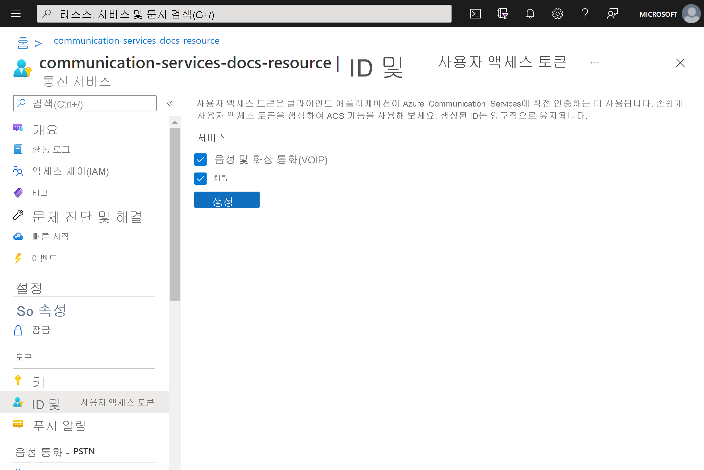
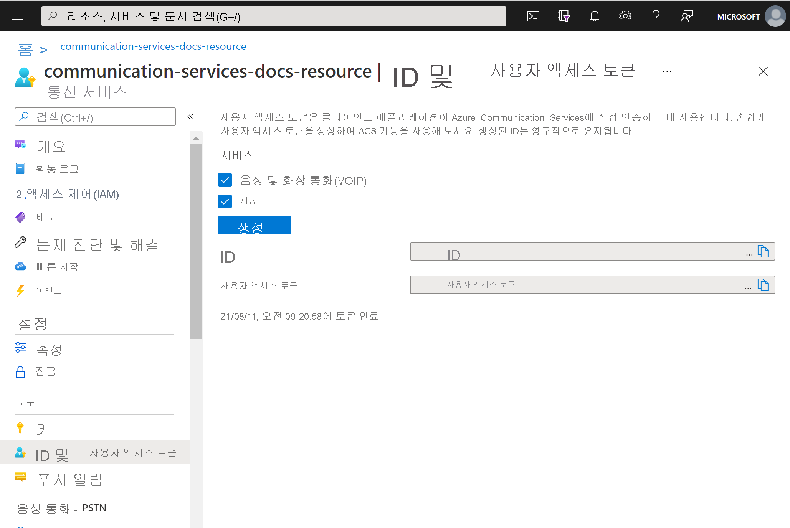

# <a name="quickstart-quickly-create-azure-communication-services-access-tokens-for-testing"></a>빠른 시작: 테스트를 위해 신속하게 Azure Communication Services 액세스 토큰 만들기

[Azure Portal](https://portal.azure.com) Communication Services 확장에서 Communication Services ID 및 액세스 토큰을 생성할 수 있습니다. 이렇게 하면 인증 서비스를 만드는 작업을 건너뛸 수 있으므로 샘플 앱과 간단한 개발 시나리오를 보다 쉽게 테스트할 수 있습니다. 이 기능은 소규모 유효성 검사와 테스트를 위한 것으로, 프로덕션 시나리오에서는 사용하면 안 됩니다. 프로덕션 코드는 [액세스 토큰 만들기 빠른 시작](../access-tokens.md)을 참조하세요.

이 도구는 간단한 사용자 환경에서 ```Identity SDK```의 동작을 보여 줍니다. 도구를 통해 만든 토큰과 ID는 ```Identity SDK```를 사용하여 만든 것처럼 동일한 동작과 규칙을 따릅니다.  예를 들어 액세스 토큰이 24시간 후에 만료됩니다.

## <a name="prerequisites"></a>필수 조건

- [Azure Communication Services 리소스](../create-communication-resource.md)

## <a name="create-the-access-tokens"></a>액세스 토큰 만들기

[Azure Portal](https://portal.azure.com)에서 Communication Services 리소스 내의 **ID 및 사용자 액세스 토큰** 블레이드로 이동합니다. 

액세스 토큰의 범위를 선택합니다. 없음, 1개 또는 여러 개를 선택할 수 있습니다. **생성** 을 클릭합니다.



ID와 해당 사용자 액세스 토큰이 생성되는 것을 확인할 수 있습니다. 이 문자열을 복사하여 [샘플 앱](../../samples/overview.md)과 기타 테스트 시나리오에서 사용할 수 있습니다.



## <a name="next-steps"></a>다음 단계


다음을 수행할 수도 있습니다.

 - [인증에 대한 자세한 정보](../../concepts/authentication.md)
 - [클라이언트 및 서버 아키텍처에 대한 자세한 정보](../../concepts/client-and-server-architecture.md)
