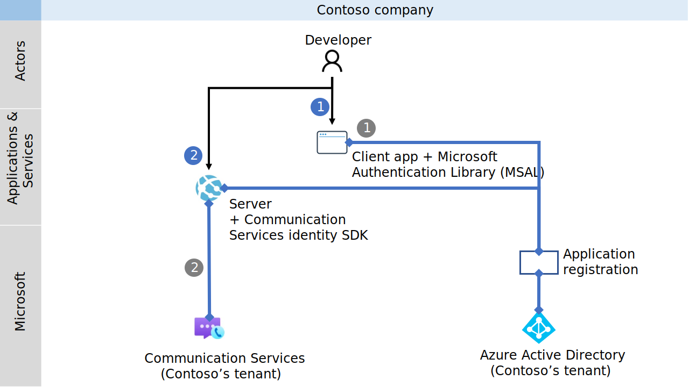
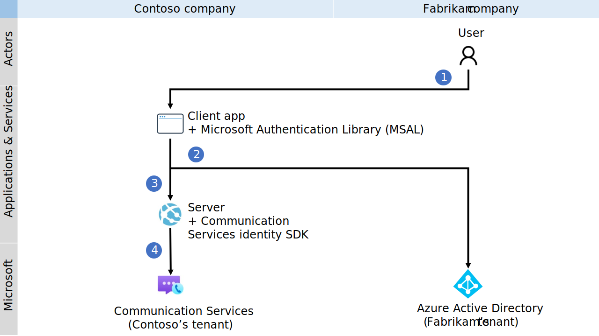

# <a name="quickstart-set-up-and-manage-teams-access-tokens"></a>빠른 시작: Teams 액세스 토큰 설정 및 관리

> [!IMPORTANT]
> 이 기능은 미리 보기에서만 사용할 수 있습니다. 사용자 지정 Teams 엔드포인트 환경을 사용하거나 사용하지 않도록 설정하려면 [이 양식을 작성하여 제출](https://forms.office.com/r/B8p5KqCH19)합니다.

이 빠른 시작에서 MSAL(Microsoft 인증 라이브러리)를 사용하고 Azure AD(Azure Active Directory) 사용자 토큰을 검색하여 Microsoft 365 사용자를 인증하기 위해 .NET 콘솔 애플리케이션을 빌드합니다. 그런 다음 이 토큰을 Azure Communication Services ID SDK를 통해 Teams 액세스 토큰으로 교환합니다. 그러면 Communication Services Calling SDK에서 Teams 액세스 토큰을 사용하여 사용자 지정 Teams 엔드포인트를 빌드할 수 있습니다.

> [!NOTE]
> 프로덕션 환경에 있는 경우 교환 요청이 비밀로 서명되기 때문에 이 교환 메커니즘은 백엔드 서비스에서 구현하는 것이 좋습니다.

## <a name="prerequisites"></a>사전 요구 사항
- 활성 구독이 있는 Azure 계정. [체험 계정을 만듭니다](https://azure.microsoft.com/free/?WT.mc_id=A261C142F).
- 활성 Azure Communication Services 리소스 및 연결 문자열 자세한 내용은 [Azure Communication Services 리소스 만들기](./create-communication-resource.md)를 참조하세요.
- [이 양식을 작성하고 제출해서](https://forms.office.com/r/B8p5KqCH19) 사용자 지정 Teams 엔드포인트 환경을 활성화합니다.
- 사용자에게 Teams 라이선스가 있는 Azure Active Directory 인스턴스

## <a name="introduction"></a>소개

Teams ID는 Azure Active Directory에 있는 테넌트에 바인딩됩니다. 애플리케이션은 동일한 테넌트의 사용자 또는 다른 테넌트의 사용자도 사용할 수 있습니다. 이 빠른 시작에서는 가상 회사인 Contoso 및 Fabrikam의 사용자, 개발자 및 관리자를 통해 다중 테넌트 사용 사례를 살펴보겠습니다. 이 사용 사례에서 Contoso는 Fabrikam에 대해 SaaS(Software as a Service) 솔루션을 구축하는 회사입니다. 

다음 섹션에서는 관리자, 개발자 및 사용자를 위한 단계를 안내합니다. 다이어그램에 다중 테넌트 사용 사례가 설명되어 있습니다. 단일 테넌트를 사용하는 경우 단일 테넌트의 Contoso 및 Fabrikam에서 모든 단계를 실행합니다.

## <a name="administrator-actions"></a>관리자 작업

관리자 역할은 Azure AD에서 확장된 사용 권한을 가집니다. 이 역할의 멤버는 리소스를 설정할 수 있으며 Azure Portal의 정보를 읽을 수 있습니다. 다음 다이어그램에서는 관리자가 실행해야 하는 모든 작업을 볼 수 있습니다.


1. Contoso 관리자는 Azure Active Directory에서 기존 애플리케이션을 만들거나 선택합니다. 지원되는 계정 유형 속성은 다양한 테넌트의 사용자가 애플리케이션에 인증할 수 있는지 여부를 정의합니다. 리디렉션 URI 속성은 성공적인 인증 요청을 Contoso 의 서버로 리디렉션합니다.
1. Contoso 관리자는 Communication Services VoIP 사용 권한으로 애플리케이션의 매니페스트를 확장합니다. 
1. Contoso 관리자는 애플리케이션에 대한 퍼블릭 클라이언트 흐름을 허용합니다.
1. Contoso 관리자는 필요에 따라 업데이트할 수 있습니다.
1. Contoso 관리자는[이 양식을 작성해서 제출](https://forms.office.com/r/B8p5KqCH19)하여 환경을 활성화합니다.
1. Contoso의 관리자는 교환 요청을 인증하는 데 사용되는 기존 Communication Services를 만들거나 선택합니다. Azure AD 사용자 토큰은 Teams 액세스 토큰에 대해 교환됩니다. 자세한 내용은 [Communication Services 리소스 만들기 및 관리](./create-communication-resource.md)를 참조하세요.
1. Fabrikam 관리자는 Fabrikam 테넌트에서 Communication Services의 새 서비스 주체를 설정합니다. 애플리케이션이 없는 경우 이 단계가 필요합니다.
1. Fabrikam 관리자는 Contoso 애플리케이션에 Communication Services VoIP 또는 `Teams.ManageCalls` 권한을 부여합니다. 이 단계는 Contoso 애플리케이션이 확인되지 않은 경우에만 필요합니다. 

### <a name="step-1-create-an-azure-ad-application-registration-or-select-an-azure-ad-application"></a>1단계: Azure AD 애플리케이션 등록 만들기 또는 Azure AD 애플리케이션 선택 

사용자는 Azure Communication Service VoIP 권한을 사용하여 Azure AD 애플리케이션에 대해 인증되어야 합니다. 이 빠른 시작에 사용할 기존 애플리케이션이 없는 경우 새 애플리케이션 등록을 만들 수 있습니다. 

환경에 영향을 주는 애플리케이션 설정은 다음과 같습니다.
- 지원되는 계정 유형 속성은 애플리케이션이 단일 테넌트(‘이 조직 디렉터리에만 있는 계정’) 또는 다중 테넌트(‘모든 조직 디렉터리의 계정’)인지 여부를 정의합니다. 이 시나리오의 경우 다중 테넌트를 사용할 수 있습니다.
- 리디렉션 URI는 인증 후 인증 요청이 리디렉션되는 URI를 정의합니다. 이 시나리오의 경우 **퍼블릭 클라이언트/네이티브(모바일 및 데스크톱)** 를 사용하고 URI로 **`http://localhost`** 를 입력합니다.

자세한 내용은 [Microsoft ID 플랫폼을 사용하여 애플리케이션 등록](../../active-directory/develop/quickstart-register-app.md#register-an-application)을 참조하세요. 

애플리케이션이 등록되면 개요에 식별자가 표시됩니다. 이 식별자, 애플리케이션(클라이언트) ID는 다음 단계에 사용됩니다.

### <a name="step-2-allow-public-client-flows"></a>2단계: 퍼블릭 클라이언트 흐름 허용

애플리케이션의 **인증** 창에서 *localhost* 를 가리키는 리디렉션 URI를 사용하여 퍼블릭 클라이언트/네이티브(모바일 및 데스크톱)에 대해 구성된 플랫폼을 확인할 수 있습니다. 창 하단에 퍼블릭 클라이언트 흐름 허용 토글 제어가 표시되며 이에 대한 빠른 시작은 **예** 로 설정되어 있어야 합니다.

### <a name="step-3-optional-update-the-publisher-domain"></a>3단계: (선택 사항) 게시자 도메인 업데이트 
**브랜딩** 창에서 애플리케이션에 대한 게시자 도메인을 업데이트할 수 있습니다. 이는 애플리케이션이 Azure에서 확인된 것으로 표시되는 다중 테넌트 애플리케이션에 유용합니다. 자세한 내용은 [애플리케이션의 게시자 도메인 구성](../../active-directory/develop/howto-configure-publisher-domain.md)을 참조하세요.

### <a name="step-4-add-the-communication-services-permissions-in-the-application"></a>4 단계: 애플리케이션에서 Communication Services 사용 권한 추가

- Azure Portal에서 AAD 앱으로 이동하고 **API 권한** 을 선택합니다.
- **권한 추가** 를 선택합니다.
- **권한 추가** 메뉴에서 **Azure Communication Services** 를 선택합니다.
- 원하는 사용 권한 **VoIP** 및/또는 **Teams.ManageCalls** 를 선택하고 **사용 권한 추가** 를 클릭합니다.


### <a name="step-5-create-or-select-a-communication-services-resource"></a>5단계: Communication Services 리소스 만들기 또는 선택

Communication Services 리소스는 Teams 액세스 토큰에 대한 Azure AD 사용자 토큰 교환을 위한 모든 요청을 인증하는 데 사용됩니다. 액세스 키나 Azure RBAC(역할 기반 액세스 제어)로 인증할 수 있는 Communication Services ID SDK를 사용하여 이 교환을 트리거할 수 있습니다. Azure Portal에서 또는 **액세스 제어(IAM)** 창의 Azure RBAC를 구성하여 액세스 키를 가져올 수 있습니다.

새 Communication Services 리소스를 만들려면 [Communication Services 리소스 만들기 및 관리](./create-communication-resource.md)를 참조하세요.

### <a name="step-6-set-up-a-communication-services-service-principal"></a>6단계: Communication Services 서비스 주체 설정

Fabrikam 테넌트의 사용자 지정 Teams 엔드포인트 환경을 사용하도록 설정하려면 Fabrikam Azure AD 관리자가 애플리케이션 ID가 *1fd5118e-2576-4263-8130-9503064c837a* 인 Azure Communication Services라는 서비스 주체를 설정해야 합니다. Azure Active Directory의 **Enterprise 애플리케이션** 창에 이 애플리케이션이 표시되지 않으면 수동으로 추가해야 합니다.

Fabrikam Azure AD 관리자는 PowerShell을 통해 Azure 테넌트에 연결합니다. 

> [!NOTE]
> 다음 명령에서 [Tenant_ID]를 Azure Portal의 Azure AD 인스턴스의 개요 페이지에 있는 테넌트 ID로 바꿉니다.

```azurepowershell
Connect-AzureAD -TenantId "[Tenant_ID]"
```

"명령을 찾을 수 없습니다" 오류가 표시되는 경우 AzureAD 모듈은 PowerShell에 설치되지 않습니다. PowerShell을 닫고 관리자 권한으로 다시 엽니다. 이제 다음 명령을 실행하여 AzureAD 패키지를 설치할 수 있습니다.

```azurepowershell
Install-Module AzureAD
```

Azure Portal에 연결하고 인증한 후 다음 명령을 실행하여 Communication Services 서비스 주체를 설정합니다. 

> [!NOTE]
> 매개 변수 AppId는 자사 애플리케이션 Communication Services를 참조합니다. 이 값은 변경하지 마세요.

```azurepowershell
New-AzureADServicePrincipal -AppId "1fd5118e-2576-4263-8130-9503064c837a"
```

### <a name="step-7-provide-administrator-consent"></a>7단계: 관리자 동의 제공

Contoso 애플리케이션이 확인되지 않은 경우 Azure AD 관리자는 Communication Services VoIP에 대해 Contoso 애플리케이션에 사용 권한을 부여해야 합니다. Fabrikam Azure AD 관리자는 고유한 URL을 통해 동의를 제공합니다. 

관리자 동의 URL을 생성하기 위해 Fabrikam Azure AD 관리자는 다음을 수행합니다.

1. URL *https://login.microsoftonline.com/{Tenant_ID}/adminconsent?client_id={Application_ID}* 에서 관리자는 {Tenant_ID}를 Fabrikam 테넌트 ID로, {Application_ID}를 Contoso 애플리케이션 ID로 바꿉니다.
1. 관리자가 로그인하고 조직을 대신하여 사용 권한을 부여합니다.

동의가 부여되면 Fabrikam의 테넌트에 있는 Contoso 애플리케이션의 서비스 주체가 만들어집니다. Fabrikam 관리자는 다음을 수행하여 Azure AD에서 동의를 검토할 수 있습니다.

1. Azure Portal에 관리자 권한으로 로그인합니다.
1. Azure Active Directory로 이동합니다.
1. **Enterprise 애플리케이션** 창에서 **애플리케이션 유형** 필터를 **모든 애플리케이션** 으로 설정합니다.
1. 애플리케이션 필터링 필드에 Contoso 애플리케이션의 이름을 입력합니다.
1. **적용** 을 선택합니다.
1. 필요한 이름을 사용하여 서비스 주체를 선택합니다. 
1. **사용 권한** 창으로 이동합니다.

Communication Services VoIP 사용 권한 상태가 *{Directory_name}에 대해 허가됨* 이 된 것을 확인할 수 있습니다.

## <a name="developer-actions"></a>개발자 작업

사용자를 인증하려면 Contoso 개발자는 클라이언트 애플리케이션을 설정해야 합니다. 리디렉션 후 Azure AD 사용자 토큰을 처리하려면 개발자는 백엔드 서버의 엔드포인트를 만들어야 합니다. Azure AD 사용자 토큰이 수신되면 Teams 액세스 토큰으로 교환되고 클라이언트 애플리케이션에 반환됩니다. 

개발자의 필수 작업은 다음 다이어그램에 표시됩니다.



1. Contoso 개발자는 Communication Services VoIP 사용 권한에 대해 관리자가 이전에 만든 애플리케이션에 사용자를 인증하도록 MSAL 라이브러리를 구성합니다.
1. Contoso 개발자는 Communication Services ID SDK를 초기화하고 SDK를 통해 들어오는 Azure AD 사용자 토큰을 Teams 액세스 토큰으로 교환합니다. 그러면 Teams의 액세스 토큰이 클라이언트 애플리케이션에 반환됩니다.

Microsoft 인증 라이브러리를 사용하여 개발자는 사용자를 인증하고 보안 웹 API에 액세스하기 위해 Microsoft ID 플랫폼 엔드포인트에서 Azure AD 사용자 토큰을 획득할 수 있습니다. Communication Services에 대한 보안 액세스를 제공하는 데 사용할 수 있습니다. MSAL은 .NET, JavaScript, Java, Python, Android 및 iOS를 비롯한 다양한 애플리케이션 아키텍처 및 플랫폼을 지원합니다.

공용 설명서의 환경 설정에 대한 자세한 내용은 [Microsoft 인증 라이브러리 개요](../../active-directory/develop/msal-overview.md)를 참조하세요.

> [!NOTE]
> 다음 섹션에서는 콘솔 애플리케이션의 Teams 액세스 토큰에 대한 Azure AD 액세스 토큰을 교환하는 방법을 설명합니다.

::: zone pivot="programming-language-csharp"
[!INCLUDE [.NET](./includes/manage-teams-identity-net.md)]
::: zone-end

::: zone pivot="programming-language-javascript"
[!INCLUDE [JavaScript](./includes/manage-teams-identity-js.md)]
::: zone-end

::: zone pivot="programming-language-python"
[!INCLUDE [Python](./includes/manage-teams-identity-python.md)]
::: zone-end

::: zone pivot="programming-language-java"
[!INCLUDE [Java](./includes/manage-teams-identity-java.md)]
::: zone-end


## <a name="user-actions"></a>사용자 작업

사용자는 Contoso 애플리케이션의 Fabrikam 사용자를 나타냅니다. 사용자 환경은 다음 다이어그램에 표시되어 있습니다.



1. Fabrikam 사용자는 Contoso의 클라이언트 애플리케이션을 사용하며 인증하라는 메시지가 표시됩니다.
1. Contoso 클라이언트 애플리케이션은 MSAL 라이브러리를 사용하여 Communication Services VoIP 권한으로 Contoso 애플리케이션의 Fabrikam Azure AD 테넌트에 대해 사용자를 인증합니다. 
1. MSAL 및 Contoso 애플리케이션에서 속성 리디렉션 URI에 정의된 대로 인증이 서버로 리디렉션됩니다.
1. Contoso 서버는 Communication Services ID SDK를 사용하여 Azure AD 사용자 토큰을 Teams 액세스 토큰으로 교환하고 Teams 액세스 토큰을 클라이언트 애플리케이션에 반환합니다.

개발자는 클라이언트 애플리케이션에서 유효한 Teams 액세스 토큰을 사용하여 Communication Services Calling SDK를 통합하고 사용자 지정 Teams 엔드포인트를 빌드할 수 있습니다.

## <a name="next-steps"></a>다음 단계

이 빠른 시작에서는 다음과 같은 방법을 배웠습니다.

> [!div class="checklist"]
> * Azure AD에서 애플리케이션을 만들고 구성합니다.
> * MSAL 라이브러리를 사용하여 Azure AD 사용자 토큰을 발행합니다.
> * Communication Services ID SDK를 사용하여 Teams 액세스 토큰에 대한 Azure AD 사용자 토큰을 교환합니다.

다음 개념에 대해 알아봅니다.

- [사용자 지정 Teams 엔드포인트](../concepts/teams-endpoint.md)
- [Teams 상호 운용성](../concepts/teams-interop.md)
