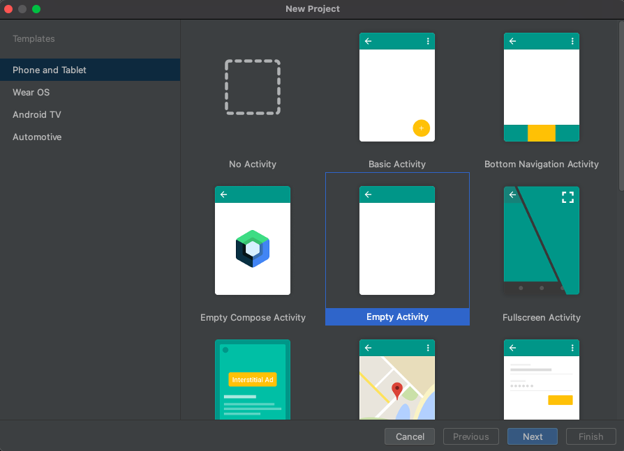
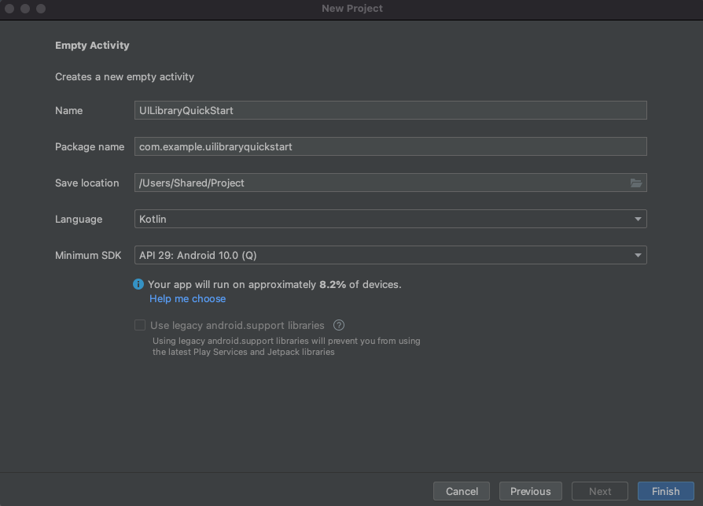
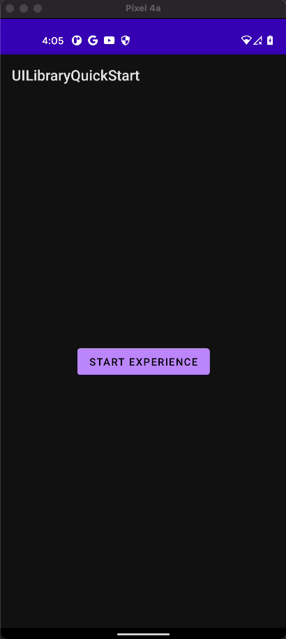

## <a name="prerequisites"></a>사전 요구 사항

- 활성 구독이 있는 Azure 계정. [체험 계정을 만듭니다](https://azure.microsoft.com/free/?WT.mc_id=A261C142F).
- [Android Studio](https://developer.android.com/studio)를 실행하는 OS.
- 배포된 Communication Services 리소스. [Communication Services 리소스를 만듭니다](../../../create-communication-resource.md).
- Azure Communication Services 토큰. [예](../../../identity/quick-create-identity.md)를 참조하세요. 

## <a name="setting-up"></a>설치

### <a name="creating-an-android-app-with-an-empty-activity"></a>빈 활동을 사용하여 Android 앱 만들기

Android Studio에서 새 프로젝트를 만들고 `Empty Activity`를 선택합니다.



`Next` 단추를 클릭하고 프로젝트 이름을 `UILibraryQuickStart`로 지정하고, 언어를 `Java/Kotlin`으로 설정하고, Minimum SDK “API 23: Android 6.0(Marshmallow)” 이상을 선택합니다.



`Finish`을 클릭합니다.

## <a name="maven-repository-credentials"></a>Maven 리포지토리 자격 증명

- `read:packages` 범위가 선택된 PAT(개인용 액세스 토큰)을 제공해야 합니다.
- 해당 PAT에 대해 `SSO enabled`해야 할 수도 있습니다.
- 또한 GitHub 사용자가 https://github.com/Azure/communication-preview에 액세스할 수 있는지 확인합니다.
- 개인용 액세스 토큰을 생성할 수 있습니다. [여기](https://github.com/settings/tokens

## <a name="install-the-packages"></a>패키지 설치

앱 수준(**앱 폴더**) `build.gradle`에서 종속성 섹션과 Android 섹션에 다음 줄을 추가합니다.

```groovy
android {
    ...
    packagingOptions {
        pickFirst  'META-INF/*'
    }
    ...
}
```

```groovy
dependencies {
    ...
    implementation 'com.azure.android:azure-communication-ui:1.0.0-alpha.1'
    ...
}
```

프로젝트 설정 수준(**앱 폴더**) `settings.gradle`에서 리포지토리에 다음 줄을 추가합니다.

```groovy
dependencyResolutionManagement {
    repositoriesMode.set(RepositoriesMode.FAIL_ON_PROJECT_REPOS)
    repositories {
        ...
        maven {
            url "https://pkgs.dev.azure.com/MicrosoftDeviceSDK/DuoSDK-Public/_packaging/Duo-SDK-Feed/maven/v1"
        }
        maven {
            name='github'
            url = 'https://maven.pkg.github.com/Azure/communication-preview'
            credentials {
                username '<your GitHub user name>'
                password '<your personal access token>'
            }
        }
        ...
    }
}
```
gradle 파일을 사용하여 프로젝트를 동기화합니다. (Android Studio -> 파일 -> Gradle 파일과 프로젝트 동기화)

## <a name="add-a-button-to-the-activity_main"></a>단추를 activity_main에 추가합니다.

레이아웃 파일(`app/src/main/res/layout/activity_main.xml`)로 이동합니다. 여기서는 다음 코드를 삭제하여 복합을 시작하는 단추를 만듭니다.

```xml
<?xml version="1.0" encoding="utf-8"?>
<androidx.constraintlayout.widget.ConstraintLayout xmlns:android="http://schemas.android.com/apk/res/android"
    xmlns:app="http://schemas.android.com/apk/res-auto"
    xmlns:tools="http://schemas.android.com/tools"
    android:layout_width="match_parent"
    android:layout_height="match_parent"
    tools:context=".MainActivity">

    <Button
        android:id="@+id/startButton"
        android:layout_width="wrap_content"
        android:layout_height="wrap_content"
        android:text="Launch"
        app:layout_constraintBottom_toBottomOf="parent"
        app:layout_constraintLeft_toLeftOf="parent"
        app:layout_constraintRight_toRightOf="parent"
        app:layout_constraintTop_toTopOf="parent" />

</androidx.constraintlayout.widget.ConstraintLayout>
```

## <a name="initialize-composite"></a>복합 초기화 

`MainActivity`로 이동합니다. 여기서는 다음 코드를 삭제하여 통화용 복합 구성 요소를 초기화합니다. `"GROUP_CALL_ID"`를 호출에 대한 그룹 ID로, `"DISPLAY_NAME"`을 사용자 이름으로, `"<USER_ACCESS_TOKEN>"`을 토큰으로 바꿉니다.

#### <a name="kotlin"></a>[Kotlin](#tab/kotlin)

```kotlin
package com.example.uilibraryquickstart

import androidx.appcompat.app.AppCompatActivity
import android.os.Bundle
import android.widget.Button
import com.azure.android.communication.common.CommunicationTokenCredential
import com.azure.android.communication.common.CommunicationTokenRefreshOptions
import com.azure.android.communication.ui.CallCompositeBuilder
import com.azure.android.communication.ui.CallComposite
import com.azure.android.communication.ui.GroupCallOptions
import java.util.UUID

class MainActivity : AppCompatActivity() {
    override fun onCreate(savedInstanceState: Bundle?) {
        super.onCreate(savedInstanceState)
        setContentView(R.layout.activity_main)
        
        val startButton: Button = findViewById(R.id.startButton)
        startButton.setOnClickListener { l -> startCallComposite() }
    }

    private fun startCallComposite() {
        val communicationTokenRefreshOptions = CommunicationTokenRefreshOptions({ fetchToken() }, true)
        val communicationTokenCredential = CommunicationTokenCredential(communicationTokenRefreshOptions)
        val options = GroupCallOptions(
            this,
            communicationTokenCredential,
            "DISPLAY_NAME",
            UUID.fromString("GROUP_CALL_ID")
        )

        val callComposite: CallComposite = CallCompositeBuilder().build()
        callComposite.launch(options)
    }

    private fun fetchToken(): String? {
        return "USER_ACCESS_TOKEN"
    }
}
```

#### <a name="java"></a>[Java](#tab/java)

```java
package com.example.uilibraryquickstart;

import androidx.appcompat.app.AppCompatActivity;
import android.os.Bundle;
import android.widget.Button;
import com.azure.android.communication.common.CommunicationTokenCredential;
import com.azure.android.communication.common.CommunicationTokenRefreshOptions;
import com.azure.android.communication.ui.CallCompositeBuilder;
import com.azure.android.communication.ui.CallComposite;
import com.azure.android.communication.ui.GroupCallOptions;
import java.util.UUID;

public class MainActivity extends AppCompatActivity {

    @Override
    protected void onCreate(Bundle savedInstanceState) {
        super.onCreate(savedInstanceState);
        setContentView(R.layout.activity_main);

        Button startButton = findViewById(R.id.startButton);

        startButton.setOnClickListener(l -> {
            startCallComposite();
        });
    }

    private void startCallComposite() {
        CallComposite callComposite = new CallCompositeBuilder().build();

        CommunicationTokenRefreshOptions communicationTokenRefreshOptions =
                new CommunicationTokenRefreshOptions(this::fetchToken, true);
        CommunicationTokenCredential communicationTokenCredential = new CommunicationTokenCredential(communicationTokenRefreshOptions);

        GroupCallOptions options = new GroupCallOptions(this,
                communicationTokenCredential,
                "DISPLAY_NAME",
                UUID.fromString("GROUP_CALL_ID"));

        callComposite.launch(options);
    }

    private String fetchToken() {
        return "USER_ACCESS_TOKEN";
    }
}
```

-----
## <a name="run-the-code"></a>코드 실행

Android Studio에서 애플리케이션을 빌드하고 시작합니다.

- `Launch`을 클릭합니다.
- 오디오 권한을 수락하고 디바이스, 마이크 및 비디오 설정을 선택합니다.
- `Join Call`을 클릭합니다.

## <a name="sample-application-code-can-be-found-here"></a>샘플 애플리케이션 코드는 [여기에서](https://github.com/Azure-Samples/communication-services-android-quickstarts/tree/ui-library-quickstart/ui-library-quick-start) 찾을 수 있습니다.



## <a name="object-model"></a>개체 모델

Azure Communication Services Android UI의 주요 기능 중 일부를 처리하는 클래스와 인터페이스는 다음과 같습니다.

| Name                                                               | Description                                                                                  |
| ------------------------------------------------------------------ | -------------------------------------------------------------------------------------------- |
| [CallComposite](#create-call-composite)                            | 참가자 갤러리 및 컨트롤을 사용하여 통화 환경을 렌더링하는 복합 구성 요소입니다.    |
| [CallCompositeBuilder](#create-call-composite)                     | 옵션을 사용하여 CallComposite를 빌드하는 작성기입니다.                                                 |
| [GroupCallOptions](#group-call)                                    | CallComposite 시작에 전달되어 그룹 호출을 시작합니다.                                          |
| [TeamsMeetingOptions](#teams-meeting)                              | Teams 모임에 참가하기 위해 CallComposite 시작에 전달됩니다.                                |
| [ThemeConfiguration](#apply-theme-configuration)                   | CallCompositeBuilder에 선택 사항으로 삽입되어 복합의 기본 색을 변경합니다.           |

## <a name="ui-library-functionality"></a>UI 라이브러리 기능

### <a name="create-call-composite"></a>호출 복합 만들기

`startCallComposite` 함수 내에서 `CallCompositeBuilder` 인스턴스 및 `CallComposite` 인스턴스를 초기화합니다.

#### <a name="kotlin"></a>[Kotlin](#tab/kotlin)

```kotlin
val callComposite: CallComposite = CallCompositeBuilder().build()
```
#### <a name="java"></a>[Java](#tab/java)

```java
CallComposite callComposite = new CallCompositeBuilder().build();
```

-----
### <a name="setup-authentication"></a>인증 설정

`startCallComposite` 함수 내에서 `CommunicationTokenCredential` 인스턴스를 초기화합니다. `"<USER_ACCESS_TOKEN>"`을 실제 토큰으로 바꿉니다.

#### <a name="kotlin"></a>[Kotlin](#tab/kotlin)

```kotlin
val callComposite: CallComposite = CallCompositeBuilder().build()

val communicationTokenRefreshOptions = CommunicationTokenRefreshOptions(this::fetchToken, true)

val communicationTokenCredential = CommunicationTokenCredential(communicationTokenRefreshOptions)
```

#### <a name="java"></a>[Java](#tab/java)

```java
CallComposite callComposite = new CallCompositeBuilder().build();

CommunicationTokenRefreshOptions communicationTokenRefreshOptions =
                new CommunicationTokenRefreshOptions(this::fetchToken, true);

CommunicationTokenCredential communicationTokenCredential = new CommunicationTokenCredential(communicationTokenRefreshOptions);

```

사용할 수 있는 토큰이 아직 없는 경우 [사용자 액세스 토큰](../../../identity/quick-create-identity.md) 설명서를 참조하세요.

-----
### <a name="setup-group-call-or-teams-meeting-options"></a>그룹 호출 또는 Teams 모임 옵션 설정

설정하려는 통화/회의 유형에 따라 적절한 옵션 개체를 사용합니다.

### <a name="group-call"></a>그룹 통화

`startCallComposite` 함수 내에서 `GroupCallOptions` 인스턴스를 초기화합니다.

`"GROUP_CALL_ID"`를 호출에 대한 그룹 ID로 바꿉니다.

`"DISPLAY_NAME"`을 사용자의 이름으로 바꿉니다.

#### <a name="kotlin"></a>[Kotlin](#tab/kotlin)

```kotlin
val options = GroupCallOptions(
            this,
            communicationTokenCredential,
            "DISPLAY_NAME",
            UUID.fromString("GROUP_CALL_ID")
        )
```

#### <a name="java"></a>[Java](#tab/java)

```java
GroupCallOptions options = new GroupCallOptions(
    this,
    communicationTokenCredential,
    "DISPLAY_NAME",
    UUID.fromString("GROUP_CALL_ID")
);
```
-----
### <a name="teams-meeting"></a>Teams 모임

`startCallComposite` 함수 내에서 `TeamsMeetingOptions` 인스턴스를 초기화합니다.
`"TEAMS_MEETING_LINK"`를 호출에 대한 그룹 ID로 바꿉니다.

`"DISPLAY_NAME"`을 사용자의 이름으로 바꿉니다.

#### <a name="kotlin"></a>[Kotlin](#tab/kotlin)

```kotlin
val options = TeamsMeetingOptions(
            this,
            communicationTokenCredential,
            "DISPLAY_NAME",
           "TEAMS_MEETING_LINK"
        )
```

#### <a name="java"></a>[Java](#tab/java)

```java
TeamsMeetingOptions options = new TeamsMeetingOptions(
    this,
    communicationTokenCredential,
    "DISPLAY_NAME",
    "TEAMS_MEETING_LINK"
);
```

-----
### <a name="get-a-microsoft-teams-meeting-link"></a>Microsoft Teams 미팅 링크 가져오기

Graph API를 사용하여 Microsoft Teams 미팅 링크를 검색할 수 있습니다. 이 프로세스는 [Graph 설명서](/graph/api/onlinemeeting-createorget?preserve-view=true&tabs=http&view=graph-rest-beta)에 자세히 설명되어 있습니다.

Communication Services 통화 SDK는 전체 Microsoft Teams 미팅 링크를 수락합니다. 이 링크는 [`joinWebUrl` 속성](/graph/api/resources/onlinemeeting?preserve-view=true&view=graph-rest-beta)에서 액세스할 수 있는 `onlineMeeting` 리소스의 일부로 반환됩니다. Teams 미팅 초대 자체의 **미팅 조인** URL에서 필요한 미팅 정보를 가져올 수도 있습니다.

### <a name="launch"></a>Launch

`startCallComposite` 함수 내의 `CallComposite` 인스턴스에서 `launch` 호출

#### <a name="kotlin"></a>[Kotlin](#tab/kotlin)

```kotlin
callComposite.launch(options)
```

#### <a name="java"></a>[Java](#tab/java)

```java
callComposite.launch(options);
```

-----

### <a name="subscribe-to-events-from-callcomposite"></a>`CallComposite`에서 이벤트 구독

이벤트를 수신하려면 `CallCompositeBuilder`에 처리기를 삽입합니다.

#### <a name="kotlin"></a>[Kotlin](#tab/kotlin)

```kotlin
val callComposite: CallComposite =
            CallCompositeBuilder()
                .callCompositeEventsHandler(ApplicationCallCompositeEventsHandler())
                .build()

...
import com.azure.android.communication.ui.CallCompositeEventsHandler
import com.azure.android.communication.ui.configuration.events.OnExceptionEventArgs

class ApplicationCallCompositeEventsHandler : CallCompositeEventsHandler {
    override fun onException(eventArgs: OnExceptionEventArgs) {
        //...
    }
}
```

#### <a name="java"></a>[Java](#tab/java)

```java
CallComposite callComposite =
                new CallCompositeBuilder()
                        .callCompositeEventsHandler(new ApplicationCallCompositeEventsHandler())
                        .build();
...
import com.azure.android.communication.ui.CallCompositeEventsHandler;
import com.azure.android.communication.ui.configuration.events.OnExceptionEventArgs;

class ApplicationCallCompositeEventsHandler implements CallCompositeEventsHandler {
    @Override
    public void onException(@NonNull OnExceptionEventArgs eventArgs) {
        //...
    }
}
```

-----

### <a name="apply-theme-configuration"></a>테마 구성 적용

복합의 기본 색을 변경하려면 `AzureCommunicationUI.Theme.Calling`을 부모 테마로 간주하여 `src/main/res/values/themes.xml` 및 `src/main/res/values-night/themes.xml`에서 새 테마 스타일을 만듭니다. 테마를 적용하려면 `CallCompositeBuilder`에 테마 ID를 삽입합니다.

```xml
<style name="MyCompany.CallComposite" parent="AzureCommunicationUI.Theme.Calling">
    <item name="azure_communication_ui_calling_primary_color">@color/purple_500</item>
</style>
```

#### <a name="kotlin"></a>[Kotlin](#tab/kotlin)

```kotlin
import com.azure.android.communication.ui.configuration.ThemeConfiguration

val communicationCallComposite: CallComposite =
        CallCompositeBuilder()
            .theme(ThemeConfiguration(R.style.MyCompany_CallComposite))
            .build()
```

#### <a name="java"></a>[Java](#tab/java)

```java
import com.azure.android.communication.ui.configuration.ThemeConfiguration;

CallComposite callComposite = 
    new CallCompositeBuilder()
        .theme(new ThemeConfiguration(R.style.MyCompany_CallComposite))
        .build();
```
