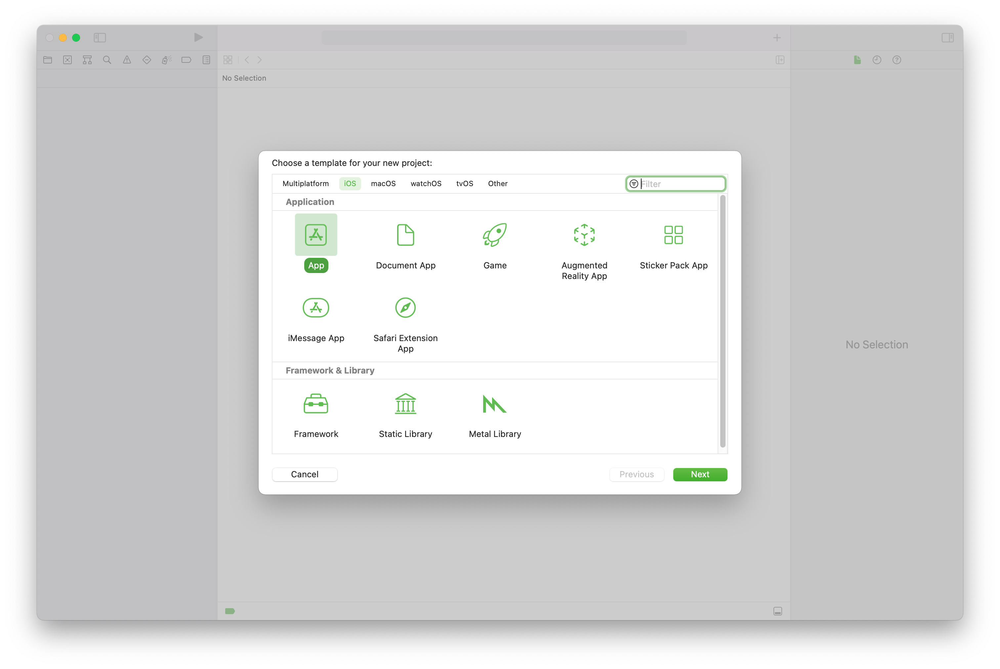
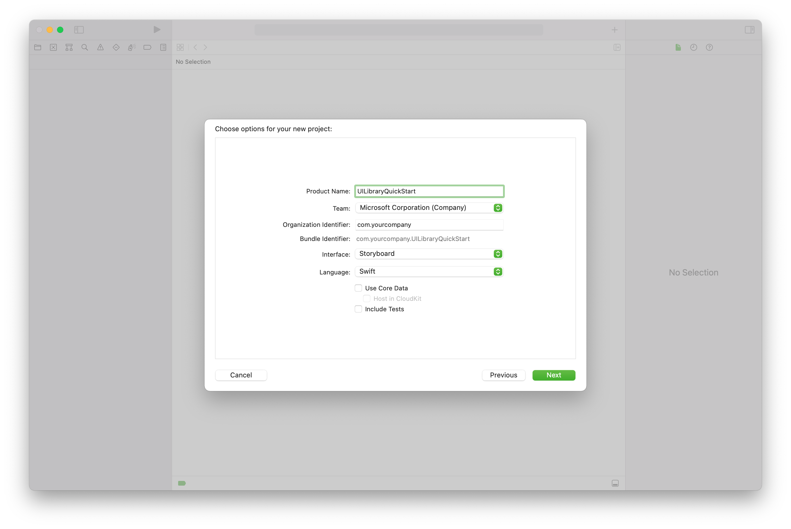
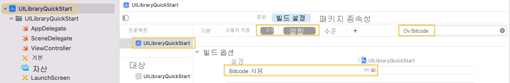
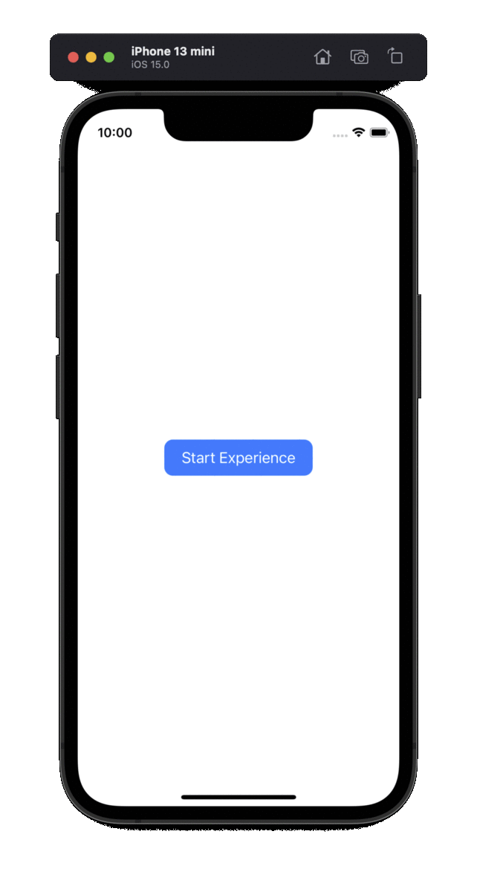

## <a name="prerequisites"></a>사전 요구 사항

- 활성 구독이 있는 Azure 계정. [체험 계정을 만듭니다](https://azure.microsoft.com/free/?WT.mc_id=A261C142F).
- 키 집합에 설치된 유효한 개발자 인증서와 함께 [Xcode](https://go.microsoft.com/fwLink/p/?LinkID=266532)를 실행하는 Mac 종속성을 페치하려면 [CocoaPods](https://cocoapods.org/)도 설치해야 합니다.
- 배포된 Communication Services 리소스. [Communication Services 리소스를 만듭니다](../../../create-communication-resource.md).
- Azure Communication Services 토큰. [예제를 참조하세요.](../../../identity/quick-create-identity.md)

## <a name="setting-up"></a>설치

### <a name="creating-the-xcode-project"></a>Xcode 프로젝트 만들기

Xcode에서 새 iOS 프로젝트를 만들고, **앱** 템플릿을 선택합니다. UIKit 스토리보드가 사용됩니다. 이 빠른 시작에서는 테스트를 만들지 않습니다. **테스트 포함** 을 선택 취소합니다.



프로젝트 이름을 `UILibraryQuickStart`로 지정합니다.



### <a name="install-the-package-and-dependencies-with-cocoapods"></a>CocoaPods를 사용하여 패키지 및 종속성 설치

1. 애플리케이션에 대한 Podfile을 만듭니다.

```
source 'https://github.com/Azure/AzurePrivatePodspecs'

platform :ios, '13.0'

target 'UILibraryQuickStart' do
    use_frameworks!
    pod 'azure-communication-ui', '1.0.0-alpha.1'
    pod 'AzureCommunicationCalling', '2.0.1-beta.1'
    pod 'MicrosoftFluentUI', '0.3.3'
end
```

2. `pod install`을 실행합니다.
3. Xcode를 사용하여 생성된 `.xcworkspace`를 엽니다.

### <a name="request-access-to-the-microphone-camera-etc"></a>마이크, 카메라 등에 대한 액세스 요청

디바이스의 하드웨어에 액세스하려면 앱의 [정보 속성] 목록을 업데이트합니다. 연결된 값을 시스템에서 사용자로부터 액세스를 요청하는 데 사용하는 대화 상자에 포함될 `string`으로 설정합니다.

프로젝트 트리의 `Info.plist` 항목을 마우스 오른쪽 단추로 클릭하고 **다음 형식으로 열기** > **소스 코드** 를 선택합니다. 최상위 `<dict>` 섹션에 다음 줄을 추가한 다음, 파일을 저장합니다.

```xml
<key>NSCameraUsageDescription</key>
<string></string>
<key>NSMicrophoneUsageDescription</key>
<string></string>
```

### <a name="turn-off-bitcode"></a>`Bitcode` 끄기
프로젝트 `Build Settings`에서 `Enable Bitcode` 옵션을 `No`로 설정합니다. 설정을 찾으려면 필터를 `Basic`에서 `All`로 변경해야 합니다. 그러면 오른쪽 검색 창을 사용할 수도 있습니다.



## <a name="initialize-composite"></a>복합 초기화

'ViewController'로 이동합니다. 여기서는 다음 코드를 삭제하여 통화용 복합 구성 요소를 초기화합니다. `<GROUP_CALL_ID>`를 호출에 대한 그룹 ID로, `<DISPLAY_NAME>`을 사용자 이름으로, `<USER_ACCESS_TOKEN>`을 토큰으로 바꿉니다.

```swift
import UIKit
import AzureCommunicationCalling
import CallingComposite

class ViewController: UIViewController {

    private var callComposite: CallComposite?

    override func viewDidLoad() {
        super.viewDidLoad()

        let button = UIButton(frame: CGRect(x: 100, y: 100, width: 200, height: 50))
        button.contentEdgeInsets = UIEdgeInsets(top: 10.0, left: 20.0, bottom: 10.0, right: 20.0)
        button.layer.cornerRadius = 10
        button.backgroundColor = .systemBlue
        button.setTitle("Start Experience", for: .normal)
        button.addTarget(self, action: #selector(startCallComposite), for: .touchUpInside)

        button.translatesAutoresizingMaskIntoConstraints = false
        self.view.addSubview(button)
        button.centerXAnchor.constraint(equalTo: view.centerXAnchor).isActive = true
        button.centerYAnchor.constraint(equalTo: view.centerYAnchor).isActive = true
    }

    @objc private func startCallComposite() {
        let callCompositeOptions = CallCompositeOptions()

        callComposite = CallComposite(withOptions: callCompositeOptions)

        let communicationTokenCredential = try! CommunicationTokenCredential(token: "<USER_ACCESS_TOKEN>")

        let options = GroupCallOptions(communicationTokenCredential: communicationTokenCredential,
                                       displayName: displayName,
                                       groupId: uuid)
        callComposite?.launch(with: options)
    }
}
```

## <a name="run-the-code"></a>코드 실행

**제품** > **실행** 을 선택하거나 (&#8984;-R) 키보드 단축키를 사용하여 iOS 시뮬레이터에서 앱을 빌드하고 실행할 수 있습니다.

1) `Start Experience`를 탭합니다.
2) 오디오 권한을 수락하고 디바이스, 마이크 및 비디오 설정을 선택합니다.
3) `Start Call`을 탭합니다.



## <a name="object-model"></a>개체 모델

Azure Communication Services UI 클라이언트 라이브러리의 주요 기능 중 일부를 처리하는 클래스와 인터페이스는 다음과 같습니다.

| 속성                                                                        | Description                                                                                  |
| --------------------------------------------------------------------------- | -------------------------------------------------------------------------------------------- |
| CallComposite | 복합은 참가자 갤러리 및 컨트롤을 사용하여 호출 환경을 렌더링합니다. |
| CallCompositeOptions | 테마 구성 및 이벤트 처리기와 같은 옵션을 포함합니다. |
| CallCompositeEventsHandler | 복합에서 이벤트를 받을 수 있습니다. |
| GroupCallOptions | groupId와 같은 그룹 통화에 호출하기 위한 옵션입니다. |
| TeamsMeetingOptions | 모임 링크와 같은 팀 회의에 조인하는 옵션입니다. |
| ThemeConfiguration | 테마를 사용자 지정할 수 있습니다. |

## <a name="ui-library-functionality"></a>UI 라이브러리 기능

### <a name="create-call-composite-options-and-call-composite"></a>호출 복합 옵션 만들기 및 복합 호출

`startCallComposite` 함수 내에서 `CallCompositeOptions` 인스턴스 및 `CallComposite` 인스턴스를 초기화합니다.

```swift
@objc private func startCallComposite() {
    let callCompositeOptions = CallCompositeOptions()

    callComposite = CallComposite(withOptions: callCompositeOptions)
}
```

### <a name="setup-authentication"></a>인증 설정

`startCallComposite` 함수 내에서 `CommunicationTokenCredential` 인스턴스를 초기화합니다. `<USER_ACCESS_TOKEN>`을 실제 토큰으로 바꿉니다.

```swift
let communicationTokenCredential = try! CommunicationTokenCredential(token: "<USER_ACCESS_TOKEN>")
```

사용할 수 있는 토큰이 아직 없는 경우 [사용자 액세스 토큰](../../../identity/quick-create-identity.md) 설명서를 참조하세요.

### <a name="setup-group-call-or-teams-meeting-options"></a>그룹 호출 또는 Teams 모임 옵션 설정

설정하려는 통화/회의 유형에 따라 적절한 옵션 개체를 사용합니다.

#### <a name="group-call"></a>그룹 호출

`startCallComposite` 함수 내에서 `GroupCallOptions` 인스턴스를 초기화합니다. `<GROUP_CALL_ID>`를 호출에 대한 그룹 ID로, `<DISPLAY_NAME>`을 사용자 이름으로 바꿉니다.

```swift
let options = GroupCallOptions(communicationTokenCredential: communicationTokenCredential,
                               displayName: displayName,
                               groupId: uuid)
```

#### <a name="teams-meeting"></a>Teams 모임

`startCallComposite` 함수 내에서 `TeamsMeetingOptions` 인스턴스를 초기화합니다. `<TEAMS_MEETING_LINK>`를 호출에 대한 그룹 ID로, `<DISPLAY_NAME>`을 사용자 이름으로 바꿉니다.

```swift
let options = TeamsMeetingOptions(communicationTokenCredential: communicationTokenCredential,
                                  displayName: displayName,
                                  meetingLink: link)
```

#### <a name="get-a-microsoft-teams-meeting-link"></a>Microsoft Teams 미팅 링크 가져오기

Graph API를 사용하여 Microsoft Teams 미팅 링크를 검색할 수 있습니다. 이 프로세스는 [Graph 설명서](/graph/api/onlinemeeting-createorget?tabs=http&view=graph-rest-beta&preserve-view=true)에 자세히 설명되어 있습니다.
Communication Services Calling SDK는 전체 Microsoft Teams 미팅 링크를 수락합니다. 이 링크는 [`joinWebUrl` 속성](/graph/api/resources/onlinemeeting?view=graph-rest-beta&preserve-view=true)에서 액세스할 수 있는 `onlineMeeting` 리소스의 일부로 반환됩니다. Teams 미팅 초대 자체의 **미팅 조인** URL에서 필요한 미팅 정보를 가져올 수도 있습니다.

### <a name="launch"></a>Launch

`startCallComposite` 함수 내의 `CallComposite` 인스턴스에서 `launch` 호출

```swift
callComposite?.launch(with: options)
```

### <a name="implement-the-closure-for-events-handler"></a>이벤트 처리기에 대한 클로저 구현

`CallCompositeEventsHandler`에서 클로저를 구현하여 이벤트에 대해 작업을 수행하고 구현을 `CallCompositeOptions`에 전달할 수 있습니다. 복합이 오류로 인해 종료된 경우에 대한 이벤트가 예입니다.

```swift
let handler = CallCompositeEventsHandler(didFail: { error in
            print("didFail with error:\(error)")
        })
```

```swift
let callCompositeOptions = CallCompositeOptions(callCompositeEventsHandler: handler)
```

### <a name="customizing-the-theme"></a>테마 사용자 지정

ThemeConfiguration 프로토콜을 구현하는 사용자 지정 테마 구성을 만들어 테마를 사용자 지정할 수 있습니다. 그런 다음, CallCompositeOptions에 새 클래스의 인스턴스를 포함합니다.

```swift
class CustomThemeConfiguration: ThemeConfiguration {
   var primaryColor: UIColor {
       return UIColor.red
   }
}
```

```swift
let callCompositeOptions = CallCompositeOptions(themeConfiguration: CustomThemeConfiguration())
```
