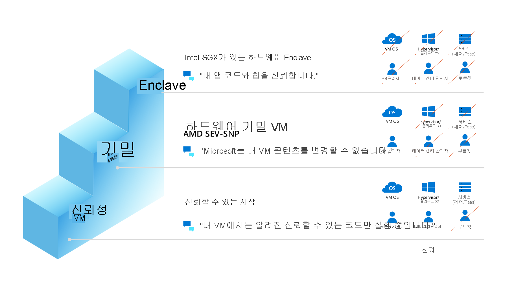

# Azure의 기밀 컴퓨팅

오늘날의 고객들은 미사용 데이터 및 전송 중인 데이터는 암호화하지만 메모리에서 사용 중인 데이터는 암호화하지 않습니다. Microsoft에서 공동 설립한 CCC[(기밀 컴퓨팅 컨소시엄)](https://confidentialcomputing.io/)는 하드웨어 기반 TEE[(신뢰 실행 환경)](https://en.wikipedia.org/wiki/Trusted_execution_environment)를 통해 사용 중인 데이터를 보호하는 것을 기밀 컴퓨팅으로 정의합니다. 이러한 TEE는 사용 중인 애플리케이션 및 데이터의 무단 액세스 또는 수정을 방지하여 중요하고 규제된 데이터를 관리하는 조직의 보안 수준을 높입니다. TEE는 데이터 무결성, 데이터 기밀성 및 코드 무결성에 대한 보증 수준을 제공하는 신뢰할 수 있는 환경입니다. 기밀 컴퓨팅 위협 모델은 클라우드 공급자 운영자 및 테넌트 도메인의 다른 작업자가 실행 중 코드 및 데이터에 액세스하는 기능을 제거하거나 줄이는 것을 목표로 합니다.

Intel SGX([Intel Software Guard Extensions](https://www.intel.com.au/content/www/au/en/architecture-and-technology/software-guard-extensions-enhanced-data-protection.html)) 또는[ AMD SEV-SNP(AMD Secure Encrypted Virtualization)](https://www.amd.com/en/processors/amd-secure-encrypted-virtualization)와 같은 기술은 기밀 컴퓨팅 구현을 지원하는 CPU의 개선된 최신 기술입니다. 이러한 기술은 가상화 확장으로 설계되었으며 메모리 암호화 및 무결성, CPU 상태 기밀성 및 무결성, 증명을 포함한 기능 집합을 제공하여 기밀 컴퓨팅 위협 모델을 빌드합니다.

:::image type="content" source="media/overview-azure-products/three-states.png" alt-text="3가지의 데이터 보호 상태를 보여주며 사용 중인 기밀 컴퓨팅의 데이터가 강조 표시된 그래픽.":::

기밀 컴퓨팅을 미사용 데이터 및 전송 중인 데이터 암호화와 함께 사용하는 경우, 안전한 퍼블릭 클라우드 플랫폼에서 중요하거나 규제가 높은 데이터 집합 및 애플리케이션 워크로드를 보호하여 사용 중인 암호화의 가장 큰 단일 장벽을 제거합니다. 기밀 컴퓨팅은 일반 데이터 보호를 넘어 확장됩니다. 또한 TEE는 독점 비즈니스 논리, 분석 함수, 기계 학습 알고리즘 또는 전체 애플리케이션을 보호하는 데 사용됩니다.

## Azure 기밀 컴퓨팅 탐색

기밀 컴퓨팅을 위한 [Microsoft 제품](https://aka.ms/azurecc)은 IaaS(Infrastructure as a Service)에서 PaaS(Platform as a Service)까지 확장되며, 개발자 도구는 클라우드에서 데이터 및 코드 기밀성 경험을 지원합니다.

## 공격 노출 영역 축소
TCB(신뢰할 수 있는 컴퓨팅 기반)는 보안 환경을 제공하는 시스템의 모든 하드웨어, 펌웨어 및 소프트웨어 구성 요소를 나타냅니다. TCB 내의 구성 요소는 "위험"으로 간주됩니다. TCB 내의 한 구성 요소가 손상되면 전체 시스템 보안이 위태로워질 수 있습니다. 낮은 TCB는 더 높은 수준의 보안을 의미합니다. 다양한 취약점, 맬웨어, 공격 및 악의적인 사용자에게 노출될 위험이 줄어듭니다. Azure 기밀 컴퓨팅은 TEE를 제공하여 클라우드 워크로드에 대한 TCB를 낮추는 것을 목표로 합니다. 

### Azure에서 TCB 줄이기

Azure 기밀 가상 머신을 배포할 때 TCB를 줄일 수 있습니다. AMD SEV-RP에서 실행되는 기밀 VM 배포 솔루션의 경우 기존 워크로드를 리프트 앤 시프트하고 VM 수준의 기밀성을 통해 클라우드 운영자로부터 데이터를 보호할 수 있습니다. Intel SGX 애플리케이션 enclave를 사용한 기밀 VM은 애플리케이션에서 코드 줄 제어를 제공하여 TCB를 최소화하고 클라우드 운영자 및 사용자의 운영자로부터 데이터를 보호합니다.  Intel SGX를 사용하여 애플리케이션 enclave를 사용하려면 구성 정책 또는 애플리케이션 코드를 일부 변경해야 할 수 있습니다.  ISV(Independent Software Vendor) 파트너 또는 OSS(오픈 소스 소프트웨어)를 활용하여 애플리케이션 enclave 내에서 기존 앱을 실행할 수도 있습니다. 

### 신뢰 사다리

Azure는 기밀 컴퓨팅 IaaS 워크로드에 대해 서로 다른 가상 머신을 제공하며 고객은 선호하는 보안 태세에 따라 가장 적합한 것을 선택할 수 있습니다. "신뢰 사다리" 그림은 이러한 IaaS 제품에 대한 보안 태세 관점에서 고객이 기대할 수 있는 것을 보여줍니다.

## Azure 제품

현재 일반 사용자에게 제공되는 서비스는 다음과 같습니다.

- [Intel SGX 애플리케이션 enclave를 사용한 기밀 VM](confidential-computing-enclaves.md) Azure는 하드웨어 기반 enclave를 만들기 위한 Intel SGX 기술을 기반으로 하는 [DCsv2](../virtual-machines/dcv2-series.md), [DCsv3 및 DCdsv3](../virtual-machines/dcv3-series.md) 시리즈를 제공하고 있습니다. 일련의 VM에서 실행할 보안 enclave 기반 애플리케이션을 빌드하여 사용 중인 애플리케이션 데이터 및 코드를 보호할 수 있습니다.
- [AKS(Azure Kubernetes Service)에서 실행되는 Enclave 인식 컨테이너](enclave-aware-containers.md) AKS의 기밀 컴퓨팅 노드는 Intel SGX를 사용하여 각 컨테이너 애플리케이션 간의 노드에 격리된 enclave 환경을 만듭니다.
- [Azure SQL의 보안 secure를 사용한 Always Encrypted](/sql/relational-databases/security/encryption/always-encrypted-enclaves) SQL 문에 데이터베이스 엔진이 실행되는 보안 enclave를 사용해야 하는 암호화된 데이터 작업이 포함된 경우 TEE 내에서 직접 SQL 쿼리를 실행하여 맬웨어 및 높은 권한이 없는 사용자로부터 중요한 데이터의 기밀성을 보호합니다.
- [Microsoft Azure Attestation](../attestation/overview.md) - 여러 TEE(신뢰 실행 환경)의 신뢰성을 확인하고 TEEs 내에서 실행되는 이진의 무결성을 확인하기 위한 원격 증명 서비스입니다.
- [Azure Key Vault 관리형 HSM](/azure/key-vault/managed-hsm/)은 FIPS 140-2 수준 3의 유효성이 검사된 HSM(하드웨어 보안 모듈)을 사용하여 클라우드 애플리케이션용 암호화 키를 보호할 수 있는 완전 관리형 고가용 단일 테넌트 표준 규격 클라우드 서비스입니다.
- [Azure IoT Edge](../iot-edge/deploy-confidential-applications.md)는 사물 인터넷(IoT) 디바이스의 보안 enclave 내에서 실행되는 기밀 애플리케이션을 지원합니다. IoT 디바이스는 악의적인 행위자가 물리적으로 액세스할 수 있으므로 변조 및 위조에 노출되는 경우가 많습니다. 기밀 IoT Edge 디바이스는 클라우드로 스트리밍하기 전에 디바이스 자체에 의해 캡처되고 저장된 데이터에 대한 액세스를 보호하여 에지에서 신뢰와 무결성을 추가합니다.

현재 다음을 포함한 다른 서비스는 미리 보기로 제공됩니다.

- [AMD SEV-SNP](https://azure.microsoft.com/blog/azure-and-amd-enable-lift-and-shift-confidential-computing/) 기술을 기반으로 하는 기밀 VM은 현재 미리 보기로 제공되며, 선택한 고객이 사용할 수 있습니다.
- [신뢰할 수 있는 시작](../virtual-machines/trusted-launch.md)은 부팅 키트, 루트킷 및 커널 수준 맬웨어로부터 보호하는 강화된 보안 기능(보안 부팅, 가상 신뢰할 수 있는 플랫폼 모듈 및 부팅 무결성 모니터링)을 제공하여 모든 2세대 VM에서 사용할 수 있습니다.
- [Azure Confidential Ledger](../confidential-ledger/overview.md). ACL은 기록 보관 및 감사 또는 다자간 시나리오의 데이터 투명성을 위해 중요한 데이터를 저장하기 위한 변조 방지 레지스터입니다. Write-Once-Read-Many를 보장하여 데이터를 삭제하고 수정할 수 없도록 합니다. 이 서비스는 Microsoft Research의 [기밀 컨소시엄 프레임워크](https://www.microsoft.com/research/project/confidential-consortium-framework/)를 기반으로 합니다.
- [기밀 유추 ONNX 런타임](https://github.com/microsoft/onnx-server-openenclave)은 ML 호스팅 당사자가 추론 요청과 해당 응답 모두에 액세스하지 못하도록 제한하는 기계 학습(ML) 유추 서버입니다.

## 다음 단계

- [애플리케이션 enclave 개발에 대해 알아보기](application-development.md)
