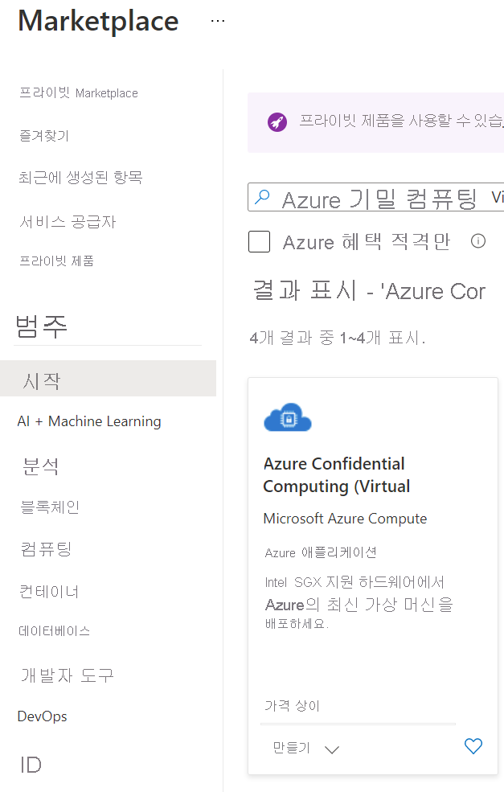

# <a name="quickstart-create-intel-sgx-vm-in-the-azure-marketplace"></a>빠른 시작: Azure Marketplace에서 Intel SGX VM 만들기

이 자습서에서는 Azure Marketplace를 사용하여 Intel SGX VM을 배포하는 과정을 설명합니다. 그렇지 않으면 [포털이나 CLI를 사용](quick-create-portal.md)하여 VM 배포 흐름을 따르는 것이 좋습니다.

## <a name="prerequisites"></a>사전 요구 사항

Azure 구독이 없는 경우 시작하기 전에 [계정을 만드세요](https://azure.microsoft.com/pricing/purchase-options/pay-as-you-go/).

> [!NOTE]
> 무료 평가판 계정에는 이 자습서의 VM에 대한 액세스 권한이 없습니다. 종량제 구독으로 업그레이드하세요.


## <a name="sign-in-to-azure"></a>Azure에 로그인

1. [Azure Portal](https://portal.azure.com/)에 로그인합니다.

1. 위쪽에서 **리소스 만들기** 를 선택합니다.

1. **시작** 기본 창에서 **Azure 기밀 컴퓨팅(가상 머신)** 을 검색합니다.

1. **Azure 기밀 컴퓨팅(가상 머신)** 템플릿을 클릭합니다.

    

1. 가상 머신 방문 페이지에서 **만들기** 를 선택합니다.


## <a name="configure-an-intel-sgx-virtual-machine"></a>Intel SGX 가상 머신 구성

1. **기본 사항** 탭에서 **구독** 및 **리소스 그룹** 을 선택합니다(이 템플릿을 배포하려면 그룹이 비어 있어야 함).

1. **가상 머신 이름** 에 대해 새 VM의 이름을 입력합니다.

1. 다음 값을 입력하거나 선택합니다.

   * **지역**: 적합한 Azure 지역을 선택합니다.

        > [!NOTE]
        > Intel SGX VM은 특정 지역의 특수한 하드웨어에서 실행됩니다. 최신 지역의 가용성을 보려면 [사용 가능한 지역](https://azure.microsoft.com/global-infrastructure/services/?products=virtual-machines)에서 DCsv2 시리즈 또는 DCsv3/DCdsv3 시리즈를 찾으십시오.

1. 가상 머신에 사용할 운영 체제 이미지를 구성합니다. 이 설정은 Gen 2 VM 및 이미지 배포만 지원합니다.

    * **이미지 선택**: 이 자습서의 경우 Ubuntu 20.04 LTS(Gen 2)를 선택합니다. Windows Server Datacenter 2019 또는 Ubuntu 18.04 LTS를 선택할 수도 있습니다. 이 작업을 수행하도록 선택하면 이에 따라 이 자습서에서 적절하게 리디렉션됩니다.
   
1. 기본 사항 탭에서 다음 정보를 입력합니다.

   * **인증 형식**: Linux VM을 만드는 경우 **SSH 공개 키** 를 선택합니다. 

        > [!NOTE]
        > 인증을 위해 SSH 공개 키를 사용할지 아니면 암호를 사용할지 선택할 수 있습니다. SSH는 더 안전합니다. SSH 키를 생성하는 방법에 대한 지침은 [Azure의 Linux VM용 Linux 및 Mac에서 SSH 키 만들기](../virtual-machines/linux/mac-create-ssh-keys.md)를 참조하세요.

    * **사용자 이름**: VM에 사용할 관리자 이름을 입력합니다.

    * **SSH 공개 키**: 해당하는 경우 RSA 공개 키를 입력합니다.
    
    * **암호**: 해당하는 경우 인증 암호를 입력합니다.
    
1. “가상 머신 설정” 탭에서 다음 정보를 입력합니다.

   * VM SKU 크기 선택
   * **DCsv2 시리즈** 는 DC1, DC2 및 DC4에서 **표준 SSD**, **프리미엄 SSD** 가 지원됩니다. 
   * **DCsv3 및 DCdsv3 시리즈** 는 **표준 SSD**, **프리미엄 SSD** 및 **Ultra Disk** 를 지원합니다.
   
   * **공용 인바운드 포트**: **선택한 포트 허용** 을 선택하고, **공용 인바운드 포트 선택** 목록에서 **SSH(22)** 및 **HTTP(80)** 를 선택합니다. Windows VM을 배포하는 경우 **HTTP(80)** 및 **RDP(3389)** 를 선택합니다. 이 빠른 시작에 안내된 이 단계는 VM에 연결하는 데 필요합니다.
   
    >[!Note]
    > 프로덕션 배포에는 RDP/SSH 포트를 허용하지 않는 것이 좋습니다.  

     


1. 필요한 경우 **모니터링** 옵션을 선택합니다.

1. **검토 + 만들기** 를 선택합니다.

1. **검토 + 만들기** 창에서 **만들기** 를 선택합니다.

> [!NOTE]
> Linux VM을 배포한 경우 다음 섹션으로 이동하여 이 자습서를 계속 진행합니다. Windows VM을 배포한 경우 [다음 단계에 따라 Windows VM에 연결](../virtual-machines/windows/connect-logon.md)합니다.


## <a name="connect-to-the-linux-vm"></a>Linux VM에 연결

이미 BASH 셸을 사용하는 경우 **ssh** 명령을 사용하여 Azure VM에 연결합니다. 다음 명령에서 VM 사용자 이름 및 IP 주소를 바꿔서 Linux VM에 연결합니다.

```bash
ssh azureadmin@40.55.55.555
```

VM의 공용 IP 주소는 Azure Portal에 있는 가상 머신의 [개요] 섹션 아래에서 확인할 수 있습니다.

:::image type="content" source="media/quick-create-portal/public-ip-virtual-machine.png" alt-text="Azure Portal의 IP 주소":::

Windows에서 실행 중이고 BASH 셸이 설치되지 않은 경우 PuTTY와 같은 SSH 클라이언트를 설치합니다.

1. [PuTTY 다운로드 및 설치](https://www.chiark.greenend.org.uk/~sgtatham/putty/download.html)

1. PuTTY를 실행합니다.

1. PuTTY 구성 화면에서 VM의 공용 IP 주소를 입력합니다.

1. **열기** 를 선택하고 프롬프트에 사용자 이름 및 암호를 입력합니다.

Linux VM에 연결하는 방법에 대한 자세한 내용은 [포털을 사용하여 Azure에서 Linux VM 만들기](../virtual-machines/linux/quick-create-portal.md)를 참조하세요.

> [!NOTE]
> 레지스트리에서 캐시되지 않은 서버의 호스트 키에 대한 PuTTY 보안 경고가 표시되는 경우 다음 옵션 중에서 선택합니다. 이 호스트를 신뢰하는 경우 **예** 를 선택하여 PuTTy의 캐시에 키를 추가하여 연결을 계속합니다. 한 번만 연결을 수행하려는 경우 캐시에 키를 추가하지 않고 **아니요** 를 선택합니다. 이 호스트를 신뢰하지 않는 경우 **취소** 를 선택하여 연결을 중단합니다.

## <a name="intel-sgx-drivers"></a>Intel SGX 드라이버

> [!NOTE]
> Intel SGX 드라이버는 이미 Ubuntu 및 Microsoft Azure 갤러리 이미지에 포함됩니다. 최신 드라이버를 사용하고 있는지 확인하려면 [INTEL SGX DCAP 드라이버 목록](https://01.org/intel-software-guard-extensions/downloads)을 방문하세요.

## <a name="clean-up-resources"></a>리소스 정리

리소스 그룹, 가상 머신 및 모든 관련 리소스가 더 이상 필요 없는 경우 삭제해도 됩니다. 

가상머신에 대한 리소스 그룹을 선택한 다음 **삭제** 를 선택합니다. 리소스 그룹의 이름을 확인하고 리소스 삭제를 마칩니다.

## <a name="next-steps"></a>다음 단계

이 빠른 시작에서는 Intel SGX VM에 배포하고 연결했습니다. 자세한 내용은 [Virtual Machines의 솔루션](virtual-machine-solutions-sgx.md)을 참조하세요. 

GitHub의 Open Enclave SDK 샘플로 계속 진행하여 기밀 컴퓨팅 애플리케이션을 빌드하는 방법을 알아봅니다. 

> [!div class="nextstepaction"]
> [Open Enclave SDK 샘플 빌드](https://github.com/openenclave/openenclave/blob/master/samples/README.md)
