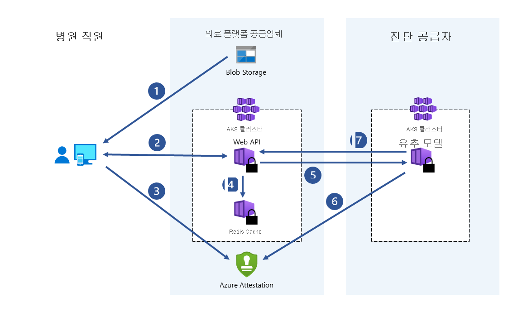

# 사용 사례 및 시나리오
기밀 컴퓨팅은 정부, 금융 서비스 및 의료 기관과 같은 규제 산업의 데이터를 보호하기 위한 다양한 사용 사례에 적용됩니다. 예를 들어 중요한 데이터에 대한 액세스를 방지하면 데이터를 저장하는 클라우드 공급자를 포함하여 관련된 모든 당사자로부터 시민 디지털 ID를 보호할 수 있습니다. 동일한 중요한 데이터에는 아동 착취의 알려진 이미지를 찾아서 제거하고, 인신매매를 방지하며, 디지털 과학수사를 지원하는 데 사용되는 생체 인식 데이터가 포함될 수 있습니다.

:::image type="content" source="media/use-cases-scenarios/use-cases.png" alt-text="정부, 금융 서비스, 의료 시나리오를 비롯한 Azure 기밀 컴퓨팅에 대한 사용 사례의 스크린샷.":::

이 문서에서는 Azure 기밀 컴퓨팅에 대한 몇 가지 일반적인 시나리오에 대해 간략하게 설명합니다. 이 문서의 추천 사항은 기밀 컴퓨팅 서비스와 프레임워크를 사용하여 애플리케이션을 개발하는 시작 지점으로 제공됩니다.

이 문서를 읽은 다음에는 다음과 같은 질문에 답할 수 있습니다.

- Azure 기밀 컴퓨팅에 대한 몇 가지 시나리오는 무엇인가요?
- 다자간 시나리오, 향상된 고객 데이터 개인 정보 및 블록체인 네트워크에 Azure 기밀 컴퓨팅을 사용하면 어떤 이점이 있나요?

## 동기
Azure 기밀 컴퓨팅을 사용하면 가상화된 환경에서 기밀 컴퓨팅 기능을 활용할 수 있습니다. 이제 도구, 소프트웨어 및 클라우드 인프라를 사용하여 보안 하드웨어를 기반으로 하여 빌드할 수 있습니다.  

**무단 액세스 방지**: 클라우드에서 중요한 데이터를 실행합니다. Azure는 가능한 한 최적의 데이터 보호 기능을 제공하며, 지금은 어떤 것을 변경하지 않아도 됩니다.

**규정 준수**: 클라우드로 마이그레이션하고 개인 정보를 보호하기 위해 정부 규정을 충족하고 조직 IP를 보호하도록 모든 데이터를 완벽하게 제어합니다.

**안전하고 신뢰할 수 없는 협업**: 다양한 데이터 분석 및 더욱 심층적인 인사이트를 활용하기 위해 여러 조직에서(경쟁업체에서도) 데이터를 결합함으로써 업계 전체의 작업 규모 문제를 해결합니다.

**격리된 처리**: 블라인드 처리를 사용하여 개인 데이터에 대한 책임을 없애는 새로운 제품을 제공합니다. 서비스 공급자는 사용자 데이터를 검색할 수도 없습니다. 

## 다자간 보안 컴퓨팅

비즈니스 트랜잭션 및 프로젝트 협업에는 여러 당사자 간에 정보를 공유해야 합니다. 공유되는 데이터는 기밀인 경우가 많습니다. 이러한 데이터는 개인 정보, 재무 기록, 의료 기록, 개인 시민 데이터 등일 수 있습니다. 퍼블릭 및 프라이빗 조직은 무단 액세스로부터 데이터를 보호해야 합니다. 경우에 따라 이러한 조직은 컴퓨팅 인프라 운영자 또는 엔지니어, 보안 설계자, 비즈니스 컨설턴트 및 데이터 과학자로부터 데이터를 보호하려고 합니다.

예를 들어 의료 디바이스에서 캡처한 환자의 더 큰 데이터 세트 및 이미지에 대한 액세스 권한을 획득함에 따라 의료 서비스에 대한 기계 학습 사용이 크게 증가했습니다. 여러 데이터 원본의 질병 진단 및 약품 개발 혜택 병원 및 의료 기관은 환자 의료 기록을 TEE(중앙 집중식 신뢰 실행 환경)와 공유하여 협업할 수 있습니다. TEE에서 기계 학습 서비스를 실행하여 데이터를 집계하고 분석합니다. 이러한 집계된 데이터 분석은 통합 데이터 세트에 대한 학습 모델로 인해 더 높은 예측 정확도를 제공할 수 있습니다. 기밀 컴퓨팅을 사용하면 병원이 환자의 개인 정보를 손상시키는 위험을 최소화할 수 있습니다.

Azure 기밀 컴퓨팅을 사용하면 입력 데이터를 다른 당사자에게 공개하지 않고도 여러 원본의 데이터를 처리할 수 있습니다. 이러한 유형의 보안 계산을 통해 자금 방지, 사기 감지 및 의료 데이터의 보안 분석과 같은 시나리오를 사용할 수 있습니다.

여러 원본에서 데이터를 가상 머신의 한 enclave에 업로드할 수 있습니다. 한 당사자가 데이터를 계산하거나 처리하도록 enclave에 지시합니다. 어떤 당사자(분석을 실행하는 당사자조차)도 enclave에 업로드된 다른 당사자의 데이터를 볼 수 없습니다.

보안 다자간 컴퓨팅에서 암호화된 데이터는 enclave로 이동합니다. enclave는 키를 사용하여 데이터의 암호를 해독하고, 분석을 수행하고, 결과를 가져오고, 당사자가 지정된 키로 암호를 해독할 수 있는 암호화된 결과를 다시 보냅니다.

### 자금 세탁 방지

이 다자간 보안 컴퓨팅 예제에서는 여러 은행에서 고객의 개인 데이터를 공개하지 않고 서로 간에 데이터를 공유합니다. 은행은 결합된 중요한 데이터 세트에 대해 합의된 분석을 실행합니다. 집계된 데이터 세트에 대한 분석을 통해 은행에서 서로의 데이터에 액세스하지 않고도 한 사용자의 여러 은행 간 자금 이동을 검색할 수 있습니다.

이러한 금융 기관은 기밀 컴퓨팅을 통해 사기 탐지율을 높이고, 자금 세탁 시나리오를 처리하고, 가양성을 줄이고, 더 큰 데이터 세트를 계속 학습할 수 있습니다.

:::image type="content" source="media/use-cases-scenarios/mpc-banks.png" alt-text="기밀 컴퓨팅에서 사용하는 데이터 이동을 보여 주는 은행 단체 다자간 데이터 공유 그래픽.":::

### 의료 분야의 의약품 개발

파트너 관계를 맺은 의료 시설은 개인 건강 데이터 세트를 제공하여 ML 모델을 학습시킵니다. 각 시설에서는 자체의 데이터 세트만 볼 수 있습니다. 다른 시설 또는 클라우드 공급자조차도 데이터 또는 학습 모델을 볼 수 없습니다. 모든 시설에서 학습된 모델을 사용하면 이점을 얻을 수 있습니다. 더 많은 데이터를 사용하여 모델을 만들면 모델이 더 정확하게 됩니다. 모델을 학습시키는 데 기여한 각 시설은 모델을 사용하여 유용한 결과를 얻을 수 있습니다.

## 향상된 고객 데이터 개인 정보

Microsoft Azure에서 제공하는 보안 수준이 클라우드 컴퓨팅 채택을 위한 최고의 동인 중 하나로 빠르게 자리하고 있지만, 고객은 공급자를 다양한 범위로 신뢰하고 있습니다. 고객이 다음을 요청합니다.

- 중요한 워크로드에 대한 최소 하드웨어, 소프트웨어 및 운영 TCB(신뢰할 수 있는 컴퓨팅 기반).
- 단순한 비즈니스 정책 및 프로세스가 아닌 기술 적용.
- 보장, 잔여 위험 및 완화에 대한 투명성.

기밀 컴퓨팅을 통해 고객이 클라우드 워크로드를 실행하는 데 사용되는 TCB를 점진적으로 제어함으로써 이러한 방향으로 진행됩니다. Azure 기밀 컴퓨팅을 통해 고객은 워크로드(데이터 및 코드)에 액세스할 수 있는 모든 하드웨어 및 소프트웨어를 정확하게 정의할 수 있으며, 이러한 보장을 검증 가능하게 적용할 수 있는 기술 메커니즘을 제공합니다. 즉, 고객은 자신의 비밀을 완전히 제어할 수 있습니다.

### 데이터 주권

정부 및 공공 기관에서 Azure 기밀 컴퓨팅은 퍼블릭 클라우드에서 데이터 주권을 보호하는 기능에 대한 신뢰도를 높이는 솔루션입니다. 또한 Azure의 PaaS 서비스에 기밀 컴퓨팅 기능이 점점 더 많이 채택됨에 따라 퍼블릭 클라우드 서비스에서 제공하는 혁신 기능에 대한 영향을 줄여 더 높은 수준의 신뢰를 달성할 수 있습니다. 이러한 요인의 조합으로 인해 Azure 기밀 컴퓨팅은 정부 서비스의 주권 및 디지털 변환 요구 사항에 대해 매우 효과적으로 대응합니다.

### 신뢰 체인 감소

기밀 컴퓨팅의 엄청난 투자와 놀라운 혁신으로 인해 클라우드 서비스 공급자를 신뢰 체인에서 전례 없는 수준으로 제거할 수 있었습니다. Azure 기밀 컴퓨팅은 오늘날의 시장에서 사용할 수 있는 가장 높은 수준의 주권을 제공합니다. 이를 통해 고객과 정부는 현재의 주권 요구 사항을 충족하고 내일의 혁신을 추진할 수 있습니다.

기밀 컴퓨팅을 통해 퍼블릭 클라우드 배포에 적합한 워크로드 수를 확장할 수 있습니다. 이로 인해 마이그레이션 및 새 워크로드에 대한 퍼블릭 서비스를 빠르게 채택하여 고객의 보안 태세를 빠르게 개선하고 혁신적인 시나리오를 신속하게 구현할 수 있습니다.

### BYOK(Bring Your Own Key) 시나리오

HSM(하드웨어 보안 모듈)을 채택하면 클라우드 서비스 공급자가 이러한 중요한 정보에 액세스할 수 없도록 보호된 클라우드 스토리지[(Azure Key Vault 관리 HSM)](\..\key-vault\managed-hsm\overview.md)로 키와 인증서를 안전하게 전송할 수 있습니다. 전송되는 비밀은 일반 텍스트 형식의 HSM 외부에 존재하지 않으며, 클라이언트에서 생성 및 관리되지만 여전히 클라우드 기반 보안 스토리지를 사용하는 키 및 인증서의 주권에 대한 시나리오를 사용할 수 있습니다.

## 블록체인 보안

블록체인 네트워크는 분산된 노드 네트워크입니다. 이러한 노드는 무결성을 보장하고 네트워크 상태에 대한 합의에 도달하려는 운영자 또는 유효성 검사기에 의해 실행되고 유지됩니다. 노드 자체는 원장의 복제본이며, 블록체인 트랜잭션을 추적하는 데 사용됩니다. 각 노드에는 트랜잭션 기록의 전체 복사본이 있으므로 분산 네트워크에서 무결성과 가용성을 보장합니다.

기밀 컴퓨팅을 기반으로 하여 구축된 블록체인 기술은 하드웨어 기반 개인 정보를 사용하여 데이터 기밀성과 보안 컴퓨팅을 가능하게 합니다. 일부 경우에는 전체 원장이 암호화되어 데이터 액세스를 보호합니다. 경우에 따라 트랜잭션 자체는 노드 내의 enclave에 있는 컴퓨팅 모듈 내에서 발생할 수 있습니다.
