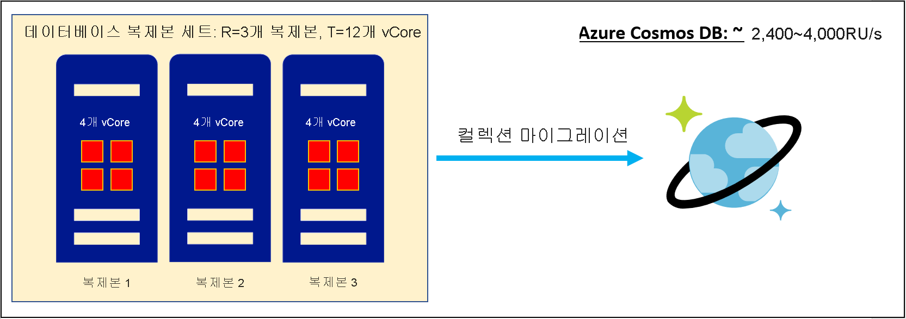
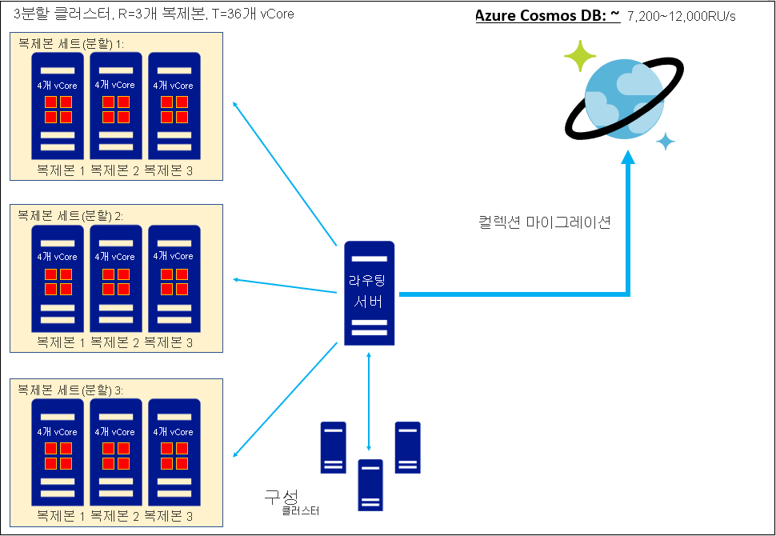
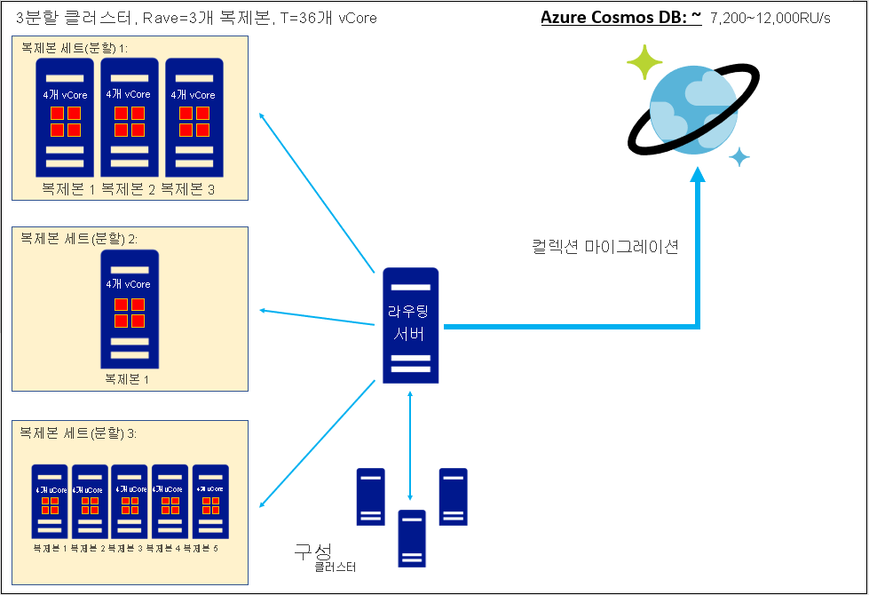

# 비관계형 데이터베이스의 vCore 또는 vCPU 수를 Azure Cosmos DB RU/s로 변환
[!INCLUDE[appliesto-sql-api](includes/appliesto-sql-api.md)]
[!INCLUDE[appliesto-mongodb-api](includes/appliesto-mongodb-api.md)]

이 문서에서는 데이터 마이그레이션을 생각하고 있지만 기존 데이터베이스 복제본 세트의 총 vCore 또는 vCPU 수만 알고 있는 경우에 Azure Cosmos DB 요청 단위(RU/s)를 예측하는 방법을 설명합니다. 하나 이상의 복제본 세트를 Azure Cosmos DB로 마이그레이션하는 경우 해당 복제본 세트에 보관된 각 컬렉션은 복제 계수가 4배인 분할된 클러스터로 구성되는 Azure Cosmos DB 컬렉션으로 저장됩니다. 아키텍처에 대한 자세한 내용은 이 [분할 및 스케일링 가이드](partitioning-overview.md)에서 알아볼 수 있습니다. 요청 단위는 컬렉션에서 처리량 용량을 프로비저닝하는 방법입니다. 자세한 내용은 [요청 단위 가이드](request-units.md) 및 RU/s [프로비저닝 가이드](set-throughput.md)를 참조하세요. 컬렉션을 마이그레이션할 때 Azure Cosmos DB는 프로비저닝된 요청 단위를 제공하고 데이터를 저장하기에 충분한 양의 분할된 데이터베이스를 프로비저닝합니다. 따라서 컬렉션의 RU/s를 예측하는 것은 마이그레이션 전에 계획된 Azure Cosmos DB 데이터 자산의 규모를 지정하는 중요한 단계입니다. 수천 명의 고객을 상대한 풍부한 경험을 통해 얻은 다음 수식을 사용하면 vCore 또는 vCPU 수를 기반으로 대략적인 시작 RU/s를 예상할 수 있습니다. 

`
Provisioned RU/s = C*T/R
`

* *T*: 기존 데이터베이스 **데이터 포함** 복제본 세트의 총 vCore 및/또는 vCPU 수입니다. 
* *R*: 기존 **데이터 포함** 복제본 세트의 복제 계수입니다. 
* *C*: vCore 또는 vCPU당 권장하는 프로비저닝 RU/s입니다. 이 값은 Azure Cosmos DB의 아키텍처에서 파생됩니다.
    * Azure Cosmos DB SQL API의 *C = 600 RU/s/vCore*
    * Azure Cosmos DB API for MongoDB v4.0의 *C = 1000 RU/s/vCore*
    * Cassandra API, Gremlin API 또는 기타 API에 대한 *C* 예상값은 현재 사용할 수 없습니다.

*C* 값은 위에 제공되었습니다. ***T* 는 기존 데이터베이스의 각 데이터 포함 복제본 세트에 있는 vCore 또는 vCPU 수를 검사하고 합계를 계산하여 결정해야 합니다**. *T* 를 예상할 수 없는 경우 이 가이드 대신 [Azure Cosmos DB Capacity Planner를 사용하여 RU/s를 예측하는 방법 가이드](estimate-ru-with-capacity-planner.md)를 따르는 것이 좋습니다. 기존 데이터베이스의 라우팅 서버 또는 구성 클러스터에 구성 요소가 포함된 경우 *T* 에는 기존 데이터베이스의 라우팅 서버 또는 구성 클러스터와 연결된 *vCore* 또는 *vCPU* 가 포함하면 안 됩니다. 

*R* 의 경우 데이터베이스 복제본 세트의 평균 복제 계수를 사용하는 것이 좋습니다. 이 정보를 알 수 없으면 경험적으로 *R=3* 을 사용하는 것이 좋습니다. 

Azure Cosmos DB interop API는 SQL API를 기반으로 실행되며 고유한 아키텍처를 구현합니다. 따라서 Azure Cosmos DB API for MongoDB v4.0의 *C* 값은 Azure Cosmos DB SQL API와 다릅니다.

## 작업 예제: 단일 복제본 세트 마이그레이션의 RU/s 예측

4코어 서버 SKU를 기반으로 하며 복제 계수가 *R=3* 인 단일 복제본 세트를 가정하겠습니다. 결과
* *T* = vCore 12개
* *R* = 3

그렇다면 Azure Cosmos DB SQL API에 권장되는 요청 단위는 다음과 같습니다.

`
Provisioned RU/s, SQL API = (600 RU/s/vCore) * (12 vCores) / (3) = 2,400 RU/s
`

그리고 Azure Cosmos DB API for MongoDB에 권장되는 요청 단위는 다음과 같습니다.

`
Provisioned RU/s, API for MongoDB = (1,000 RU/s/vCore) * (12 vCores) / (3) = 4,000 RU/s
`

## 작업 예제: 동일한 복제본 세트 클러스터를 마이그레이션할 때 RU/s 예측

분할 및 복제된 클러스터가 하나 있는데, 이 클러스터는 복제 계수가 3인 복제본 세트 3개로 구성되어 있으며 각 서버는 4코어 SKU라고 가정하겠습니다. 결과
* *T* = vCore 36개
* *R* = 3

그렇다면 Azure Cosmos DB SQL API에 권장되는 요청 단위는 다음과 같습니다.

`
Provisioned RU/s, SQL API = (600 RU/s/vCore) * (36 vCores) / (3) = 7,200 RU/s
`

그리고 Azure Cosmos DB API for MongoDB에 권장되는 요청 단위는 다음과 같습니다.

`
Provisioned RU/s, API for MongoDB = (1,000 RU/s/vCore) * (36 vCores) / (3) = 12,000 RU/s
`

## 작업 예제: 동일한 복제본 세트 클러스터를 마이그레이션할 때 RU/s 예측

각 서버가 4코어 SKU를 기반으로 하는 복제본 세트 3개로 구성된 분할 및 복제된 클러스터라고 가정하겠습니다. 복제본 세트의 복제 계수가 각각 3x, 1x 및 5x이므로 "서로 다른" 복제본 세트입니다. 요청 단위를 계산할 때 평균 복제 계수를 사용하는 것이 좋습니다. 결과
* *T* = vCore 36개
* *Ravg* = (3+1+5)/3 = 3

그렇다면 Azure Cosmos DB SQL API에 권장되는 요청 단위는 다음과 같습니다.

`
Provisioned RU/s, SQL API = (600 RU/s/vCore) * (36 vCores) / (3) = 7,200 RU/s
`

그리고 Azure Cosmos DB API for MongoDB에 권장되는 요청 단위는 다음과 같습니다.

`
Provisioned RU/s, API for MongoDB = (1,000 RU/s/vCore) * (36 vCores) / (3) = 12,000 RU/s
`

## 가장 정확한 RU/s 예상치를 얻기 위한 팁

*클라우드 관리형 데이터베이스에서 마이그레이션:* 현재 클라우드 관리형 데이터베이스를 사용하는 경우 이러한 서비스는 종종 *vCore* 또는 *vCPU* 단위(즉, *T*)로 프로비저닝되는 것처럼 보이지만, 실제로는 프로비저닝하는 코어 개수에 따라 *R*-노드 복제본 세트의 *vCore/복제본* 또는 *vCPU/복제본* 값(*T/R*)이 설정됩니다. 코어의 실제 수는 명시적으로 프로비저닝한 것보다 *R* 배 더 많습니다. 이 설명이 현재 클라우드 관리형 데이터베이스에 적용되는지 확인하고, 적용된다면 정확한 *T* 를 예상할 수 있도록 프로비저닝된 *vCore* 또는 *vCPU* 의 명목 수와 *R* 을 곱해야 합니다.

*vCore와 vCPU의 차이점:* 이 문서에서는 "vCore"와 "vCPU"를 동의어로 취급하므로 *C* 의 *RU/s/vCore* 또는 *RU/s/vCPU* 단위를 구분하지 않습니다. 그러나 실제로는 상황에 따라 이것이 정확하지 않을 수 있습니다. 이러한 용어는 의미가 다를 수 있습니다. 예를 들어 물리적 CPU가 하이퍼스레딩을 지원하는 경우 *vCPU 1개 = vCore 2개* 또는 다른 수식이 성립할 수 있습니다. 일반적으로 *vCore*/*vCPU* 관계는 하드웨어에 따라 다르므로 기존 클러스터 하드웨어의 관계와 클러스터 컴퓨팅이 *vCore* 또는 *vCPU* 중 무엇으로 프로비저닝되는지 조사하는 것이 좋습니다. *vCPU* 와 *vCore* 가 하드웨어에서 서로 다른 의미를 갖는 경우 위의 *C* 예상치를 *RU/s/vCore* 단위로 취급하고, 필요한 경우 하드웨어에 적합한 변환 계수를 사용하여 *T* 를 vCPU에서 vCore로 변환하는 것이 좋습니다.

## 요약

*vCore* 또는 *vCPU* 로 RU/s를 예측하려면 기존 데이터베이스 복제본 세트의 총 *vCore*/*vCPU* 수와 복제 계수에 대한 정보를 수집해야 합니다. 그런 다음, *vCore*/*vCPU* 간의 알려진 관계와 처리량을 사용하여 Azure Cosmos DB 요청 단위(RU/s)를 예상할 수 있습니다. 이 요청 단위 예상치를 찾는 것은 마이그레이션 후 Azure Cosmos DB 데이터 자산의 규모를 예측할 때 중요한 단계입니다.

아래 표에는 Azure Cosmos DB SQL API 및 API for MongoDB v4.0의 *vCore* 와 *vCPU* 간의 관계가 요약되어 있습니다.

| vCore 수 | RU/s(SQL API)  (복제 계수=3) | RU/s(API for MongoDB v4.0)  (복제 계수=3) |
|-------------|----------------|------------------|
| 3           | 600            |            1000  |
| 6           | 1200            |            2000  |
| 12           | 2400            |            4000  |
| 24           | 4800            |            8000  |
| 48           | 9600            |            16000  |
| 96           | 19200            |            32000  |
| 192           | 38400            |            64000  |
| 384           | 76800            |            128000  |

## 다음 단계
* [Azure Cosmos DB 가격 책정에 대해 알아보기](https://azure.microsoft.com/pricing/details/cosmos-db/)
* [Azure Cosmos DB 비용을 계획하고 관리하는 방법 알아보기](plan-manage-costs.md)
* [Azure Cosmos DB로 마이그레이션하는 옵션 검토](cosmosdb-migrationchoices.md)
* [Azure Cosmos DB SQL API로 마이그레이션](import-data.md)
* [Azure Cosmos DB API for MongoDB로 마이그레이션 계획](mongodb/pre-migration-steps.md). 이 문서에는 계획이 완료되면 사용할 수 있는 다양한 마이그레이션 도구의 링크가 포함되어 있습니다.

[regions]: https://azure.microsoft.com/regions/