# <a name="run-a-databricks-notebook-with-the-databricks-notebook-activity-in-azure-data-factory"></a>Azure Data Factory에서 Databricks Notebook 작업으로 Databricks Notebook 실행

[!INCLUDE[appliesto-adf-xxx-md](includes/appliesto-adf-xxx-md.md)]

이 자습서에서는 Azure Portal을 사용하여 databricks 작업 클러스터에 대해 Databricks Notebook을 실행하는 Azure Data Factory 파이프라인을 만듭니다. 또한 실행 중에 Azure Data Factory 매개 변수를 Databricks Notebook에 전달합니다.

이 자습서에서 수행하는 단계는 다음과 같습니다.

  - 데이터 팩터리를 만듭니다.

  - Databricks Notebook 작업을 사용하는 파이프라인을 만듭니다.

  - 파이프라인 실행 트리거

  - 파이프라인 실행을 모니터링합니다.

Azure 구독이 아직 없는 경우 시작하기 전에 [체험 계정](https://azure.microsoft.com/free/)을 만듭니다.

11분 동안 이 기능의 소개 및 데모에 대한 다음 비디오를 시청하세요.

> [!VIDEO https://channel9.msdn.com/Shows/Azure-Friday/ingest-prepare-and-transform-using-azure-databricks-and-data-factory/player]

## <a name="prerequisites"></a>사전 요구 사항

  - **Azure Databricks 작업 영역**. [databricks 작업 영역을 만들거나](/azure/databricks/scenarios/quickstart-create-databricks-workspace-portal) 기존 작업 영역을 사용합니다. Azure Databricks 작업 영역에 Python Notebook을 만듭니다. 그런 다음, Azure Data Factory를 사용하여 Notebook을 실행하고 매개 변수를 전달합니다.

## <a name="create-a-data-factory"></a>데이터 팩터리 만들기

1. **Microsoft Edge** 또는 **Google Chrome** 웹 브라우저를 시작합니다. 현재 Data Factory UI는 Microsoft Edge 및 Google Chrome 웹 브라우저에서만 지원됩니다.

1. Azure Portal 메뉴에서 **리소스 만들기**, **통합**, **데이터 팩터리** 를 차례로 선택합니다.

    :::image type="content" source="./media/doc-common-process/new-azure-data-factory-menu.png" alt-text="새로 만들기 창에서 Data Factory 선택 항목을 보여 주는 스크린샷":::

1. **Data Factory 만들기** 페이지의 **기본 사항** 탭에서 데이터 팩터리를 만들려는 위치에 Azure **구독** 을 선택합니다.

1. **리소스 그룹** 에 대해 다음 단계 중 하나를 사용합니다.
    
    1. 드롭다운 목록에서 기존 리소스 그룹을 선택합니다.
    
    1. **새로 만들기** 를 선택하고 새 리소스 그룹의 이름을 입력합니다.

    리소스 그룹에 대한 자세한 내용은 [리소스 그룹을 사용하여 Azure 리소스 관리](../azure-resource-manager/management/overview.md)를 참조하세요.

1. **지역** 의 경우 데이터 팩터리의 위치를 선택합니다.

    이 목록은 데이터 팩터리가 지원하는 위치 및 Azure Data Factory 메타데이터가 저장될 위치만 표시합니다. Data Factory에서 사용하는 연결된 데이터 저장소(Azure Storage 및 Azure SQL Database 등) 및 컴퓨팅(Azure HDInsight 등)은 다른 하위 지역에서 실행할 수 있습니다.

1. **이름** 에 **ADFTutorialDataFactory** 를 입력합니다.
    
    Azure Data Factory의 이름은 *전역적으로 고유* 해야 합니다. 다음 오류가 표시되는 경우 데이터 팩터리 이름을 변경합니다(예: **&lt;yourname&gt;ADFTutorialDataFactory** 사용). 데이터 팩터리 아티팩트에 대한 명명 규칙은 [데이터 팩터리 - 명명 규칙](./naming-rules.md) 문서를 참조하세요.

    :::image type="content" source="./media/doc-common-process/name-not-available-error.png" alt-text="이름을 사용할 수 없는 경우의 오류를 보여 주는 스크린샷":::

1. **버전** 에서 **V2** 를 선택합니다.

1. 완료되면 **다음: Git 구성** 을 선택한 다음, **나중에 Git 구성** 확인란을 선택합니다.

1. **검토 + 만들기** 를 선택하고 유효성 검사를 통과한 후 **만들기** 를 선택합니다. 

1. 만들기가 완료되면 **리소스로 이동** 을 선택하여 **Data Factory** 페이지로 이동합니다. **Azure Data Factory 스튜디오 열기** 타일을 선택하여 별도의 브라우저 탭에서 Azure Data Factory UI(사용자 인터페이스) 애플리케이션을 시작합니다.

    :::image type="content" source="./media/doc-common-process/data-factory-home-page.png" alt-text="Azure Data Factory 스튜디오 열기 타일이 있는 Azure Data Factory 페이지를 보여 주는 스크린샷":::

## <a name="create-linked-services"></a>연결된 서비스 만들기

이 섹션에서는 Databricks 연결된 서비스를 작성합니다. 이 연결된 서비스에는 Databricks 클러스터에 대한 연결 정보가 포함됩니다.

### <a name="create-an-azure-databricks-linked-service"></a>Azure Databricks 연결된 서비스 만들기

1.  홈페이지에서 왼쪽 패널의 **관리** 탭으로 전환합니다.

    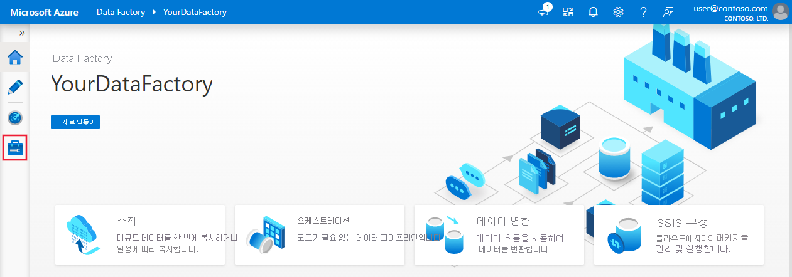

1.  **연결** 아래에서 **연결된 서비스** 를 선택한 다음, **+ 새로 만들기** 를 선택합니다.
    
    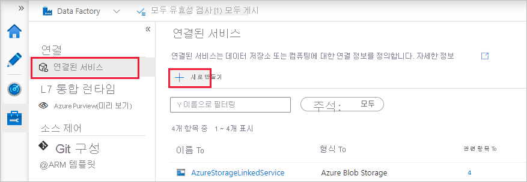

1.  **새 연결된 서비스** 창에서 **컴퓨팅** &gt; **Azure Databricks**, **계속** 을 차례로 선택합니다.
    
    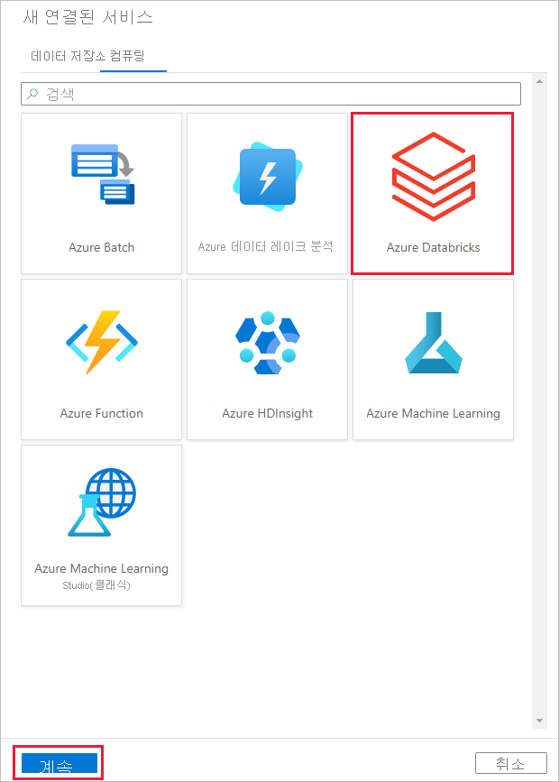

1.  **새 연결된 서비스** 창에서 다음 단계를 완료합니다.
    
    1.  **이름** 에 대해 **_AzureDatabricks\_LinkedService_** 를 입력합니다.
    
    1.  Notebook을 실행하는 데 적절한 **Databricks 작업 영역** 을 선택합니다.

    1.  **클러스터 선택** 에 대해 **새 작업 클러스터** 를 선택합니다.
    
    1.  **Databrick 작업 영역 URL** 의 경우 해당 정보가 자동으로 채워집니다.

    1.  **액세스 토큰** 에 대해 Azure Databricks 작업 공간에서 생성합니다. 단계는 [여기](https://docs.databricks.com/api/latest/authentication.html#generate-token)서 찾을 수 있습니다.

    1.  **클러스터 버전** 에 대해 **4.2**(Apache Spark 2.3.1, Scala 2.11 포함)를 선택합니다.

    1.  **클러스터 노드 유형** 에 대해 이 자습서의 **범용(HDD)** 범주 아래에서 **표준\_D3\_v2** 를 선택합니다. 
    
    1.  **근로자** 에 대해 **2** 를 입력합니다.
    
    1.  **만들기** 를 선택합니다.

        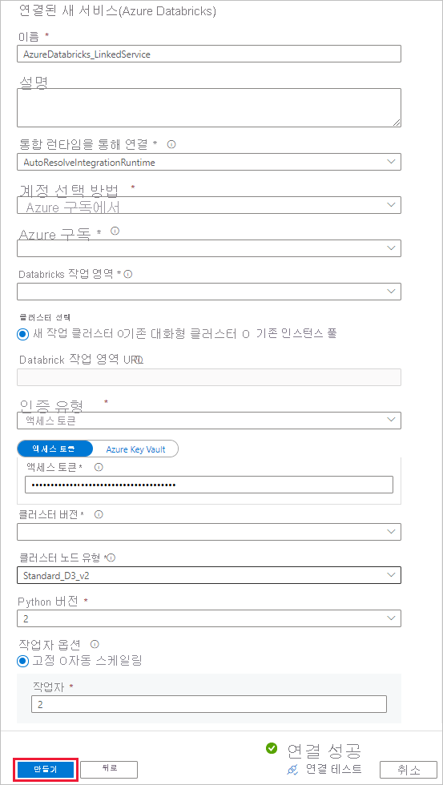

## <a name="create-a-pipeline"></a>파이프라인 만들기

1.  **+** (더하기) 단추를 선택한 다음 메뉴에서 **파이프라인** 을 선택합니다.

    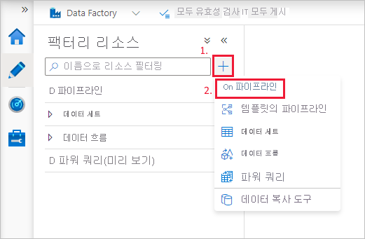

1.  **파이프라인** 에서 사용할 **매개 변수** 를 만듭니다. 나중에 이 매개 변수를 Databricks Notebook 작업에 전달합니다. 빈 파이프라인에서 **매개 변수** 탭, **새로 만들기** 를 차례로 선택하고, 이름으로 '**name**'을 지정합니다.

    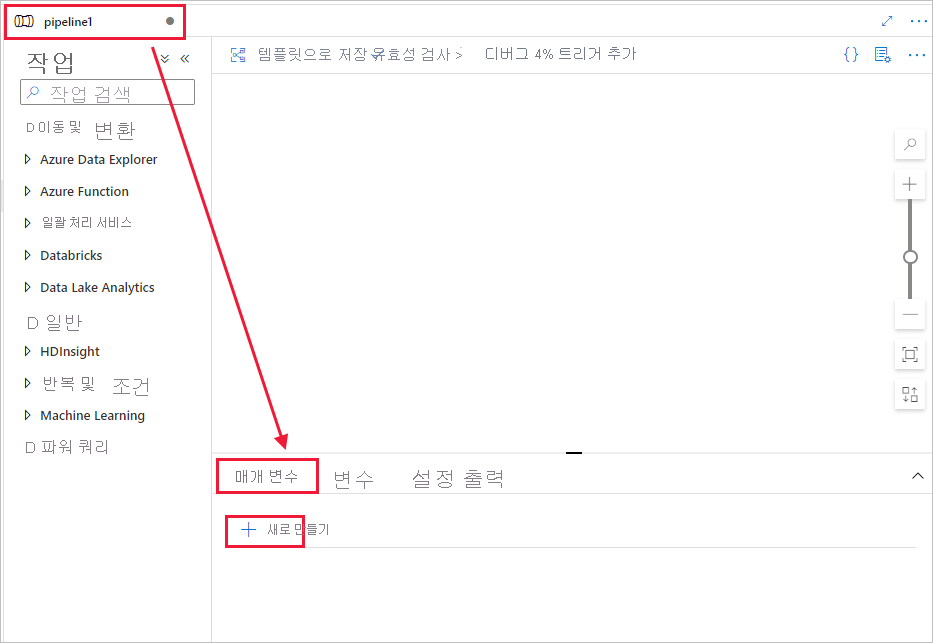

    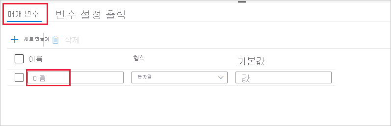

1.  **활동** 도구 상자에서 **Databricks** 를 펼칩니다. **활동** 도구 상자에서 **Notebook** 활동을 파이프라인 디자이너 화면으로 끌어서 놓습니다.

    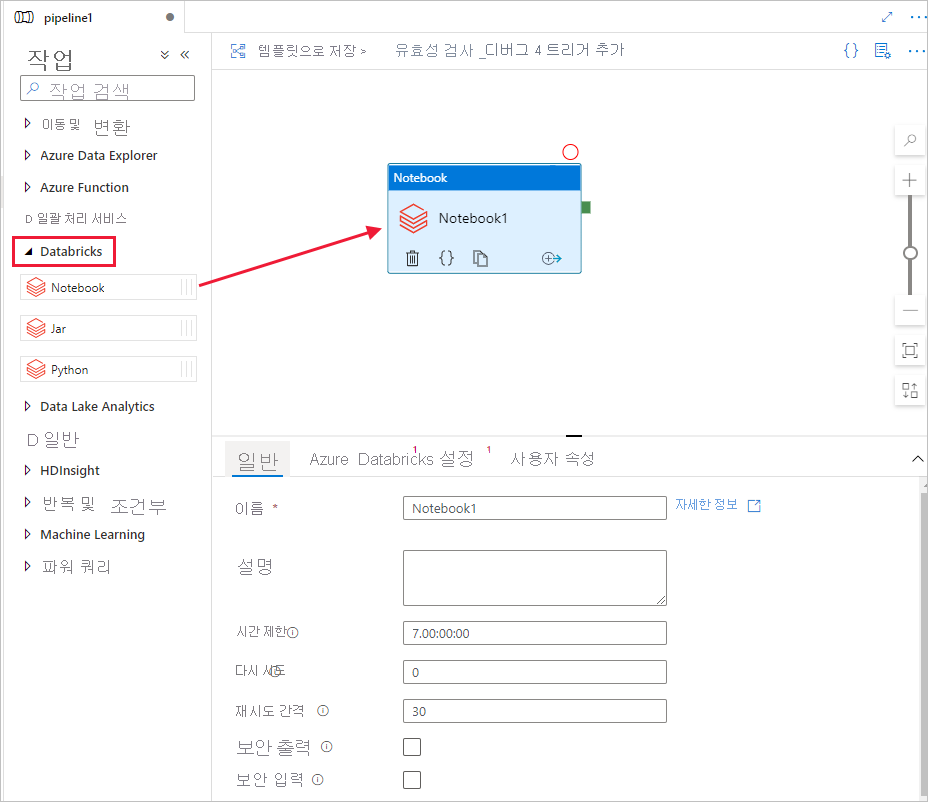

1.  아래쪽의 **Databricks** **Notebook** 활동 창에 대한 속성에서 다음 단계를 완료합니다.

    1. **Azure Databricks** 탭으로 전환합니다.

    1. 이전 절차에서 만든 **AzureDatabricks\_LinkedService** 를 선택합니다.

    1. **설정** 탭으로 전환합니다.

    1. Databricks **Notebook 경로** 를 찾아봅니다. 여기서는 노트북을 만들고 경로를 지정해 보겠습니다. 다음 몇 단계를 따라 Notebook 경로를 가져옵니다.

       1. Azure Databricks 작업 영역을 시작합니다.

       1. 작업 공간에서 **새 폴더** 를 만들고 **adftutorial** 로 호출합니다.

          

       1. [새 Notebook을 만드는 방법을 보여 주는 스크린샷](https://docs.databricks.com/user-guide/notebooks/index.html#creating-a-notebook) (Python) **adftutorial** 폴더 아래에서 **mynotebook** 이라고 하고 **만들기** 를 클릭해 보겠습니다.

          

          

       1. 새로 생성된 "mynotebook&quot; Notebook에서 다음 코드를 추가합니다.

           ```
           # Creating widgets for leveraging parameters, and printing the parameters

           dbutils.widgets.text(&quot;input&quot;, &quot;&quot;,&quot;")
           y = dbutils.widgets.get("input")
           print ("Param -\'input':")
           print (y)
           ```

           

       1. 이 경우 **Notebook 경로** 는 **/adftutorial/mynotebook** 입니다.

1.  **Data Factory UI 제작 도구** 로 다시 전환합니다. **Notebook1** 작업 아래의 **설정** 탭으로 이동합니다.

    a.  **매개 변수** 를 Notebook 작업에 추가합니다. 이전에 **파이프라인** 에 추가한 것과 동일한 매개 변수를 사용합니다.

       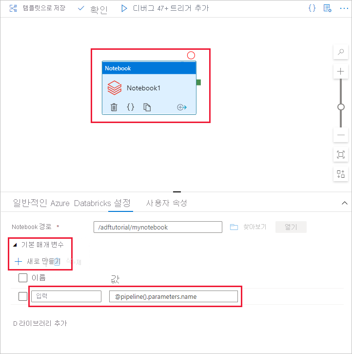

    b.  매개 변수의 이름을 **input** 으로 지정하고 값을 **\@pipeline().parameters.name** 식으로 제공합니다.

1.  파이프라인에 대한 유효성을 검사하려면 도구 모음에서 **유효성 검사** 단추를 선택합니다. 유효성 검사 창을 닫으려면 **닫기** 단추를 선택합니다.

    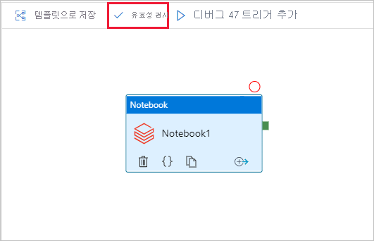

1.  **모두 게시** 를 선택합니다. Data Factory UI는 엔터티(연결된 서비스 및 파이프라인)를 Azure Data Factory 서비스에 게시합니다.

    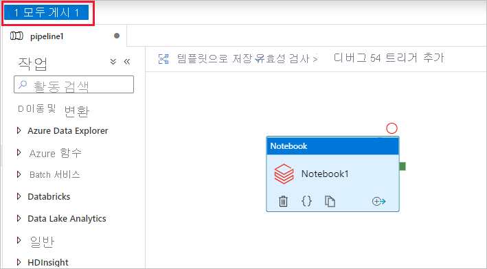

## <a name="trigger-a-pipeline-run"></a>파이프라인 실행 트리거

도구 모음에서 **트리거 추가** 를 선택한 다음, **지금 트리거** 를 선택합니다.

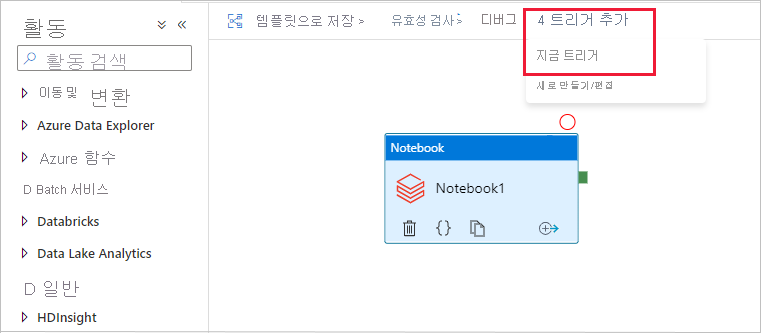

**파이프라인 실행** 대화 상자에서 **name** 매개 변수를 요청합니다. 여기서는 **/path/filename** 을 매개 변수로 사용합니다. **확인** 을 선택합니다.

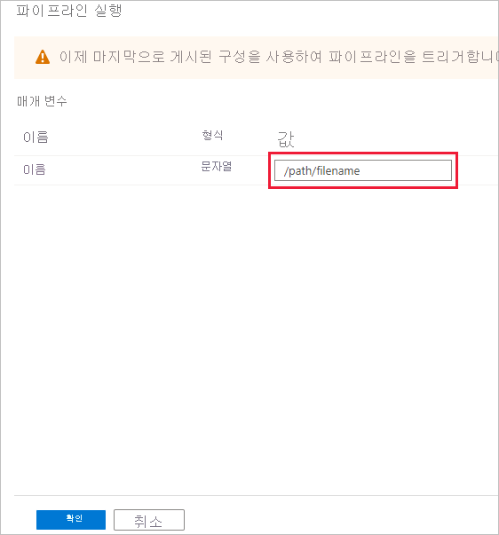

## <a name="monitor-the-pipeline-run"></a>파이프라인 실행을 모니터링합니다.

1.  **모니터** 탭으로 전환합니다. 파이프라인 실행이 표시되는지 확인합니다. 노트북이 실행되는 Databricks 작업 클러스터를 만드는 데 약 5~8분이 걸립니다.

    

1.  주기적으로 **새로 고침** 을 선택하여 파이프라인 실행 상태를 확인합니다.

1.  파이프라인 실행과 연결된 활동 실행을 보려면 **작업** 열에서 **활동 실행 보기** 를 선택합니다.

    

위쪽의 **파이프라인** 링크를 선택하여 파이프라인 실행 보기로 다시 전환할 수 있습니다.

## <a name="verify-the-output"></a>출력 확인

**Azure Databricks 작업 영역** 에 로그온하고 **클러스터** 로 이동할 수 있으며, **작업** 상태가 *실행 보류 중, 실행 중 또는 종료됨* 으로 표시됩니다.


**작업 이름** 을 클릭하여 세부 정보를 탐색할 수 있습니다. 성공적으로 실행되면 전달된 매개 변수와 Python 노트북의 출력의 유효성을 검사할 수 있습니다.


## <a name="next-steps"></a>다음 단계

이 샘플의 파이프라인에서 Databricks Notebook 활동을 트리거하고 여기에 매개 변수를 전달합니다. 구체적으로 다음 작업 방법을 알아보았습니다.

  - 데이터 팩터리를 만듭니다.

  - Databricks Notebook 활동을 사용하는 파이프라인을 만듭니다.

  - 파이프라인 실행 트리거

  - 파이프라인 실행을 모니터링합니다.