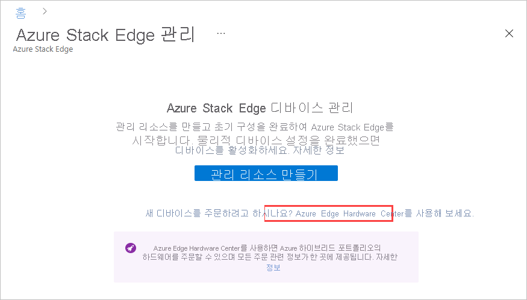
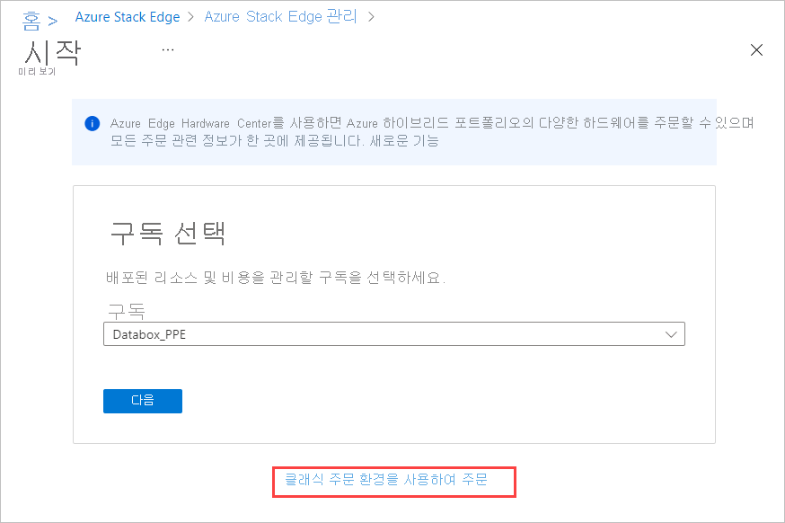
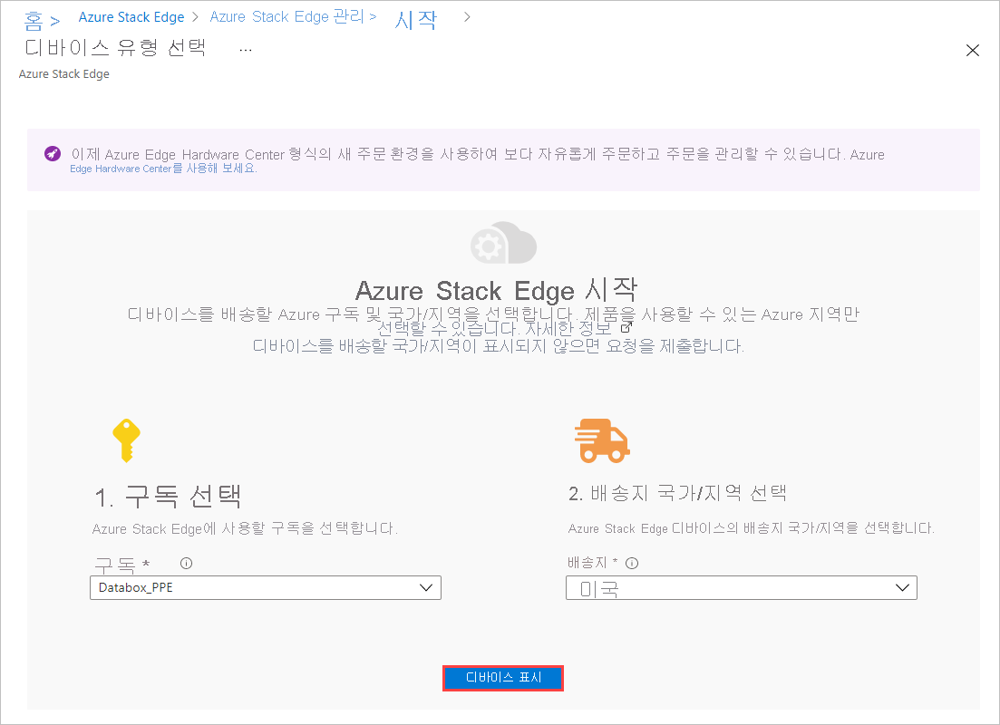
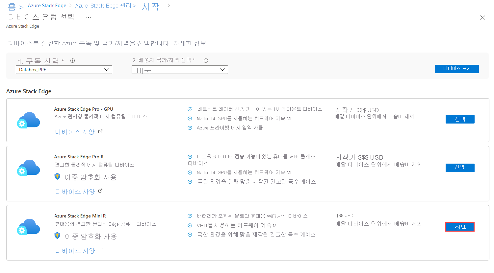
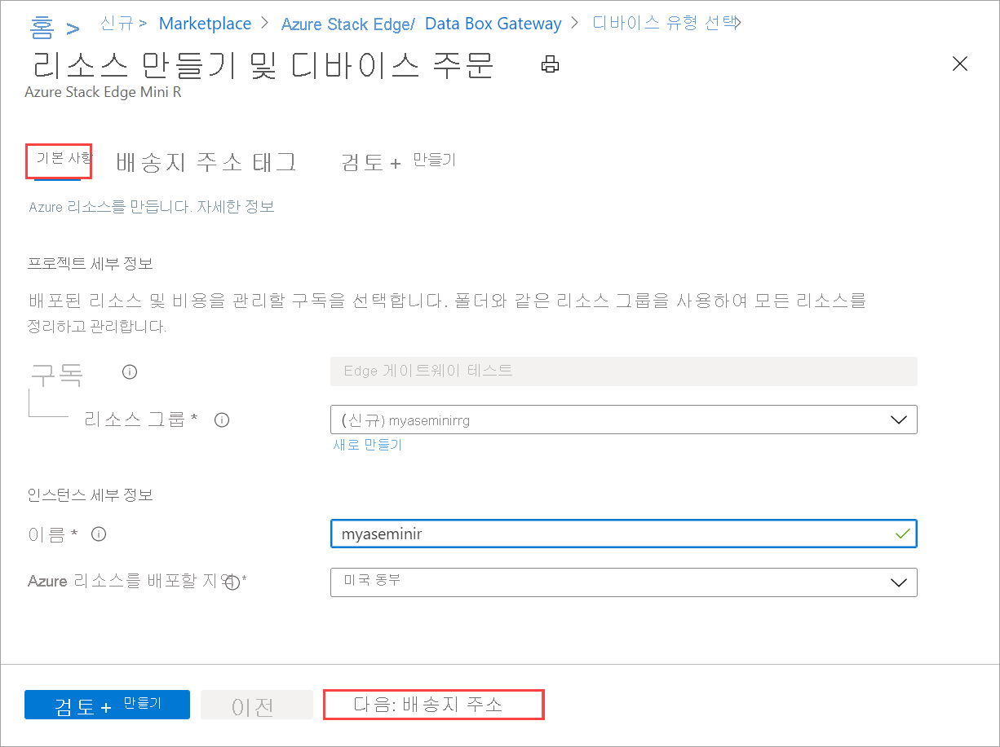
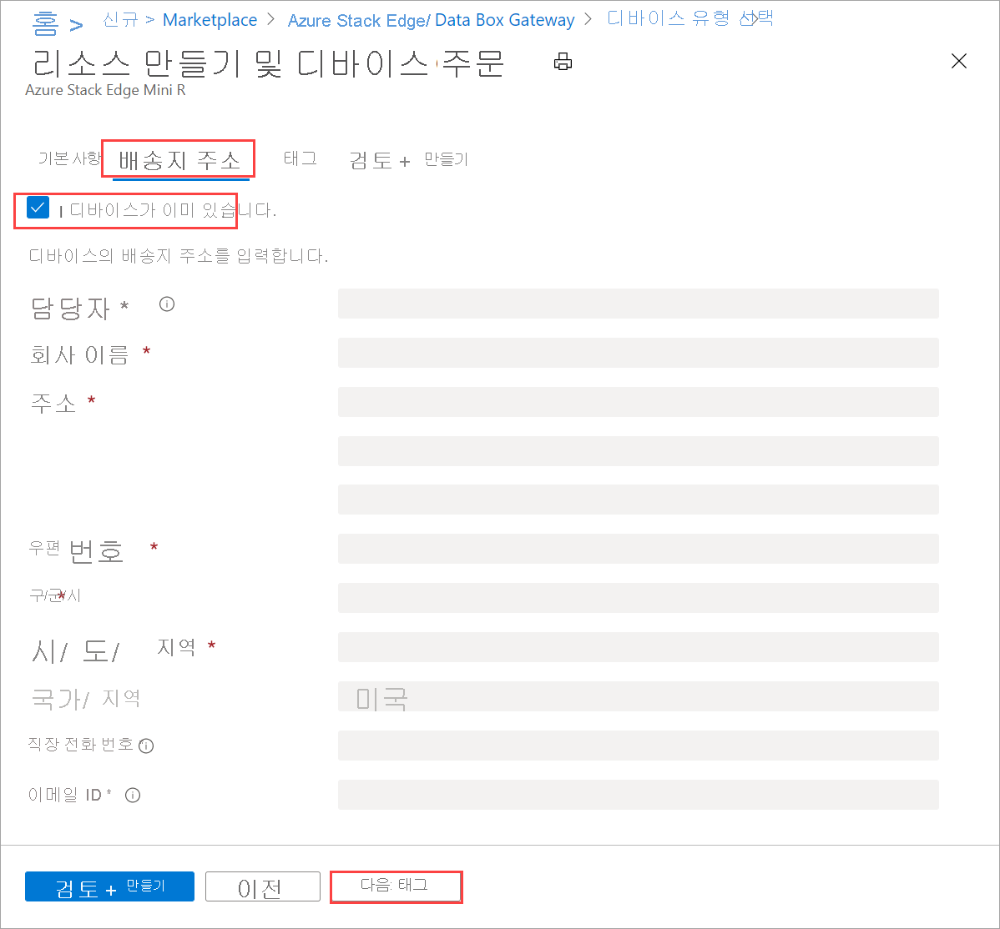
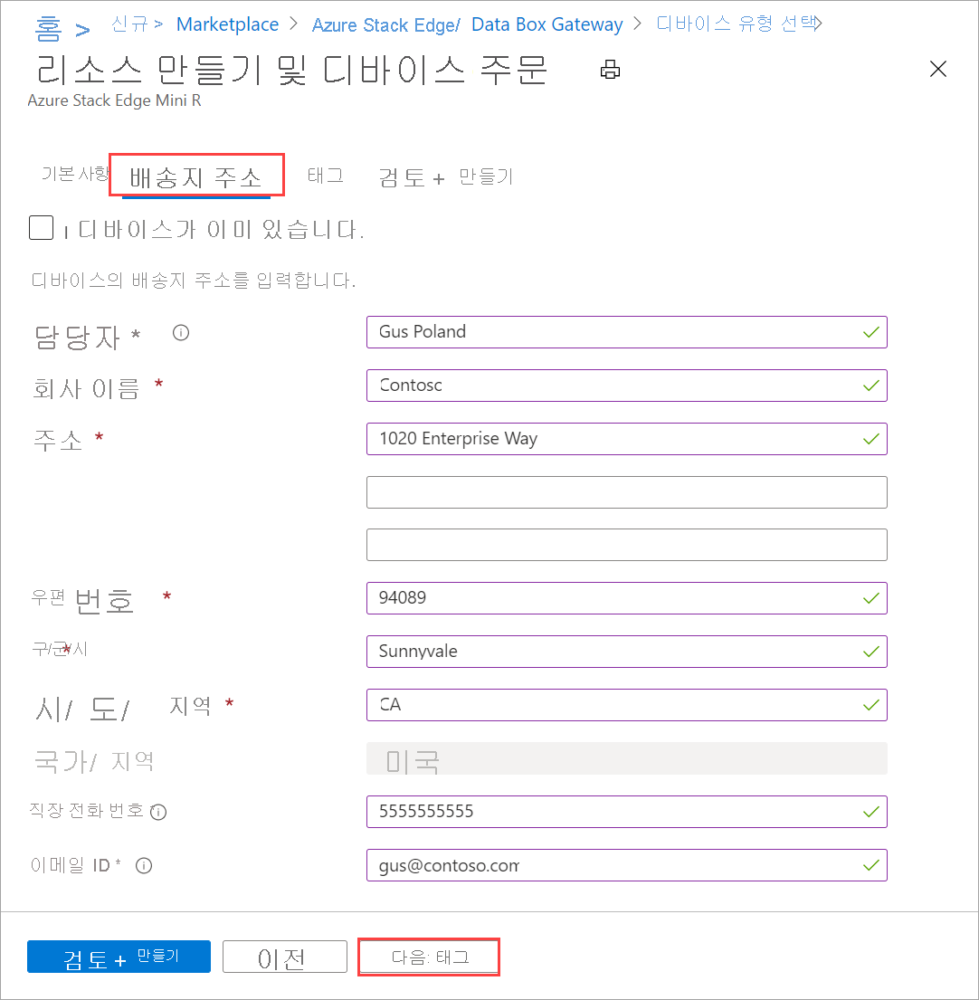

# <a name="tutorial-prepare-to-deploy-azure-stack-edge-mini-r"></a>자습서: Azure Stack Edge Mini R 배포 준비

이 자습서는 Azure Stack Edge Mini R 디바이스를 완전히 배포하는 데 필요한 배포 자습서 시리즈 중 첫 번째 자습서입니다. 이 자습서에서는 Azure Stack Edge 리소스를 배포하기 위해 Azure Portal을 준비하는 방법에 대해 설명합니다.

설치 및 구성 프로세스를 완료하려면 관리자 권한이 필요합니다. 포털 준비에는 10분 미만이 소요됩니다.

이 자습서에서는 다음 작업 방법을 알아봅니다.

> [!div class="checklist"]
> * 새 리소스 만들기
> * 활성화 키 가져오기

### <a name="get-started"></a>시작하기

Azure Stack Edge Mini R을 배포하려면 다음 자습서를 지정된 순서대로 참조하세요.

| 단계 | Description |
| --- | --- |
| **준비** |이러한 단계는 예정된 배포 준비 과정에서 완료해야 합니다. |
| **[배포 구성 검사 목록](#deployment-configuration-checklist)** |이 검사 목록을 사용하여 배포 이전 및 배포하는 동안 정보를 수집하고 기록합니다. |
| **[배포 사전 요구 사항](#prerequisites)** |이러한 필수 구성 요소는 배포할 준비가 되어 있는 환경인지 유효성을 검사합니다. |
|  | |
|**배포 자습서** |이러한 자습서는 프로덕션 환경에서 Azure Stack Edge Mini R 디바이스를 배포하는 데 필요합니다. |
|**[1. 디바이스에 대한 Azure Portal 준비](azure-stack-edge-mini-r-deploy-prep.md)** |물리적 디바이스를 설치하기 전에 Azure Stack Edge 리소스를 만들고 구성합니다. |
|**[2. 디바이스 설치](azure-stack-edge-mini-r-deploy-install.md)**|물리적 디바이스를 검사하고 케이블을 연결합니다.  |
|**[3. 디바이스에 연결](azure-stack-edge-mini-r-deploy-connect.md)** |디바이스가 설치되면 디바이스 로컬 웹 UI에 연결합니다.  |
|**[4. 네트워크 설정 구성](azure-stack-edge-mini-r-deploy-configure-network-compute-web-proxy.md)** |디바이스에 대한 컴퓨팅 네트워크 및 웹 프록시 설정을 포함하여 네트워크를 구성합니다.   |
|**[5. 디바이스 설정 구성](azure-stack-edge-mini-r-deploy-set-up-device-update-time.md)** |디바이스 이름과 DNS 도메인을 할당하고, 업데이트 서버 및 디바이스 시간을 구성합니다. |
|**[6. 보안 설정 구성](azure-stack-edge-mini-r-deploy-configure-certificates-vpn-encryption.md)** |사용자 고유의 인증서를 사용하여 인증서를 구성하고, VPN을 설정하고, 디바이스에 대한 미사용 암호화를 구성합니다.   |
|**[7. 디바이스 활성화](azure-stack-edge-mini-r-deploy-activate.md)** |서비스의 활성화 키를 사용하여 디바이스를 활성화합니다. 디바이스에서 SMB 또는 NFS 공유를 설정하거나 REST를 통해 연결할 준비가 되었습니다. |
|**[8. 컴퓨팅 구성](azure-stack-edge-gpu-deploy-configure-compute.md)** |디바이스에서 컴퓨팅 역할을 구성합니다. Kubernetes 클러스터도 만들어집니다. |

이제 Azure Portal 설치를 시작할 수 있습니다.

## <a name="deployment-configuration-checklist"></a>배포 구성 검사 목록

디바이스를 배포하기 전에 Azure Stack Edge Mini R 디바이스에서 소프트웨어를 구성하기 위한 정보를 수집해야 합니다. 이 정보 중 일부를 미리 준비하면 사용자 환경에서 디바이스를 배포하는 프로세스를 간소화하는 데 도움이 됩니다. 디바이스를 배포할 때 [Azure Stack Edge Mini R 배포 구성 검사 목록](azure-stack-edge-mini-r-deploy-checklist.md)을 사용하여 구성 세부 정보를 적어 둡니다.

## <a name="prerequisites"></a>사전 요구 사항

다음은 Azure Stack Edge 리소스, Azure Stack Edge 디바이스 및 데이터 센터 네트워크의 구성 필수 조건입니다.

### <a name="for-the-azure-stack-edge-resource"></a>Azure Stack Edge 리소스

[!INCLUDE [Azure Stack Edge resource prerequisites](../../includes/azure-stack-edge-gateway-resource-prerequisites.md)]

### <a name="for-the-azure-stack-edge-device"></a>Azure Stack Edge 디바이스

물리적 디바이스를 배포하기 전에 먼저 다음 사항을 확인합니다.

- [Azure Stack Edge 디바이스에 대한 안전 지침](azure-stack-edge-mini-r-safety.md)에서 이 디바이스에 대한 안정 정보를 검토했습니다.
[!INCLUDE [Azure Stack Edge device prerequisites](../../includes/azure-stack-edge-gateway-device-prerequisites.md)] 

### <a name="for-the-datacenter-network"></a>데이터 센터 네트워크의 경우

시작하기 전에 다음 사항을 확인합니다.

- 데이터 센터의 네트워크가 Azure Stack Edge 디바이스의 네트워킹 요구 사항에 따라 구성되어 있습니다. 자세한 내용은 [Azure Stack Edge Mini R 시스템 요구 사항](azure-stack-edge-mini-r-system-requirements.md)을 참조하세요.

- Azure Stack Edge가 정상 작동하기 위한 조건은 다음과 같습니다.

    - 디바이스가 업데이트 상태를 유지하기 위한 10Mbps의 최소 다운로드 대역폭.
    - 파일을 전송하기 위한 20Mbps의 최소 전용 업로드 및 다운로드 대역폭.

## <a name="create-a-new-resource"></a>새 리소스 만들기

물리적 디바이스를 관리할 수 있는 기존 Azure Stack Edge 리소스가 있으면 이 단계를 건너뛰고 [활성화 키 가져오기](#get-the-activation-key)로 이동합니다.

---

### <a name="azure-edge-hardware-center-preview"></a>[Azure Edge Hardware Center(미리 보기)](#tab/azure-edge-hardware-center)

Azure Edge Hardware Center(미리 보기)는 Azure Stack Edge Pro 디바이스를 포함하여 Azure 하이브리드 포트폴리오의 다양한 하드웨어를 탐색하고 주문할 수 있게 해주는 새로운 서비스입니다.

Azure Edge Hardware Center를 통해 주문할 때는 여러 주소로 여러 디바이스 배송을 주문할 수 있고 다른 주문에 배송지 주소를 재사용할 수 있습니다.

Azure Edge Hardware Center를 통해 주문하면 모든 주문 관련 정보가 포함된 Azure 리소스가 생성됩니다. 주문되는 각 단위마다 각각 하나의 리소스가 생성됩니다. 디바이스를 받은 후 이를 활성화하고 관리하려면 Azure Stack Edge 리소스를 만들어야 합니다.

[!INCLUDE [Create order in Azure Edge Hardware Center](../../includes/azure-edge-hardware-center-new-order.md)]

#### <a name="create-a-management-resource-for-each-device"></a>각 디바이스에 대한 관리 리소스 만들기

Azure Edge Hardware Center를 통해 주문된 디바이스를 관리하려면 Azure Stack Edge에서 각 디바이스에 대한 관리 리소스를 만듭니다. 디바이스를 활성화하면 관리 리소스가 주문 항목과 연결됩니다. 관리 리소스에서 주문 항목을 열고 주문 항목에서 관리 리소스를 열 수 있습니다. 

디바이스가 배달된 후에는 **하드웨어 구성** 링크가 주문 항목 세부 정보에 추가되어 관리 리소스를 만들기 위한 마법사를 직접 열 수 있습니다. Azure Stack Edge에서 **관리 리소스 만들기** 옵션을 사용할 수도 있습니다.

[!INCLUDE [Create management resource](../../includes/azure-edge-hardware-center-create-management-resource.md)]

### <a name="portal-classic"></a>[포털(기본)](#tab/azure-portal)

Azure Stack Edge 리소스를 만들려면 Azure Portal에서 다음 단계를 수행합니다.

1. Microsoft Azure 자격 증명을 사용하여 [https://portal.azure.com](https://portal.azure.com) URL에서 Azure Portal에 로그인합니다.

2. **Azure 서비스** 에서 **Azure Stack Edge** 를 검색하고 선택합니다. 그런 다음, **+ 만들기** 를 선택합니다. 

3. **Azure Stack Edge 디바이스 관리** 에서 **Azure Hardware Center 사용해 보기** 링크를 선택합니다.

    

    그러면 Azure Edge Hardware Center에서 주문을 만들기 위한 **시작** 화면이 열립니다. 

4. Hardware Center를 통해 주문하지 않으려면 **시작** 화면에서 **클래식 주문 환경을 사용하여 주문** 을 선택합니다.

   

5. Azure Stack Edge Pro 디바이스에 사용하려는 구독을 선택합니다. 이 물리적 디바이스를 배송하려는 국가를 선택합니다. **디바이스 표시** 를 선택합니다.

    


6. 디바이스 유형을 선택합니다. **Azure Stack Edge** 아래에서 **Azure Stack Edge Mini R** 을 선택한 다음, **선택** 을 선택합니다. 문제가 있거나 디바이스 유형을 선택할 수 없는 경우 [주문 문제 해결](azure-stack-edge-troubleshoot-ordering.md)로 이동합니다.

    [](media/azure-stack-edge-mini-r-deploy-prep/create-resource-2.png)


7. **기본 사항** 탭에서 다음 **프로젝트 세부 정보** 를 입력하거나 선택합니다.
    
    |설정  |값  |
    |---------|---------|
    |Subscription    |이전에 선택한 내용에 따라 구독이 자동으로 채워집니다. 구독은 청구 계정에 연결됩니다. |
    |Resource group  |기존 그룹을 선택하거나 새 그룹을 만듭니다.<br>[Azure 리소스 그룹](../azure-resource-manager/management/overview.md)에 대해 자세히 알아봅니다.     |


8. 다음 **인스턴스 세부 정보** 를 입력하거나 선택합니다.

    |설정  |값  |
    |---------|---------|
    |속성   | 리소스를 식별하기 위한 이름.<br>이름은 문자, 숫자 및 하이픈을 포함하여 2~50자입니다.<br> 이름은 문자 또는 숫자로 시작하고 끝납니다.        |
    |지역     |Azure Stack Edge 리소스를 사용할 수 있는 모든 지역 목록을 보려면 [지역별로 사용 가능한 Azure 제품](https://azure.microsoft.com/global-infrastructure/services/?products=databox&regions=all)을 참조하세요. Azure Government를 사용하는 경우 [Azure 지역](https://azure.microsoft.com/global-infrastructure/regions/)에서 본 것처럼 모든 정부 지역을 사용할 수 있습니다.<br> 디바이스를 배포하려는 지역에 지리적으로 가장 가까운 위치를 선택합니다.|

    


9. 완료되면 **다음: 배송 주소** 를 선택합니다.

   - 디바이스가 이미 있는 경우 **이미 디바이스가 있습니다** 의 콤보 상자를 선택합니다.

     

   - 이 디바이스가 주문하는 새 디바이스인 경우 연락처 이름, 회사, 디바이스를 배송할 주소, 연락처 정보를 입력합니다.

     

10. 완료되면 **다음: 태그** 를 선택합니다. 필요에 따라 리소스를 범주화하고 청구를 통합하는 태그를 입력합니다. 완료되면 **다음: 리뷰 + 만들기** 를 클릭합니다.

11. **검토 + 만들기** 탭에서 **가격 책정 세부 정보**, **사용 약관** 및 리소스 세부 정보를 살펴봅니다. **I have reviewed the privacy terms**(개인정보처리방침을 검토했습니다) 콤보 상자를 선택합니다.

    

    또한 리소스 생성 중에 클라우드 서비스에 인증할 수 있는 MSI(관리되는 서비스 ID)가 활성화된다는 알림이 표시됩니다. 이 ID는 리소스가 존재하는 동안 존재합니다.

12. **만들기** 를 선택합니다.

    리소스 생성에는 몇 분 정도가 소요됩니다. Azure Stack Edge 디바이스가 Azure의 리소스 공급자와 통신할 수 있도록 MSI도 만들어집니다.
    
    리소스가 생성되고 배포된 후에는 알림이 표시됩니다. **리소스로 이동** 을 선택합니다.
    
    
    
주문이 완료되면 Microsoft에서 주문을 검토한 후 배송 세부 정보가 포함된 이메일을 통해 연락을 드립니다.

> [!NOTE]
> 한 번에 여러 주문을 만들거나 기존 주문을 복제하려는 경우 [Azure 샘플의 스크립트](https://github.com/Azure-Samples/azure-stack-edge-order)를 사용할 수 있습니다. 자세한 내용은 추가 정보 파일을 참조하세요.

주문 프로세스 중에 문제가 발생하는 경우 [주문 문제 해결](azure-stack-edge-troubleshoot-ordering.md)을 참조하세요.

### <a name="azure-cli"></a>[Azure CLI](#tab/azure-cli)

필요한 경우 Azure CLI에 대한 환경을 준비합니다.

[!INCLUDE [azure-cli-prepare-your-environment-no-header.md](../../includes/azure-cli-prepare-your-environment-no-header.md)]

Azure Stack Edge 리소스를 만들려면 Azure CLI에서 다음 명령을 수행합니다.

1. [az group create](/cli/azure/group#az_group_create) 명령을 사용하여 리소스 그룹을 만들거나 기존 리소스 그룹을 사용합니다.

   ```azurecli
   az group create --name myasepgpu1 --location eastus
   ```

1. 디바이스를 만들려면 [az databoxedge device create](/cli/azure/databoxedge/device#az_databoxedge_device_create) 명령을 사용합니다.

   ```azurecli
   az databoxedge device create --resource-group myasepgpu1 \
      --device-name myasegpu1 --location eastus --sku EdgeMR_Mini
   ```

   디바이스를 배포하려는 지역에 지리적으로 가장 가까운 위치를 선택합니다. 지역에는 디바이스 관리용 메타데이터만 저장됩니다. 실제 데이터는 원하는 스토리지 계정에 저장할 수 있습니다.

   Azure Stack Edge 리소스를 사용할 수 있는 모든 지역 목록을 보려면 [지역별로 사용 가능한 Azure 제품](https://azure.microsoft.com/global-infrastructure/services/?products=databox&regions=all)을 참조하세요. Azure Government를 사용하는 경우 [Azure 지역](https://azure.microsoft.com/global-infrastructure/regions/)에서 본 것처럼 모든 정부 지역을 사용할 수 있습니다.

1. 주문을 생성하려면 [az databoxedge order create](/cli/azure/databoxedge/order#az_databoxedge_order_create) 명령을 실행합니다.

   ```azurecli
   az databoxedge order create --resource-group myasepgpu1 \
      --device-name myasegpu1 --company-name "Contoso" \
      --address-line1 "1020 Enterprise Way" --city "Sunnyvale" \
      --state "California" --country "United States" --postal-code 94089 \
      --contact-person "Gus Poland" --email-list gus@contoso.com --phone 4085555555
   ```

리소스 생성에는 몇 분 정도가 소요됩니다. [az databoxedge order show](/cli/azure/databoxedge/order#az_databoxedge_order_show) 명령을 실행하여 순서를 확인합니다.

```azurecli
az databoxedge order show --resource-group myasepgpu1 --device-name myasegpu1 
```

주문한 후 Microsoft는 주문을 검토하고 배송 세부 정보가 포함된 이메일로 연락을 드립니다.

---

## <a name="get-the-activation-key"></a>활성화 키 가져오기

Azure Stack Edge 리소스가 가동되면 활성화 키를 가져와야 합니다. 이 키는 Azure Stack Edge Mini R 디바이스를 활성화하고 리소스와 연결하는 데 사용됩니다. 이제 Azure Portal에서 이 키를 얻을 수 있습니다.

1. 사용자가 만든 리소스를 선택하고 **개요** 를 선택합니다.

   

2. **활성화** 타일에서 Azure Key Vault 이름을 입력하거나 기본 이름을 적용합니다. 키 자격 증명 모음 이름은 3~24자여야 합니다. 

    디바이스에서 활성화된 각 Azure Stack Edge 리소스에 대한 키 자격 증명 모음이 만들어집니다. 키 자격 증명 모음을 사용하여 비밀을 저장하고 액세스할 수 있습니다. 예를 들어 서비스의 CIK(채널 무결성 키)는 키 자격 증명 모음에 저장됩니다.

    키 자격 증명 모음 이름을 지정했으면 **활성화 키 생성** 을 선택하여 활성화 키를 만듭니다.

    [](media/azure-stack-edge-mini-r-deploy-prep/azure-stack-edge-resource-3.png#lightbox)

    키 자격 증명 모음 및 활성화 키가 생성되는 동안 몇 분 정도 기다립니다. 복사 아이콘을 선택하여 키를 복사하고 나중에 사용할 수 있도록 저장합니다.

> [!IMPORTANT]
> - 활성화 키는 생성되고 3일 후에 만료됩니다.
> - 키가 만료된 경우 새 키를 만듭니다. 이전 키는 유효하지 않습니다.

## <a name="next-steps"></a>다음 단계

이 자습서에서는 다음과 같은 Azure Stack Edge 토픽에 대해 알아보았습니다.

> [!div class="checklist"]
> * 새 리소스 만들기
> * 활성화 키 가져오기

Azure Stack Edge를 설치하는 방법을 알아보려면 다음 자습서를 계속 진행하세요.

> [!div class="nextstepaction"]
> [Azure Stack Edge 설치](./azure-stack-edge-mini-r-deploy-install.md)
