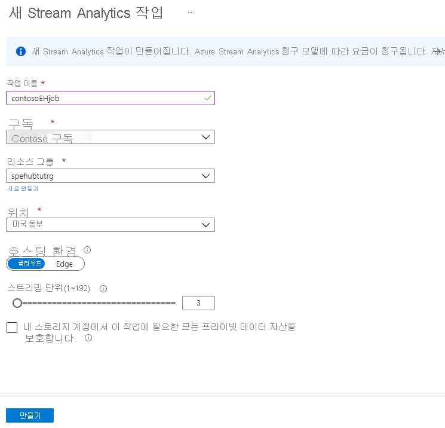
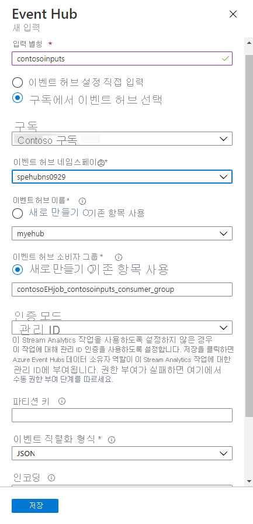

# <a name="tutorial-visualize-data-anomalies-in-real-time-events-sent-to-azure-event-hubs"></a>자습서: Azure Event Hubs에 보내는 실시간 이벤트에서 데이터 이상 시각화

Azure Event Hubs에서는 Azure Stream Analytics를 사용하여 들어오는 데이터를 확인하고 변칙을 짚어낸 다음, Power BI에서 시각화할 수 있습니다. 이벤트 허브에 지속적으로 실시간 데이터를 보내 초당 최대 수백 만 건의 이벤트를 더하는 수천 대의 디바이스를 가정해 보겠습니다. 이렇게 많은 데이터에서 변칙이나 오류를 어떻게 확인할까요? 예를 들어 디바이스가 신용 카드 트랜잭션을 전송하는데, 5초 이내 간격으로 여러 국가/지역에서 발생하는 여러 트랜잭션 모두 캡처해야 한다면 어떻게 될까요? 누군가 신용 카드를 도용하여 동시에 전세계에서 물품을 구매하는 경우 이런 상황이 발생할 수 있습니다. 

이 자습서에서는 이 예제를 시뮬레이션합니다. 신용 카드 거래를 만들어 이벤트 허브로 보내는 애플리케이션을 실행합니다. 그런 다음, Azure Stream Analytics를 통해 실시간으로 데이터 스트림을 읽습니다. 여기서는 유효한 거래와 잘못된 거래를 구별한 다음, Power BI를 사용하여 잘못된 것으로 태그 지정된 거래를 시각적으로 식별합니다.

이 자습서에서는 다음 작업 방법을 알아봅니다.
> [!div class="checklist"]
> * Event Hubs 네임스페이스 만들기
> * 이벤트 허브 만들기
> * 신용 카드 거래를 전송하는 앱 실행
> * 이러한 트랜잭션을 처리하는 Stream Analytics 작업 구성
> * Power BI 시각화를 구성하여 결과 표시

## <a name="prerequisites"></a>사전 요구 사항
시작하기 전에 다음 단계를 완료해야 합니다.

- Azure 구독이 아직 없는 경우 시작하기 전에 [체험 계정](https://azure.microsoft.com/free/)을 만듭니다.
- [Event Hubs 네임스페이스를 만들고 이 네임스페이스에 이벤트 허브를 만듭니다](event-hubs-create.md).
- [Event Hubs 연결 문자열 가져오기](event-hubs-get-connection-string.md)의 지침을 따릅니다. Event Hub 네임스페이스에 대한 연결 문자열과 이벤트 허브의 이름을 기록해 둡니다. 
- [Visual Studio](https://www.visualstudio.com/)를 설치합니다. Visual Studio 솔루션을 사용해 앱을 실행하여 테스트 이벤트 데이터를 생성하고 이벤트 허브로 보냅니다. 
- Stream Analytics 작업에서 출력을 분석하려면 Power BI 계정이 필요합니다. [Power BI 평가판](https://app.powerbi.com/signupredirect?pbi_source=web)을 사용할 수 있습니다.

## <a name="run-app-to-produce-test-event-data"></a>테스트 이벤트 데이터를 생성하는 앱 실행

GitHub의 Event Hubs [샘플](https://github.com/Azure/azure-event-hubs/tree/master/samples/DotNet)에는 테스트 데이터를 생성하는 Anomaly Detector 앱이 포함되어 있습니다. 이벤트 허브에 신용 카드 거래를 작성하여 신용 카드 사용을 시뮬레이션하는데, 경우에 따라 여러 위치에서 동일한 신용 카드에 대해 여러 개의 거래를 작성하여 변칙으로 태그되게 합니다. 이 앱을 실행하려면 다음 단계를 수행합니다. 

1. GitHub에서 [Azure Event Hubs 샘플](https://github.com/Azure/azure-event-hubs/archive/master.zip)을 다운로드하여 로컬에 압축을 풉니다.
2. **\azure-event-hubs-master\samples\DotNet\\** 폴더로 이동합니다. 
3. **Azure.Messaging.EventHubs\AnomalyDetector\\** 폴더로 전환하고 **AnomalyDetector.sln** 을 두 번 클릭하여 Visual Studio에서 솔루션을 엽니다. 

    이전 Microsoft.Azure.EventHubs 패키지를 사용하는 이전 버전의 샘플을 사용하려면 **Microsoft.Azure.EventHubs\AnomalyDetector** 폴더에서 솔루션을 엽니다. 
3. Program.cs를 열고 **Event Hubs connection string** 을 스크립트를 실행할 때 저장한 연결 문자열로 바꿉니다. 
4. **Event Hub name** 을 이벤트 허브 이름으로 바꿉니다. F5를 클릭하여 애플리케이션을 실행합니다. 이벤트 허브로 이벤트를 보내기 시작하고 1000개 이벤트를 보낼 때까지 계속합니다. 데이터를 검색하려면 앱을 실행해야 하는 경우가 있습니다. 이러한 경우는 필요하면 다음 지침에서 다룹니다.

## <a name="set-up-azure-stream-analytics"></a>Azure Stream Analytics 설정

이제 이벤트 허브로 데이터를 스트리밍할 수 있습니다. Power BI 시각화에서 데이터를 사용하려면 먼저 데이터를 검색한 다음, Power BI 시각화에 입력하는 Stream Analytics 작업을 설정합니다.

### <a name="create-the-stream-analytics-job"></a>Stream Analytics 작업 만들기

1. Azure Portal에서 **리소스 만들기** 를 클릭합니다. 검색 상자에 **stream analytics** 를 입력하고 **Enter** 를 누릅니다. **Stream Analytics 작업** 을 선택합니다. Stream Analytics 작업 창에서 **만들기** 를 클릭합니다. 

2. 작업에 대해 다음 정보를 입력합니다.

   **작업 이름**: **contosoEHjob** 을 사용합니다. 이 필드는 작업의 이름이며 전역에서 고유해야 합니다.

   **구독**: 구독을 선택합니다.

   **리소스 그룹**: 이벤트 허브에서 사용하는 것과 동일한 리소스 그룹(**ContosoResourcesEH**)을 사용합니다.

   **위치**: 이전에 사용한 것과 동일한 Azure 지역을 사용합니다.

   

    나머지 필드는 기본값을 그대로 사용합니다. **만들기** 를 클릭합니다. 

### <a name="add-an-input-to-the-stream-analytics-job"></a>Stream Analytics 작업에 입력 추가

**Stream Analytics 작업** 창에서 포털에 있지 않으면 포털의 **리소스 그룹** 을 클릭하고 리소스 그룹(**ContosoResourcesEH**)을 선택하여 Stream Analytics 작업으로 돌아갈 수 있습니다. 이 작업은 그룹의 모든 리소스를 표시하므로 자신의 Stream Analytics 작업을 선택할 수 있습니다. 

Stream Analytics 작업 입력은 이벤트 허브로부터의 신용 카드 거래입니다.


1. 왼쪽 메뉴의 **작업 토폴로지** 섹션에서 **입력** 을 선택합니다.
2. **입력** 창에서 **스트림 입력 추가** 를 클릭하고 **Event Hubs** 를 선택합니다. 나타난 화면에서 다음 필드를 입력합니다.

   **입력 별칭**: **contosoinputs** 를 사용합니다. 이 필드는 데이터에 대한 쿼리를 정의할 때 사용한 입력 스트림의 이름입니다.

   **구독**: Azure 구독을 선택합니다.

   **Event Hubs 네임스페이스**: Event Hub 네임스페이스를 선택합니다. 

   **Event Hub 이름**: **기존 항목 사용** 을 클릭하고 이벤트 허브를 선택합니다.

   **Event Hubs 소비자 그룹**: 기본 소비자 그룹을 사용하려면 이 필드를 비워 둡니다.

   나머지 필드에 대해 기본값을 수락합니다.

   
5. **저장** 을 클릭합니다.

### <a name="add-an-output-to-the-stream-analytics-job"></a>Stream Analytics 작업에 출력 추가

1. 왼쪽 메뉴의 **작업 토폴로지** 섹션에서 **출력** 을 선택합니다. 이 필드는 데이터에 대한 쿼리를 정의할 때 사용한 출력 스트림의 이름입니다.
2. **출력** 창에서 **추가** 를 클릭한 다음, **Power BI** 를 선택합니다. 나타난 화면에서 다음 필드를 입력합니다.

   **출력 별칭**: **contosooutputs** 를 사용합니다. 이 필드는 출력에 대한 고유 별칭입니다. 

   **데이터 세트 이름**: **contosoehdataset** 를 사용합니다. 이 필드는 Power BI에 사용할 데이터 세트의 이름입니다. 

   **테이블 이름**: **contosoehtable** 을 사용합니다. 이 필드는 Power BI에 사용할 테이블의 이름입니다. 

   나머지 필드는 기본값을 그대로 사용합니다.

   
3. **권한 부여** 를 클릭하고 사용자의 Power BI 계정에 로그인합니다.
4. 나머지 필드는 기본값을 그대로 사용합니다.
5. **저장** 을 클릭합니다.

### <a name="configure-the-query-of-the-stream-analytics-job"></a>Stream Analytics 작업의 쿼리 구성

이 쿼리는 궁극적으로 Power BI 시각화로 전송되는 데이터를 검색하는 데 사용됩니다. 이전에 작업을 설정할 때 정의한 **contosoinputs** 및 **contosooutputs** 를 사용합니다. 이 쿼리는 사기로 간주되는 신용카드 거래를 검색합니다. 즉 같은 5초 간격 안에 서로 다른 위치에서 동일한 신용카드 번호에 여러 거래가 발생한 경우입니다.

1. **작업 토폴로지** 에서 **쿼리** 를 클릭합니다.

2. 쿼리를 다움으로 바꿉니다. 

   ```SQL
   /* criteria for fraud:
      credit card purchases with the same card
      in different locations within 5 seconds
   */
   SELECT System.Timestamp AS WindowEnd, 
     COUNT(*) as FraudulentUses      
   INTO contosooutputs
   FROM contosoinputs CS1 TIMESTAMP BY [Timestamp]
       JOIN contosoinputs CS2 TIMESTAMP BY [Timestamp]
       /* where the credit card # is the same */
       ON CS1.CreditCardId = CS2.CreditCardId
       /* and time between the two is between 0 and 5 seconds */
       AND DATEDIFF(second, CS1, CS2) BETWEEN 0 AND 5
       /* where the location is different */
   WHERE CS1.Location != CS2.Location
   GROUP BY TumblingWindow(Duration(second, 1))
   ```

4. **저장** 을 클릭합니다.

### <a name="test-the-query-for-the-stream-analytics-job"></a>Stream Analytics 작업에 대해 쿼리 테스트 

1. Anomaly Detector 앱을 실행하여 테스트를 설정 및 실행하는 동안 이벤트 허브로 데이터를 보냅니다. 

2. 쿼리 창에서 **contosoinputs** 입력 옆에 있는 점을 클릭한 다음, **입력의 샘플 데이터** 를 선택합니다.

3. 3분 데이터를 지정하고 **확인** 을 클릭합니다. 데이터가 샘플링되었다는 알림을 받을 때까지 기다립니다.

4. **테스트** 를 클릭하고 결과를 가져오는지 확인합니다. 결과가 아래쪽 창의 **결과** 섹션에서 쿼리 아래 오른쪽에 표시됩니다.

5. 쿼리 창을 닫습니다.

### <a name="run-the-stream-analytics-job"></a>Stream Analytics 작업 실행

Stream Analytic 작업에서 **시작**, **지금**, **시작** 을 차례로 클릭합니다. 작업이 성공적으로 시작되면 작업 상태가 **중지됨** 에서 **실행 중** 으로 변경됩니다.

## <a name="set-up-the-power-bi-visualizations"></a>Power BI 시각화 설정

1. Anomaly Detector 앱을 실행하여 Power BI 시각화를 설정하는 동안 이벤트 허브로 데이터를 보냅니다. 실행할 때마다 1000개의 거래만 생성하므로 여러 번 실행해야 할 수 있습니다.

2. [Power BI](https://powerbi.microsoft.com/) 계정에 로그인합니다.

3. **내 작업 영역** 으로 이동합니다.

4. **데이터 세트** 를 클릭합니다.

   Stream Analytics 작업에 대한 출력을 만들 때 지정한 데이터 세트가 표시됩니다(**contosoehdataset**). 데이터 세트를 처음 표시할 때는 5-10분이 걸릴 수 있습니다.

5. **대시보드** 를 클릭한 다음, **만들기** 를 클릭하고 **대시보드** 를 선택합니다.

   

6. 대시보드 이름을 지정한 다음, **만들기** 를 클릭합니다. **신용 카드 변칙** 을 사용합니다.

   

7. 대시보드 페이지에서 **타일 추가** 를 클릭하고 **REAL-TIME DATA** 에서 **사용자 지정 스트리밍 데이터** 를 선택한 후, **다음** 을 클릭합니다.

   

8. 데이터 세트(**contosoehdataset**)를 선택하고 **다음** 을 클릭합니다.

   

9. 시각화 형식으로 **카드** 를 선택합니다. **필드** 에서 **값 추가** 를 클릭한 다음, `fraudulentuses`를 선택합니다.

   

   **다음** 을 클릭합니다.

10. 제목을 **사기성 사용** 으로, 부제목을 **지난 몇 분 동안의 합계** 로 설정합니다. **적용** 을 클릭합니다. 대시보드에 타일을 저장합니다.

    

    > [!IMPORTANT]
    > 샘플 애플리케이션을 실행하고 데이터를 이벤트 허브로 스트리밍하면, 이 타일의 숫자가 빠르게(1초마다) 변경됩니다. 이것은 Stream Analytics 쿼리가 실제로 **매초마다** 값을 업데이트하기 때문입니다. 지난 수분간의 합계를 보려면 쿼리를 3분간의 연속 창으로 업데이트합니다. 
11. 다른 시각화를 추가합니다. 처음 몇 단계를 다시 반복합니다.

    * **타일 추가** 를 클릭합니다.
    * **사용자 지정 스트리밍 데이터** 를 선택합니다. 
    * **다음** 을 클릭합니다.
    * 데이터 세트를 선택하고 **다음** 을 클릭합니다. 

12. **시각화 형식** 에서 **꺾은선형 차트** 를 선택합니다.

13. **축** 에서 **값 추가** 를 클릭하고 `windowend`를 선택합니다. 

14. **값** 에서 **값 추가** 를 클릭하고 `fraudulentuses`를 선택합니다.

15. **표시할 시간 창** 에 지난 5분을 선택합니다. **다음** 을 클릭합니다.

16. 제목에 **시간 경과에 따른 사기성 사용 표시** 를 입력하고 타일 부제목은 공백으로 둔 다음, **적용** 을 클릭합니다. 대시보드로 돌아갑니다.

17. Anomaly Detector 앱을 다시 실행하여 일부 데이터를 이벤트 허브로 보냅니다. 데이터 분석에 따라 **사기성 사용** 타일이 변경되고 꺾은선형 차트가 데이터를 표시합니다. 

    

## <a name="clean-up-resources"></a>리소스 정리

사용자가 만든 리소스를 모두 제거하려면 Power BI 시각화 데이터를 제거한 다음, 리소스 그룹을 삭제합니다. 리소스 그룹을 삭제하면 그룹 안에 포함된 모든 리소스가 삭제됩니다. 이 경우 이벤트 허브, 이벤트 허브 네임스페이스, 스트림 분석 작업 및 리소스 그룹 자체가 제거됩니다. 

### <a name="clean-up-resources-in-the-power-bi-visualization"></a>Power BI 시각화에서 리소스 정리

Power BI 계정에 로그인합니다. **내 작업 영역** 으로 이동합니다. 대시보드 이름이 있는 줄에서 휴지통 아이콘을 클릭합니다. **데이터 세트** 로 이동하고 휴지통 아이콘을 클릭하여 데이터 세트(**contosoehdataset**)를 삭제합니다.

### <a name="clean-up-resources"></a>리소스 정리
이 자습서의 일부로 만든 모든 리소스가 포함된 리소스 그룹을 삭제합니다. 

## <a name="next-steps"></a>다음 단계

이 자습서에서는 다음 작업 방법을 알아보았습니다.
> [!div class="checklist"]
> * Event Hubs 네임스페이스 만들기
> * 이벤트 허브 만들기
> * 이벤트를 시뮬레이션하고 이벤트 허브로 보내는 앱 실행
> * 허브로 전송된 이벤트를 처리하는 Stream Analytics 작업 구성
> * Power BI 시각화를 구성하여 결과 표시

Azure Event Hubs에 대해 자세히 알아보려면 다음 문서를 진행하세요.

> [!div class="nextstepaction"]
> [.NET Standard를 사용하여 Azure Event Hubs로 메시지 전송 시작](event-hubs-dotnet-standard-getstarted-send.md)

[create a free account]: https://azure.microsoft.com/free/?ref=microsoft.com&utm_source=microsoft.com&utm_medium=docs&utm_campaign=visualstudio
