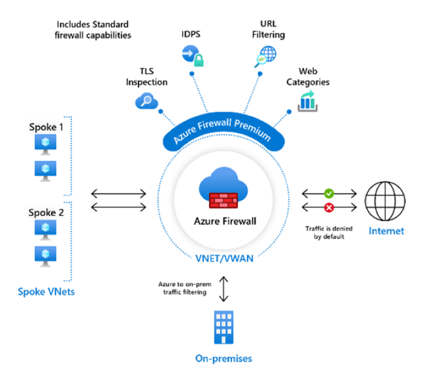

# Azure Firewall이란?

<!---  --->

Azure Firewall은 Azure에서 실행되는 클라우드 워크로드에 대해 동급 최강의 위협 보호를 제공하는 클라우드 네이티브 및 지능형 네트워크 방화벽 보안 서비스입니다. 고가용성 및 무제한 클라우드 확장성이 기본 제공되는 서비스 형태의 완전한 상태 저장 방화벽입니다. 동서 및 남북 트래픽 검사를 모두 제공합니다.

Azure Firewall은 Standard 및 Premium의 두 가지 SKU로 제공됩니다.

## Azure Firewall Standard

   Azure Firewall Standard는 Microsoft Cyber Security에서 직접 L3-L7 필터링 및 위협 인텔리전스 피드를 제공합니다. 위협 인텔리전스 기반 필터링은 새로운 공격으로부터 보호하기 위해 실시간으로 업데이트되는 알려진 악성 IP 주소 및 도메인에 대한 트래픽을 경고하고 거부할 수 있습니다.

   

Firewall Standard 기능에 대한 자세한 내용은 [Azure Firewall Standard 기능](features.md)을 참조하세요.

## Azure Firewall Premium

   Azure Firewall Premium은 특정 패턴을 찾아 공격을 신속하게 감지할 수 있도록 하는 서명 기반 IDPS를 포함하는 고급 기능을 제공합니다. 이러한 패턴에는 네트워크 트래픽의 바이트 시퀀스 또는 맬웨어에서 사용하는 알려진 악성 명령 시퀀스가 포함될 수 있습니다. 50개 이상의 범주에 58,000개 넘는 서명이 있으며, 이 시그니처는 새롭게 등장하는 악용으로부터 보호하기 위해 실시간으로 업데이트됩니다. 악용 범주에는 맬웨어, 피싱, 코인 마이닝 및 트로이 목마 공격이 포함됩니다.

   

Firewall Premium에 관해 알아보려면 [Azure Firewall Premium 기능](premium-features.md)을 참조하세요.

## Azure Firewall Manager

Azure Firewall Manager를 사용하여 여러 구독에 걸쳐 Azure Firewall을 중앙에서 관리할 수 있습니다. Firewall Manager는 방화벽 정책을 활용하여 공통 네트워크/애플리케이션 규칙 및 구성 집합을 테넌트의 방화벽에 적용합니다.
 
Firewall Manager는 VNet 및 Virtual WAN(보안 가상 허브) 환경 모두에서 방화벽을 지원합니다. 보안 가상 허브는 Virtual WAN 경로 자동화 솔루션을 사용하여 몇 번의 클릭으로 방화벽으로의 트래픽 라우팅을 단순화합니다.

Azure Firewall Manager에 대한 자세한 내용은 [Azure Firewall Manager](../firewall-manager/overview.md)를 참조하세요.

## 가격 및 SLA

Azure Firewall 가격 책정 정보는 [Azure Firewall 가격 책정](https://azure.microsoft.com/pricing/details/azure-firewall/)을 참조하세요.

Azure Firewall SLA 정보는 [Azure Firewall SLA](https://azure.microsoft.com/support/legal/sla/azure-firewall/)를 참조하세요.

## 새로운 기능

Azure Firewall의 새로운 기능을 알아보려면 [Azure 업데이트](https://azure.microsoft.com/updates/?category=networking&query=Azure%20Firewall)를 참조하세요.

## 알려진 문제

Azure Firewall의 알려진 문제는 다음과 같습니다.

|문제  |설명  |완화 방법  |
|---------|---------|---------|
|TCP/UDP 프로토콜이 아닌 프로토콜(예: ICMP)에 대한 네트워크 필터링 규칙은 인터넷 바운드 트래픽에 작동하지 않습니다.|TCP/UDP 프로토콜이 아닌 프로토콜에 대한 네트워크 필터링 규칙은 공용 IP 주소에 대한 SNAT에 작동하지 않습니다. TCP/UDP 프로토콜이 아닌 프로토콜은 스포크 서브넷과 VNet 간에 지원됩니다.|Azure Firewall은 표준 Load Balancer를 사용하기 때문에 [현재 IP 프로토콜을 위한 SNAT를 지원하지 않습니다](../load-balancer/load-balancer-overview.md). 향후 릴리스에서 이 시나리오를 지원할 수 있는 옵션을 모색하고 있습니다.|
|ICMP에 대한 PowerShell 및 CLI 지원 누락|Azure PowerShell 및 CLI는 네트워크 규칙에 유효한 프로토콜로 ICMP를 지원하지 않습니다.|여전히 포털 및 REST API를 통해 ICMP를 프로토콜로 사용할 수 있습니다. PowerShell 및 CLI에 ICMP를 조만간 추가하기 위해 노력 중입니다.|
|FQDN 태그는 프로토콜: 설정할 포트가 필요|FQDN 태그를 사용하는 애플리케이션 규칙에는 포트: 프로토콜 정의가 필요합니다.|**https** 를 포트: 프로토콜 값으로 사용할 수 있습니다. FQDN 태그를 사용할 때 이 필드 옵션이 작동하도록 하기 위한 작업이 진행 중입니다.|
|방화벽을 다른 리소스 그룹 또는 구독으로 이동하는 기능은 지원되지 않습니다.|방화벽을 다른 리소스 그룹 또는 구독으로 이동하는 기능은 지원되지 않습니다.|이 기능은 로드맵에 있습니다. 방화벽을 다른 리소스 그룹 또는 구독으로 이동하려면 현재 인스턴스를 삭제하고 새 리소스 그룹 또는 구독에서 다시 만들어야 합니다.|
|위협 인텔리전스 경고는 마스킹될 수 있습니다.|아웃바운드 필터링의 대상이 80/443인 네트워크 규칙은 위협 전용 모드로 구성되면 위협 인텔리전스 경고를 마스킹합니다.|애플리케이션 규칙을 사용하여 80/443에 대한 아웃바운드 필터링을 만듭니다. 또는 위협 인텔리전스 모드를 **경고 및 거부** 로 변경합니다.|
|Azure Firewall DNAT는 개인 IP 대상에는 작동하지 않습니다.|Azure Firewall DNAT 지원은 인터넷 송신/수신으로 제한됩니다. DNAT는 현재 개인 IP 대상에는 작동하지 않습니다. 예: 스포크-스포크.|이 문제가 현재 제한 사항입니다.|
|첫 번째 공용 IP 구성을 제거할 수 없음|각 Azure Firewall 공용 IP 주소는 *IP 구성* 에 할당됩니다.  첫 번째 IP 구성은 방화벽을 배포하는 동안 할당되며, 일반적으로 방화벽 서브넷에 대한 참조도 포함하고 있습니다(템플릿 배포를 통해 명시적으로 다르게 구성하지 않는 이상). 이 IP 구성을 삭제하면 방화벽이 할당 취소되므로 삭제할 수 없습니다. 방화벽에 사용 가능한 다른 공용 IP 주소가 하나 이상 있는 경우 이 IP 구성과 연결된 공용 IP 주소를 변경하거나 제거할 수 있습니다.|이것은 의도적인 것입니다.|
|가용성 영역은 배포 중에만 구성할 수 있습니다.|가용성 영역은 배포 중에만 구성할 수 있습니다. 방화벽이 배포된 후에는 가용 영역을 구성할 수 없습니다.|이것은 의도적인 것입니다.|
|인바운드 연결의 SNAT|DNAT 외에도 방화벽 공용 IP 주소(인바운드)를 통한 연결은 방화벽 개인 IP 중 하나로 SNAT됩니다. 이 요구 사항은 현재(활성/활성 NVA의 경우에도) 대칭 라우팅을 보장합니다.|HTTP/S에 대한 원래 원본을 보존하려면 [XFF](https://en.wikipedia.org/wiki/X-Forwarded-For) 헤더를 사용하는 것이 좋습니다. 예를 들어 방화벽 앞에 있는 [Azure Front Door](../frontdoor/front-door-http-headers-protocol.md#front-door-to-backend) 또는 [Azure Application Gateway](../application-gateway/rewrite-http-headers-url.md)와 같은 서비스를 사용합니다. Azure Front Door의 일부로 WAF를 추가하고 방화벽에 체인을 추가할 수도 있습니다.
|프록시 모드(포트 1433)에서만 지원되는 SQL FQDN 필터링|Azure SQL Database, Azure Synapse Analytics 및 Azure SQL Managed Instance의 경우:  SQL FQDN 필터링은 프록시 모드에서만 지원됩니다(포트 1433).  Azure SQL IaaS의 경우:  비표준 포트를 사용하는 경우 애플리케이션 규칙에서 해당 포트를 지정할 수 있습니다.|리디렉션 모드의 SQL(Azure 내에서 연결하는 경우 기본값)의 경우 대신 SQL 서비스 태그를 Azure Firewall 네트워크 규칙의 일부로 사용하여 액세스를 필터링할 수 있습니다.
|TCP 포트 25의 아웃바운드 SMTP 트래픽이 차단됨|TCP 포트 25에서 외부 도메인(예: `outlook.com` 및 `gmail.com`)으로 직접 전송되는 아웃바운드 이메일 메시지는 Azure Firewall에 의해 차단됩니다. 이는 Azure의 기본 플랫폼 동작입니다. |일반적으로 TCP 포트 587을 통해 연결하지만 다른 포트도 지원하는 인증된 SMTP 릴레이 서비스를 사용합니다.  자세한 내용은 [Azure에서 아웃바운드 SMTP 연결 문제 해결](../virtual-network/troubleshoot-outbound-smtp-connectivity.md)을 참조하세요. 현재 Azure Firewall은 아웃바운드 TCP 25를 사용하여 공용 IP와 통신할 수 있지만 작동이 보장되지 않으며 모든 구독 유형에서 지원되지 않습니다. 가상 네트워크, VPN 및 Azure ExpressRoute와 같은 개인 IP의 경우 Azure Firewall은 TCP 포트 25의 아웃바운드 연결을 지원합니다.
|SNAT 포트 소모|Azure Firewall은 현재 백 엔드 가상 머신 확장 집합 인스턴스별로 공용 IP 주소당 포트 1024개를 지원합니다. 기본적으로 두 개의 가상 머신 확장 집합 인스턴스가 있습니다.|이는 SLB 제한이며 지속적으로 제한이 증가되도록 노력하고 있습니다. 그 동안에는 SNAT이 소모될 수 있는 배포에 대한 공용 IP 주소를 최소 5개 사용하여 Azure Firewall 배포를 구성하는 것이 좋습니다. 그러면 사용 가능한 SNAT 포트가 5배로 증가합니다. 다운스트림 권한이 간소화되도록 IP 주소 접두사에서 할당합니다.|
|DNAT는 강제 터널링을 사용하는 경우 지원되지 않습니다.|강제 터널링을 사용하여 배포된 방화벽은 비대칭 라우팅으로 인해 인터넷에서 인바운드 액세스를 지원할 수 없습니다.|이는 비대칭 라우팅 때문에 의도된 것입니다. 인바운드 연결의 반환 경로는 온-프레미스 방화벽을 통해 전달되며 설정된 연결이 표시되지 않습니다.
|아웃바운드 수동 FTP는 FTP 서버 구성에 따라 여러 공용 IP 주소가 있는 방화벽에서 작동하지 않을 수 있습니다.|수동 FTP는 제어 및 데이터 채널에 대해 서로 다른 연결을 설정합니다. 공용 IP 주소가 여러 개인 방화벽이 데이터를 아웃바운드로 보내는 경우 원본 IP 주소에 대한 공용 IP 주소 중 하나를 임의로 선택합니다. FTP 서버 구성에 따라 데이터 및 제어 채널에서 다른 원본 IP 주소를 사용하는 경우 FTP가 실패할 수 있습니다.|명시적 SNAT 구성이 계획되어 있습니다. 그 동안에는 FTP 서버를 구성하여 서로 다른 원본 IP 주소에서 데이터를 허용하고 채널을 제어할 수 있습니다([IIS의 예제](/iis/configuration/system.applicationhost/sites/sitedefaults/ftpserver/security/datachannelsecurity) 참조). 또는 이 경우에 단일 IP 주소를 사용하는 것이 좋습니다.|
|FTP 서버 구성에 따라 인바운드 수동 FTP가 작동하지 않을 수 있습니다. |수동 FTP는 제어 및 데이터 채널에 대해 서로 다른 연결을 설정합니다. Azure Firewall의 인바운드 연결은 대칭 라우팅을 보장하기 위해 방화벽 개인 IP 주소 중 하나에 SNAT됩니다. FTP 서버 구성에 따라 데이터 및 제어 채널에서 다른 원본 IP 주소를 사용하는 경우 FTP가 실패할 수 있습니다.|원래 원본 IP 주소를 유지하는 동안 조사하고 있습니다. 그 동안에는 FTP 서버를 구성하여 서로 다른 원본 IP 주소에서 데이터를 허용하고 채널을 제어할 수 있습니다.|
|FTP 클라이언트가 인터넷을 통해 FTP 서버에 연결해야 하는 경우에는 활성 FTP가 작동하지 않습니다.|활성 FTP는 FTP 서버에 데이터 채널에 사용할 IP 및 포트를 지시하는 FTP 클라이언트의 포트 명령을 활용합니다. 이 포트 명령은 변경할 수 없는 클라이언트의 개인 IP를 활용합니다. Azure Firewall을 통과하는 클라이언트 쪽 트래픽은 인터넷 기반 통신을 위한 NAT로, FTP 서버에서는 PORT 명령을 잘못된 것으로 표시합니다.|이것은 클라이언트 쪽 NAT와 함께 사용할 경우에 나타나는 활성 FTP의 일반적인 제한 사항입니다.|
|NetworkRuleHit 메트릭에 프로토콜 차원이 누락됨|ApplicationRuleHit 메트릭은 필터링 기반 프로토콜을 허용하지만 해당 NetworkRuleHit 메트릭에는 이 기능이 없습니다.|수정 사항을 조사하고 있습니다.|
|64000에서 65535 사이의 포트를 사용하는 NAT 규칙이 지원되지 않음|Azure Firewall은 네트워크 및 애플리케이션 규칙에서 1-65535 범위의 모든 포트를 허용하지만 NAT 규칙은 1-63999 범위의 포트만 지원합니다.|이 문제가 현재 제한 사항입니다.
|구성 업데이트는 평균 5분이 걸릴 수 있습니다.|Azure Firewall 구성 업데이트는 평균 3 ~ 5분이 걸릴 수 있으며 병렬 업데이트는 지원되지 않습니다.|수정 사항을 조사하고 있습니다.|
|Azure Firewall은 SNI TLS 헤더를 사용하여 HTTPS 및 MSSQL 트래픽을 필터링합니다.|브라우저 또는 서버 소프트웨어에서 SNI(서버 이름 표시기) 확장을 지원하지 않는 경우 Azure Firewall을 통해 연결할 수 없습니다.|브라우저 또는 서버 소프트웨어에서 SNI를 지원하지 않는 경우 애플리케이션 규칙 대신 네트워크 규칙을 사용하여 연결을 제어할 수 있습니다. SNI를 지원하는 소프트웨어는 [서버 이름 표시](https://wikipedia.org/wiki/Server_Name_Indication)를 참조하세요.|
|사용자 지정 DNS는 강제 터널링에서 작동하지 않습니다.|강제 터널링이 활성화된 경우 사용자 지정 DNS가 작동하지 않습니다.|수정 사항을 조사하고 있습니다.|
|강제 터널 모드로 구성된 방화벽에서 시작/중지가 작동하지 않습니다.|강제 터널 모드로 구성된 Azure 방화벽에서 시작/중지가 작동하지 않습니다. 강제 터널링이 구성된 Azure Firewall을 시작하려고 하면 다음 오류가 발생합니다.  *Set-AzFirewall: AzureFirewall FW-xx 관리 IP 구성은 기존 방화벽에 추가할 수 없습니다. 강제 터널링 지원을 사용하려면 관리 IP 구성으로 다시 배포합니다. StatusCode: 400 ReasonPhrase: 잘못된 요청*|확인 중입니다.  해결 방법으로 기존 방화벽을 삭제하고 동일한 매개 변수를 사용하여 새 방화벽을 만들 수 있습니다.|
|포털 또는 ARM(Azure Resource Manager) 템플릿을 사용하여 방화벽 정책 태그를 추가할 수 없음|Azure Firewall 정책에는 Azure Portal 또는 ARM 템플릿을 사용하여 태그를 추가할 수 없도록 하는 패치 지원 제한이 있습니다. 다음 오류가 생성됩니다. *리소스에 대한 태그를 저장할 수 없습니다*.|수정 사항을 조사하고 있습니다. 또는 Azure PowerShell cmdlet `Set-AzFirewallPolicy`를 사용하여 태그를 업데이트할 수 있습니다.|
|IPv6은 현재 지원되지 않습니다.|규칙에 IPv6 주소를 추가하면 방화벽이 실패합니다.|IPv4 주소만 사용합니다. IPv6 지원은 조사 중에 있습니다.|
|여러 IP 그룹 업데이트가 충돌 오류로 인해 실패합니다.|동일한 방화벽에 연결된 IP 그룹을 두 개 이상 업데이트하면 리소스 중 하나가 실패한 상태가 됩니다.|이는 알려진 문제/제한 사항입니다.   IP 그룹을 업데이트하면 IP 그룹이 연결된 모든 방화벽에 대한 업데이트가 트리거됩니다. 방화벽이 여전히 ‘업데이트 중’ 상태에 있는 동안 두 번째 IP 그룹에 대한 업데이트를 시작하면 IP 그룹 업데이트가 실패합니다.  오류를 방지하려면 동일한 방화벽에 연결된 IP 그룹을 한 번에 하나씩 업데이트해야 합니다. 업데이트 사이에 충분한 시간을 허용하여 방화벽이 *업데이트* 상태를 벗어날 수 있도록 합니다.|
|ARM 템플릿을 사용한 RuleCollectionGroups 제거는 지원되지 않습니다.|ARM 템플릿을 사용한 RuleCollectionGroup 제거는 지원되지 않으며 실패합니다.|이 작업은 지원되지 않습니다.|
|*임의*(*) 허용에 대한 DNAT 규칙은 SNAT트래픽을 발생시킵니다.|DNAT 규칙이 원본 IP 주소로 *임의*(*)를 허용하는 경우 암시적 네트워크 규칙은 VNet-VNet 트래픽과 일치하고 항상 SNAT 트래픽을 발생시킵니다.|이 문제가 현재 제한 사항입니다.|
|보안 공급자가 있는 보안 가상 허브에 DNAT 규칙을 추가하는 것은 지원되지 않습니다.|이로 인해 보안 공급자로 이동하는 DNAT 트래픽을 반환하는 비동기 경로가 생성됩니다.|지원 안 됨|
| 2,000개를 초과하는 규칙 컬렉션을 만드는 동안 오류가 발생했습니다. | NAT/애플리케이션 또는 네트워크 규칙 컬렉션의 최대 수는 2,000개(리소스 관리자 한도)입니다. | 이 문제가 현재 제한 사항입니다. |
|Azure Firewall 로그에서 네트워크 규칙 이름을 볼 수 없습니다.|Azure Firewall 네트워크 규칙 로그 데이터는 네트워크 트래픽에 대한 규칙 이름을 표시하지 않습니다.|이를 지원하기 위해 기능을 조사하고 있습니다.|

## 다음 단계

- [빠른 시작: Azure Firewall 및 방화벽 정책 만들기 - ARM 템플릿](../firewall-manager/quick-firewall-policy.md)
- [빠른 시작: 가용성 영역을 사용하여 Azure Firewall 배포 - ARM 템플릿](deploy-template.md)
- [자습서: Azure Portal을 사용하여 Azure Firewall 배포 및 구성](tutorial-firewall-deploy-portal.md)
- [학습 모듈: Azure Firewall 소개](/learn/modules/introduction-azure-firewall/)
