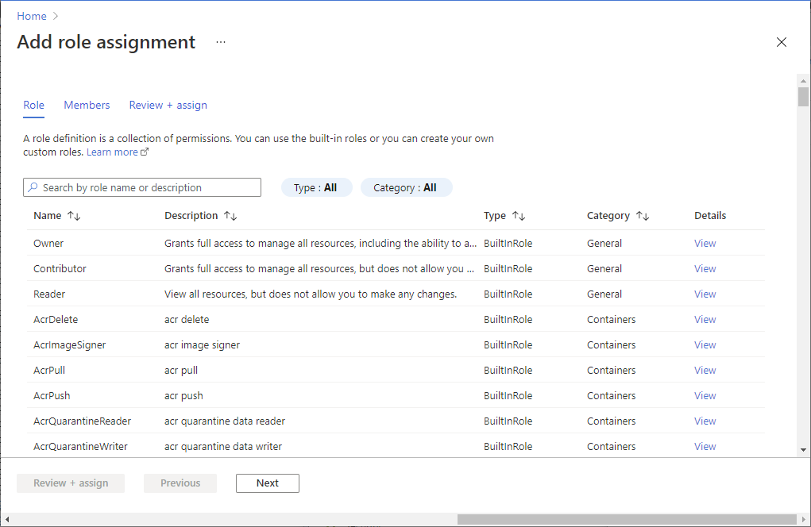

# <a name="how-to-convert-data-to-fhir-preview"></a>데이터를 FHIR로 변환하는 방법(미리 보기)

> [!IMPORTANT]
> 이 기능은 공개 미리 보기 상태 이며 서비스 수준 계약 없이 제공 됩니다. 프로덕션 워크로드에는 권장되지 않습니다. 특정 기능이 지원되지 않거나 기능이 제한될 수 있습니다. 자세한 내용은 [Microsoft Azure Preview에 대한 추가 사용 약관](https://azure.microsoft.com/support/legal/preview-supplemental-terms/)을 참조하세요.

FHIR 서비스의 $convert 데이터 사용자 지정 끝점은 서로 다른 데이터 형식에서 FHIR로 데이터를 변환 하기 위한 것입니다. Liquid 템플릿 엔진과 [FHIR 변환기](https://github.com/microsoft/FHIR-Converter) 프로젝트의 템플릿을 기본 템플릿으로 사용합니다. 필요에 따라 이러한 변환 템플릿을 사용자 지정할 수 있습니다. 현재는 두 가지 유형의 변환 인 **C-CDA에서 fhir** 및 **HL7v2 TO fhir** 변환을 지원 합니다.

## <a name="use-the-convert-data-endpoint"></a>$convert-data 엔드포인트 사용

`$convert-data`작업은 FHIR 서비스에 통합 되어 서비스의 일부로 실행 됩니다. 서버에 대 한 API 호출을 수행 하 여 데이터를 FHIR로 변환할 수 있습니다.

`https://<<FHIR service base URL>>/$convert-data`

### <a name="parameter-resource"></a>매개 변수 리소스

$convert 데이터는 아래 표에 설명 된 것 처럼 요청 본문에서 [매개 변수](http://hl7.org/fhir/parameters.html) 리소스를 사용 합니다. API 호출 요청 본문에는 다음 매개 변수가 포함 됩니다.

| 매개 변수 이름      | 설명 | 허용되는 값 |
| ----------- | ----------- | ----------- |
| inputData      | 변환할 데이터입니다. | 유효한 JSON 문자열|
| inputDataType   | 입력 데이터 형식입니다. | ```HL7v2```, ``Ccda`` |
| templateCollectionReference | [ACR (Azure Container Registry)](https://azure.microsoft.com/services/container-registry/)에서 [OCI 이미지](https://github.com/opencontainers/image-spec) 템플릿 컬렉션에 대 한 참조입니다. 변환에 사용할 액체 템플릿이 포함 된 이미지입니다. 이는 FHIR 서비스 내에 등록 된 기본 템플릿 또는 사용자 지정 템플릿 이미지에 대 한 참조일 수 있습니다. 템플릿을 사용자 지정 하 고, ACR에서 호스트를 호스팅하고, FHIR 서비스에 등록 하는 방법에 대해 알아보려면 아래를 참조 하세요. | **HL7v2** 기본 템플릿의 경우: <br>```microsofthealth/fhirconverter:default``` <br>``microsofthealth/hl7v2templates:default``<br><br>**C CDA** 기본 템플릿의 경우:``microsofthealth/ccdatemplates:default`` <br>\<RegistryServer\>/\<imageName\>@\<imageDigest\>, \<RegistryServer\>/\<imageName\>:\<imageTag\> |
| rootTemplate | 데이터를 변환하는 동안 사용할 루트 템플릿입니다. | **HL7v2** 의 경우:<br>```ADT_A01```, ```OML_O21```, ```ORU_R01```, ```VXU_V04```<br><br> **C CDA**:<br>```CCD```, `ConsultationNote`, `DischargeSummary`, `HistoryandPhysical`, `OperativeNote`, `ProcedureNote`, `ProgressNote`, `ReferralNote`, `TransferSummary` |

> [!WARNING]
> 기본 템플릿은 MIT 라이선스에서 해제 되며 Microsoft 지원에서 지원 **되지** 않습니다.
>
> 기본 템플릿은 신속 하 게 시작할 수 있도록 제공 됩니다. FHIR 용 Azure API의 버전을 업데이트 하면 업데이트 될 수 있습니다. 따라서 변환 동작을 확인 하 고 사용자 **고유의 템플릿 복사본** 을 Azure Container Registry에서 호스트 하 고, Fhir 용 azure api에 등록 하 고, API 호출에서 사용 하 여 다양 한 azure API for FHIR에 대해 일관 된 데이터 변환 동작을 사용 해야 합니다.


**샘플 요청:**

```json
{
    "resourceType": "Parameters",
    "parameter": [
        {
            "name": "inputData",
            "valueString": "MSH|^~\\&|SIMHOSP|SFAC|RAPP|RFAC|20200508131015||ADT^A01|517|T|2.3|||AL||44|ASCII\nEVN|A01|20200508131015|||C005^Whittingham^Sylvia^^^Dr^^^DRNBR^PRSNL^^^ORGDR|\nPID|1|3735064194^^^SIMULATOR MRN^MRN|3735064194^^^SIMULATOR MRN^MRN~2021051528^^^NHSNBR^NHSNMBR||Kinmonth^Joanna^Chelsea^^Ms^^CURRENT||19870624000000|F|||89 Transaction House^Handmaiden Street^Wembley^^FV75 4GJ^GBR^HOME||020 3614 5541^HOME|||||||||C^White - Other^^^||||||||\nPD1|||FAMILY PRACTICE^^12345|\nPV1|1|I|OtherWard^MainRoom^Bed 183^Simulated Hospital^^BED^Main Building^4|28b|||C005^Whittingham^Sylvia^^^Dr^^^DRNBR^PRSNL^^^ORGDR|||CAR|||||||||16094728916771313876^^^^visitid||||||||||||||||||||||ARRIVED|||20200508131015||"
        },
        {
            "name": "inputDataType",
            "valueString": "Hl7v2"
        },
        {
            "name": "templateCollectionReference",
            "valueString": "microsofthealth/fhirconverter:default"
        },
        {
            "name": "rootTemplate",
            "valueString": "ADT_A01"
        }
    ]
}
```

**샘플 응답:**

```json
{
  "resourceType": "Bundle",
  "type": "transaction",
  "entry": [
    {
      "fullUrl": "urn:uuid:9d697ec3-48c3-3e17-db6a-29a1765e22c6",
      "resource": {
        "resourceType": "Patient",
        "id": "9d697ec3-48c3-3e17-db6a-29a1765e22c6",
        ...
        ...
      "request": {
        "method": "PUT",
        "url": "Location/50becdb5-ff56-56c6-40a1-6d554dca80f0"
      }
    }
  ]
}
```

## <a name="customize-templates"></a>템플릿 사용자 지정

Visual Studio Code용 [FHIR Converter 확장](https://marketplace.visualstudio.com/items?itemName=ms-azuretools.vscode-health-fhir-converter)을 사용하여 필요에 따라 템플릿을 사용자 지정할 수 있습니다. 이 확장은 대화형 편집 환경을 제공하며 Microsoft에서 게시한 템플릿 및 샘플 데이터를 쉽게 다운로드할 수 있게 해줍니다. 자세한 내용은 확장의 설명서를 참조 하세요.

## <a name="host-and-use-templates"></a>템플릿 호스트 및 사용

ACR에서 고유한 템플릿 복사본을 호스트 하는 것이 좋습니다. 사용자 고유의 템플릿 복사본을 호스트 하 고 $convert 데이터 작업에서 사용 하는 네 가지 단계가 있습니다.

1. Azure Container Registry로 템플릿을 푸시합니다.
1. Azure API for FHIR 인스턴스에서 관리 ID를 사용합니다.
1. Azure API for FHIR 관리 ID에 ACR 액세스를 제공합니다.
1. Azure API for FHIR에서 ACR 서버 등록
1. 필요에 따라 보안 액세스를 위해 ACR 방화벽을 구성 합니다.

### <a name="push-templates-to-azure-container-registry"></a>Azure Container Registry로 템플릿 푸시

ACR 인스턴스를 만든 후에 _FHIR 변환기: 템플릿 푸시_([FHIR 변환기 확장](https://marketplace.visualstudio.com/items?itemName=ms-azuretools.vscode-health-fhir-converter)에 있음)를 사용하여 사용자 지정된 템플릿을 ACR로 푸시합니다. 또는 이를 위해 [템플릿 관리 CLI 도구](https://github.com/microsoft/FHIR-Converter/blob/main/docs/TemplateManagementCLI.md)를 사용할 수 있습니다.

### <a name="enable-managed-identity-on-azure-api-for-fhir"></a>Azure API for FHIR에서 관리 ID 사용

Azure Portal에서 Azure API for FHIR 서비스의 인스턴스로 이동한 다음 **id** 블레이드를 선택 합니다.
Azure API for FHIR에서 관리 ID를 사용하려면 상태를 **켜기** 로 변경합니다.


### <a name="provide-access-of-the-acr-to-azure-api-for-fhir"></a>Azure API for FHIR에 ACR 액세스 제공

1. **액세스 제어 (IAM)** 블레이드로 이동 합니다.

1. **추가** 를 선택한 다음 **역할 할당 추가** 를 선택 하 여 역할 할당 추가 페이지를 엽니다.

1. [Acrpull](../../role-based-access-control/built-in-roles.md#acrpull) 역할을 할당 합니다. 

    

Azure Portal에서 역할을 할당 하는 방법에 대 한 자세한 내용은 [Azure 기본 제공 역할](../../role-based-access-control/role-assignments-portal.md)을 참조 하세요.

### <a name="register-the-acr-servers-in-azure-api-for-fhir"></a>Azure API for FHIR에서 ACR 서버 등록

Azure Portal를 사용 하거나 CLI를 사용 하 여 ACR 서버를 등록할 수 있습니다.

#### <a name="registering-the-acr-server-using-azure-portal"></a>Azure Portal를 사용 하 여 ACR 서버 등록
fhir 인스턴스에 대 한 Azure API의 **데이터 변환** 에서 **Artifacts** 블레이드로 이동 합니다. 현재 등록 된 ACR 서버 목록이 표시 됩니다. **추가** 를 선택한 다음 드롭다운 메뉴에서 레지스트리 서버를 선택 합니다. 등록을 적용 하려면 **저장** 을 선택 해야 합니다. 변경 내용을 적용 하 고 인스턴스를 다시 시작 하는 데 몇 분 정도 걸릴 수 있습니다.

#### <a name="registering-the-acr-server-using-cli"></a>CLI를 사용 하 여 ACR 서버 등록
FHIR 용 Azure API에서 최대 20 개의 ACR 서버를 등록할 수 있습니다.

필요한 경우 Azure PowerShell에서 의료 api CLI를 설치 합니다.

```powershell
az extension add -n healthcareapis
```

아래 예제를 수행하여 Azure API for FHIR에 ACR 서버를 등록합니다.

##### <a name="register-a-single-acr-server"></a>단일 ACR 서비스 등록

```powershell
az healthcareapis acr add --login-servers "fhiracr2021.azurecr.io" --resource-group fhir-test --resource-name fhirtest2021
```

##### <a name="register-multiple-acr-servers"></a>여러 ACR 서비스 등록

```powershell
az healthcareapis acr add --login-servers "fhiracr2021.azurecr.io fhiracr2020.azurecr.io" --resource-group fhir-test --resource-name fhirtest2021
```
### <a name="configure-acr-firewall"></a>ACR 방화벽 구성

포털에서 Azure storage 계정의 **네트워킹** 을 선택 합니다.

   :::image type="content" source="media/convert-data/networking-container-registry.png" alt-text="컨테이너 레지스트리.":::


**선택한 네트워크** 를 선택합니다. 

**방화벽** 섹션 아래의 **주소 범위** 상자에 IP 주소를 지정 합니다. 인터넷 또는 온-프레미스 네트워크에서의 액세스를 허용 하는 IP 범위를 추가 합니다. 

아래 표에서 FHIR 서비스에 대 한 Azure API가 프로 비전 되는 Azure 지역에 대 한 IP 주소를 찾을 수 있습니다.

|**Azure 지역**         |**공용 IP 주소** |
|:----------------------|:-------------------|
| 오스트레일리아 동부       | 20.53.44.80       |
| 캐나다 중부       | 20.48.192.84      |
| 미국 중부           | 52.182.208.31     |
| 미국 동부              | 20.62.128.148     |
| 미국 동부 2            | 20.49.102.228     |
| 미국 동부 2 EUAP       | 20.39.26.254      |
| 독일 북부        | 51.116.51.33      |
| 독일 중서부 | 51.116.146.216    |
| 일본 동부           | 20.191.160.26     |
| 한국 중부        | 20.41.69.51       |
| 미국 중북부     | 20.49.114.188     |
| 북유럽         | 52.146.131.52     |
| 남아프리카 북부   | 102.133.220.197   |
| 미국 중남부     | 13.73.254.220     |
| 동남 아시아       | 23.98.108.42      |
| 스위스 북부    | 51.107.60.95      |
| 영국 남부             | 51.104.30.170     |
| 영국 서부              | 51.137.164.94     |
| 미국 중서부      | 52.150.156.44     |
| 서유럽          | 20.61.98.66       |
| 미국 서부 2            | 40.64.135.77      |


> [!NOTE]
> 위의 단계는 FHIR 데이터를 내보내는 방법 문서에 설명 된 구성 단계와 유사 합니다. 자세한 내용은 [Azure Storage로 보안 내보내기](../data-transformation/export-data.md#secure-export-to-azure-storage) 를 참조 하세요.

### <a name="verify"></a>확인

templateCollectionReference 매개 변수에서 템플릿 참조를 지정하여 $convert-data API로 호출합니다.

`<RegistryServer>/<imageName>@<imageDigest>`
