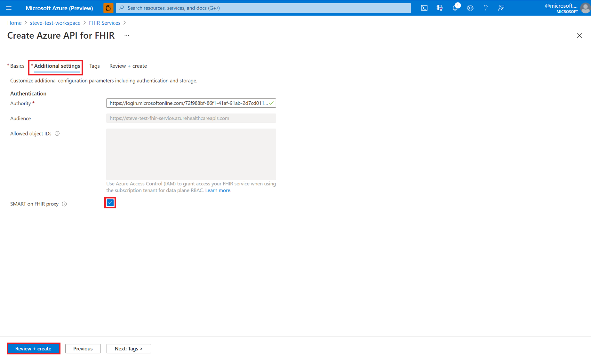

# Azure 의료 Api 내에서 FHIR 서비스 배포-포털 사용

> [!IMPORTANT]
> Azure 의료 Api는 현재 미리 보기로 제공 됩니다. [Microsoft Azure 미리 보기에 대한 추가 사용 약관](https://azure.microsoft.com/support/legal/preview-supplemental-terms/)에는 베타 또는 미리 보기로 제공되거나 아직 일반 공급으로 릴리스되지 않은 Azure 기능에 적용되는 추가 약관이 포함되어 있습니다.

이 문서에서는 Azure Portal를 사용 하 여 Azure 의료 Api (FHIR 서비스 라고 함) 내에서 FHIR 서비스를 배포 하는 방법을 알아봅니다.

## 필수 조건

시작 하기 전에 Azure 의료 Api를 이미 배포 했어야 합니다. Azure 의료 Api 배포에 대 한 자세한 내용은 [Azure Portal에서 작업 영역 배포](../healthcare-apis-quickstart.md)를 참조 하세요.

## 새 FHIR 서비스 만들기

작업 영역에서 **배포 FHIR 서비스** 를 선택 합니다.

[ 배포 ](media/fhir-service/deploy-fhir-services.png#lightbox)

**+ 서비스 추가** 를 선택 합니다.

[ 추가 ](media/fhir-service/add-fhir-service.png#lightbox)

FHIR 서비스에 대 한 **계정 이름을** 입력 합니다. **Fhir 버전** (**STU3** **또는 4, 4**)을 선택 하 고 **검토 + 만들기** 를 선택 합니다.

[ 만들기 ](media/fhir-service/create-fhir-service.png#lightbox)

**만들기** 를 선택 하기 전에 **기본** 의 속성과 Fhir 서비스의 **추가 설정을** 검토 합니다. 돌아가서 변경 작업을 수행 해야 하는 경우 **이전** 을 선택 합니다. **유효성 검사 성공** 메시지가 표시 되는지 확인 합니다. 

[ 유효성 검사 ](media/fhir-service/validation-fhir-service.png#lightbox)

## 추가 설정(선택 사항)

**추가 설정** 탭을 선택 하 여 인증 설정을 볼 수도 있습니다. Azure API for FHIR의 기본 구성은 **데이터 평면 역할 할당에 Azure RBAC를 사용** 하는 것입니다. 이 모드에서 구성 된 경우 fhir 서비스에 대 한 "기관"이 구독의 Azure Active Directory 테 넌 트로 설정 됩니다.

**허용 된 개체 id** 를 입력 하는 상자는 회색으로 표시 됩니다. 이 경우 역할 할당을 구성 하기 위해 Azure RBAC를 사용 하기 때문입니다.

외부 또는 보조 Azure Active Directory 테넌트를 사용하도록 FHIR 서비스를 구성하려는 경우 권한을 변경하고 서버에 대한 액세스를 허용해야 하는 사용자 및 그룹의 개체 ID를 입력할 수 있습니다.

## Fetch FHIR API 기능 문

새 FHIR API 계정이 프로 비전 되었는지 확인 하려면로 이동 하 여 기능 설명을 인출 `https://<WORKSPACE NAME>-<ACCOUNT-NAME>.fhir.azurehealthcareapis.com/metadata` 합니다.

## 다음 단계

>[!div class="nextstepaction"]
>[Postman을 사용 하 여 FHIR 서비스에 액세스](../use-postman.md)

