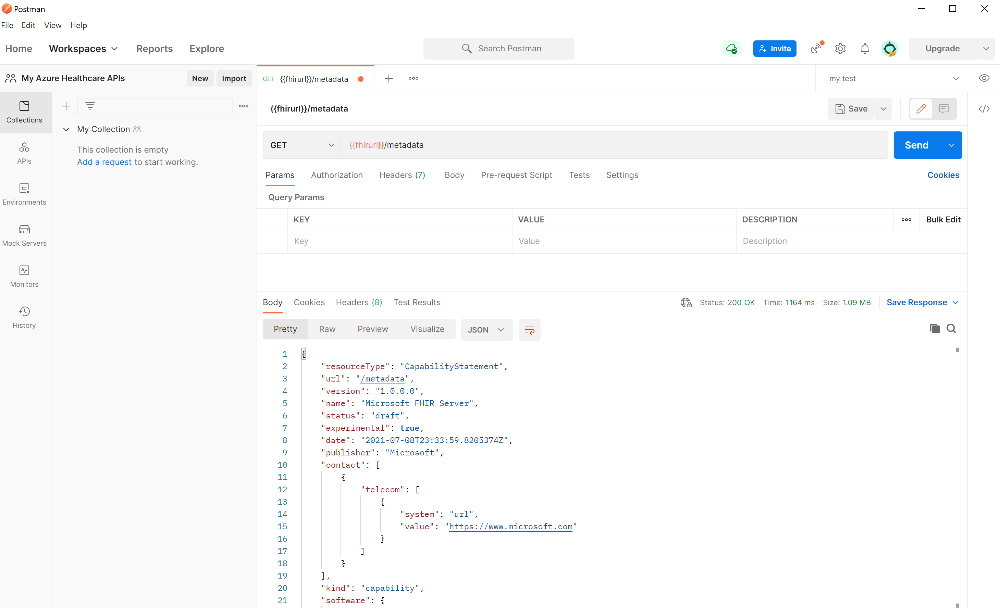
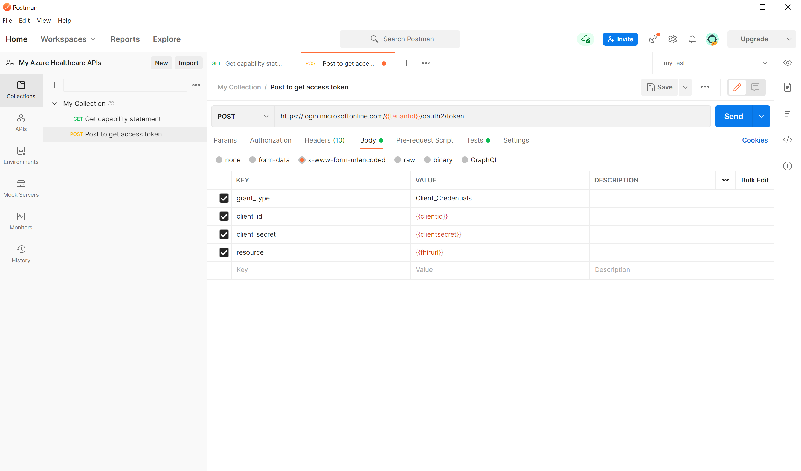
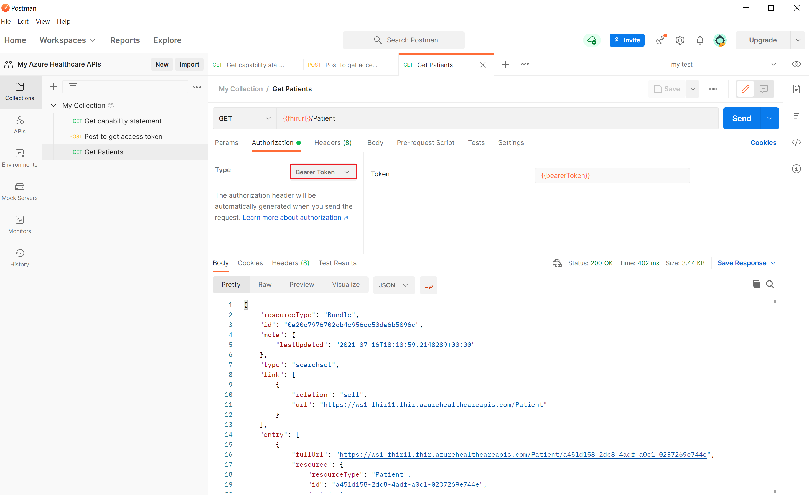
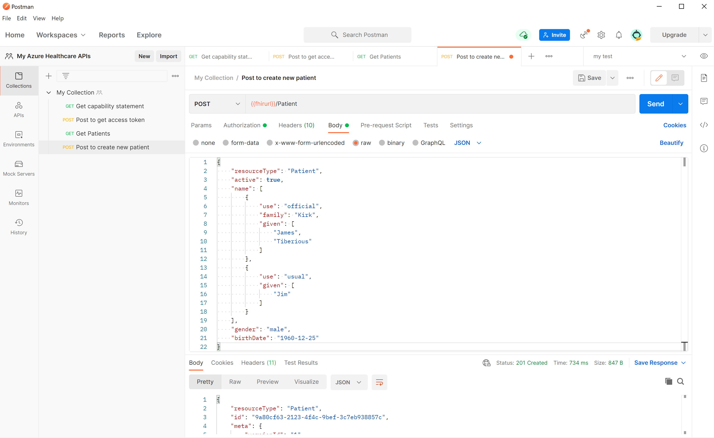
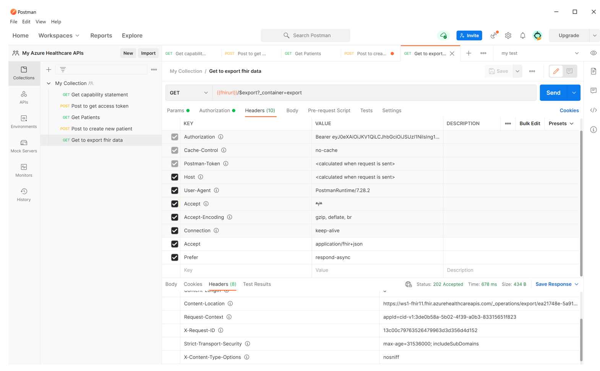

# <a name="access-the-fhir-service-using-postman"></a>Postman을 사용하여 FHIR 서비스에 액세스

> [!IMPORTANT]
> Azure Healthcare API는 현재 미리 보기로 제공됩니다. [Microsoft Azure 미리 보기에 대한 추가 사용 약관](https://azure.microsoft.com/support/legal/preview-supplemental-terms/)에는 베타 또는 미리 보기로 제공되거나 아직 일반 공급으로 릴리스되지 않은 Azure 기능에 적용되는 추가 약관이 포함되어 있습니다.

이 문서에서는 [Postman을](https://www.getpostman.com/)통해 의료 API FHIR 서비스(여기서는 FHIR 서비스라고 함)에 액세스하는 단계를 안내합니다.

## <a name="prerequisites"></a>필수 조건

* Azure에 배포된 FHIR 서비스입니다. FHIR 서비스를 배포하는 방법에 대한 자세한 내용은 [FHIR 서비스 배포를 참조하세요.](fhir-portal-quickstart.md)
* FHIR 서비스에 액세스하기 위한 등록된 클라이언트 애플리케이션입니다. 클라이언트 애플리케이션을 등록하는 방법에 대한 자세한 내용은 [Azure Active Directory 서비스 클라이언트 애플리케이션 등록을](../register-application.md)참조하세요. 
* 클라이언트 애플리케이션 및 사용자 계정에 부여된 권한(예: "FHIR 데이터 기여자")은 FHIR 서비스에 액세스할 수 있습니다. 자세한 내용은 [Azure Healthcare API 내에서 FHIR 서비스 배포를 참조하세요.](fhir-portal-quickstart.md)
* Postman이 로컬로 설치되었습니다. Postman에 대한 자세한 내용은 [Postman을 시작](https://www.getpostman.com/)참조하세요.

## <a name="using-postman-create-workspace-collection-and-environment"></a>Postman 사용: 작업 영역, 컬렉션 및 환경 만들기

Postman을 접하는 경우 아래 단계를 수행합니다. 그렇지 않으면 이 단계를 건너뛸 수 있습니다.
 
Postman은 사용자와 팀이 API, 컬렉션, 환경 및 기타 구성 요소를 공유할 수 있도록 하는 작업 영역 개념을 소개합니다. 기본 "내 작업 영역" 또는 "팀 작업 영역"을 사용하거나 사용자 또는 팀을 위한 새 작업 영역을 만들 수 있습니다.
 
[ ](media/postman/postman-create-new-workspace.png#lightbox)

다음으로 관련된 모든 REST API 요청을 그룹화할 수 있는 새 컬렉션을 만듭니다. 작업 영역에서 컬렉션 **만들기를 선택합니다.** 기본 이름 New **컬렉션을** 유지하거나 이름을 바꿀 수 있습니다. 변경 사항이 자동으로 저장됩니다.

[ ](media/postman/postman-create-a-new-collection.png#lightbox)

Postman 컬렉션을 가져오고 내보낼 수도 있습니다. 자세한 내용은 [Postman 설명서 를 참조하세요.](https://learning.postman.com/docs/getting-started/importing-and-exporting-data/)

[ ](media/postman/postman-import-data.png#lightbox)

## <a name="create-or-update-environment-variables"></a>환경 변수 만들기 또는 업데이트

요청에서 전체 URL을 사용할 수 있지만 URL 및 기타 데이터를 변수에 저장하고 사용하는 것이 좋습니다.

FHIR 서비스에 액세스하려면 다음 변수를 만들거나 업데이트해야 합니다.

* **tenantid** – FHIR 서비스가 배포되는 Azure 테넌트입니다. **애플리케이션 등록 개요** 메뉴 옵션에 있습니다.
* **subid** – FHIR 서비스가 배포된 Azure 구독입니다. **FHIR 서비스 개요** 메뉴 옵션에 있습니다.
* **clientid** – 애플리케이션 클라이언트 등록 ID입니다.
* **clientsecret** – 애플리케이션 클라이언트 등록 비밀입니다.
* **fhirurl** – FHIR 서비스 전체 URL입니다. 예들 들어 `https://xxx.azurehealthcareapis.com`입니다. **FHIR 서비스 개요** 메뉴 옵션에 있습니다.
* **bearerToken** – 스크립트에 Azure Active Directory(Azure AD) 액세스 토큰을 저장할 변수입니다. 비워 둠

> [!NOTE]
> 클라이언트 애플리케이션 등록에서 리디렉션 URL 를 구성했는지 [https://www.getpostman.com/oauth2/callback](https://www.getpostman.com/oauth2/callback) 확인합니다.

[ ](media/postman/postman-environments-variable.png#lightbox)

## <a name="connect-to-the-fhir-server"></a>FHIR 서버에 커넥트

Postman을 열고 사용하려는 **작업 영역,** **컬렉션** 및 **환경을** 선택합니다. 아이콘을 선택하여 `+` 새 요청을 만듭니다. 

[ ](media/postman/postman-create-new-request.png#lightbox)

## <a name="get-capability-statement"></a>기능 문 얻기

`{{fhirurl}}/metadata`요청에 를 `GET` 입력하고 를 `Send` 누릅니다. FHIR 서비스의 capability 문이 표시됩니다.

[ ](media/postman/postman-capability-statement.png#lightbox)

[ ](media/postman/postman-save-request.png#lightbox)

## <a name="get-azure-ad-access-token"></a>Azure AD 액세스 토큰 얻기

FHIR 서비스는 Azure AD로 보호됩니다. 기본 인증은 사용하지 않도록 설정될 수 없습니다. FHIR 서비스에 액세스하려면 먼저 Azure AD 액세스 토큰을 받아야 합니다. 자세한 내용은 [액세스 토큰 Microsoft ID 플랫폼 참조하세요.](../../active-directory/develop/access-tokens.md)

새 요청을 만듭니다. `POST`

1. 요청 헤더에 를 입력합니다. `https://login.microsoftonline.com/{{tenantid}}/oauth2/token`

2. **본문** 탭을 선택하고 **x-www-form-urlencoded를** 선택합니다. 키 및 값 섹션에 다음 값을 입력합니다.
    - **grant_type:**`Client_Credentials`
    - **client_id:**`{{clientid}}`
    - **client_secret:**`{{clientsecret}}`
    - **리소스**: `{{fhirurl}}`
    
3. **테스트** 탭을 선택하고 텍스트 섹션에 를 입력합니다.`pm.environment.set("bearerToken", pm.response.json().access_token);`
4. **저장** 을 선택하여 설정을 저장합니다.
5. **보내기를 누릅니다.** 변수에 자동으로 저장되는 Azure AD 액세스 토큰이 포함된 응답이 `accessToken` 표시됩니다. 그런 다음 모든 FHIR 서비스 API 요청에서 사용할 수 있습니다.

  [ ](media/postman/postman-send-button.png#lightbox)

과 같은 온라인 도구를 사용하여 액세스 토큰을 검사할 수 [https://jwt.ms](https://jwt.ms) 있습니다. **클레임** 탭을 선택하여 토큰의 각 클레임에 대한 자세한 설명을 확인합니다.

[ ](media/postman/postman-access-token-claims.png#lightbox)

## <a name="get-fhir-resource"></a>FHIR 리소스를 얻습니다.

Azure AD 액세스 토큰을 가져온 후에는 FHIR 데이터에 액세스할 수 있습니다. 새 `GET` 요청에서 를 `{{fhirurl}}/Patient` 입력합니다.

권한 부여 유형으로 **Bearer 토큰을** 선택합니다.  `{{bearerToken}}` **토큰** 섹션에 를 입력합니다. **보내기** 를 선택합니다. 이에 대한 응답으로 FHIR 리소스에 환자 목록이 표시됩니다.

[ ](media/postman/postman-select-bearer-token.png#lightbox)

## <a name="create-or-update-your-fhir-resource"></a>FHIR 리소스 만들기 또는 업데이트

Azure AD 액세스 토큰을 가져온 후 FHIR 데이터를 만들거나 업데이트할 수 있습니다. 예를 들어 새 환자를 만들거나 기존 환자를 업데이트할 수 있습니다.
 
새 요청을 만들고, 메서드를 "Post"로 변경하고, 요청 섹션에 값을 입력합니다.

`{{fhirurl}}/Patient`

권한 부여 유형으로 **Bearer 토큰을** 선택합니다.  `{{bearerToken}}` **토큰** 섹션에 를 입력합니다. **본문** 탭을 선택합니다. **원시** 옵션을 선택하고 본문 텍스트 형식으로 **JSON을** 선택합니다. 텍스트를 복사하여 본문 섹션에 붙여넣습니다. 


```
{
    "resourceType": "Patient",
    "active": true,
    "name": [
        {
            "use": "official",
            "family": "Kirk",
            "given": [
                "James",
                "Tiberious"
            ]
        },
        {
            "use": "usual",
            "given": [
                "Jim"
            ]
        }
    ],
    "gender": "male",
    "birthDate": "1960-12-25"
}
```
**보내기** 를 선택합니다. JSON 응답에 새 환자가 표시됩니다.

[ ](media/postman/postman-send-create-new-patient.png#lightbox)

## <a name="export-fhir-data"></a>FHIR 데이터 내보내기

Azure AD 액세스 토큰을 가져온 후에는 FHIR 데이터를 Azure Storage 계정으로 내보낼 수 있습니다.

새 요청을 만듭니다. `GET``{{fhirurl}}/$export?_container=export`

권한 부여 유형으로 **Bearer 토큰을** 선택합니다.  `{{bearerToken}}` **토큰** 섹션에 를 입력합니다. **헤더** 를 선택 하 여 두 개의 새 헤더를 추가 합니다.

- **수락**: `application/fhir+json`
- **선호**:  `respond-async`

**보내기** 를 누릅니다. 응답을 확인 해야 합니다 `202 Accepted` . 응답의 **헤더** 탭을 선택 하 고 **콘텐츠 위치의** 값을 기록 합니다. 값을 사용 하 여 내보내기 작업 상태를 쿼리할 수 있습니다.

[ ](media/postman/postman-202-accepted-response.png#lightbox)

## <a name="next-steps"></a>다음 단계

이 문서에서는 Postman을 사용 하 여 Azure 의료 Api에서 FHIR 서비스에 액세스 하는 방법을 배웠습니다. Azure 의료 Api의 FHIR 서비스에 대 한 자세한 내용은을 참조 하세요.

>[!div class="nextstepaction"]
>[FHIR 서비스는 무엇 인가요?](overview.md)