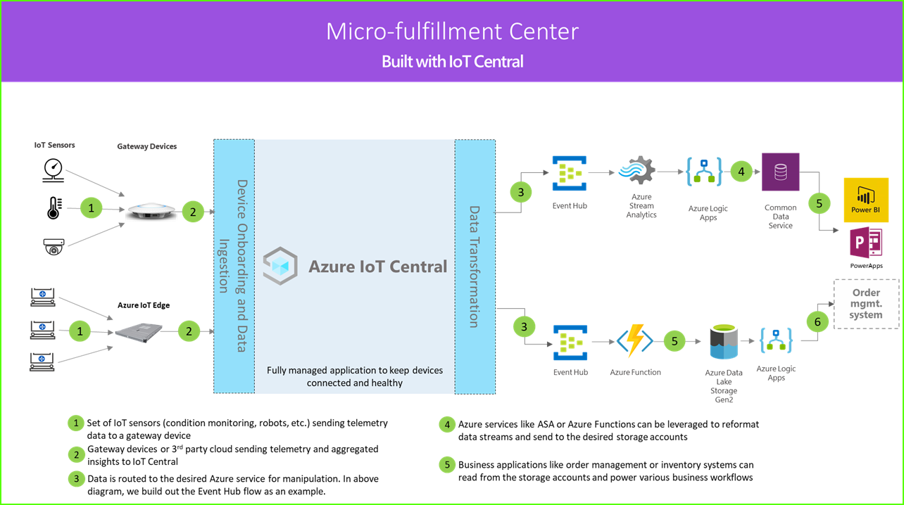

# 자습서: 마이크로 주문 처리 센터 애플리케이션 템플릿 배포 및 연습

IoT Central *마이크로 처리 센터* 애플리케이션 템플릿과 이 문서의 지침을 사용하여 엔드투엔드 마이크로 처리 센터 솔루션을 개발합니다.

1. 게이트웨이 디바이스로 원격 분석 데이터를 보내는 IoT 센서 세트
2. 원격 분석 및 집계된 인사이트를 IoT Central로 보내는 게이트웨이 디바이스
3. 조작을 위해 원하는 Azure 서비스로 연속 데이터 내보내기
4. 데이터를 원하는 형식으로 구조화하여 스토리지 서비스로 보낼 수 있습니다.
5. 비즈니스 애플리케이션은 데이터를 쿼리하고 소매점 업무를 지원하는 인사이트를 생성할 수 있습니다.

### 로보틱 이동 통신 사업자

마이크로 처리 센터 솔루션은 다양한 종류의 원격 분석 신호를 생성하는 많은 로보틱 이동 통신 사업자를 가질 수 있습니다. 이러한 신호는 게이트웨이 디바이스에 의해 수집된 다음, 아키텍처 다이어그램의 왼쪽에 나타난 것 같이 IoT Central로 전송될 수 있습니다.  

### 상태 모니터링 센서

IoT 솔루션은 처리 센터 내에서 의미 있는 신호를 캡처하는 센서 세트로 시작합니다. 위의 아키텍처 다이어그램의 왼쪽 끝에서 다양한 종류의 센서를 확인할 수 있습니다.

### 게이트웨이 디바이스

많은 IoT 센서가 원시 신호를 클라우드 또는 근처에 있는 게이트웨이 디바이스에 직접 제공할 수 있습니다. 게이트웨이 디바이스는 IoT Central 애플리케이션에 요약 인사이트를 보내기 전에 에지에서 데이터 집계를 수행합니다. 또한 게이트웨이 디바이스는 해당되는 경우 센서 디바이스에 명령 및 제어 작업을 릴레이하는 역할을 담당합니다. 

### IoT Central 애플리케이션

Azure IoT Central 애플리케이션은 처리 센터 환경 내에서 다양한 종류의 IoT 센서와 게이트웨이 디바이스에서 데이터를 수집하고 의미 있는 인사이트 세트를 생성합니다.

또한 Azure IoT Central은 매장 운영자에게 맞춤형 환경을 제공하여 인프라 디바이스를 원격으로 모니터링하고 관리할 수 있도록 합니다.

### 데이터 변환

원시 또는 집계된 인사이트를 Azure PaaS(Platform as a Service) 서비스 세트로 내보내도록 솔루션 내의 Azure IoT Central 애플리케이션을 구성하여 데이터 조작을 수행하고 풍부한 인사이트를 확보한 후 비즈니스 애플리케이션에 제공할 수 있습니다. 

### 비즈니스 애플리케이션

IoT 데이터는 소매 환경 내 다양한 종류의 비즈니스 애플리케이션을 지원하는 데 사용될 수 있습니다. 처리 센터 관리자나 직원은 이러한 애플리케이션을 사용하여 비즈니스 인사이트를 시각화하고 의미 있는 작업을 실시간으로 수행할 수 있습니다. 소매 팀을 위한 실시간 Power BI 대시보드를 빌드하는 방법에 대한 자세한 내용은 [자습서](./tutorial-in-store-analytics-create-app.md)를 참조하세요.

이 자습서에서는 다음에 대해 알아봅니다.

> [!div class="checklist"]

> * 애플리케이션 템플릿을 배포하는 방법
> * 애플리케이션 템플릿을 사용하는 방법

## 사전 요구 사항

* 이 앱을 배포하는 데 필요한 특정 필수 구성 요소가 없습니다.
* 무료 가격 책정 요금제를 사용하거나 Azure 구독을 사용할 수 있습니다.

## 마이크로 처리 애플리케이션 만들기

다음 단계를 사용하여 애플리케이션을 만듭니다.

1. [Azure IoT Central 빌드](https://aka.ms/iotcentral) 사이트로 이동합니다. 그런 다음, Microsoft 개인, 회사 또는 학교 계정으로 로그인합니다. 왼쪽 탐색 모음에서 **빌드** 를 선택한 다음, **소매** 탭을 선택합니다.

   :::image type="content" source="media/tutorial-micro-fulfillment-center-app/iotc-retail-homepage-mfc.png" alt-text="앱을 만드는 방법을 보여 주는 스크린샷.":::

1. **마이크로 처리 센터** 에서 **앱 만들기** 를 선택합니다.

## 애플리케이션 살펴보기 

다음 섹션에서는 애플리케이션의 주요 기능을 안내합니다.

앱 템플릿이 성공적으로 배포되면 **Northwind Traders 마이크로 처리 센터 대시보드** 가 표시됩니다. Northwind Trader는 이 Azure IoT Central 애플리케이션에서 마이크로 처리 센터를 관리하는 가상의 소매업체입니다. 이 대시보드에는 수행할 수 있는 명령, 작업 및 동작 세트와 함께 이 템플릿의 디바이스에 대한 정보 및 원격 분석 데이터가 표시됩니다. 대시보드는 논리적으로 두 섹션으로 분할됩니다. 왼쪽에서는 처리 구조 내에서 환경 상태를 모니터링할 수 있고, 오른쪽에서는 시설 내 로봇 캐리어의 상태를 모니터링할 수 있습니다.  

대시보드에서 수행할 수 있는 작업은 다음과 같습니다.
   * 선택 횟수, 처리된 주문 수, 속성(예: 구조 시스템 상태)과 같은 디바이스 원격 분석을 확인합니다.  
   * 처리 구조 내에 있는 로봇 캐리어의 평면도와 위치를 봅니다.
   * 제어 시스템 다시 설정, 캐리어 펌웨어 업데이트 및 네트워크 재구성과 같은 명령을 트리거합니다.

  :::image type="content" source="media/tutorial-micro-fulfillment-center-app/mfc-dashboard-1.png" alt-text="Northwind Traders 마이크로 처리 센터 대시보드 상단 절반의 스크린샷.":::
   * 운영자가 처리 센터 내의 상태를 모니터링하는 데 사용할 수 있는 대시보드의 예를 참조합니다.
   * 처리 센터 내의 게이트웨이 디바이스에서 실행되는 페이로드의 상태를 모니터링합니다.

  :::image type="content" source="media/tutorial-micro-fulfillment-center-app/mfc-dashboard-2.png" alt-text="Northwind Traders 마이크로 처리 센터 대시보드 아래쪽 절반의 스크린샷":::

### 디바이스 템플릿

디바이스 템플릿 탭이 선택되면 템플릿에 포함된 다음 두 가지 유형의 디바이스가 표시됩니다. 
   * **로봇 캐리어**: 이 디바이스 템플릿은 처리 구조에 배포되어 적절한 저장 및 검색 작업을 수행하는 작동 중인 로봇 캐리어에 대한 정의를 나타냅니다. 이 템플릿을 선택하면 로봇에서 디바이스 데이터(예: 온도 및 축 위치)와 속성(예: 로봇 캐리어 상태)을 표시합니다. 
   * **구조 상태 모니터링**: 이 디바이스 템플릿은 처리 센터를 강화하기 위해 다양한 에지 워크로드를 호스팅하는 게이트웨이 디바이스뿐만 아니라 환경 상태도 모니터링할 수 있는 디바이스 컬렉션을 나타냅니다. 디바이스는 온도, 선택 횟수 및 주문 수와 같은 원격 분석 데이터를 보냅니다. 또한 환경에서 실행되는 컴퓨팅 워크로드의 상태에 대한 정보도 보냅니다. 

  :::image type="content" source="media/tutorial-micro-fulfillment-center-app/device-templates.png" alt-text="마이크로 처리 센터 디바이스 템플릿.":::

디바이스 그룹 탭을 선택하면 이러한 디바이스 템플릿에서 자동으로 만든 디바이스 그룹을 표시합니다.

### 규칙

**규칙** 탭에는 로봇 캐리어의 온도 상태를 모니터링하기 위해 애플리케이션 템플릿에 있는 샘플 규칙이 표시됩니다. 설비의 특정 로봇이 과열되어 서비스를 위해 오프라인으로 전환해야 하는 경우 이 규칙을 사용하여 운영자에게 경고할 수 있습니다. 

샘플 규칙을 창의적으로 사용하여 비즈니스 기능에 더 적합한 규칙을 정의합니다.

  :::image type="content" source="media/tutorial-micro-fulfillment-center-app/rules.png" alt-text="규칙 탭의 스크린샷.":::

### 리소스 정리

이 애플리케이션을 계속 사용하지 않으려면 애플리케이션 템플릿을 삭제합니다. **관리** > **애플리케이션 설정** 으로 차례로 이동하고, **삭제** 를 선택합니다.

  :::image type="content" source="media/tutorial-micro-fulfillment-center-app/delete.png" alt-text="마이크로 처리 센터 애플리케이션 설정 페이지의 스크린샷.":::

## 다음 단계

다음에 대해 자세히 알아봅니다.

> [!div class="nextstepaction"]
> [마이크로 처리 센터 솔루션 아키텍처](./architecture-micro-fulfillment-center.md)
