# <a name="quickstart-provision-a-simulated-tpm-device"></a>빠른 시작: 시뮬레이션된 TPM 디바이스 프로비저닝

이 빠른 시작에서는 Windows 컴퓨터에서 TPM 시뮬레이션된 디바이스를 만들 것입니다. 장치를 구성한 후 Azure IoT Hub Device Provisioning Service를 사용하여 IoT hub에 프로비전합니다. 샘플 코드를 사용하여 Device Provisioning Service 인스턴스에 디바이스를 등록할 수 있습니다.

프로비저닝 프로세스에 익숙하지 않은 경우 [프로비저닝](about-iot-dps.md#provisioning-process) 개요를 검토하세요.  계속하기 전에 [Azure Portal에서 IoT Hub Device Provisioning Service 설정](./quick-setup-auto-provision.md)의 단계를 완료해야 합니다.

Azure IoT Device Provisioning 서비스는 다음과 같은 두 가지 등록을 지원합니다.

* [등록 그룹](concepts-service.md#enrollment-group)은 여러 관련 디바이스를 등록하는 데 사용됩니다.

* [개별 등록](concepts-service.md#individual-enrollment)은 단일 장치를 등록하는 데 사용됩니다.

이 문서에서는 개별 등록을 보여 줍니다.

## <a name="prerequisites"></a>필수 구성 요소

* Azure 구독이 아직 없는 경우 시작하기 전에 [체험 계정](https://azure.microsoft.com/free/?ref=microsoft.com&utm_source=microsoft.com&utm_medium=docs&utm_campaign=visualstudio)을 만듭니다.

* [Azure Portal로 IoT Hub Device Provisioning Service 설정](./quick-setup-auto-provision.md)의 단계를 완료합니다.

다음 필수 구성 요소는 Windows 개발 환경을 위한 것입니다. Linux 또는 macOS의 경우 SDK 설명서에서 [개발 환경 준비](https://github.com/Azure/azure-iot-sdk-c/blob/master/doc/devbox_setup.md)의 해당 섹션을 참조하세요.

::: zone pivot="programming-language-ansi-c"

* ['C++를 사용한 데스크톱 개발'](/cpp/ide/using-the-visual-studio-ide-for-cpp-desktop-development) 워크로드를 사용하도록 설정된 [Visual Studio](https://visualstudio.microsoft.com/vs/) 2019. Visual Studio 2015와 Visual Studio 2017도 지원됩니다.

::: zone-end

::: zone pivot="programming-language-csharp"

* Windows 기반 머신에 [.NET Core 2.1 SDK](https://dotnet.microsoft.com/download) 이상이 설치되어 있는지 확인합니다. 다음 명령을 사용하여 버전을 확인할 수 있습니다.

    ```bash
    dotnet --info
    ```

::: zone-end

::: zone pivot="programming-language-nodejs"

* [Node.js v4.0+](https://nodejs.org)를 설치합니다.

::: zone-end

::: zone pivot="programming-language-python"

* [Python 2.x 또는 3.x](https://www.python.org/downloads/)를 설치합니다. 설치 프로그램의 요구 사항에 따라 32비트 또는 64비트 설치를 사용해야 합니다. 설치하는 동안 메시지가 표시되면 플랫폼 특정 환경 변수에 Python을 추가해야 합니다.

* Windows OS를 사용하는 경우 Python에서 원시 DLL을 사용하기 위해 [Visual C++ 재배포 가능 패키지](https://support.microsoft.com/help/2977003/the-latest-supported-visual-c-downloads)를 설치합니다.

* ['C++를 사용한 데스크톱 개발'](/cpp/ide/using-the-visual-studio-ide-for-cpp-desktop-development) 워크로드를 사용하도록 설정된 [Visual Studio](https://visualstudio.microsoft.com/vs/) 2019. Visual Studio 2015와 Visual Studio 2017도 지원됩니다.

* [CMake 빌드 시스템](https://cmake.org/download/)

::: zone-end

::: zone pivot="programming-language-java"

* 머신에 [Java SE Development Kit 8](/azure/developer/java/fundamentals/java-support-on-azure) 이상을 설치합니다.

* [Maven](https://maven.apache.org/install.html)을 다운로드하고 설치합니다.

::: zone-end

* 최신 버전의 [Git](https://git-scm.com/download/)을 설치합니다. Git이 명령 창에 액세스할 수 있는 환경 변수에 추가되었는지 확인합니다. 설치할 `git` 도구의 최신 버전은 [Software Freedom Conservancy의 Git 클라이언트 도구](https://git-scm.com/download/)를 참조하세요. 여기에는 로컬 Git 리포지토리와 상호 작용하는 데 사용할 수 있는 명령줄 앱인 *Git Bash* 가 포함됩니다.

<a id="setupdevbox"></a>

## <a name="prepare-your-development-environment"></a>개발 환경 준비

::: zone pivot="programming-language-ansi-c"

이 섹션에서는 [Azure IoT C SDK](https://github.com/Azure/azure-iot-sdk-c) 및 [TPM](/windows/device-security/tpm/trusted-platform-module-overview) 디바이스 시뮬레이터 샘플을 빌드하는 데 사용되는 개발 환경을 준비합니다.

1. 최신 [CMake 빌드 시스템](https://cmake.org/download/)을 다운로드합니다.

    >[!IMPORTANT]
    >`CMake` 설치를 시작하기 **전에** Visual Studio 필수 구성 요소(Visual Studio 및 'C++를 사용한 데스크톱 개발' 워크로드)를 머신에 설치해야 합니다. 필수 구성 요소가 설치되고 다운로드를 확인하면 CMake 빌드 시스템을 설치합니다. 이전 버전의 CMake 빌드 시스템은 이 문서에 사용된 솔루션 파일을 생성하지 못합니다. 최신 버전의 CMake를 사용해야 합니다.

2. 웹 브라우저를 열고 [Azure IoT C SDK 릴리스 페이지](https://github.com/Azure/azure-iot-sdk-c/releases/latest)로 이동합니다.

3. 페이지 맨 위에서 **태그** 탭을 선택합니다.

4. Azure IoT C SDK의 최신 릴리스에 대한 태그 이름을 복사합니다.

5. 명령 프롬프트 또는 Git Bash 셸을 엽니다. 다음 명령을 실행하여 [Azure IoT C SDK](https://github.com/Azure/azure-iot-sdk-c) GitHub 리포지토리의 최신 릴리스를 복제합니다. (`<release-tag>`을(를) 이전 단계에서 복사한 이름으로 바꿉니다).

    ```cmd/sh
    git clone -b <release-tag> https://github.com/Azure/azure-iot-sdk-c.git
    cd azure-iot-sdk-c
    git submodule update --init
    ```

    이 작업을 완료하는 데 몇 분 정도 걸릴 수 있습니다.

6. 작업이 완료되면 `azure-iot-sdk-c` 디렉터리에서 다음 명령을 실행합니다.

    ```cmd/sh
    mkdir cmake
    cd cmake
    ```

::: zone-end

::: zone pivot="programming-language-csharp"

1. Git CMD 또는 Git Bash 명령줄 환경을 엽니다.

2. 다음 명령을 사용하여 [C#용 Azure IoT 샘플](https://github.com/Azure-Samples/azure-iot-samples-csharp) GitHub 리포지토리를 복제합니다.

    ```cmd
    git clone https://github.com/Azure-Samples/azure-iot-samples-csharp.git
    ```

::: zone-end

::: zone pivot="programming-language-nodejs"

1. Git CMD 또는 Git Bash 명령줄 환경을 엽니다.

2. 다음 명령을 사용하여 [azure-utpm-c](https://github.com/Azure-Samples/azure-iot-samples-csharp) GitHub 리포지토리를 복제합니다.

    ```cmd/sh
    git clone https://github.com/Azure/azure-utpm-c.git --recursive
    ```

::: zone-end

::: zone pivot="programming-language-python"

1. Git CMD 또는 Git Bash 명령줄 환경을 엽니다.
  
2. 다음 명령을 사용하여 [Python](https://github.com/Azure/azure-iot-sdk-python) GitHub 리포지토리를 복제합니다.

    ```cmd/sh
    git clone --single-branch --branch v1-deprecated https://github.com/Azure/azure-iot-sdk-python.git --recursive
    ```

3. CMake 빌드 프로세스에 대한 이 GitHub 리포지토리의 로컬 복사본에 폴더를 만듭니다. 

    ```cmd/sh
    cd azure-iot-sdk-python/c
    mkdir cmake
    cd cmake
    ```

4. [이러한 지침](https://github.com/Azure/azure-iot-sdk-python/blob/v1-deprecated/doc/python-devbox-setup.md)에 따라 Python 패키지를 빌드합니다.

   > [!NOTE]
   > `build_client.cmd`를 실행하는 경우 `--use-tpm-simulator` 플래그를 사용해야 합니다.
   > 
   > [!NOTE]
   > `pip`를 사용하는 경우 `azure-iot-provisioning-device-client` 패키지도 설치해야 합니다. 릴리스된 PIP 패키지는 시뮬레이터가 아닌 실제 TPM을 사용하고 있습니다. 시뮬레이터를 사용하려면 `--use-tpm-simulator` 플래그를 사용하여 원본에서 컴파일해야 합니다.

::: zone-end

::: zone pivot="programming-language-java"

1. Git CMD 또는 Git Bash 명령줄 환경을 엽니다.
  
2. 다음 명령을 사용하여 [Java](https://github.com/Azure/azure-iot-sdk-java.git) GitHub 리포지토리를 복제합니다.

    ```cmd/sh
    git clone https://github.com/Azure/azure-iot-sdk-java.git --recursive
    ```

::: zone-end

## <a name="build-and-run-the-tpm-device-simulator"></a>TPM 디바이스 시뮬레이터를 빌드하고 실행합니다.

이 섹션에서는 TPM 시뮬레이터를 빌드하고 실행합니다. 이 시뮬레이터는 포트 2321 및 2322에서 소켓을 수신 대기합니다. 명령 창을 닫으면 안 됩니다. 이 빠른 시작 가이드가 끝날 때까지 이 시뮬레이터를 계속 실행해 두어야 합니다.

::: zone pivot="programming-language-ansi-c"

1. 다음 명령을 실행하여 TPM 디바이스 시뮬레이터 샘플 코드가 포함된 Azure IoT C SDK를 빌드합니다. 시뮬레이션된 디바이스에 대한 Visual Studio 솔루션이 `cmake` 디렉터리에서 생성됩니다. 이 샘플에서는 SAS(공유 액세스 서명) 토큰 인증을 통해 TPM [증명 메커니즘](concepts-service.md#attestation-mechanism)을 제공합니다.

    ```cmd
    cmake -Duse_prov_client:BOOL=ON ..
    ```

    >[!TIP]
    >`cmake`이(가) C++ 컴파일러를 찾지 못하면 위의 명령을 실행하는 동안 빌드 오류가 발생할 수 있습니다. 이 경우에는 [Visual Studio 명령 프롬프트](/dotnet/framework/tools/developer-command-prompt-for-vs)에서 명령을 실행합니다.

2. 빌드가 성공되면 마지막 몇 개의 출력 줄은 다음 출력과 유사하게 표시됩니다.

    ```cmd/sh
    $ cmake -Duse_prov_client:BOOL=ON ..
    -- Building for: Visual Studio 16 2019
    -- The C compiler identification is MSVC 19.23.28107.0
    -- The CXX compiler identification is MSVC 19.23.28107.0

    ...

    -- Configuring done
    -- Generating done
    -- Build files have been written to: C:/code/azure-iot-sdk-c/cmake
    ```

3. 복제된 git 리포지토리의 루트 폴더로 이동합니다.

4. 아래 표시된 경로를 사용하여 [TPM](/windows/device-security/tpm/trusted-platform-module-overview) 시뮬레이터를 실행합니다.

    ```cmd/sh
    cd ..
    .\provisioning_client\deps\utpm\tools\tpm_simulator\Simulator.exe
    ```

    시뮬레이터는 출력을 표시하지 않습니다. TPM 디바이스를 시뮬레이션하는 동안 계속 실행합니다.

::: zone-end

::: zone pivot="programming-language-csharp"

1. Device Provisioning Service의 주 메뉴에서 **개요** 를 선택합니다.

2. **ID 범위** 값을 복사합니다.

    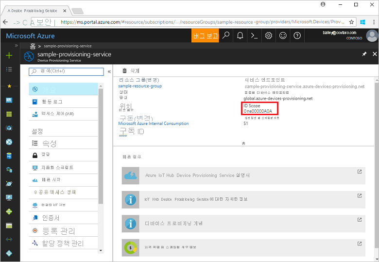 

3. 명령 프롬프트에서 디렉터리를 TPM 디바이스 프로비전 샘플에 대한 프로젝트 디렉터리로 변경합니다.

    ```cmd
    cd .\azure-iot-samples-csharp\provisioning\Samples\device\TpmSample
    ```

4. 다음 명령을 입력하여 TPM 장치 프로비저닝 샘플을 빌드하고 실행합니다 (`<IDScope>`을(를) 프로비저닝 서비스에 대한 ID 범위로 대체).

    ```cmd
    dotnet run <IDScope>
    ```

    >[!NOTE]
    >이 명령은 별도의 명령 프롬프트에서 TPM 칩 시뮬레이터를 시작합니다. Windows의 경우 `Simulator.exe`이(가) 공용 네트워크에서 통신할 수 있게 허용할지 여부를 묻는 Windows 보안 경고가 발생할 수 있습니다. 이 샘플의 목적을 위해 요청을 취소할 수 있습니다.

5. 디바이스 등록에 필요한 **_인증 키_**, **_등록 ID_** 및 제안된 **_디바이스 ID_** 가 원래 명령 창에 표시됩니다. 이러한 값을 기록해 둡니다. 이러한 값을 사용하여 Device Provisioning Service 인스턴스에서 개별 등록을 만듭니다.

   > [!NOTE]
   > 명령 출력이 포함된 창과 TPM 시뮬레이터의 출력이 포함된 창을 혼동하지 마세요. 원래 명령 창을 선택하여 포그라운드로 전환해야 할 수도 있습니다.

::: zone-end

::: zone pivot="programming-language-nodejs"

1. GitHub 루트 폴더로 이동합니다.

2. 시뮬레이션된 디바이스의 [HSM](https://azure.microsoft.com/blog/azure-iot-supports-new-security-hardware-to-strengthen-iot-security/)이 되도록 [TPM](/windows/device-security/tpm/trusted-platform-module-overview) 시뮬레이터를 실행합니다.

    ```cmd/sh
    .\azure-utpm-c\tools\tpm_simulator\Simulator.exe
    ```

3. **registerdevice** 라는 빈 폴더를 새로 만듭니다. **registerdevice** 폴더의 명령 프롬프트에서 다음 명령을 사용하여 _package.json_ 파일을 만듭니다. (`npm`에서 묻는 모든 질문에 답변하였거나 적절하다면 기본값을 수락해야 합니다)

    ```cmd/sh
    npm init
    ```

4. 선도적인 다음 패키지를 설치합니다.

    ```cmd/sh
    npm install node-gyp -g
    npm install ffi -g
    ```

    > [!NOTE]
    > 위 패키지를 설치하는 데 알려진 몇 가지 문제가 있습니다. 이러한 문제를 해결하려면 **관리자 권한으로 실행** 모드에서 명령 프롬프트를 사용하여 `npm install --global --production windows-build-tools`를 실행하고, 경로를 설치된 버전으로 바꾼 후에 `SET VCTargetsPath=C:\Program Files (x86)\MSBuild\Microsoft.Cpp\v4.0\V140`을 실행한 다음, 위의 설치 명령을 다시 실행합니다.
    >

5. **registerdevice** 폴더의 명령 프롬프트에서 다음 명령을 실행하여 필요한 모든 패키지를 설치할 수 있습니다.

    ```cmd/sh
    npm install --save azure-iot-device azure-iot-device-mqtt azure-iot-security-tpm azure-iot-provisioning-device-http azure-iot-provisioning-device
    ```

    해당 명령은 다음 패키지를 설치합니다.

   * TPM에서 작동하는 보안 클라이언트: `azure-iot-security-tpm`
   * Device Provisioning Service에 연결하는 디바이스에 대한 전송: `azure-iot-provisioning-device-http` 또는 `azure-iot-provisioning-device-amqp`
   * 전송 및 보안 클라이언트를 사용하는 클라이언트: `azure-iot-provisioning-device`
   * 디바이스 클라이언트: `azure-iot-device`
   * 전송: `azure-iot-device-amqp`, `azure-iot-device-mqtt`, 또는 `azure-iot-device-http` 중 하나
   * 이미 설치한 보안 클라이언트: `azure-iot-security-tpm`

     > [!NOTE]
     > 이 빠른 시작의 샘플은 `azure-iot-provisioning-device-http` 및 `azure-iot-device-mqtt` 전송을 사용합니다.
     >

6. 원하는 텍스트 편집기를 엽니다.

7. _registerdevice_ 폴더에 새 **ExtractDevice.js** 파일을 만듭니다.

8. **ExtractDevice.js** 파일의 시작 부분에 다음 `require` 문을 추가합니다.

    ```Javascript

    'use strict';
    
    var tpmSecurity = require('azure-iot-security-tpm');
    var tssJs = require("tss.js");
    
    var myTpm = new tpmSecurity.TpmSecurityClient(undefined, new tssJs.Tpm(true));
    ```

9. 메서드를 구현하는 다음 함수를 추가합니다.

    ```Javascript

    myTpm.getEndorsementKey(function(err, endorsementKey) {
      if (err) {
        console.log('The error returned from get key is: ' + err);
      } else {
        console.log('the endorsement key is: ' + endorsementKey.toString('base64'));
        myTpm.getRegistrationId((getRegistrationIdError, registrationId) => {
          if (getRegistrationIdError) {
            console.log('The error returned from get registration id is: ' + getRegistrationIdError);
          } else {
            console.log('The Registration Id is: ' + registrationId);
            process.exit();
          }
        });
      }
    });
    ```

10. _ExtractDevice.js_ 파일을 저장하고 닫습니다.

    ```cmd/sh
    node ExtractDevice.js
    ```

11. 예제를 실행합니다.

12. 출력 창에 디바이스 등록에 필요한 **_인증 키_** 와 **_등록 ID_** 가 표시됩니다. 이러한 값을 복사합니다.

::: zone-end

::: zone pivot="programming-language-python"

1. 다음 명령을 실행하여 SAS 토큰 인증을 사용하도록 설정합니다. 이 명령은 시뮬레이션된 디바이스에 대한 Visual Studio 솔루션도 생성합니다.

    ```cmd/sh
    cmake -Duse_prov_client:BOOL=ON -Duse_tpm_simulator:BOOL=ON ..
    ```

2. 두 번째 명령 프롬프트를 엽니다.

3. 두 번째 명령 프롬프트에서 TPM 시뮬레이터 폴더로 이동합니다.

4. 시뮬레이션된 디바이스의 [HSM](https://azure.microsoft.com/blog/azure-iot-supports-new-security-hardware-to-strengthen-iot-security/)이 되도록 [TPM](/windows/device-security/tpm/trusted-platform-module-overview) 시뮬레이터를 실행합니다.

5. **액세스 허용** 을 선택합니다. 이 시뮬레이터는 포트 2321 및 2322에서 소켓을 수신 대기합니다. 이 명령 창을 닫지 마세요. 이 빠른 시작 가이드가 끝날 때까지 이 시뮬레이터가 실행되는 상태를 유지해야 합니다.

  ```cmd/sh
  .\azure-iot-sdk-python\c\provisioning_client\deps\utpm\tools\tpm_simulator\Simulator.exe
  ```

  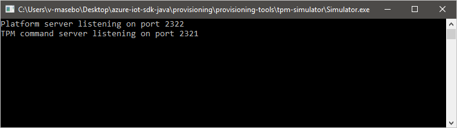

::: zone-end

::: zone pivot="programming-language-java"

1. 시뮬레이션된 디바이스의 [HSM](https://azure.microsoft.com/blog/azure-iot-supports-new-security-hardware-to-strengthen-iot-security/)이 되도록 [TPM](/windows/device-security/tpm/trusted-platform-module-overview) 시뮬레이터를 실행합니다.

2. **액세스 허용** 을 선택합니다. 이 시뮬레이터는 포트 2321 및 2322에서 소켓을 수신 대기합니다. 이 명령 창을 닫지 마세요. 이 빠른 시작 가이드가 끝날 때까지 이 시뮬레이터가 실행되는 상태를 유지해야 합니다.

    ```cmd/sh
    .\azure-iot-sdk-java\provisioning\provisioning-tools\tpm-simulator\Simulator.exe
    ```

    

3. 두 번째 명령 프롬프트를 엽니다.

4. 두 번째 명령 프롬프트에서 루트 폴더로 이동하고 샘플 종속성을 빌드합니다.

    ```cmd/sh
    cd azure-iot-sdk-java
    mvn install -DskipTests=true
    ```

5. 샘플 폴더로 이동합니다.

    ```cmd/sh
    cd provisioning/provisioning-samples/provisioning-tpm-sample
    ```

::: zone-end

::: zone pivot="programming-language-ansi-c, programming-language-python,programming-language-java"

<a id="simulatetpm"></a>

## <a name="read-cryptographic-keys-from-the-tpm-device"></a>TPM 디바이스의 암호화 키 읽기

이 섹션에서는 포트 2321 및 2322에서 실행되어 수신 대기 중인 TPM 시뮬레이터의 인증 키 및 등록 ID를 읽을 샘플을 빌드하고 실행합니다. 이러한 값은 Device Provisioning Service 인스턴스를 사용하는 디바이스 등록에 사용됩니다.

::: zone-end

::: zone pivot="programming-language-ansi-c"

1. Visual Studio를 실행합니다.

2. *cmake* 폴더에 생성된 솔루션(`azure_iot_sdks.sln`)을 엽니다.

3. Visual Studio 메뉴에서 **빌드** > **빌드 솔루션** 을 선택하여 솔루션의 모든 프로젝트를 빌드합니다.

4. Visual Studio의 *솔루션 탐색기* 창에서 **Provision\_Tools** 폴더로 이동합니다. **tpm_device_provision** 프로젝트를 마우스 오른쪽 단추로 클릭한 다음 **시작 프로젝트로 설정** 을 선택합니다. 

5. Visual Studio 메뉴에서 **디버그** > **디버깅하지 않고 시작** 을 선택하여 솔루션을 실행합니다. 앱은 **_등록 ID_** 및 **_인증 키_** 를 읽고 표시합니다. 이러한 값을 적어 두거나 복사합니다. 해당 값은 디바이스 등록을 위해 다음 섹션에서 사용됩니다.

::: zone-end

::: zone pivot="programming-language-python"

1. Visual Studio를 실행합니다.

2. *cmake* 폴더에 생성된 솔루션(`azure_iot_sdks.sln`)을 엽니다.

3. Visual Studio 메뉴에서 **빌드** > **빌드 솔루션** 을 선택하여 솔루션의 모든 프로젝트를 빌드합니다.

4. **tpm_device_provision** 프로젝트를 마우스 오른쪽 단추로 클릭한 다음 **시작 프로젝트로 설정** 을 선택합니다.

5. 솔루션을 실행합니다. 출력 창에 디바이스 등록에 필요한 **_인증 키_** 와 **_등록 ID_** 가 표시됩니다. 이러한 값을 복사합니다.

::: zone-end

::: zone pivot="programming-language-java"

1. Azure Portal에 로그인하여 왼쪽 메뉴에서 **모든 리소스** 단추를 선택하고 Device Provisioning Service를 엽니다. _ID 범위_ 및 _Provisioning Service 글로벌 엔드포인트_ 를 확인합니다.

    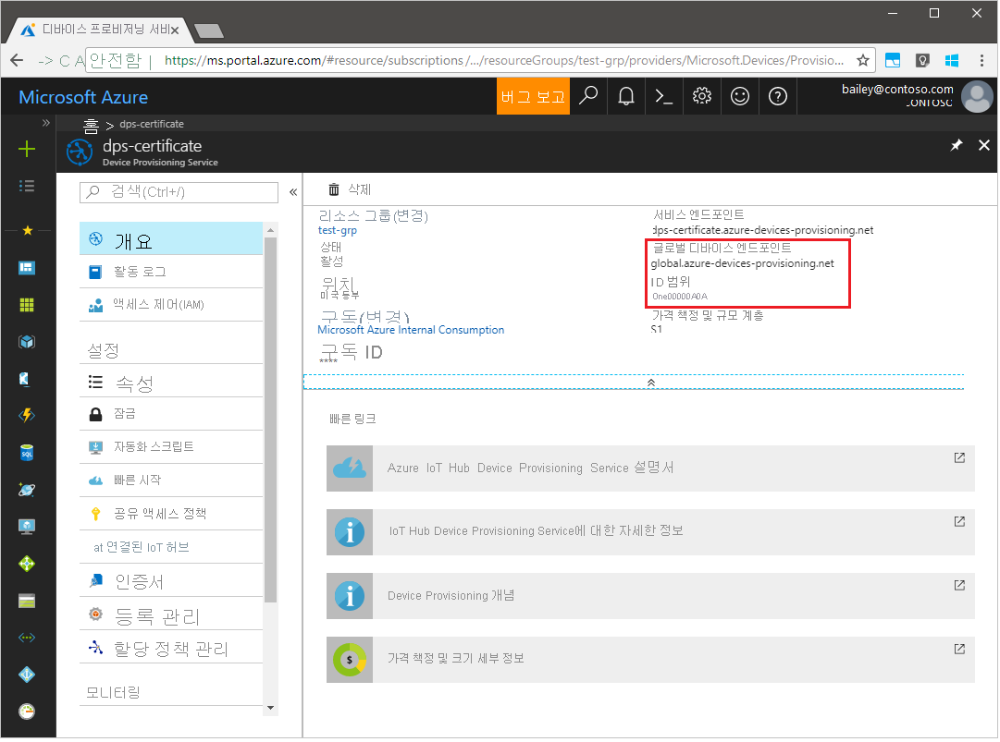

2. 앞에서 설명한 대로 _ID 범위_ 및 _Provisioning Service 글로벌 엔드포인트_ 를 포함하도록 `src/main/java/samples/com/microsoft/azure/sdk/iot/ProvisioningTpmSample.java`를 편집합니다.  

    ```java
    private static final String idScope = "[Your ID scope here]";
    private static final String globalEndpoint = "[Your Provisioning Service Global Endpoint here]";
    private static final ProvisioningDeviceClientTransportProtocol PROVISIONING_DEVICE_CLIENT_TRANSPORT_PROTOCOL = ProvisioningDeviceClientTransportProtocol.HTTPS;
    ```

3. 파일을 저장합니다.

4. 다음 명령을 사용하여 프로젝트를 빌드하고 대상 폴더로 이동한 다음, 생성된 .jar 파일을 실행합니다(`{version}`을(를) 사용자의 Java 버전으로 대체).

    ```cmd/sh
    mvn clean install
    cd target
    java -jar ./provisioning-tpm-sample-{version}-with-deps.jar
    ```

5. 프로그램 실행이 시작되면 *_인증 키_* 와 *_등록 ID_* 가 나타납니다.  다음 섹션을 위해 이러한 값을 복사합니다. 프로그램을 계속 실행해야 합니다.
  
::: zone-end


<a id="portalenrollment"></a>

## <a name="create-a-device-enrollment-entry"></a>디바이스 등록 항목 만들기

1. [Azure Portal](https://portal.azure.com)에 로그인합니다.

2. 왼쪽 메뉴 또는 포털 페이지에서 **모든 리소스** 를 선택합니다.

3. Device Provisioning Service를 선택합니다.

4. **설정** 메뉴에서 **등록 관리** 를 선택합니다.

5. 페이지 위쪽에서 **+ 개별 등록 추가** 단추를 선택합니다.

6. **등록 추가** 패널에서 다음 정보를 입력합니다.

   * ID 증명 *메커니즘* 으로 **TPM** 을 선택합니다.
   * 앞에서 기록한 값에서 TPM 디바이스에 대한 *등록 ID* 및 *인증 키* 를 입력합니다.
   * 프로비전 서비스와 연결된 IoT Hub를 선택합니다.
   * 필요에 따라 다음 정보를 입력합니다.
       * 고유한 *디바이스 ID* 를 입력합니다. 제안된 **test-docs-device** 를 사용해도 되고, 직접 입력해도 됩니다. 디바이스 이름을 지정할 때 중요한 데이터가 포함되지 않도록 합니다. 제공하지 않도록 선택하면 등록 ID가 대신 디바이스를 식별하는 데 사용됩니다.
       * 디바이스에 대해 원하는 초기 구성으로 **초기 디바이스 쌍 상태** 를 업데이트합니다.
   * 완료되면 **저장** 단추를 누릅니다.

      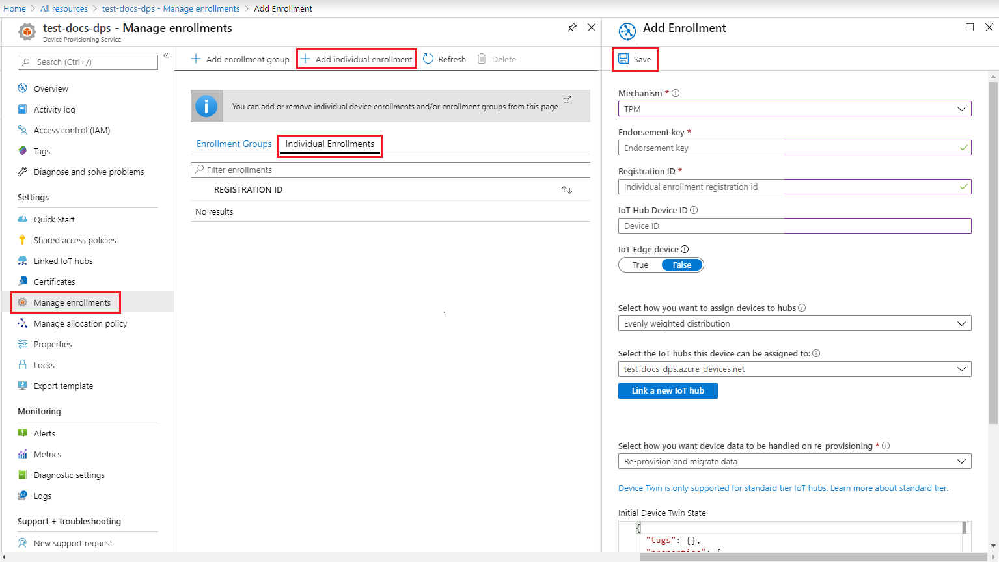  

7. **저장** 을 선택합니다.

## <a name="register-the-device"></a>디바이스 등록

이 섹션에서는 샘플 코드가 [AMQP(고급 메시지 큐 프로토콜)](https://wikipedia.org/wiki/Advanced_Message_Queuing_Protocol)를 사용하도록 구성하여 디바이스의 부팅 시퀀스를 Device Provisioning Service 인스턴스에 보냅니다. 이 부팅 시퀀스를 사용하면 디바이스가 Device Provisioning Service 인스턴스에 연결된 IoT Hub에 등록됩니다.

::: zone pivot="programming-language-ansi-c"

<a id="firstbootsequence"></a>

1. Azure Portal에서 Device Provisioning Service에 대한 **개요** 탭을 선택합니다.

2. **_ID 범위_** 값을 복사합니다.

    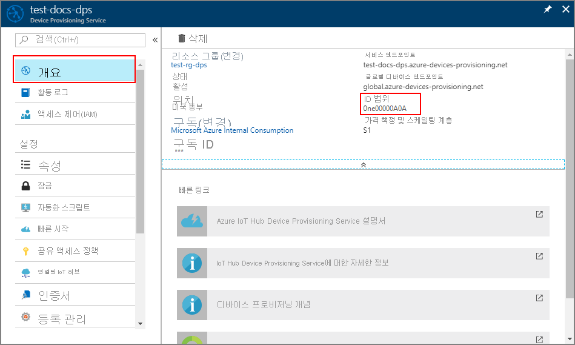
3. Visual Studio의 *솔루션 탐색기* 창에서 **Provision\_Samples** 폴더로 이동합니다. **prov\_dev\_client\_sample** 이라는 샘플 프로젝트를 확장합니다. **원본 파일** 을 확장하고, **prov\_dev\_client\_sample.c** 를 엽니다.

4. 아래에 표시된 대로 파일의 맨 위쪽 가까이에 있는 각 디바이스 프로토콜에 대한 `#define` 문을 찾습니다. `SAMPLE_AMQP`의 주석 처리를 제거했는지 확인합니다.

    현재 [MQTT 프로토콜은 TPM 개별 등록에 지원되지 않습니다](https://github.com/Azure/azure-iot-sdk-c#provisioning-client-sdk).

    ```c
    //
    // The protocol you wish to use should be uncommented
    //
    //#define SAMPLE_MQTT
    //#define SAMPLE_MQTT_OVER_WEBSOCKETS
    #define SAMPLE_AMQP
    //#define SAMPLE_AMQP_OVER_WEBSOCKETS
    //#define SAMPLE_HTTP
    ```

5. `id_scope` 상수를 찾고, 값을 앞에서 복사한 **ID 범위** 값으로 바꿉니다. 

    ```c
    static const char* id_scope = "0ne00002193";
    ```

6. 동일한 파일에서 `main()` 함수에 대한 정의를 찾습니다. 아래와 같이 `hsm_type` 변수가 `SECURE_DEVICE_TYPE_TPM` 대신 `SECURE_DEVICE_TYPE_X509`으로 설정되었는지 확인합니다.

    ```c
    SECURE_DEVICE_TYPE hsm_type;
    //hsm_type = SECURE_DEVICE_TYPE_TPM;
    hsm_type = SECURE_DEVICE_TYPE_X509;
    ```

7. **prov\_dev\_client\_sample** 프로젝트를 마우스 오른쪽 단추로 클릭하고 **시작 프로젝트로 설정** 을 선택합니다.

8. Visual Studio 메뉴에서 **디버그** > **디버깅하지 않고 시작** 을 선택하여 솔루션을 실행합니다. 프로젝트를 다시 빌드하라는 프롬프트에서 **예** 를 선택하여 실행하기 전에 프로젝트를 다시 빌드합니다.

    다음 출력은 프로비전 디바이스 클라이언트 샘플을 성공적으로 부팅하고, IoT Hub 정보를 가져오기 위해 Device Provisioning Service 인스턴스에 연결하고, 등록하는 예제입니다.

     ```cmd
    Provisioning API Version: 1.2.7

    Registering... Press enter key to interrupt.

    Provisioning Status: PROV_DEVICE_REG_STATUS_CONNECTED
    Provisioning Status: PROV_DEVICE_REG_STATUS_ASSIGNING
    Provisioning Status: PROV_DEVICE_REG_STATUS_ASSIGNING

    Registration Information received from service:
    test-docs-hub.azure-devices.net, deviceId: test-docs-cert-device
    ```

::: zone-end

::: zone pivot="programming-language-nodejs"

1. Azure Portal에서 Device Provisioning Service에 대한 **개요** 탭을 선택합니다.

2. **_ID 범위_** 값을 복사합니다.

      

3. 원하는 텍스트 편집기를 엽니다.

4. **registerdevice** 폴더에 새 _RegisterDevice.js_ 파일을 만듭니다.

5. _RegisterDevice.js_ 파일의 시작에 다음의 `require` 문을 추가합니다.

    ```Javascript

    'use strict';

    var ProvisioningTransport = require('azure-iot-provisioning-device-http').Http;
    var iotHubTransport = require('azure-iot-device-mqtt').Mqtt;
    var Client = require('azure-iot-device').Client;
    var Message = require('azure-iot-device').Message;
    var tpmSecurity = require('azure-iot-security-tpm');
    var ProvisioningDeviceClient = require('azure-iot-provisioning-device').ProvisioningDeviceClient;
    ```

    > [!NOTE]
    > **Node.js용 Azure IoT SDK** 는 _AMQ_, _AMQP WS_ 및 _MQTT WS_ 와 같은 추가 프로토콜을 지원합니다.  더 많은 예제는 [Node.js 샘플용 Device Provisioning Service SDK](https://github.com/Azure/azure-iot-sdk-node/tree/main/provisioning/device/samples)를 참조하세요.
    > 

6. **globalDeviceEndpoint** 및 **idScope** 변수를 추가하고, 이러한 변수를 사용하여 **ProvisioningDeviceClient** 인스턴스를 만듭니다. **{globalDeviceEndpoint}** 및 **{idScope}** 를 **1단계** 의 **_전역 디바이스 엔드포인트_** 및 **_ID 범위_** 값으로 바꿉니다.

    ```Javascript

    var provisioningHost = '{globalDeviceEndpoint}';
    var idScope = '{idScope}';

    var tssJs = require("tss.js");
    var securityClient = new tpmSecurity.TpmSecurityClient('', new tssJs.Tpm(true));
    // if using non-simulated device, replace the above line with following:
    //var securityClient = new tpmSecurity.TpmSecurityClient();

    var provisioningClient = ProvisioningDeviceClient.create(provisioningHost, idScope, new ProvisioningTransport(), securityClient);
    ```

7. 디바이스에서 메서드를 실행하도록 다음 함수를 추가합니다.

    ```JavaScript

    provisioningClient.register(function(err, result) {
      if (err) {
        console.log("error registering device: " + err);
      } else {
        console.log('registration succeeded');
        console.log('assigned hub=' + result.registrationState.assignedHub);
        console.log('deviceId=' + result.registrationState.deviceId);
        var tpmAuthenticationProvider = tpmSecurity.TpmAuthenticationProvider.fromTpmSecurityClient(result.registrationState.deviceId, result.registrationState.assignedHub, securityClient);
        var hubClient = Client.fromAuthenticationProvider(tpmAuthenticationProvider, iotHubTransport);

        var connectCallback = function (err) {
          if (err) {
            console.error('Could not connect: ' + err.message);
          } else {
            console.log('Client connected');
            var message = new Message('Hello world');
            hubClient.sendEvent(message, printResultFor('send'));
          }
        };

        hubClient.open(connectCallback);

        function printResultFor(op) {
          return function printResult(err, res) {
            if (err) console.log(op + ' error: ' + err.toString());
            if (res) console.log(op + ' status: ' + res.constructor.name);
            process.exit(1);
          };
        }
      }
    });
    ```

8. _RegisterDevice.js_ 파일을 저장하고 닫습니다. 

9. 다음 명령을 실행합니다.

    ```cmd/sh
    node RegisterDevice.js
    ```

10. 디바이스를 부팅하고 IoT Hub 정보를 얻기 위해 Device Provisioning Service에 연결하는 과정을 시뮬레이션하는 메시지를 확인합니다.

::: zone-end

::: zone pivot="programming-language-python"

1. Git 리포지토리의 샘플 폴더로 이동합니다.

    ```cmd/sh
    cd azure-iot-sdk-python/provisioning_device_client/samples
    ```

2. Python IDE를 사용하여 **프로비저닝\_디바이스\_클라이언트\_sample.py**(대체)`{globalServiceEndpoint}` 및 `{idScope}` Python 스크립트를 이전에 복사한 값으로 편집합니다. 또한 *보안\_디바이스\_유형* 을 `ProvisioningSecurityDeviceType.TPM`(으)로 설정합니다.

    ```python
    GLOBAL_PROV_URI = "{globalServiceEndpoint}"
    ID_SCOPE = "{idScope}"
    SECURITY_DEVICE_TYPE = ProvisioningSecurityDeviceType.TPM
    PROTOCOL = ProvisioningTransportProvider.HTTP
    ```

    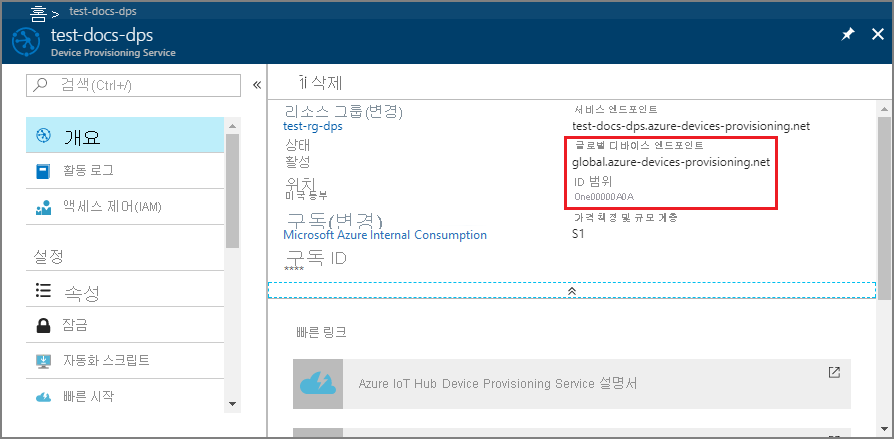

3. 예제를 실행합니다.

    ```cmd/sh
    python provisioning_device_client_sample.py
    ```

4. 디바이스를 부팅하고 IoT Hub 정보를 얻기 위해 Device Provisioning Service에 연결하는 과정을 시뮬레이션하는 메시지를 확인합니다.

::: zone-end

::: zone pivot="programming-language-java"

1. 머신에서 Java 샘플 코드를 실행 중인 명령 창에서 *Enter* 키를 눌러 애플리케이션을 계속 실행합니다. 디바이스를 부팅하고 IoT Hub 정보를 얻기 위해 Device Provisioning Service에 연결하는 과정을 시뮬레이션하는 메시지를 확인합니다.  

    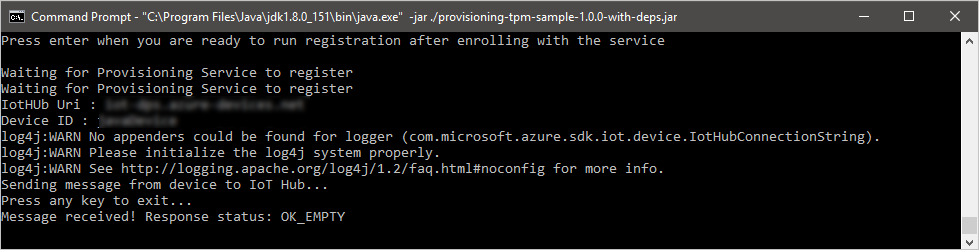

::: zone-end

## <a name="confirm-your-device-provisioning-registration"></a>디바이스 프로비저닝 등록 확인

1. [Azure Portal](https://portal.azure.com)로 이동합니다.

2. 왼쪽 메뉴 또는 포털 페이지에서 **모든 리소스** 를 선택합니다.

3. 디바이스가 할당된 IoT Hub를 선택합니다.

4. **Explorers** 메뉴에서 **IoT 디바이스** 를 선택합니다.

5. 디바이스가 성공적으로 프로비전된 경우 **상태** 가 *사용* 으로 설정된 디바이스 ID가 목록에 표시됩니다. 디바이스가 표시되지 않으면 페이지 위쪽에서 **새로 고침** 을 선택합니다.

    :::zone pivot="programming-language-ansi-c"

    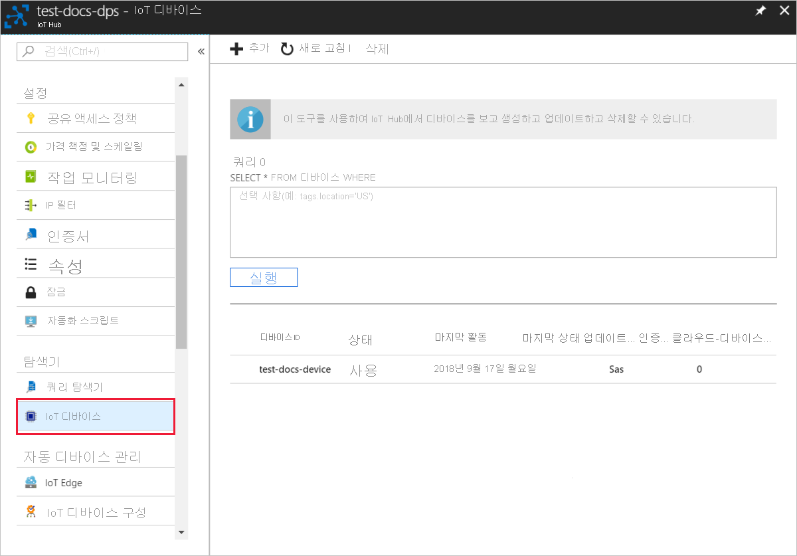 

    :::zone-end

    :::zone pivot="programming-language-csharp"

      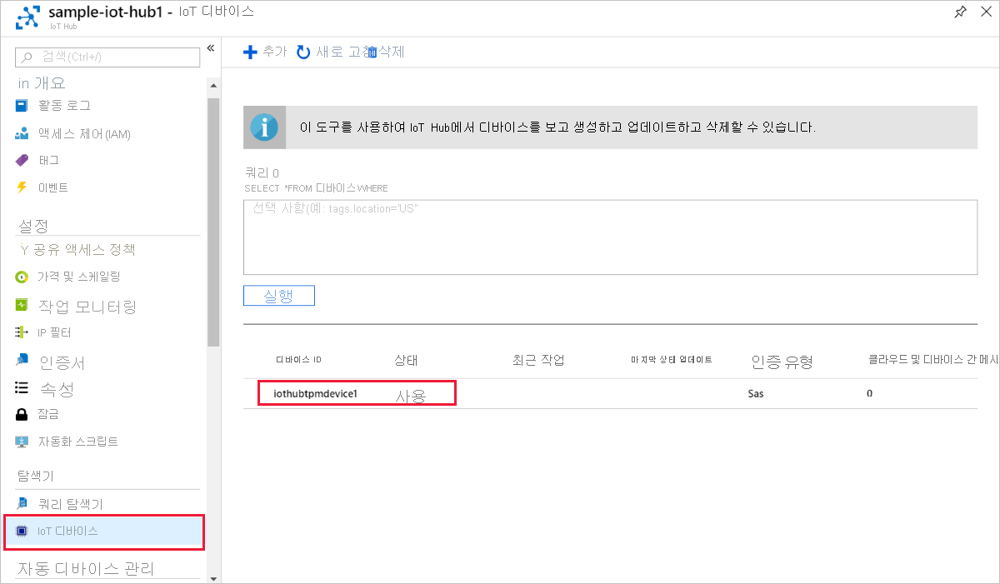

    ::: zone-end

    ::: zone pivot="programming-language-nodejs"

    

    ::: zone-end

    ::: zone pivot="programming-language-python"

    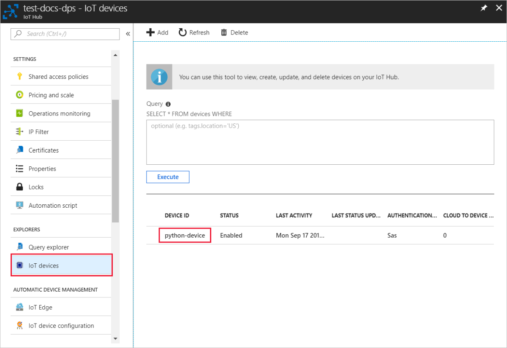 

    ::: zone-end

    ::: zone pivot="programming-language-java"

    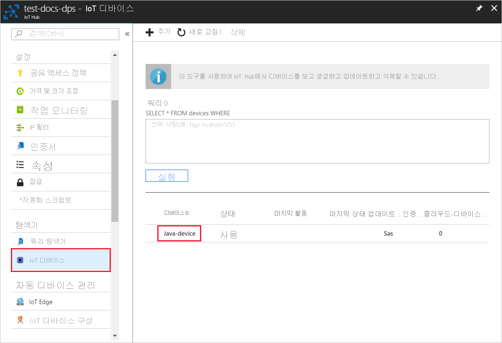 

    ::: zone-end


> [!NOTE]
> 디바이스에 대한 등록 항목의 기본값으로부터 *초기 디바이스 쌍 상태* 를 변경한 경우, 허브에서 원하는 쌍 상태를 가져와서 그에 맞게 작동할 수 있습니다. 자세한 내용은 [IoT Hub의 디바이스 쌍 이해 및 사용](../iot-hub/iot-hub-devguide-device-twins.md)을 참조하세요.
>

## <a name="clean-up-resources"></a>리소스 정리

디바이스 클라이언트 샘플에 계속 작업하고 탐색할 계획인 경우 이 빠른 시작에서 만든 리소스를 정리하지 마세요. 그만하려면 다음 단계를 사용하여 이 빠른 시작에서 만든 모든 리소스를 삭제합니다.

### <a name="delete-your-device-enrollment"></a>디바이스 등록 삭제

1. 컴퓨터에서 디바이스 클라이언트 샘플 출력 창을 닫습니다.

2. Azure Portal의 왼쪽 메뉴에서 **모든 리소스** 를 선택합니다.

3. Device Provisioning Service를 선택합니다.

4. **설정** 메뉴에서 **등록 관리** 를 선택합니다.

5. **개별 등록** 탭을 선택합니다.

6. 이 빠른 시작에 등록한 디바이스의 *등록 ID* 옆에 있는 확인란을 선택합니다.

7. 페이지 위쪽에서 **삭제** 를 선택합니다.

### <a name="delete-your-device-registration-from-iot-hub"></a>IoT Hub에서 디바이스 등록 삭제

1. Azure Portal의 왼쪽 메뉴에서 **모든 리소스** 를 선택합니다.

2. IoT Hub를 선택합니다.

3. **Explorers** 메뉴에서 **IoT 디바이스** 를 선택합니다.

4. 이 빠른 시작에서 등록한 디바이스의 *디바이스 ID* 옆에 있는 확인란을 선택합니다.

5. 페이지 위쪽에서 **삭제** 를 선택합니다.

## <a name="next-steps"></a>다음 단계

이 빠른 시작에서는 시뮬레이션된 TPM 디바이스를 머신에 만들고, IoT Hub Device Provisioning Service를 사용하여 IoT 허브에 이 디바이스를 프로비저닝했습니다. 프로그래밍 방식으로 TPM 디바이스를 등록하는 방법을 알아보려면 프로그래밍 방식으로 TPM 디바이스를 등록하는 빠른 시작을 계속 진행하세요.

> [!div class="nextstepaction"]
> [빠른 시작 - Azure IoT Hub Device Provisioning Service에 TPM 디바이스 등록](quick-enroll-device-tpm.md)