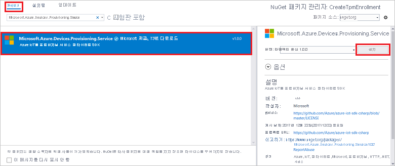

# <a name="quickstart-enroll-individual-device-to-iot-hub-device-provisioning-service-using-tpm-attestation"></a>빠른 시작: TPM 증명을 사용하여 IoT Hub Device Provisioning Service에 개별 디바이스 등록

이 문서에서는 [Microsoft Azure IoT SDK](../iot-hub/iot-hub-devguide-sdks.md) 및 샘플 애플리케이션을 사용하여 Azure IoT Hub Device Provisioning Service에서 TPM 디바이스에 대한 개별 등록을 프로그래밍 방식으로 만드는 방법을 보여줍니다. 필요에 따라 이 개별 등록 항목을 사용하여 시뮬레이션된 TPM 디바이스를 프로비저닝 서비스에 등록할 수 있습니다. 

이러한 단계는 Windows 및 Linux 컴퓨터 모두에서 작동하지만, 이 문서에서는 Windows 개발 컴퓨터를 사용합니다.

## <a name="prerequisites"></a>필수 조건

[!INCLUDE [quickstarts-free-trial-note](../../includes/quickstarts-free-trial-note.md)]

* [Azure Portal에서 IoT Hub Device Provisioning Service 설정](./quick-setup-auto-provision.md)의 단계를 완료합니다.

:::zone pivot="programming-language-csharp"

* [Visual Studio 2019](https://www.visualstudio.com/vs/)를 설치합니다.

* Windows 기반 머신에 [.NET Core 3.1 SDK 이상](https://dotnet.microsoft.com/download)을 설치합니다. 다음 명령을 사용하여 버전을 확인할 수 있습니다.

    ```bash
    dotnet --info
    ```

* (선택 사항) 이 빠른 시작을 완료한 후 시뮬레이션된 디바이스를 등록하려면, 디바이스에 대한 인증 키를 가져오는 단계까지 [시뮬레이션된 TPM 디바이스 만들기 및 프로비저닝](quick-create-simulated-device-tpm.md)의 단계를 수행합니다. 인증 키, 등록 ID 그리고 필요에 따라 디바이스 ID를 저장해 둡니다.

:::zone-end

:::zone pivot="programming-language-nodejs"

* [Node.js v4.0 이상](https://nodejs.org)을 설치합니다.

* (선택 사항) 인증 키를 만듭니다. [시뮬레이션된 디바이스 만들기 및 프로비저닝](quick-create-simulated-device-tpm.md)의 단계를 수행하여 키를 가져옵니다.

:::zone-end

:::zone pivot="programming-language-python"

* [Python 2.x 또는 3.x](https://www.python.org/downloads/)를 다운로드하고 설치합니다. 설치 프로그램의 요구 사항에 따라 32비트 또는 64비트 설치를 사용해야 합니다. 설치하는 동안 메시지가 표시되면 플랫폼 특정 환경 변수에 Python을 추가해야 합니다. 

* Python 배포판에 [Pip](https://pip.pypa.io/en/stable/installing/)가 포함되지 않은 경우 Pip를 설치합니다.

> [!IMPORTANT]
> 이 문서는 더 이상 사용되지 않는 V1 Python SDK에만 적용됩니다. IoT Hub Device Provisioning Service에 대한 디바이스 및 서비스 클라이언트는 아직 V2에서 사용할 수 없습니다. 이 팀은 현재 V2를 기능 패리티로 가져오기 위해 노력하고 있습니다.

:::zone-end

:::zone pivot="programming-language-java"

* [Java SE Development Kit 8](/azure/developer/java/fundamentals/java-support-on-azure)을 설치합니다. 이 빠른 시작에서는 아래 [Java 서비스 SDK](https://azure.github.io/azure-iot-sdk-java/master/service/)를 설치합니다. Windows와 Linux 모두에서 작동합니다. 이 빠른 시작에서는 Windows를 사용합니다.

* [Maven 3](https://maven.apache.org/download.cgi)을 설치합니다.

* [Git](https://git-scm.com/download/)을 설치하고 경로가 환경 변수 `PATH`에 추가되도록 합니다.


:::zone-end

> [!NOTE]
> Azure Portal을 사용하여 개별 등록을 만드는 단계는 수행하지 마세요.


:::zone pivot="programming-language-python"

<a id="prepareenvironment"></a>

## <a name="prepare-the-development-environment"></a>개발 환경 준비

* [Python 프로비저닝 서비스 SDK](https://github.com/Azure/azure-iot-sdk-python/tree/v1-deprecated/provisioning_service_client)를 다운로드하여 설치하려면 다음 옵션 중 하나를 선택합니다.
    
    - **Azure IoT Python SDK** 를 빌드하고 컴파일합니다. [이러한 지침](https://github.com/Azure/azure-iot-sdk-python/blob/v1-deprecated/doc/python-devbox-setup.md)에 따라 Python 패키지를 빌드합니다. Windows OS를 사용하는 경우 Python의 네이티브 DLL을 사용할 수 있도록 [Visual C++ 재배포 가능 패키지](https://support.microsoft.com/help/2977003/the-latest-supported-visual-c-downloads)도 설치합니다.
    
    - [*pip* Python 패키지 관리 시스템을 설치 또는 업그레이드](https://pip.pypa.io/en/stable/installing/)하고 다음 명령을 통해 패키지를 설치합니다.
        
        ```cmd/sh
        pip install azure-iothub-provisioningserviceclient
        ```

### <a name="copy-symmetric-and-tpm-enrollment-keys"></a>대칭 및 TPM 등록 키 복사

이 빠른 시작에서는 대칭 키와 TPM 등록을 시연합니다. 키를 직접 만들어도 되고, 제공된 테스트 키를 사용해도 됩니다.
 
# <a name="symmetric-key"></a>[대칭 키](#tab/symmetrickey)

시뮬레이션된 대칭 키 디바이스 등록의 경우 디바이스용 기본 및 보조 키가 필요합니다. 유효한 대칭 키가 없는 경우에는 다음과 같은 예제용 테스트 키를 사용하면 됩니다.

*기본 대칭 키*

```
UmorGiEVPNIQuaWGXXbe8v9gWayS7XtOZmNMo6DEaEXP65GvhuK3OeRf8RVZ9BymBCHxNg3oRTey0pUHUwwYKQ==
```

*보조 대칭 키*

```
Zx8/eE7PUBmnouB1qlNQxI7fcQ2HbJX+y96F1uCVQvDj88jFL+q6L9YWLLi4jqTmkRPOulHlSbSv2uFgj4vKtw==
```

# <a name="tpm"></a>[TPM](#tab/tpm)

TPM 등록의 경우는 디바이스용 인증 키가 필요합니다. [시뮬레이션된 디바이스 만들기 및 프로비전](quick-create-simulated-device-tpm.md) 빠른 시작을 수행하여 시뮬레이션된 TPM 디바이스를 만든 경우 해당 디바이스에 대해 만든 키를 사용합니다. 그렇지 않으면 SDK와 함께 제공되는 다음 인증 키를 사용할 수 있습니다.

```
AToAAQALAAMAsgAgg3GXZ0SEs/gakMyNRqXXJP1S124GUgtk8qHaGzMUaaoABgCAAEMAEAgAAAAAAAEAtW6MOyCu/Nih47atIIoZtlYkhLeCTiSrtRN3q6hqgOllA979No4BOcDWF90OyzJvjQknMfXS/Dx/IJIBnORgCg1YX/j4EEtO7Ase29Xd63HjvG8M94+u2XINu79rkTxeueqW7gPeRZQPnl1xYmqawYcyzJS6GKWKdoIdS+UWu6bJr58V3xwvOQI4NibXKD7htvz07jLItWTFhsWnTdZbJ7PnmfCa2vbRH/9pZIow+CcAL9mNTNNN4FdzYwapNVO+6SY/W4XU0Q+dLMCKYarqVNH5GzAWDfKT8nKzg69yQejJM8oeUWag/8odWOfbszA+iFjw3wVNrA5n8grUieRkPQ==
```

---

:::zone-end


:::zone pivot="programming-language-java"

<a id="setupdevbox"></a>

## <a name="prepare-the-development-environment"></a>개발 환경 준비 

### <a name="set-up-environment-variables"></a>환경 변수 설정

환경 변수를 설정하려면 다음을 수행합니다.

1. `PATH` 변수에는 *jdk1.8.x\bin* 디렉터리의 전체 경로가 포함되어야 합니다. 컴퓨터의 첫 번째 Java 설치인 경우 `JAVA_HOME`이라는 새 환경 변수를 만들고 *jdk1.8.x* 디렉터리의 전체 경로를 가리키도록 지정합니다. Windows 머신에서 이 디렉터리는 *C:\\Program Files\\Java\\* 폴더에 있으며, Windows 머신의 **제어판** 에서 **시스템 환경 변수 편집** 을 검색하여 환경 변수를 만들거나 편집할 수 있습니다.

    명령 창에서 다음 명령을 실행하여 Java가 머신에 성공적으로 설치되었는지 확인할 수 있습니다.

    ```cmd\sh
    java -version
    ```

2. Maven이 추출된 폴더 내의 *apache-maven-3.x.x\\bin* 폴더를 가리키도록 `PATH` 환경 변수를 편집합니다. 명령 창에서 다음 명령을 실행하여 Maven이 성공적으로 설치되었는지 확인할 수 있습니다:

    ```cmd\sh
    mvn --version
    ```

3. 컴퓨터에 [git](https://git-scm.com/download/)가 설치되어 있고 `PATH` 환경 변수에 추가되었는지 확인합니다.

### <a name="clone-git-repository-for-azure-iot-java-sdk"></a>Azure IoT Java SDK용 Git 리포지토리 복제

Azure IoT Java SDK를 복제하려면 다음을 수행합니다.

1. 명령 프롬프트를 엽니다. 

2. [Java 서비스 SDK](https://azure.github.io/azure-iot-sdk-java/master/service/)를 사용하여 디바이스 등록 코드 샘플에 대한 GitHub 리포지토리를 복제합니다.

    ```cmd\sh
    git clone https://github.com/Azure/azure-iot-sdk-java.git --recursive
    ```

:::zone-end

## <a name="get-the-connection-string-for-your-provisioning-service"></a>프로비전 서비스에 대한 연결 문자열 가져오기

이 빠른 시작의 샘플에서는 프로비전 서비스의 연결 문자열을 복사해야 합니다.

1. [Azure Portal](https://portal.azure.com)에 로그인합니다.

2. 왼쪽 메뉴 또는 포털 페이지에서 **모든 리소스** 를 선택합니다.

3. 해당하는 Device Provisioning Service를 선택합니다.

4. **설정** 메뉴에서 **공유 액세스 정책** 을 선택합니다.

5. 사용하려는 액세스 정책을 선택합니다.

6. **액세스 정책** 패널에서 기본 키 연결 문자열을 복사하여 저장합니다.

    :::image type="content" source="./media/quick-enroll-device-tpm/get-service-connection-string.png" alt-text="포털에서 프로비전 서비스 연결 문자열 가져오기":::

## <a name="create-the-individual-enrollment-sample"></a>개별 등록 샘플 만들기

:::zone pivot="programming-language-csharp"

이 섹션에서는 TPM 디바이스의 개별 등록을 프로비저닝 서비스에 추가하는 .NET Core 콘솔 앱을 만드는 방법을 보여줍니다. 일부를 수정하여 개별 등록을 추가할 [Windows IoT Core](https://developer.microsoft.com/en-us/windows/iot) 콘솔 앱을 만들기 위해 다음과 같은 단계를 수행할 수 있습니다. IoT Core를 사용하여 개발하는 방법에 대한 자세한 내용은 [Windows IoT Core 개발자 설명서](/windows/iot-core/)를 참조하세요.

1. Visual Studio를 열고 **새 프로젝트 만들기** 를 선택합니다.

2. **새 프로젝트 만들기** 패널에서 **콘솔 애플리케이션* 을 선택합니다.

3. **새로 만들기** 를 선택합니다.

4. **프로젝트 이름** 으로 *CreateEnrollmentGroup* 을 입력합니다.

5. **다음** 을 선택합니다. 기본 **대상 프레임워크** 를 유지합니다.

6. **생성** 를 선택합니다.

7. 솔루션이 열리면 **솔루션 탐색기** 창에서 **CreateEnrollmentGroup** 프로젝트를 마우스 오른쪽 단추로 클릭한 다음, **NuGet 패키지 관리** 를 선택합니다.

8. **NuGet 패키지 관리자** 에서 **찾아보기** 를 선택합니다.

9. *Microsoft.Azure.Devices.Provisioning.Service* 를 입력하고 선택합니다.

10. **설치** 를 선택합니다.

    

    이 단계에서는 [Azure IoT 프로비저닝 서비스 클라이언트 SDK](https://www.nuget.org/packages/Microsoft.Azure.Devices.Provisioning.Service/) NuGet 패키지 및 해당 종속성에 대한 참조를 다운로드하고, 설치하고, 추가합니다.

11. `Program.cs` 맨 위에서 다른 `using` 문 뒤에 다음 `using` 문을 추가합니다.
  
    ```csharp
    using System.Threading.Tasks;
    using Microsoft.Azure.Devices.Provisioning.Service;
    ```

12. `Program` 클래스에 다음 필드를 추가하고 나열된 변경 작업을 수행합니다.  

    ```csharp
    private static string ProvisioningConnectionString = "{ProvisioningServiceConnectionString}";
    private const string RegistrationId = "sample-registrationid-csharp";
    private const string TpmEndorsementKey =
        "AToAAQALAAMAsgAgg3GXZ0SEs/gakMyNRqXXJP1S124GUgtk8qHaGzMUaaoABgCAAEMAEAgAAAAAAAEAxsj2gUS" +
        "cTk1UjuioeTlfGYZrrimExB+bScH75adUMRIi2UOMxG1kw4y+9RW/IVoMl4e620VxZad0ARX2gUqVjYO7KPVt3d" +
        "yKhZS3dkcvfBisBhP1XH9B33VqHG9SHnbnQXdBUaCgKAfxome8UmBKfe+naTsE5fkvjb/do3/dD6l4sGBwFCnKR" +
        "dln4XpM03zLpoHFao8zOwt8l/uP3qUIxmCYv9A7m69Ms+5/pCkTu/rK4mRDsfhZ0QLfbzVI6zQFOKF/rwsfBtFe" +
        "WlWtcuJMKlXdD8TXWElTzgh7JS4qhFzreL0c1mI0GCj+Aws0usZh7dLIVPnlgZcBhgy1SSDQMQ==";
        
    // Optional parameters
    private const string OptionalDeviceId = "myCSharpDevice";
    private const ProvisioningStatus OptionalProvisioningStatus = ProvisioningStatus.Enabled;
    ```

13. `ProvisioningServiceConnectionString` 자리 표시자 값을 이전 섹션에서 복사한 프로비전 서비스의 연결 문자열로 바꿉니다.

14. 시뮬레이션된 디바이스를 프로비저닝하기 위해 [시뮬레이션된 TPM 디바이스 만들기 및 프로비전](quick-create-simulated-device-tpm.md) 빠른 시작과 함께 이 빠른 시작을 사용하는 경우 인증 키 및 등록 ID를 해당 빠른 시작에서 기록해 둔 값으로 바꿉니다. 디바이스 ID를 해당 빠른 시작에서 제안한 값으로 바꾸거나, 고유한 값을 사용하거나, 이 샘플의 기본값을 사용할 수 있습니다.

15. `Program` 클래스에 다음 메서드를 추가합니다.  이 코드는 개별 등록 항목을 만든 다음, `ProvisioningServiceClient`에서 `CreateOrUpdateIndividualEnrollmentAsync` 메서드를 호출하여 프로비저닝 서비스에 개별 등록을 추가합니다.

    ```csharp
    public static async Task RunSample()
    {
        Console.WriteLine("Starting sample...");
    
        using (ProvisioningServiceClient provisioningServiceClient =
                ProvisioningServiceClient.CreateFromConnectionString(ProvisioningConnectionString))
        {
            #region Create a new individualEnrollment config
            Console.WriteLine("\nCreating a new individualEnrollment...");
            Attestation attestation = new TpmAttestation(TpmEndorsementKey);
            IndividualEnrollment individualEnrollment =
                    new IndividualEnrollment(
                            RegistrationId,
                            attestation);
    
            // The following parameters are optional. Remove them if you don't need them.
            individualEnrollment.DeviceId = OptionalDeviceId;
            individualEnrollment.ProvisioningStatus = OptionalProvisioningStatus;
            #endregion
    
            #region Create the individualEnrollment
            Console.WriteLine("\nAdding new individualEnrollment...");
            IndividualEnrollment individualEnrollmentResult =
                await provisioningServiceClient.CreateOrUpdateIndividualEnrollmentAsync(individualEnrollment).ConfigureAwait(false);
            Console.WriteLine("\nIndividualEnrollment created with success.");
            Console.WriteLine(individualEnrollmentResult);
            #endregion
        
        }
    }
    ```

16. 마지막으로 `Main` 메서드를 다음 줄로 바꿉니다.

    ```csharp
    static async Task Main(string[] args)
    {
        await RunSample();
        Console.WriteLine("\nHit <Enter> to exit ...");
        Console.ReadLine();
    }
    ```

17. 솔루션을 빌드합니다.

:::zone-end

:::zone pivot="programming-language-nodejs"

1. 작업 폴더의 명령 창에서 다음을 실행합니다.
  
    ```cmd\sh
    npm install azure-iot-provisioning-service
    ```  

2. 텍스트 편집기를 사용하여 작업 폴더에 _create_individual_enrollment.js_ 파일을 만듭니다. 파일에 다음 코드를 추가합니다.

    ```Java
    'use strict';

    var provisioningServiceClient = require('azure-iot-provisioning-service').ProvisioningServiceClient;

    var serviceClient = provisioningServiceClient.fromConnectionString(process.argv[2]);
    var endorsementKey = process.argv[3];

    var enrollment = {
      registrationId: 'first',
      attestation: {
        type: 'tpm',
        tpm: {
          endorsementKey: endorsementKey
        }
      }
    };

    serviceClient.createOrUpdateIndividualEnrollment(enrollment, function(err, enrollmentResponse) {
      if (err) {
        console.log('error creating the individual enrollment: ' + err);
      } else {
        console.log("enrollment record returned: " + JSON.stringify(enrollmentResponse, null, 2));
      }
    });
    ```

3. 파일을 저장합니다.

:::zone-end

:::zone pivot="programming-language-python"

1. 텍스트 편집기를 사용하여 새 *Enrollment.py* 파일을 만듭니다.

2. 다음 `import` 문과 변수를 *Enrollment.py* 파일의 시작 부분에 추가합니다. `{dpsConnectionString}`을 앞에서 복사한 연결 문자열로 바꾸고, 인증서 자리 표시자를 [대칭 및 TPM 등록 키 복사](#copy-symmetric-and-tpm-enrollment-keys)에서 만든 인증서로 바꾸고, `{registrationid}`를 소문자 영숫자와 하이픈으로만 구성된 고유한 `registrationid`로 바꿔야 합니다.


    # <a name="symmetric-key"></a>[대칭 키](#tab/symmetrickey)

    ```python
    from provisioningserviceclient import ProvisioningServiceClient
    from provisioningserviceclient.models import IndividualEnrollment, AttestationMechanism
    from provisioningserviceclient.protocol.models import SymmetricKeyAttestation

    CONNECTION_STRING = "Enter your DPS connection string"
    PRIMARY_KEY = "Add a valid key"
    SECONDARY_KEY = "Add a valid key"
    REGISTRATION_ID = "Enter a registration ID"
    ```

    # <a name="tpm"></a>[TPM](#tab/tpm)
   
    ```python
    from provisioningserviceclient import ProvisioningServiceClient
    from provisioningserviceclient.models import IndividualEnrollment, AttestationMechanism

    CONNECTION_STRING = "Enter your DPS connection string"
    ENDORSEMENT_KEY = "Enter the endorsement key for your device"
    REGISTRATION_ID = "Enter a registration ID"
    ```

    ---

3. 다음 Python 코드를 추가하여 개별 등록 만들기를 시행합니다.

     # <a name="symmetric-key"></a>[대칭 키](#tab/symmetrickey)

    ```python
    def main():
        print ( "Starting individual enrollment..." )
    
        psc = ProvisioningServiceClient.create_from_connection_string(CONNECTION_STRING)
    
        symAtt = SymmetricKeyAttestation(primary_key=PRIMARY_KEY, secondary_key=SECONDARY_KEY)
        att = AttestationMechanism(type="symmetricKey", symmetric_key=symAtt)
        ie = IndividualEnrollment.create(REGISTRATION_ID, att)
    
        ie = psc.create_or_update(ie)
    
        print ( "Individual enrollment successful." )
    
    if __name__ == '__main__':
        main()
    ```

    # <a name="tpm"></a>[TPM](#tab/tpm)

    ```python
    def main():
        print ( "Starting individual enrollment..." )
    
        psc = ProvisioningServiceClient.create_from_connection_string(CONNECTION_STRING)
    
        att = AttestationMechanism.create_with_tpm(ENDORSEMENT_KEY)
        ie = IndividualEnrollment.create(REGISTRATION_ID, att)
    
        ie = psc.create_or_update(ie)
    
        print ( "Individual enrollment successful." )
    
    if __name__ == '__main__':
        main()
    ```

    ---

4. *Enrollment.py* 파일을 저장하고 닫습니다.

:::zone-end

:::zone pivot="programming-language-java"

1. 다운로드한 소스 코드에서 *_azure-iot-sdk-java/provisioning/provisioning-samples/service-enrollment-sample_* 샘플 폴더로 이동합니다. *_/src/main/java/samples/com/microsoft/azure/sdk/iot/ServiceEnrollmentSample.java_* 파일을 엽니다.

2. `[Provisioning Connection String]`을 [프로비전 서비스에 대한 연결 문자열 가져오기](#get-the-connection-string-for-your-provisioning-service)에서 복사한 연결 문자열로 바꿉니다.

    ```Java
    private static final String PROVISIONING_CONNECTION_STRING = "[Provisioning Connection String]";
    ```

   2. TPM 디바이스 세부 정보를 추가합니다.
       1. [TPM 디바이스 시뮬레이션](quick-create-simulated-device-tpm.md#simulatetpm) 섹션으로 이어지는 단계에 따라 TPM 디바이스 시뮬레이션에 대한 *등록 ID* 및 *TPM 인증 키* 를 가져옵니다.
       2. 이전 단계 출력의 **_등록 ID_** 와 **_인증 키_** 를 사용하여 **_ServiceEnrollmentSample.java_** 샘플 코드 파일의 `[RegistrationId]` 및 `[TPM Endorsement Key]`를 바꿉니다.
    
           ```Java
           private static final String REGISTRATION_ID = "[RegistrationId]";
           private static final String TPM_ENDORSEMENT_KEY = "[TPM Endorsement Key]";
           ```

3. 샘플 코드 내에서 프로비전 서비스를 구성하려면 다음 단계를 진행합니다. 프로비전 서비스를 구성하지 않으려면 _ServiceEnrollmentSample.java_ 파일에서 다음 명령문을 주석으로 처리하거나 삭제합니다.

    ```Java
    / / The following parameters are optional. Remove it if you don't need.
    individualEnrollment.setDeviceId(DEVICE_ID);
    individualEnrollment.setIotHubHostName(IOTHUB_HOST_NAME);
    individualEnrollment.setProvisioningStatus(PROVISIONING_STATUS);
    ```

4. 이 단계에서는 샘플 코드에서 프로비전 서비스를 구성하는 방법을 보여줍니다.

    1. [Azure Portal](https://portal.azure.com)로 이동합니다.

    2. 왼쪽 메뉴 또는 포털 페이지에서 **모든 리소스** 를 선택합니다.

    3. 해당하는 Device Provisioning Service를 선택합니다.

    4. **개요** 패널에서 *서비스 엔드포인트* 의 호스트 이름을 복사합니다.  소스 코드 샘플에서 `[Host name]`을 복사한 호스트 이름으로 바꿉니다.

    ```Java
    private static final String IOTHUB_HOST_NAME = "[Host name].azure-devices.net";
    ```

5. 샘플 코드를 조사합니다. 개별 TPM 디바이스 등록을 생성, 업데이트, 쿼리 및 삭제합니다. 포털에서 성공적으로 등록되었는지 확인하려면 _ServiceEnrollmentSample.java_ 파일 끝에 다음 코드 줄을 일시적으로 주석 처리합니다.

    ```Java
    // *********************************** Delete info of individualEnrollment ************************************
    System.out.println("\nDelete the individualEnrollment...");
    provisioningServiceClient.deleteIndividualEnrollment(REGISTRATION_ID);
    ```

6. _ServiceEnrollmentSample.java_ 파일을 저장합니다.

:::zone-end

## <a name="run-the-individual-enrollment-sample"></a>개별 등록 샘플 실행

:::zone pivot="programming-language-csharp"

1. Visual Studio에서 샘플을 실행하여 등록을 만듭니다. 명령 창이 나타나고, 확인 메시지가 표시됩니다.

2. 성공적으로 만들어지면 명령 창에 새 등록의 속성이 표시됩니다.

:::zone-end

:::zone pivot="programming-language-nodejs"

샘플을 실행하려면 이전 섹션에서 복사한 프로비전 서비스의 연결 문자열과 디바이스의 인증 키가 필요합니다. [시뮬레이션된 디바이스 만들기 및 프로비저닝](quick-create-simulated-device-tpm.md) 빠른 시작을 수행하여 시뮬레이션된 TPM 디바이스를 만든 경우 해당 디바이스에 대해 만든 키를 사용합니다. 그렇지 않고 개별 등록 샘플을 만들려면 [Node.js 서비스 SDK](https://github.com/Azure/azure-iot-sdk-node)에서 제공되는 다음 인증 키를 사용할 수 있습니다.

```bash
AToAAQALAAMAsgAgg3GXZ0SEs/gakMyNRqXXJP1S124GUgtk8qHaGzMUaaoABgCAAEMAEAgAAAAAAAEAxsj2gUScTk1UjuioeTlfGYZrrimExB+bScH75adUMRIi2UOMxG1kw4y+9RW/IVoMl4e620VxZad0ARX2gUqVjYO7KPVt3dyKhZS3dkcvfBisBhP1XH9B33VqHG9SHnbnQXdBUaCgKAfxome8UmBKfe+naTsE5fkvjb/do3/dD6l4sGBwFCnKRdln4XpM03zLpoHFao8zOwt8l/uP3qUIxmCYv9A7m69Ms+5/pCkTu/rK4mRDsfhZ0QLfbzVI6zQFOKF/rwsfBtFeWlWtcuJMKlXdD8TXWElTzgh7JS4qhFzreL0c1mI0GCj+Aws0usZh7dLIVPnlgZcBhgy1SSDQMQ==
```

1. TPM 디바이스에 대한 개별 등록을 만들려면 다음 명령을 실행합니다(명령 인수를 따옴표로 묶음).

     ```cmd\sh
     node create_individual_enrollment.js "<the connection string for your provisioning service>" "<endorsement key>"
     ```

2. 성공적으로 만들어지면 명령 창에 새 등록의 속성이 표시됩니다.

:::zone-end

:::zone pivot="programming-language-python"

1. 명령 프롬프트를 열고 다음 스크립트를 실행합니다.

    ```cmd/sh
    python Enrollment.py
    ```

2. 성공적으로 만들어지면 명령 창에 새 등록의 속성이 표시됩니다.

:::zone-end

:::zone pivot="programming-language-java"

1. 명령 창을 관리자 모드로 열고 *_azure-iot-sdk-java/provisioning/provisioning-samples/service-enrollment-group-sample_* 폴더로 이동합니다.

2. 명령 프롬프트에서 다음 명령을 사용합니다.

    ```cmd\sh
    mvn install -DskipTests
    ```

    이 명령은 [`com.microsoft.azure.sdk.iot.provisioning.service`](https://mvnrepository.com/artifact/com.microsoft.azure.sdk.iot.provisioning/provisioning-service-client) Maven 패키지를 컴퓨터에 다운로드합니다. 이 패키지에는 샘플 코드에서 빌드해야 하는 Java 서비스 SDK에 대한 이진 파일이 포함되어 있습니다. 이전 섹션에서 _X.509 인증서 생성기_ 도구를 실행한 경우 이 패키지는 이미 컴퓨터에 다운로드되어 있습니다.

3. 명령 프롬프트에서 스크립트를 실행합니다.

    ```cmd\sh
    cd target
    java -jar ./service-enrollment-group-sample-{version}-with-deps.jar
    ```

4. 성공적으로 만들어지면 명령 창에 새 등록의 속성이 표시됩니다.


:::zone-end

등록 그룹이 만들어졌는지 확인하려면 다음을 수행합니다.

1. Azure Portal에서 Device Provisioning Service를 선택합니다.

2. **설정** 메뉴에서 **등록 관리** 를 선택합니다.

3. **개별 등록** 을 선택합니다. 샘플에서 사용한 등록 ID에 해당하는 새 등록 항목이 표시됩니다.

:::zone pivot="programming-language-csharp"

:::image type="content" source="./media/quick-enroll-device-tpm/verify-enrollment-csharp.png" alt-text="포털에서 C# 개별 디바이스의 등록을 확인합니다.":::

:::zone-end

:::zone pivot="programming-language-nodejs"

:::image type="content" source="./media/quick-enroll-device-tpm/verify-enrollment-nodejs.png" alt-text="포털에서 Node.js 개별 디바이스의 등록을 확인합니다.":::

:::zone-end

:::zone pivot="programming-language-python"

:::image type="content" source="./media/quick-enroll-device-tpm/verify-enrollment-python.png" alt-text="포털에서 Python 개별 디바이스의 등록을 확인합니다.":::

:::zone-end

:::zone pivot="programming-language-java"

:::image type="content" source="./media/quick-enroll-device-tpm/verify-enrollment-java.png" alt-text="포털에서 Java 개별 디바이스의 등록을 확인합니다.":::

:::zone-end


## <a name="clean-up-resources"></a>리소스 정리

[Azure IoT Hub Device Provisioning Service 자습서](./tutorial-set-up-cloud.md)를 살펴보려면 이 빠른 시작에서 만든 리소스를 정리하지 마세요. 그렇지 않으면 다음 단계를 사용하여 이 빠른 시작에서 만든 모든 리소스를 삭제합니다.

1. 컴퓨터에서 샘플 출력 창을 닫습니다.

2. Azure Portal의 왼쪽 메뉴에서 **모든 리소스** 를 선택합니다.

3. Device Provisioning Service를 선택합니다.

4. **설정** 메뉴에서 **등록 관리** 를 선택합니다.

5. **개별 등록** 탭을 선택합니다.

6. 이 빠른 시작에 등록한 디바이스의 *등록 ID* 옆에 있는 확인란을 선택합니다.

7. 페이지 위쪽에서 **삭제** 를 선택합니다.

8. Azure Portal의 Device Provisioning Service에서 **인증서** 를 선택합니다.

9. 이 빠른 시작을 진행하기 위해 업로드한 인증서를 선택합니다.

10. **인증서 세부 정보** 의 위쪽에서 **삭제** 를 선택합니다.  

11. [시뮬레이션된 TPM 디바이스 만들기 및 프로비저닝](quick-create-simulated-device-tpm.md)의 단계를 수행하여 시뮬레이션된 TPM 디바이스를 만든 경우 다음 단계를 수행합니다.

    1. TPM 시뮬레이터 창 및 시뮬레이션된 디바이스에 대한 샘플 출력 창을 닫습니다.

    2. Azure Portal에서 디바이스가 프로비전된 IoT Hub로 이동합니다. 

    3. **탐색기** 아래에 있는 메뉴에서 **IoT 디바이스** 를 선택합니다.

    4. 이 빠른 시작에서 등록한 디바이스의 *디바이스 ID* 옆에 있는 확인란을 선택합니다.

    5. 창 위쪽에서 **삭제** 를 선택합니다.

## <a name="next-steps"></a>다음 단계

이 빠른 시작에서는 TPM 디바이스에 대한 개별 등록 항목을 프로그래밍 방식으로 만들었습니다. 선택 사항으로, 컴퓨터에 TPM 시뮬레이션된 디바이스를 만들고 Azure IoT Hub Device Provisioning Service를 사용하여 IoT 허브에 프로비저닝했습니다. 디바이스 프로비전에 대해 자세히 알아보려면 Azure Portal에서 Device Provisioning Service 설치에 대한 자습서를 살펴보세요.

> [!div class="nextstepaction"]
> [Azure IoT Hub Device Provisioning Service 자습서](./tutorial-set-up-cloud.md)
