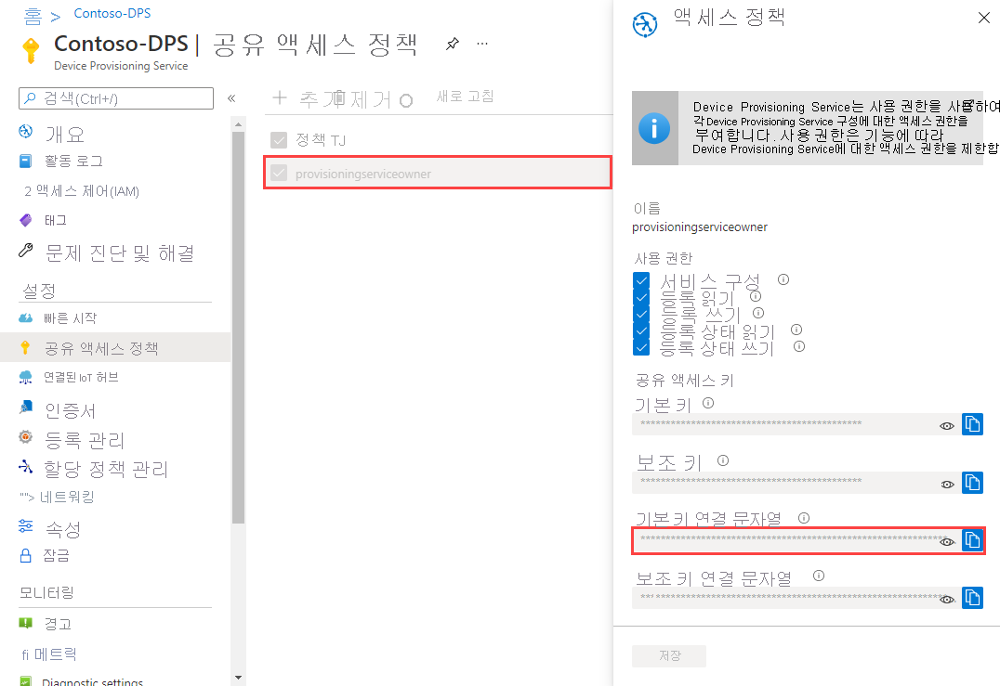
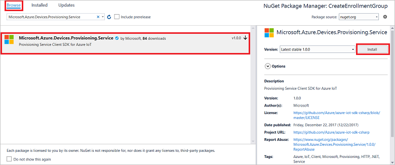
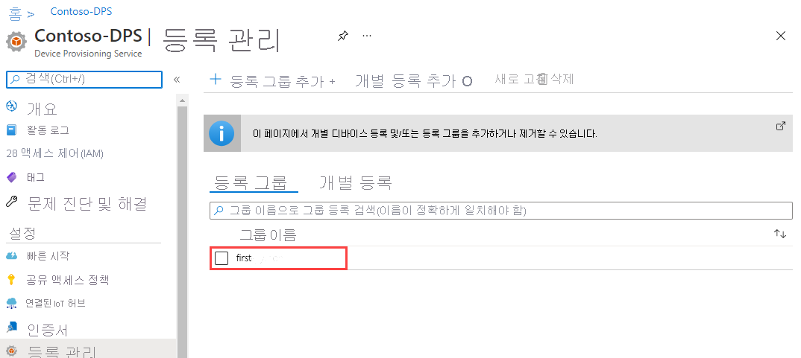

# <a name="quickstart-enroll-a-group-of-devices-to-the-device-provisioning-service-using-x509-certificate-attestation"></a>빠른 시작: X.509 인증서 증명을 사용하여 Device Provisioning Service에 디바이스 그룹 등록 

:::zone pivot="programming-language-csharp,programming-language-nodejs, programming-language-python"

이 빠른 시작에서는 중간 또는 루트 CA X.509 인증서를 사용하는 [등록 그룹](concepts-service.md#enrollment-group)을 프로그래밍 방식으로 만드는 방법을 보여줍니다. 등록 그룹은 [Microsoft Azure IoT SDK](../iot-hub/iot-hub-devguide-sdks.md) 및 샘플 애플리케이션을 사용하여 만듭니다. 등록 그룹은 해당 인증서 체인에 일반적인 서명 인증서를 공유하는 디바이스의 프로비전 서비스에 대한 액세스를 제어합니다. 자세히 알아보려면 [X.509 인증서를 사용하여 프로비전 서비스에 대한 디바이스 액세스 제어](./concepts-x509-attestation.md#controlling-device-access-to-the-provisioning-service-with-x509-certificates)를 참조하세요. Azure IoT Hub 및 Device Provisioning Service에서 X.509 인증서 기반 PKI(공개 키 인프라)를 사용하는 방법에 대한 자세한 내용은 [X.509 CA 인증서 보안 개요](../iot-hub/iot-hub-x509ca-overview.md)를 참조하세요.

:::zone-end

:::zone pivot="programming-language-java"

이 빠른 시작에서는 중간 또는 루트 CA X.509 인증서를 사용하는 [등록 그룹](concepts-service.md#enrollment-group) 및 개별 등록을 프로그래밍 방식으로 만드는 방법을 보여줍니다. 등록 그룹은 [Microsoft Azure IoT SDK](../iot-hub/iot-hub-devguide-sdks.md) 및 샘플 애플리케이션을 사용하여 만듭니다. 등록 그룹은 해당 인증서 체인에 일반적인 서명 인증서를 공유하는 디바이스의 프로비전 서비스에 대한 액세스를 제어합니다. 자세히 알아보려면 [X.509 인증서를 사용하여 프로비전 서비스에 대한 디바이스 액세스 제어](./concepts-x509-attestation.md#controlling-device-access-to-the-provisioning-service-with-x509-certificates)를 참조하세요. Azure IoT Hub 및 Device Provisioning Service에서 X.509 인증서 기반 PKI(공개 키 인프라)를 사용하는 방법에 대한 자세한 내용은 [X.509 CA 인증서 보안 개요](../iot-hub/iot-hub-x509ca-overview.md)를 참조하세요.

:::zone-end

## <a name="prerequisites"></a>필수 구성 요소

* Azure 구독이 아직 없는 경우 시작하기 전에 [체험 계정](https://azure.microsoft.com/free/?ref=microsoft.com&utm_source=microsoft.com&utm_medium=docs&utm_campaign=visualstudio)을 만듭니다.

* [Azure Portal에서 IoT Hub Device Provisioning Service 설정](./quick-setup-auto-provision.md)의 단계를 완료합니다.

:::zone pivot="programming-language-csharp"

* [Visual Studio 2019](https://www.visualstudio.com/vs/)를 설치합니다.

* Windows 기반 머신에 [.NET Core 3.1 SDK 이상](https://dotnet.microsoft.com/download)을 설치합니다. 다음 명령을 사용하여 버전을 확인할 수 있습니다.

    ```bash
    dotnet --info
    ```

:::zone-end

:::zone pivot="programming-language-nodejs"

* 머신에 [Node.js v4.0 이상](https://nodejs.org)을 설치합니다.

:::zone-end

:::zone pivot="programming-language-python"

* [Python 2.x 또는 3.x](https://www.python.org/downloads/)를 설치하고 Python을 플랫폼 관련 환경 변수에 추가합니다.

    > [!IMPORTANT]
    > 이 문서는 더 이상 사용되지 않는 V1 Python SDK에만 적용됩니다. IoT Hub Device Provisioning Service에 대한 디바이스 및 서비스 클라이언트는 아직 V2에서 사용할 수 없습니다. 이 팀은 현재 V2를 기능 패리티로 가져오기 위해 노력하고 있습니다.

* 아직 Pip가 Python 배포에 포함되지 않은 경우 [Pip](https://pip.pypa.io/en/stable/installing/)를 설치합니다.

:::zone-end

:::zone pivot="programming-language-java"

* [Java SE Development Kit 8](/azure/developer/java/fundamentals/java-support-on-azure). 이 빠른 시작에서는 아래 [Java 서비스 SDK](https://azure.github.io/azure-iot-sdk-java/master/service/)를 설치합니다. Windows와 Linux 모두에서 작동합니다. 이 빠른 시작에서는 Windows를 사용합니다.

* [Maven 3](https://maven.apache.org/download.cgi)

:::zone-end

* 최신 버전의 [Git](https://git-scm.com/download/)을 설치합니다. 명령 창에서 액세스할 수 있는 환경 변수에 Git이 추가되었는지 확인합니다. 설치할 `git` 도구의 최신 버전은 [Software Freedom Conservancy의 Git 클라이언트 도구](https://git-scm.com/download/)를 참조하세요. 여기에는 로컬 Git 리포지토리와 상호 작용하는 데 사용할 수 있는 명령줄 앱인 *Git Bash* 가 포함됩니다.

>[!NOTE]
>이 문서의 단계는 Windows 및 Linux 컴퓨터 모두에서 작동하지만, 이 문서에서는 Windows 개발 컴퓨터를 사용합니다.

## <a name="prepare-test-certificates"></a>테스트 인증서 준비

이 빠른 시작의 경우 중간 또는 루트 CA X.509 인증서의 공개 부분을 포함하는 *.pem* 또는 *.cer* 파일이 있어야 합니다. 이 인증서는 프로비전 서비스에 업로드되고 서비스에서 확인되어야 합니다.

:::zone pivot="programming-language-csharp,programming-language-nodejs, programming-language-python"

### <a name="clone-the-azure-iot-c-sdk"></a>Azure IoT C SDK를 복제합니다.

[Azure IoT C SDK](https://github.com/Azure/azure-iot-sdk-c)에는 X.509 인증서 체인을 만들고, 해당 체인에서 루트 또는 중간 인증서를 업로드하고, 인증서를 확인하기 위해 서비스를 통해 소유 증명을 수행하는 데 도움이 되는 테스트 도구가 포함되어 있습니다.

[Azure IoT C SDK](https://github.com/Azure/azure-iot-sdk-c) GitHub 리포지토리의 최신 릴리스를 이미 복제했으면 [다음 섹션](#create-the-test-certificate)으로 건너뜁니다.

1. 웹 브라우저를 열고 [Azure IoT C SDK의 릴리스 페이지](https://github.com/Azure/azure-iot-sdk-c/releases/latest)로 이동합니다.

2. Azure IoT C SDK 최신 릴리스의 태그 이름을 복사합니다.

3. 명령 프롬프트 또는 Git Bash 셸을 엽니다. 다음 명령을 실행하여 [Azure IoT C SDK](https://github.com/Azure/azure-iot-sdk-c) GitHub 리포지토리의 최신 릴리스를 복제합니다. (`<release-tag>`를 이전 단계에서 복사한 태그로 바꿉니다.)

    ```cmd/sh
    git clone -b <release-tag> https://github.com/Azure/azure-iot-sdk-c.git
    cd azure-iot-sdk-c
    git submodule update --init
    ```

    이 작업을 완료하는 데 몇 분 정도 걸릴 수 있습니다.

4. 테스트 도구는 복제한 리포지토리의 *azure-iot-sdk-c/tools/CACertificates* 에 있습니다.

:::zone-end

:::zone pivot="programming-language-java"

<a id="javasample"></a>

### <a name="clone-the-azure-iot-java-sdk"></a>Azure IoT Java SDK 복제

[Azure IoT Java SDK](https://github.com/Azure/azure-iot-sdk-java)에는 X.509 인증서 체인을 만들고, 해당 체인에서 루트 또는 중간 인증서를 업로드하고, 인증서를 확인하기 위해 서비스를 통해 소유 증명을 수행하는 데 도움이 되는 테스트 도구가 포함되어 있습니다.

1. 명령 프롬프트를 엽니다.

2. [Java 서비스 SDK](https://azure.github.io/azure-iot-sdk-java/master/service/)를 사용하여 디바이스 등록 코드 샘플에 대한 GitHub 리포지토리를 복제합니다.

    ```cmd\sh
    git clone https://github.com/Azure/azure-iot-sdk-java.git --recursive
    ```

:::zone-end

### <a name="create-the-test-certificate"></a>테스트 인증서 만들기

테스트 인증서를 만들려면 다음을 수행합니다.

:::zone pivot="programming-language-csharp,programming-language-nodejs, programming-language-python"

테스트 인증서를 만들려면 [샘플 및 자습서에 대한 테스트 CA 인증서 관리](https://github.com/Azure/azure-iot-sdk-c/blob/master/tools/CACertificates/CACertificateOverview.md)의 단계를 따릅니다.

>[!TIP]
>C SDK의 도구 이외에도 *Microsoft Azure IoT SDK for .NET* 의 [그룹 인증서 확인 샘플](https://github.com/Azure-Samples/azure-iot-samples-csharp/tree/master/provisioning/Samples/service/GroupCertificateVerificationSample)은 기존 X.509 중간 또는 루트 CA 인증서를 사용하여 C#에서 소유 증명을 수행하는 방법을 보여줍니다.

:::zone-end

:::zone pivot="programming-language-java"

1. 명령 창에서 *_azure-iot-sdk-java/provisioning/provisioning-tools/provisioning-x509-cert-generator_* 폴더로 이동합니다.

2. 도구를 빌드하려면 다음 명령을 실행합니다.

    ```cmd\sh
    mvn clean install
    ```

3. 도구를 실행하려면 다음 명령을 사용합니다.

    ```cmd\sh
    cd target
    java -jar ./provisioning-x509-cert-generator-{version}-with-deps.jar
    ```

4. 메시지가 표시되면 필요에 따라 인증서에 대해 _일반 이름_ 을 입력할 수 있습니다.

5. 이 도구는 *클라이언트 인증서*, *클라이언트 인증서 프라이빗 키* 및 *루트 인증서* 를 로컬로 생성합니다. 샘플 코드를 수정할 때 필요한 *루트 인증서* 를 복사합니다.

6. 명령 창을 닫거나 *확인 코드* 에 대한 메시지가 표시되면 **n** 을 입력합니다.

:::zone-end

### <a name="add-and-verify-your-test-certificate"></a>테스트 인증서 추가 및 확인

Device Provisioning Service에 인증서를 추가하고 확인하려면 다음을 수행합니다.

1. 인증서를 만든 후에는 [Azure Portal](https://portal.azure.com)에 로그인합니다.

2. 왼쪽 메뉴 또는 포털 페이지에서 **모든 리소스** 를 선택합니다.

3. 해당하는 Device Provisioning Service를 선택합니다.

4. **설정** 메뉴에서 **인증서* 를 선택합니다.

5. 위쪽 메뉴에서 **+ 추가:** 를 선택합니다.

6. 인증서 이름을 입력하고, 이전 섹션에서 만든 *.pem* 파일을 업로드합니다.

7. **업로드 시 인증서 상태를 확인하도록 설정** 을 선택합니다.

8. **저장** 을 선택합니다.

:::image type="content" source="./media/quick-enroll-device-x509/add-certificate.png" alt-text="확인용 인증서를 추가합니다.":::

## <a name="get-the-connection-string-for-your-provisioning-service"></a>프로비전 서비스에 대한 연결 문자열 가져오기

이 빠른 시작의 샘플에서는 프로비전 서비스의 연결 문자열을 복사해야 합니다.

1. [Azure Portal](https://portal.azure.com)에 로그인합니다.

2. 왼쪽 메뉴 또는 포털 페이지에서 **모든 리소스** 를 선택합니다.

3. 해당하는 Device Provisioning Service를 선택합니다.

4. **설정** 메뉴에서 **공유 액세스 정책** 을 선택합니다.

5. 사용하려는 액세스 정책을 선택합니다.

6. **액세스 정책** 패널에서 기본 키 연결 문자열을 복사하여 저장합니다.

    

## <a name="create-the-enrollment-group-sample"></a>등록 그룹 샘플 만들기

:::zone pivot="programming-language-csharp"

이 섹션에서는 등록 그룹을 프로비전 서비스에 추가하는 .NET Core 콘솔 애플리케이션을 만드는 방법을 보여줍니다.

>[!TIP]
>다음 단계를 약간 수정하여 실행하면 등록 그룹을 추가하는 [Windows IoT Core](https://developer.microsoft.com/en-us/windows/iot) 콘솔 애플리케이션을 만들 수 있습니다. IoT Core를 사용하여 개발하는 방법에 대해 자세히 알아보려면 [Windows IoT Core 개발자 설명서](/windows/iot-core/)를 참조하세요.

1. Visual Studio를 열고 **새 프로젝트 만들기** 를 선택합니다.

2. **새 프로젝트 만들기** 패널에서 **콘솔 애플리케이션* 을 선택합니다.

3. **새로 만들기** 를 선택합니다.

4. **프로젝트 이름** 으로 *CreateEnrollmentGroup* 을 입력합니다.

5. **다음** 을 선택합니다. 기본 **대상 프레임워크** 를 유지합니다.

6. **생성** 를 선택합니다.

7. 솔루션이 열리면 **솔루션 탐색기** 창에서 **CreateEnrollmentGroup** 프로젝트를 마우스 오른쪽 단추로 클릭한 다음, **NuGet 패키지 관리** 를 선택합니다.

8. **NuGet 패키지 관리자** 에서 **찾아보기** 를 선택합니다.

9. *Microsoft.Azure.Devices.Provisioning.Service* 를 입력하고 선택합니다.

10. **설치** 를 선택합니다.

    

    이 단계에서는 [Azure IoT 프로비저닝 서비스 클라이언트 SDK](https://www.nuget.org/packages/Microsoft.Azure.Devices.Provisioning.Service/) NuGet 패키지 및 해당 종속성에 대한 참조를 다운로드하고, 설치하고, 추가합니다.

11. `Program.cs` 맨 위에서 다른 `using` 문 뒤에 다음 `using` 문을 추가합니다.

    ```csharp
    using System.Security.Cryptography.X509Certificates;
    using System.Threading.Tasks;
    using Microsoft.Azure.Devices.Provisioning.Service;
    ```

12. `Program` 클래스에 다음 필드를 추가하고 나열된 변경 작업을 수행합니다.  

    ```csharp
    private static string ProvisioningConnectionString = "{ProvisioningServiceConnectionString}";
    private static string EnrollmentGroupId = "enrollmentgrouptest";
    private static string X509RootCertPath = @"{Path to a .cer or .pem file for a verified root CA or intermediate CA X.509 certificate}";
    ```

13. `ProvisioningServiceConnectionString` 자리 표시자 값을 이전 섹션에서 복사한 프로비전 서비스의 연결 문자열로 바꿉니다.

14. `X509RootCertPath` 자리 표시자 값을 .pem 또는 .cer 파일의 경로로 바꿉니다. 이 파일은 이전에 프로비저닝 서비스를 사용하여 업로드되고 확인된 중간 또는 루트 CA X.509 인증서의 공용 부분을 나타냅니다.

15. 필요에 따라 `EnrollmentGroupId` 값을 변경할 수 있습니다. 문자열에는 소문자 및 하이픈만 포함될 수 있습니다.

    > [!IMPORTANT]
    > 프로덕션 코드에서는 다음 보안 고려 사항을 고려해야 합니다.
    >
    > * 프로비전 서비스 관리자에 대한 연결 문자열을 하드 코딩하면 보안 모범 사례에 반합니다. 대신 연결 문자열은 보안 구성 파일 또는 레지스트리에서와 같이 안전하게 유지되어야 합니다.
    > * 서명 인증서의 공용 부분만 업로드해야 합니다. 프라이빗 키를 포함하는 .pfx(PKCS12) 또는 .pem 파일을 프로비전 서비스에 업로드하지 않습니다.

16. `Program` 클래스에 다음 메서드를 추가합니다. 이 코드는 등록 그룹 항목을 만든 다음, `ProvisioningServiceClient`에서 `CreateOrUpdateEnrollmentGroupAsync` 메서드를 호출하여 프로비저닝 서비스에 등록 그룹을 추가합니다.

    ```csharp
    public static async Task RunSample()
    {
        Console.WriteLine("Starting sample...");
    
        using (ProvisioningServiceClient provisioningServiceClient =
                ProvisioningServiceClient.CreateFromConnectionString(ProvisioningConnectionString))
        {
            #region Create a new enrollmentGroup config
            Console.WriteLine("\nCreating a new enrollmentGroup...");
            var certificate = new X509Certificate2(X509RootCertPath);
            Attestation attestation = X509Attestation.CreateFromRootCertificates(certificate);
            EnrollmentGroup enrollmentGroup =
                    new EnrollmentGroup(
                            EnrollmentGroupId,
                            attestation)
                    {
                        ProvisioningStatus = ProvisioningStatus.Enabled
                    };
            Console.WriteLine(enrollmentGroup);
            #endregion
    
            #region Create the enrollmentGroup
            Console.WriteLine("\nAdding new enrollmentGroup...");
            EnrollmentGroup enrollmentGroupResult =
                await provisioningServiceClient.CreateOrUpdateEnrollmentGroupAsync(enrollmentGroup).ConfigureAwait(false);
            Console.WriteLine("\nEnrollmentGroup created with success.");
            Console.WriteLine(enrollmentGroupResult);
            #endregion
    
        }
    }
    ```

17. 마지막으로 `Main` 메서드를 다음 줄로 바꿉니다.

    ```csharp
    static async Task Main(string[] args)
    {
        await RunSample();
        Console.WriteLine("\nHit <Enter> to exit ...");
        Console.ReadLine();
    }
    ```

18. 솔루션을 빌드합니다.

:::zone-end

:::zone pivot="programming-language-nodejs"

이 섹션에서는 등록 그룹을 프로비전 서비스에 추가하는 node.js 스크립트를 만드는 방법을 보여줍니다.

1. 작업 폴더의 명령 창에서 다음을 실행합니다.

     ```cmd\sh
     npm install azure-iot-provisioning-service
     ```  

2. 텍스트 편집기를 사용하여 작업 폴더에 **create_enrollment_group.js** 파일을 만듭니다. 다음 코드를 파일에 추가하고 저장합니다.

    ```javascript
        'use strict';
        var fs = require('fs');
    
        var provisioningServiceClient = require('azure-iot-provisioning-service').ProvisioningServiceClient;
    
        var serviceClient = provisioningServiceClient.fromConnectionString(process.argv[2]);
    
        var enrollment = {
          enrollmentGroupId: 'first',
          attestation: {
            type: 'x509',
            x509: {
              signingCertificates: {
                primary: {
                  certificate: fs.readFileSync(process.argv[3], 'utf-8').toString()
                }
              }
            }
          },
          provisioningStatus: 'disabled'
        };
    
        serviceClient.createOrUpdateEnrollmentGroup(enrollment, function(err, enrollmentResponse) {
          if (err) {
            console.log('error creating the group enrollment: ' + err);
          } else {
            console.log("enrollment record returned: " + JSON.stringify(enrollmentResponse, null, 2));
            enrollmentResponse.provisioningStatus = 'enabled';
            serviceClient.createOrUpdateEnrollmentGroup(enrollmentResponse, function(err, enrollmentResponse) {
              if (err) {
                console.log('error updating the group enrollment: ' + err);
              } else {
                console.log("updated enrollment record returned: " + JSON.stringify(enrollmentResponse, null, 2));
              }
            });
          }
        });
    ```

:::zone-end

:::zone pivot="programming-language-python"

이 섹션에서는 등록 그룹을 프로비전 서비스에 추가하는 Python 스크립트를 만드는 방법을 보여줍니다.

1. 텍스트 편집기를 사용하여 새 *EnrollmentGroup.py* 파일을 만듭니다.

2. 다음 Python 코드를 파일에 복사합니다. `{dpsConnectionString}`을 앞에서 복사한 연결 문자열로 바꾸고, 인증서 자리 표시자를 [테스트 인증서 준비](#prepare-test-certificates)에서 만든 인증서로 바꾸고, `{registrationid}`를 소문자 영숫자와 하이픈으로만 구성된 고유한 `registrationid`로 바꿔야 합니다.

    ```python
    from provisioningserviceclient import ProvisioningServiceClient
    from provisioningserviceclient.models import EnrollmentGroup, AttestationMechanism
    
    CONNECTION_STRING = "{dpsConnectionString}"
    
    SIGNING_CERT = """-----BEGIN CERTIFICATE-----
    XXXXXXXXXXXXXXXXXXXXXXXXXXXXXXXXXXXXXXXXXXXXXXXXXXXXXXXXXXXXXXXX
    XXXXXXXXXXXXXXXXXXXXXXXXXXXXXXXXXXXXXXXXXXXXXXXXXXXXXXXXXXXXXXXX
    XXXXXXXXXXXXXXXXXXXXXXXXXXXXXXXXXXXXXXXXXXXXXXXXXXXXXXXXXXXXXXXX
    XXXXXXXXXXXXXXXXXXXXXXXXXXXXXXXXXXXXXXXXXXXXXXXXXXXXXXXXXXXXXXXX
    XXXXXXXXXXXXXXXXXXXXXXXXXXXXXXXXXXXXXXXXXXXXXXXXXXXXXXXXXXXXXXXX
    XXXXXXXXXXXXXXXXXXXXXXXXXXXXXXXXXXXXXXXXXXXXXXXXXXXXXXXXXXXXXXXX
    XXXXXXXXXXXXXXXXXXXXXXXXXXXXXXXXXXXXXXXXXXXXXXXXXXXXXXXXXXXXXXXX
    XXXXXXXXXXXXXXXXXXXXXXXXXXXXXXXXXXXXXXXXXXXXXXXXXXXXXXXXXXXXXXXX
    XXXXXXXXXXXXXXXXXXXXXXXXXXXXXXXXXXXXXXXXXXXXXXXXXXXXXXXXXXXXXXXX
    XXXXXXXXXXXXXXXXXXXXXXXXXXXXXXXXXXXXXXXXXXXXXXXXXXXXXXXXXXXXXXXX
    XXXXXXXXXXXXXXXXXXXXXXXXXXXXXXXXXXXXXXXXXXXXXXXXXXXXXXXXXXXXXXXX
    XXXXXXXXXXXXXXXXXXXXXXXXXXXXXXXXXXXXXXXXXXXXXXXXXXXXXXXXXXXXXXXX
    XXXXXXXXXXXXXXXXXXXXXXXXXXXXXXXXXXXXXXXXXXXXXXXXXXXXXXXXXXXXXXXX
    XXXXXXXXXXXXXXXXXXXXXXXXXXXXXXXXXXXXXXXXXXXXXXXXXXXXXXXXXXXXXXXX
    XXXXXXXXXXXXXXXXXXXXXXXXXXXXXXXXXXXXXXXXXXXXXXXXXXXXXXXX
    -----END CERTIFICATE-----"""
    
    GROUP_ID = "{registrationid}"

    def main():
        print ( "Initiating enrollment group creation..." )

        psc = ProvisioningServiceClient.create_from_connection_string(CONNECTION_STRING)
        att = AttestationMechanism.create_with_x509_signing_certs(SIGNING_CERT)
        eg = EnrollmentGroup.create(GROUP_ID, att)

        eg = psc.create_or_update(eg)
    
        print ( "Enrollment group created." )

    if __name__ == '__main__':
        main()
    ```

3. **EnrollmentGroup.py** 파일을 저장하고 닫습니다.

:::zone-end

:::zone pivot="programming-language-java"

<a id="runjavasample"></a>

1. Azure IoT Java SDK에서 샘플 폴더 *_azure-iot-sdk-java/provisioning/provisioning-samples/service-enrollment-group-sample_* 로 이동합니다.

2. 원하는 편집기에서 *_/src/main/java/samples/com/microsoft/azure/sdk/iot/ServiceEnrollmentGroupSample.java_* 파일을 엽니다.

3. `[Provisioning Connection String]`을 [프로비전 서비스에 대한 연결 문자열 가져오기](#get-the-connection-string-for-your-provisioning-service)에서 복사한 연결 문자열로 바꿉니다.

4. `PUBLIC_KEY_CERTIFICATE_STRING` 값을 이전 섹션에서 생성한 *루트 인증서** 값으로 바꿉니다. **_-----BEGIN CERTIFICATE-----_** 및 **_-----END CERTIFICATE-----_** 줄을 포함한 전체 샘플 값을 바꿔야 합니다.

5. 샘플 코드 내에서 프로비전 서비스를 구성하려면 다음 단계를 진행합니다. 프로비전 서비스를 구성하지 않으려면 _ServiceEnrollmentGroupSample.java_ 파일에서 다음 명령문을 주석으로 처리하거나 삭제합니다.

    ```Java
    enrollmentGroup.setIotHubHostName(IOTHUB_HOST_NAME);                // Optional parameter.
    enrollmentGroup.setProvisioningStatus(ProvisioningStatus.ENABLED);  // Optional parameter.
    ```

6. 이 단계에서는 샘플 코드에서 프로비전 서비스를 구성하는 방법을 보여줍니다.

    1. [Azure Portal](https://portal.azure.com)로 이동합니다.

    2. 왼쪽 메뉴 또는 포털 페이지에서 **모든 리소스** 를 선택합니다.

    3. 해당하는 Device Provisioning Service를 선택합니다.

    4. **개요** 패널에서 *서비스 엔드포인트* 의 호스트 이름을 복사합니다.  소스 코드 샘플에서 `[Host name]`을 복사한 호스트 이름으로 바꿉니다.

        ```Java
        private static final String IOTHUB_HOST_NAME = "[Host name].azure-devices.net";
        ```

7. 샘플 코드를 조사합니다. X.509 디바이스에 대한 그룹 등록을 생성, 업데이트, 쿼리 및 삭제합니다. 포털에서 성공적으로 등록되었는지 확인하려면 _ServiceEnrollmentGroupSample.java_ 파일 끝에 다음 코드 줄을 일시적으로 주석 처리합니다.

    ```Java
    // ************************************** Delete info of enrollmentGroup ***************************************
    System.out.println("\nDelete the enrollmentGroup...");
    provisioningServiceClient.deleteEnrollmentGroup(enrollmentGroupId);
    ```

8. _ServiceEnrollmentGroupSample.java_ 파일을 저장합니다.

:::zone-end

## <a name="run-the-enrollment-group-sample"></a>등록 그룹 샘플 실행

:::zone pivot="programming-language-csharp"

1. Visual Studio에서 샘플을 실행하여 등록 그룹을 만듭니다. 명령 창이 나타나고, 확인 메시지가 표시됩니다.

2. 성공적으로 만들어지면 명령 창에 새 등록 그룹에 대한 속성이 표시됩니다.

:::zone-end

:::zone pivot="programming-language-nodejs"

1. 명령 프롬프트를 열고 다음 명령을 실행합니다. 명령 인수를 따옴표로 묶고, `<connection string>`을 이전 섹션에서 복사한 연결 문자열로 바꾸고, `<certificate .pem file>`을 `.pem` 파일의 경로로 바꿔야 합니다.

    ```cmd\sh
    node create_enrollment_group.js "<connection string>" "<certificate .pem file>"
    ```

2. 성공적으로 만들어지면 명령 창에 새 등록 그룹에 대한 속성이 표시됩니다.

:::zone-end

:::zone pivot="programming-language-python"

1. 명령 프롬프트를 관리자 모드로 열고, 다음 명령을 실행하여 [azure-iot-provisioning-device-client](https://pypi.org/project/azure-iot-provisioning-device-client)를 설치합니다.

    ```cmd/sh
    pip install azure-iothub-provisioningserviceclient    
    ```

2. 명령 프롬프트에서 스크립트를 실행합니다.

    ```cmd/sh
    python EnrollmentGroup.py
    ```

3. 성공적으로 만들어지면 명령 창에 새 등록 그룹에 대한 속성이 표시됩니다.

:::zone-end

:::zone pivot="programming-language-java"

1. 명령 창을 관리자 모드로 열고 *_azure-iot-sdk-java/provisioning/provisioning-samples/service-enrollment-group-sample_* 폴더로 이동합니다.

2. 명령 프롬프트에서 다음 명령을 사용합니다.

    ```cmd\sh
    mvn install -DskipTests
    ```

    이 명령은 [`com.microsoft.azure.sdk.iot.provisioning.service`](https://mvnrepository.com/artifact/com.microsoft.azure.sdk.iot.provisioning/provisioning-service-client) Maven 패키지를 컴퓨터에 다운로드합니다. 이 패키지에는 샘플 코드에서 빌드해야 하는 Java 서비스 SDK에 대한 이진 파일이 포함되어 있습니다. 이전 섹션에서 _X.509 인증서 생성기_ 도구를 실행한 경우 이 패키지는 이미 컴퓨터에 다운로드되어 있습니다.

3. 명령 프롬프트에서 스크립트를 실행합니다.

    ```cmd\sh
    cd target
    java -jar ./service-enrollment-group-sample-{version}-with-deps.jar
    ```

4. 성공적으로 만들어지면 명령 창에 새 등록 그룹에 대한 속성이 표시됩니다.

:::zone-end

등록 그룹이 만들어졌는지 확인하려면 다음을 수행합니다.

1. Azure Portal에서 Device Provisioning Service를 선택합니다.

2. **설정** 메뉴에서 **등록 관리** 를 선택합니다.

3. **등록 그룹** 을 선택합니다. 샘플에서 사용한 등록 ID에 해당하는 새 등록 항목이 표시됩니다.

:::zone pivot="programming-language-csharp"

:::image type="content" source="./media/quick-enroll-device-x509/verify-enrollment-csharp.png" alt-text="포털에서 C# 그룹의 등록을 확인합니다.":::

:::zone-end

:::zone pivot="programming-language-nodejs"



:::zone-end

:::zone pivot="programming-language-python"

:::image type="content" source="./media/quick-enroll-device-x509/verify-enrollment-python.png" alt-text="포털에서 Python 그룹의 등록을 확인합니다.":::

:::zone-end

:::zone pivot="programming-language-java"

:::image type="content" source="./media/quick-enroll-device-x509/verify-enrollment-java.png" alt-text="포털에서 Java 그룹의 등록을 확인합니다.":::

:::zone-end

:::zone pivot="programming-language-java"

## <a name="modifications-to-enroll-a-single-x509-device"></a>단일 X.509 디바이스 등록 수정

단일 X.509 디바이스를 등록하려면 다음과 같이 [Java 서비스 SDK를 사용하여 IoT Hub Device Provisioning Service에 TPM 디바이스 등록](quick-enroll-device-tpm.md)에서 사용된 *개별 등록* 샘플 코드를 수정합니다.

1. X.509 클라이언트 인증서의 *일반 이름* 을 클립보드에 복사합니다. [앞의 샘플 코드 섹션](#javasample)에서 표시한 대로 _X.509 인증서 생성기_ 도구를 사용하려면, 인증서에 대한 _일반 이름_ 을 입력하거나 기본 **microsoftriotcore** 를 사용합니다. 이 **일반 이름** 을 *REGISTRATION_ID* 변수의 값으로 사용합니다.

    ```Java
    // Use common name of your X.509 client certificate
    private static final String REGISTRATION_ID = "[RegistrationId]";
    ```

2. *TPM_ENDORSEMENT_KEY* 변수의 이름을 *PUBLIC_KEY_CERTIFICATE_STRING* 으로 바꿉니다. *PUBLIC_KEY_CERTIFICATE_STRING* 변수의 값으로 클라이언트 인증서 또는 _X.509 인증서 생성기_ 도구 출력의 **클라이언트 인증서** 를 복사합니다.

    ```Java
    // Rename the variable *TPM_ENDORSEMENT_KEY* as *PUBLIC_KEY_CERTIFICATE_STRING*
    private static final String PUBLIC_KEY_CERTIFICATE_STRING =
            "-----BEGIN CERTIFICATE-----\n" +
            "XXXXXXXXXXXXXXXXXXXXXXXXXXXXXXXXXXXXXXXXXXXXXXXXXXXXXXXXXXXXXXXX\n" +
            "XXXXXXXXXXXXXXXXXXXXXXXXXXXXXXXXXXXXXXXXXXXXXXXXXXXXXXXXXXXXXXXX\n" +
            "XXXXXXXXXXXXXXXXXXXXXXXXXXXXXXXXXXXXXXXXXXXXXXXXXXXXXXXXXXXXXXXX\n" +
            "XXXXXXXXXXXXXXXXXXXXXXXXXXXXXXXXXXXXXXXXXXXXXXXXXXXXXXXXXXXXXXXX\n" +
            "XXXXXXXXXXXXXXXXXXXXXXXXXXXXXXXXXXXXXXXXXXXXXXXXXXXXXXXXXXXXXXXX\n" +
            "XXXXXXXXXXXXXXXXXXXXXXXXXXXXXXXXXXXXXXXXXXXXXXXXXXXXXXXXXXXXXXXX\n" +
            "XXXXXXXXXXXXXXXXXXXXXXXXXXXXXXXXXXXXXXXXXXXXXXXXXXXXXXXXXXXXXXXX\n" +
            "XXXXXXXXXXXXXXXXXXXXXXXXXXXXXXXXXXXXXXXXXXXXXXXXXXXXXXXXXXXXXXXX\n" +
            "XXXXXXXXXXXXXXXXXXXXXXXXXXXXXXXXXXXXXXXXXXXXXXXXXXXXXXXXXXXXXXXX\n" +
            "XXXXXXXXXXXXXXXXXXXXXXXXXXXXXXXXXXXXXXXXXXXXXXXXXXXXXXXXXXXXXXXX\n" +
            "-----END CERTIFICATE-----\n";
    ```

3. X.509 클라이언트 인증서를 사용하려면 **main** 함수에서 `Attestation attestation = new TpmAttestation(TPM_ENDORSEMENT_KEY);` 줄을 다음과 같이 바꿉니다.

    ```Java
    Attestation attestation = X509Attestation.createFromClientCertificates(PUBLIC_KEY_CERTIFICATE_STRING);
    ```

4. [개별 등록 샘플 만들기](quick-enroll-device-tpm.md) 섹션의 단계를 사용하여 *개별 등록* 샘플 파일을 저장, 빌드 및 실행합니다.

:::zone-end

## <a name="clean-up-resources"></a>리소스 정리

[Azure IoT Hub Device Provisioning Service 자습서](./tutorial-set-up-cloud.md)를 살펴보려면 이 빠른 시작에서 만든 리소스를 정리하지 마세요. 그렇지 않으면 다음 단계를 사용하여 이 빠른 시작에서 만든 모든 리소스를 삭제합니다.

1. 컴퓨터에서 샘플 출력 창을 닫습니다.

2. Azure Portal의 왼쪽 메뉴에서 **모든 리소스** 를 선택합니다.

3. 해당하는 Device Provisioning Service를 선택합니다.

4. **설정** 메뉴에서 **등록 관리** 를 선택합니다.

5. **등록 그룹** 탭을 선택합니다.

6. 이 빠른 시작에서 등록한 디바이스의 *등록 ID* 옆에 있는 확인란을 선택합니다.

7. 페이지 위쪽에서 **삭제** 를 선택합니다.

8. Azure Portal의 Device Provisioning Service에서 **인증서** 를 선택합니다.

9. 이 빠른 시작을 진행하기 위해 업로드한 인증서를 선택합니다.

10. **인증서 세부 정보** 의 위쪽에서 **삭제** 를 선택합니다.  

## <a name="next-steps"></a>다음 단계

이 빠른 시작에서는 Azure IoT Hub Device Provisioning Service를 사용하여 X.509 중간 또는 루트 CA 인증서에 대한 등록 그룹을 만들었습니다. 디바이스 프로비전에 대해 자세히 알아보려면 Azure Portal에서 Device Provisioning Service 설치에 대한 자습서를 살펴보세요.

> [!div class="nextstepaction"]
> [Azure IoT Hub Device Provisioning Service 자습서](./tutorial-set-up-cloud.md)

:::zone pivot="programming-language-nodejs"

> [!div class="nextstepaction"]
>[Node.js 디바이스 프로비저닝 샘플](https://github.com/Azure/azure-iot-sdk-node/tree/master/provisioning/device/samples)

:::zone-end