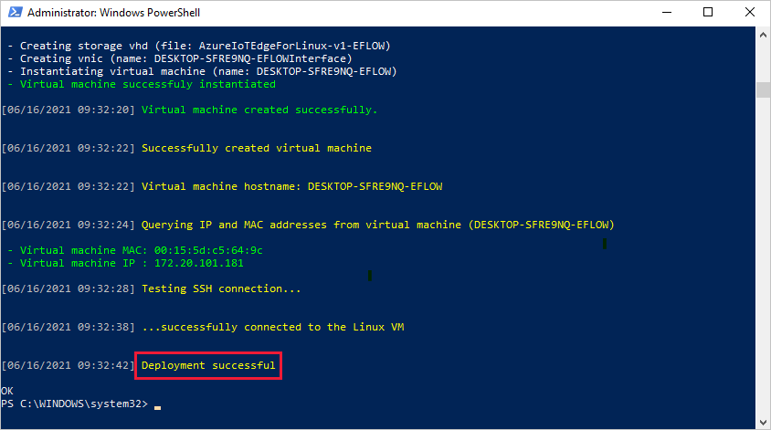

# <a name="install-and-provision-azure-iot-edge-for-linux-on-a-windows-device"></a>Windows 디바이스에서 Linux용 Azure IoT Edge 설치 및 프로비저닝

[!INCLUDE [iot-edge-version-201806](../../includes/iot-edge-version-201806.md)]

Azure IoT Edge 런타임은 디바이스를 IoT Edge 디바이스로 바꿔줍니다. 런타임은 PC 클래스에서 산업용 서버에 이르는 디바이스에 배포할 수 있습니다. 디바이스가 IoT Edge 런타임을 사용하여 구성되면 클라우드에서 디바이스에 비즈니스 논리를 배포할 수 있습니다. 자세한 내용은 [Azure IoT Edge 런타임 및 아키텍처 이해](iot-edge-runtime.md)를 참조하세요.

Azure IoT Edge for Linux on Windows를 사용하면 Windows 디바이스에서 실행되는 Linux 가상 머신에 IoT Edge를 설치할 수 있습니다. Linux 버전의 Azure IoT Edge 및 이와 함께 배포된 모든 Linux 모듈은 가상 머신에서 실행됩니다. 여기서는 Windows 애플리케이션 및 코드와 IoT Edge 런타임 및 모듈이 서로 자유롭게 상호 작용할 수 있습니다.

이 문서에는 Windows 디바이스에서 IoT Edge를 설정하는 단계가 나와 있습니다. 이러한 단계에서는 Windows 디바이스에서 실행할 IoT Edge 런타임이 포함된 Linux 가상 머신을 배포한 다음, 해당 IoT Hub 디바이스 ID를 사용하여 디바이스를 프로비전합니다.

>[!NOTE]
>Windows의 Linux용 IoT Edge는 Windows 환경에서 Azure IoT Edge를 사용하는 데 권장되는 환경입니다. 그러나 Windows 컨테이너는 계속 사용할 수 있습니다. Windows 컨테이너를 사용하려는 경우 [Windows 컨테이너로 Azure IoT Edge 설치 및 관리](how-to-install-iot-edge-windows-on-windows.md)를 참조하세요.

## <a name="prerequisites"></a>사전 요구 사항

* 유효한 구독이 있는 Azure 계정. [Azure 구독](../guides/developer/azure-developer-guide.md#understanding-accounts-subscriptions-and-billing)이 아직 없는 경우 시작하기 전에 [체험 계정](https://azure.microsoft.com/free/)을 만듭니다.

* Azure의 무료 또는 표준 계층 [IoT Hub](../iot-hub/iot-hub-create-through-portal.md).

* 다음과 같은 최소 시스템 요구 사항을 충족하는 Windows 디바이스:

  * Windows 10 버전 1809 이상, 빌드 17763 이상
  * Professional, Enterprise 또는 Server 버전
  * 사용 가능한 최소 메모리: 1GB
  * 사용 가능한 최소 디스크 공간: 10GB
  * 가상화 지원
    * Windows 10에서 Hyper-V를 사용하도록 설정합니다. 자세한 내용은 [Hyper-V를 Windows 10에 설치](/virtualization/hyper-v-on-windows/quick-start/enable-hyper-v)를 참조하세요.
    * Windows Server에서 Hyper-V 역할을 설치하고 기본 네트워크 스위치를 만듭니다. 자세한 내용은 [Azure IoT Edge for Linux on Windows의 중첩된 가상화](nested-virtualization.md)를 참조하세요.
    * 가상 머신에서 중첩 가상화를 구성합니다. 자세한 내용은 [중첩된 가상화](nested-virtualization.md)를 참조하세요.
  * 네트워킹 지원
      * Windows Server에는 기본 스위치가 없습니다. EFLOW를 Windows Server 디바이스에 배포하려면 먼저 가상 스위치를 만들어야 합니다.  자세한 내용은 [Windows에서 Linux용 가상 스위치 만들기](how-to-create-virtual-switch.md)를 참조하세요.
      * Windows 데스크톱 버전에는 EFLOW 설치에 사용할 수 있는 기본 스위치가 있습니다. 필요한 경우 고유한 사용자 지정 가상 스위치를 만들 수 있습니다.     

* Windows Admin Center를 사용하여 IoT Edge 디바이스를 설치 및 관리하려면 Windows Admin Center에 대한 액세스 권한이 있고 Azure IoT Edge 확장이 설치되어 있는지 확인합니다.

   1. [Windows Admin Center 설치 관리자](https://aka.ms/wacdownload)를 다운로드 및 실행합니다. 설치 마법사의 프롬프트에 따라 Windows Admin Center를 설치합니다.

   1. 설치되면 지원되는 브라우저를 사용하여 Windows Admin Center를 엽니다. 지원되는 브라우저에는 Microsoft Edge(Windows 10 버전 1709 이상), Google Chrome 및 Microsoft Edge Insider가 있습니다.

   1. Windows Admin Center를 처음 사용하는 경우 사용할 인증서를 선택하라는 메시지가 표시됩니다. 인증서로 **Windows Admin Center 클라이언트** 를 선택합니다.

   1. Azure IoT Edge 확장을 설치합니다. Windows Admin Center 대시보드의 오른쪽 위에서 기어 아이콘을 선택합니다.

      

   1. **설정** 메뉴의 **게이트웨이** 아래에서 **확장** 을 선택합니다.

   1. **사용 가능한 확장** 탭의 확장 목록에서 **Azure IoT Edge** 를 찾습니다. 이를 선택하고, 확장 목록 위의 **설치** 프롬프트를 선택합니다.

   1. 설치가 완료되면 **설치된 확장** 탭의 설치된 확장 목록에 Azure IoT Edge가 표시됩니다.

* Windows 배포의 Linux용 Azure IoT Edge에서 **GPU 가속 Linux 모듈** 을 사용하려는 경우 고려해야 할 몇 가지 구성 옵션이 있습니다. GPU 아키텍처에 따라 올바른 드라이버를 설치해야 하며 Windows 참가자 프로그램 빌드에 액세스해야 할 수도 있습니다. 구성 요구 사항을 확인하고 이러한 필수 조건을 충족하려면 [Windows의 Linux용 Azure IoT Edge에 대한 GPU 가속](gpu-acceleration.md)을 참조하세요.

## <a name="choose-your-provisioning-method"></a>프로비전 방법 선택

Azure IoT Edge for Linux on Windows에서 지원하는 프로비전 방법은 다음과 같습니다.

* 단일 디바이스에 대한 **수동 프로비저닝**.

  * 수동 프로비저닝을 준비하려면 [IoT Hub에 IoT Edge 디바이스 등록](how-to-register-device.md)의 단계를 따르세요. 대칭 키 인증 또는 X.509 인증서 인증을 선택한 다음 이 문서로 돌아와 IoT Edge를 설치 및 프로비저닝합니다.

* 하나 이상의 디바이스에 대해 IoT Hub DPS(디바이스 프로비저닝 서비스)를 사용하여 **자동 프로비저닝** 합니다.

  * 사용하려는 인증 방법을 선택한 다음 해당 문서의 단계에 따라 DPS 인스턴스를 설정하고 등록을 만들어 디바이스를 프로비저닝합니다. 등록 유형에 대한 자세한 내용은 [Azure IoT Hub Device Provisioning Service 개념](../iot-dps/concepts-service.md#enrollment)을 참조하세요.

    * [DPS 및 대칭 키로 IoT Edge 디바이스를 프로비저닝합니다.](how-to-provision-devices-at-scale-linux-on-windows-symmetric.md)
    * [DPS 및 X.509 인증서로 IoT Edge 디바이스를 프로비저닝합니다.](how-to-provision-devices-at-scale-linux-on-windows-x509.md)
    * [DPS 및 TPM 증명으로 IoT Edge 디바이스를 프로비저닝합니다.](how-to-auto-provision-tpm-linux-on-windows.md)

## <a name="create-a-new-deployment"></a>새 배포 만들기

대상 디바이스에 Windows의 Linux용 Azure IoT Edge를 배포합니다.

# <a name="powershell"></a>[PowerShell](#tab/powershell)

아직 설치되지 않은 경우 IoT Edge for Linux on Windows를 대상 디바이스에 설치합니다.

> [!NOTE]
> 다음 PowerShell 프로세스에서는 Windows의 Linux용 IoT Edge를 로컬 디바이스에 배포하는 방법을 간략하게 설명합니다. PowerShell을 사용하여 원격 대상 디바이스에 배포하려면 [원격 PowerShell](/powershell/module/microsoft.powershell.core/about/about_remote)을 사용하여 원격 디바이스에 대한 연결을 설정하고 해당 디바이스에서 이러한 명령을 원격으로 실행합니다.

1. 관리자 권한 PowerShell 세션에서 다음 명령을 각각 실행하여 IoT Edge for Linux on Windows를 다운로드합니다.

   ```powershell
   $msiPath = $([io.Path]::Combine($env:TEMP, 'AzureIoTEdge.msi'))
   $ProgressPreference = 'SilentlyContinue'
   Invoke-WebRequest "https://aka.ms/AzEflowMSI" -OutFile $msiPath
   ```

1. IoT Edge for Linux on Windows를 디바이스에 설치합니다.

   ```powershell
   Start-Process -Wait msiexec -ArgumentList "/i","$([io.Path]::Combine($env:TEMP, 'AzureIoTEdge.msi'))","/qn"
   ```

   설치 명령에 `INSTALLDIR="<FULLY_QUALIFIED_PATH>"` 및 `VHDXDIR="<FULLY_QUALIFIED_PATH>"` 매개 변수를 추가하여 Windows의 Linux 설치 및 VHDX 디렉터리용 사용자 지정 IoT Edge를 지정할 수 있습니다.

1. 대상 디바이스의 실행 정책이 아직 설정되지 않은 경우 `AllSigned`로 설정합니다. 다음을 사용하여 관리자 권한 PowerShell 프롬프트에서 현재 실행 정책을 확인할 수 있습니다.

   ```powershell
   Get-ExecutionPolicy -List
   ```

   `local machine`의 실행 정책이 `AllSigned`가 아닌 경우 다음을 사용하여 실행 정책을 설정할 수 있습니다.

   ```powershell
   Set-ExecutionPolicy -ExecutionPolicy AllSigned -Force
   ```

1. IoT Edge for Linux on Windows 배포를 만듭니다.

   ```powershell
   Deploy-Eflow
   ```

   >[!TIP]
   >기본적으로 `Deploy-Eflow` 명령은 RAM 1GB, vCPU 코어 1개, 디스크 공간 16GB를 사용하여 Linux 가상 머신을 만듭니다. 그러나 VM에 필요한 리소스는 배포하는 워크로드에 따라 달라집니다. 워크로드를 지원하기에 충분 한 메모리가 없는 VM은 시작되지 않습니다.
   >
   >`Deploy-Eflow` 명령의 선택적 매개 변수를 사용하여 가상 컴퓨터의 사용 가능한 리소스를 사용자 지정할 수 있습니다.
   >
   >예를 들어, 아래 명령은 vCPU 코어 4개, RAM 4GB, 디스크 공간 20GB의 가상 머신을 만듭니다.
   >
   >   ```powershell
   >   Deploy-Eflow -cpuCount 4 -memoryInMB 4096 -vmDiskSize 20
   >   ```
   >
   >사용 가능한 모든 선택적 매개 변수에 대한 자세한 내용은 [Windows의 Linux용 IoT Edge용 PowerShell 함수](reference-iot-edge-for-linux-on-windows-functions.md#deploy-eflow)를 참조하세요.

   배포에 GPU를 할당하여 GPU 가속 Linux 모듈을 사용하도록 설정할 수 있습니다. 이러한 기능에 액세스하려면 [Windows의 Linux용 Azure IoT Edge용 GPU 가속](gpu-acceleration.md)에 설명된 필수 구성 요소를 설치해야 합니다.

   GPU 통과를 사용하려면 `Deploy-Eflow` 명령에 **gpuName**, **gpuPassthroughType** 및 **gpuCount** 매개 변수를 추가해야 합니다. 사용 가능한 모든 선택적 매개 변수에 대한 자세한 내용은 [Windows의 Linux용 IoT Edge용 PowerShell 함수](reference-iot-edge-for-linux-on-windows-functions.md#deploy-eflow)를 참조하세요.

   >[!WARNING]
   >하드웨어 디바이스 통과를 사용하도록 설정하면 보안 위험이 증가할 수 있습니다. Microsoft는 해당되는 경우 GPU 공급업체의 디바이스 완화 드라이버를 권장합니다. 자세한 내용은 [개별 디바이스 할당을 사용하여 그래픽 디바이스 배포](/windows-server/virtualization/hyper-v/deploy/deploying-graphics-devices-using-dda)를 참조하세요.

1. 'Y'를 입력하여 사용 조건에 동의합니다.

1. 기본 설정에 따라 'O' 또는 'R'을 입력하여 **선택적 진단 데이터** 를 설정하거나 해제합니다.

1. 배포가 완료되면 PowerShell 창에 **배포 성공** 이 보고됩니다.

   

배포가 완료되면 디바이스를 프로비전할 준비가 되었습니다.

# <a name="windows-admin-center"></a>[Windows Admin Center](#tab/windowsadmincenter)

>[!NOTE]
>Windows Admin Center용 Azure IoT Edge 확장은 현재 [공개 미리 보기](https://azure.microsoft.com/support/legal/preview-supplemental-terms/)입니다. 설치 및 관리 프로세스는 일반적으로 사용할 수 있는 기능과 다를 수 있습니다.

Windows Admin Center 시작 페이지의 연결 목록 아래에는 Windows Admin Center를 실행하는 PC를 나타내는 로컬 호스트 연결이 표시됩니다. 관리하는 추가 서버, PC 또는 클러스터도 여기에 표시됩니다.

Windows Admin Center를 사용하여 Azure IoT Edge for Linux on Windows를 로컬 디바이스 또는 원격 관리 디바이스에 설치하고 관리할 수 있습니다. 이 가이드에서 로컬 호스트 연결은 Azure IoT Edge for Linux on Windows를 배포하기 위한 대상 디바이스 역할을 수행합니다.

로컬 디바이스 대신 원격 대상 디바이스에 배포하려고 하고 목록에 원하는 대상 디바이스가 표시되지 않으면 [지침에 따라 디바이스를 추가](/windows-server/manage/windows-admin-center/use/get-started#connecting-to-managed-nodes-and-clusters)합니다.

   

1. **추가** 를 선택합니다.

1. **리소스 추가 또는 만들기** 창에서 **Azure IoT Edge** 타일을 찾습니다. **새로 만들기** 를 선택하여 새 Azure IoT Edge for Linux on Windows 인스턴스를 디바이스에 설치합니다.

   디바이스에서 실행되는 IoT Edge for Linux on Windows가 이미 있는 경우 **추가** 를 선택하여 기존 IoT Edge 디바이스에 연결하고 Windows Admin Center에서 해당 디바이스를 관리할 수 있습니다.

   

1. **Azure IoT Edge for Linux on Windows 배포 만들기** 창이 열립니다. **1. 시작하기** 탭에서 최소 요구 사항을 검토하고 **다음** 을 선택합니다.

1. 사용 조건을 검토하고, **동의함** 을 선택하고, **다음** 을 선택합니다.

1. 기본 설정에 따라 **선택적 진단 데이터** 를 설정하거나 해제할 수 있습니다.

1. **다음: 배포** 를 선택합니다.

   

1. **2. 배포** 탭의 **대상 디바이스 선택** 아래에서 나열된 디바이스를 클릭하여 최소 요구 사항을 충족하는지 확인합니다. 상태가 '지원됨'으로 확인되면 **다음** 을 선택합니다.

   

1. **2.2 설정** 탭에서 배포의 구성 설정을 검토합니다.

   >[!NOTE]
   >Windows의 Linux용 IoT Edge는 Linux 가상 머신에 내부 IP 주소를 할당하는 기본 스위치를 사용합니다. 이 내부 IP 주소는 Windows 시스템 외부에서 연결할 수 없습니다. Windows 컴퓨터에 로그온한 상태에서 가상 컴퓨터에 로컬로 연결할 수 있습니다.
   >
   >Windows Server를 사용하는 경우 Windows에서 Linux용 IoT Edge를 배포하기 전에 기본 스위치를 설정합니다.

   배포에 GPU를 할당하여 GPU 가속 Linux 모듈을 사용하도록 설정할 수 있습니다. 이러한 기능에 액세스하려면 [Windows의 Linux용 Azure IoT Edge용 GPU 가속](gpu-acceleration.md)에 설명된 필수 구성 요소를 설치해야 합니다. 배포 프로세스의 이 시점에서 이러한 필수 구성 요소만 설치하는 경우 처음부터 다시 시작해야 합니다.

   배포에 할당하는 GPU 어댑터에 따라 사용 가능한 GPU 통과에는 **DDA(직접 디바이스 할당)** 및 **GPU-PV(GPU 반가상화)** 의 두 가지 옵션이 있습니다. 각 방법의 예는 다음과 같습니다.

   직접 디바이스 할당 방법의 경우 Linux 가상 머신에 할당할 GPU 프로세서 수를 선택합니다.

   

   반가상화 방법의 경우 추가 설정이 필요하지 않습니다.

   

   >[!WARNING]
   >하드웨어 디바이스 통과를 사용하도록 설정하면 보안 위험이 증가할 수 있습니다. Microsoft는 해당되는 경우 GPU 공급업체의 디바이스 완화 드라이버를 권장합니다. 자세한 내용은 [개별 디바이스 할당을 사용하여 그래픽 디바이스 배포](/windows-server/virtualization/hyper-v/deploy/deploying-graphics-devices-using-dda)를 참조하세요.

   설정에 만족하면 **다음** 을 선택합니다.

1. **2.3 배포** 탭에서 배포 상황을 확인할 수 있습니다. 전체 프로세스에는 Azure IoT Edge for Linux on Windows 패키지 다운로드, 패키지 설치, 호스트 디바이스 구성 및 Linux 가상 머신 설정이 포함됩니다. 이 프로세스를 완료하는 데 몇 분이 걸릴 수 있습니다. 성공적인 배포는 다음과 같습니다.

   

배포가 완료되면 디바이스를 프로비전할 준비가 되었습니다. **다음: 연결** 을 선택하여 Azure IoT Edge 디바이스 프로비전을 처리하는 **3. 연결** 탭으로 이동합니다.

---

## <a name="provision-your-device"></a>디바이스 프로비전

디바이스를 프로비전하는 방법을 선택하고 해당 섹션의 지침을 따릅니다. 이 문서에서는 대칭 키 또는 X.509 인증서를 사용하여 디바이스를 수동으로 프로비저닝하는 단계를 제공합니다. DPS와 함께 자동 프로비저닝을 사용하는 경우 해당 링크를 따라 프로비저닝을 완료합니다.

Windows Admin Center 또는 관리자 권한 PowerShell 세션을 사용하여 디바이스를 프로비전할 수 있습니다.

* 수동 프로비저닝:

  * [IoT Edge 디바이스의 연결 문자열을 사용하여 수동 프로비저닝](#manual-provisioning-using-the-connection-string)
  * [X.509 인증서를 사용한 수동 프로비저닝](#manual-provisioning-using-x509-certificates)

* 자동 프로비저닝:

  * [DPS(Device Provisioning Service) 및 대칭 키를 사용하여 자동 프로비저닝](how-to-provision-devices-at-scale-linux-on-windows-symmetric.md#configure-the-device-with-provisioning-information)
  * [DPS 및 X.509 인증서를 사용하여 자동 프로비저닝](how-to-provision-devices-at-scale-linux-on-windows-x509.md#configure-the-device-with-provisioning-information)
  * [DPS 및 TPM 증명을 사용한 자동 프로비저닝](how-to-auto-provision-tpm-linux-on-windows.md#configure-the-device-with-provisioning-information)

### <a name="manual-provisioning-using-the-connection-string"></a>연결 문자열을 사용한 수동 프로비저닝

이 섹션에서는 IoT Edge 디바이스의 연결 문자열을 사용하여 디바이스를 수동으로 프로비저닝하는 방법에 대해 설명합니다.

아직 없는 경우 [IoT Hub의 IoT Edge 디바이스 등록](how-to-register-device.md)의 단계를 따라 디바이스를 등록하고 해당 연결 문자열을 검색합니다.

# <a name="powershell"></a>[PowerShell](#tab/powershell)

대상 디바이스의 관리자 권한 PowerShell 세션에서 다음 명령을 실행합니다. 자리 표시자 텍스트를 고유한 값으로 바꿉니다.

```powershell
Provision-EflowVm -provisioningType ManualConnectionString -devConnString "<CONNECTION_STRING_HERE>"
```

`Provision-EflowVM` 명령에 대한 자세한 내용은 [Windows의 Linux용 IoT Edge용 PowerShell 함수](reference-iot-edge-for-linux-on-windows-functions.md#provision-eflowvm)를 참조하세요.

# <a name="windows-admin-center"></a>[Windows Admin Center](#tab/windowsadmincenter)

1. **Azure IoT Edge 디바이스 프로비전** 창의 프로비전 방법 드롭다운에서 **연결 문자열(수동)** 을 선택합니다.

1. [Azure Portal](https://ms.portal.azure.com/)에서 IoT Hub의 **IoT Edge** 탭으로 이동합니다.

1. 디바이스의 디바이스 ID를 클릭합니다. **기본 연결 문자열** 필드를 복사합니다.

1. 디바이스를 등록한 후 IoT Hub에서 검색한 **디바이스 연결 문자열** 을 제공합니다.

1. **선택한 방법으로 프로비저닝** 을 선택합니다.

   

1. 프로비전이 완료되면 **마침** 을 선택합니다. 기본 대시보드로 돌아갑니다. 이제 유형이 `IoT Edge Devices`인 새 디바이스가 표시됩니다. 연결할 IoT Edge 디바이스를 선택할 수 있습니다. **개요** 페이지에서 디바이스의 **IoT Edge 모듈 목록** 및 **IoT Edge 상태** 가 표시됩니다.

---

### <a name="manual-provisioning-using-x509-certificates"></a>X.509 인증서를 사용한 수동 프로비저닝

이 섹션에서는 IoT Edge 디바이스에서 X.509 인증서를 사용하여 수동으로 디바이스를 프로비저닝하는 방법을 다룹니다.

아직 등록하지 않은 경우 [IoT Hub에 IoT Edge 디바이스 등록](how-to-register-device.md) 단계에 따라 필요한 인증서를 준비하고 디바이스를 등록합니다. 

# <a name="powershell"></a>[PowerShell](#tab/powershell)

대상 디바이스에서 디바이스 ID 인증서와 일치하는 프라이빗 키를 준비합니다. 두 파일의 절대 경로를 알고 있습니다.

대상 디바이스의 관리자 권한 PowerShell 세션에서 다음 명령을 실행합니다. 자리 표시자 텍스트를 고유한 값으로 바꿉니다.

```powershell
Provision-EflowVm -provisioningType ManualX509 -iotHubHostname "<HUB HOSTNAME>" -deviceId "<DEVICE ID>" -identityCertPath "<ABSOLUTE PATH TO IDENTITY CERT>" -identityPrivKeyPath "<ABSOLUTE PATH TO PRIVATE KEY>"
```

`Provision-EflowVM` 명령에 대한 자세한 내용은 [Windows의 Linux용 IoT Edge용 PowerShell 함수](reference-iot-edge-for-linux-on-windows-functions.md#provision-eflowvm)를 참조하세요.

# <a name="windows-admin-center"></a>[Windows Admin Center](#tab/windowsadmincenter)

1. **Azure IoT Edge 디바이스 프로비저닝** 창의 프로비저닝 방법 드롭다운에서 **ManualX509** 를 선택합니다.

   

1. 필수 매개 변수를 제공합니다.

   * **IoT Hub 호스트 이름**: 이 디바이스가 등록된 IoT Hub의 이름입니다.
   * **디바이스 ID**: 이 디바이스가 등록된 이름입니다.
   * **인증서 파일**: 디바이스 ID 인증서를 업로드합니다. 이 인증서는 가상 머신으로 이동되어 디바이스를 프로비저닝하는 데 사용됩니다.
   * **프라이빗 키 파일**: 일치하는 프라이빗 키 파일을 업로드합니다. 이 파일은 가상 머신으로 이동되어 디바이스를 프로비저닝하는 데 사용됩니다.

1. **선택한 방법으로 프로비저닝** 을 선택합니다.

1. 프로비전이 완료되면 **마침** 을 선택합니다. 기본 대시보드로 돌아갑니다. 이제 유형이 `IoT Edge Devices`인 새 디바이스가 표시됩니다. 연결할 IoT Edge 디바이스를 선택할 수 있습니다. **개요** 페이지에서 디바이스의 **IoT Edge 모듈 목록** 및 **IoT Edge 상태** 가 표시됩니다.

---

## <a name="verify-successful-configuration"></a>성공적인 구성 확인

IoT Edge for Linux on Windows가 IoT Edge 디바이스에 성공적으로 설치되고 구성되었는지 확인합니다.

# <a name="powershell"></a>[PowerShell](#tab/powershell)

> [!IMPORTANT]
> Windows PowerShell 공개 기능에서 Linux용 IoT Edge를 사용하는 경우 대상 디바이스의 실행 정책을 `AllSigned`로 설정해야 합니다. [Windows의 Linux용 IoT Edge에 대한 PowerShell 함수](reference-iot-edge-for-linux-on-windows-functions.md)에 대한 모든 필수 구성 요소가 충족되는지 확인합니다.

1. PowerShell 세션에서 다음 명령을 사용하여 IoT Edge for Linux on Windows 가상 머신에 로그인합니다.

   ```powershell
   Connect-EflowVm
   ```

   >[!NOTE]
   >SSH를 가상 머신에 허용하는 유일한 계정은 가상 머신을 만든 사용자입니다.

1. 로그인하면 다음 Linux 명령을 사용하여 실행되는 IoT Edge 모듈의 목록을 확인할 수 있습니다.

   ```bash
   sudo iotedge list
   ```

1. IoT Edge 서비스 문제를 해결해야 하는 경우 다음 Linux 명령을 사용합니다.

    1. 서비스 문제를 해결해야 할 경우 서비스 로그를 검색합니다.

       ```bash
       sudo journalctl -u iotedge
       ```

    2. `check` 도구를 사용하여 디바이스의 구성 및 연결 상태를 확인합니다.

       ```bash
       sudo iotedge check
       ```

# <a name="windows-admin-center"></a>[Windows Admin Center](#tab/windowsadmincenter)

1. Windows Admin Center의 연결된 디바이스 목록에서 IoT Edge 디바이스를 선택하여 연결합니다.

1. 디바이스 개요 페이지에는 디바이스에 대한 몇 가지 정보가 표시됩니다.

   * **IoT Edge 모듈 목록** 섹션에는 디바이스에서 실행되는 모듈이 표시됩니다. IoT Edge 서비스가 처음 시작되면 **edgeAgent** 모듈만 실행되는 것으로 표시됩니다. edgeAgent 모듈은 기본적으로 실행되며, 디바이스에 배포하는 추가 모듈을 설치하고 시작하는 데 도움이 됩니다.

   * **IoT Edge 상태** 섹션에는 서비스 상태가 표시되며 **활성(실행 중)** 이 보고됩니다.

---

새 IoT Edge 디바이스를 만들면 Azure Portal에 상태 코드 `417 -- The device's deployment configuration is not set`이 표시됩니다. 이 상태는 정상이며 디바이스가 모듈 배포를 수신할 준비가 되었음을 의미합니다.

## <a name="next-steps"></a>다음 단계

* 디바이스에 모듈을 배포하는 방법을 알아보려면 [IoT Edge 모듈 배포](how-to-deploy-modules-portal.md)를 계속 진행하세요.
* [IoT Edge for Linux on Windows 가상 머신에서 인증서를 관리](how-to-manage-device-certificates.md)하고 파일을 호스트 OS에서 Linux 가상 머신으로 전송하는 방법을 알아봅니다.
* [프록시 서버를 통해 통신하도록 IoT Edge 디바이스를 구성](how-to-configure-proxy-support.md)하는 방법을 알아봅니다.
