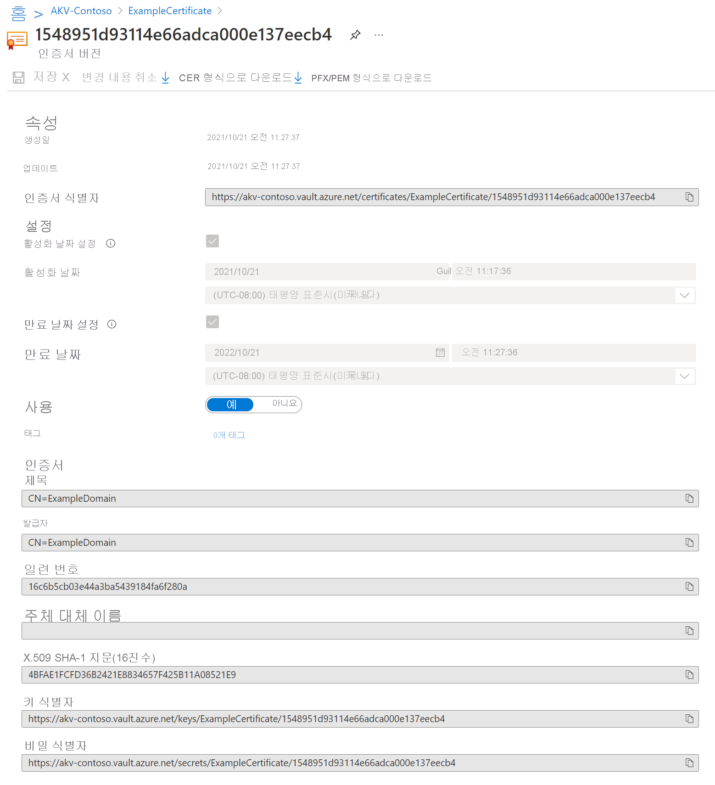
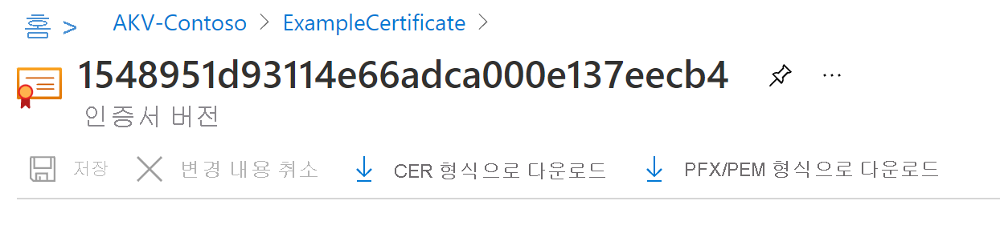

# 빠른 시작: Azure Portal을 사용하여 Azure Key Vault에서 인증서 설정 및 검색

Azure Key Vault는 보안 비밀 저장소를 제공하는 클라우드 서비스입니다. 키, 암호, 인증서 및 기타 비밀을 안전하게 저장할 수 있습니다. Azure Portal을 통해 Azure Key Vault를 만들고 관리할 수 있습니다. 이 빠른 시작에서는 Key Vault를 만든 다음, 인증서를 저장하는 데 사용합니다. Key Vault에 대한 자세한 내용을 보려면 [개요](../general/overview.md)를 검토합니다.

## 사전 요구 사항

Azure Key Vault에 액세스하려면 Azure 구독이 필요합니다. 구독이 아직 없는 경우 시작하기 전에 [체험 계정](https://azure.microsoft.com/free/?WT.mc_id=A261C142F)을 만듭니다.

비밀에 대한 모든 액세스는 Azure Key Vault를 통해 수행됩니다. 이 빠른 시작에서는 [Azure Portal](../general/quick-create-portal.md), [Azure CLI](../general/quick-create-cli.md) 또는 [Azure PowerShell](../general/quick-create-powershell.md)을 사용하여 키 자격 증명 모음을 만듭니다.

## Azure에 로그인

[https://portal.azure.com](https://portal.azure.com ) 에서 Azure Portal에 로그인합니다.

## Key Vault에 인증서 추가

자격 증명 모음에 인증서를 추가하려면 몇 가지 추가 단계만 수행하면 됩니다. 이 경우 애플리케이션에서 사용할 수 있는 자체 서명된 인증서를 추가합니다. 인증서는 **ExampleCertificate** 라고 합니다.

1. Key Vault 속성 페이지에서 **인증서** 를 선택합니다.
2. **생성/가져오기** 를 클릭합니다.
3. **인증서 만들기** 화면에서 다음 값을 선택합니다.
    - **인증서를 만드는 방법**: Generate.
    - **인증서 이름**: ExampleCertificate.
    - **주체**: CN=ExampleDomain
    - 다른 값은 기본값으로 그대로 둡니다. (기본적으로 고급 정책에서 특수 항목을 지정하지 않으면 클라이언트 인증 인증서로 사용할 수 있습니다.)
 4. **만들기** 를 클릭합니다.

인증서가 성공적으로 생성되었다는 메시지가 표시되면 목록에서 클릭할 수 있습니다. 그런 다음, 속성 중 일부를 볼 수 있습니다. 현재 버전을 클릭하면 이전 단계에서 지정한 값을 볼 수 있습니다.

## Key Vault에서 인증서 내보내기

"CER 형식으로 다운로드" 또는 "PFX/PEM 형식으로 다운로드" 단추를 클릭하면 인증서를 다운로드할 수 있습니다. 

## 리소스 정리

다른 Key Vault 빠른 시작과 자습서는 이 빠른 시작을 기반으로 빌드됩니다. 이후의 빠른 시작 및 자습서를 계속 진행하려는 경우 이러한 리소스를 유지하는 것이 좋습니다.
더 이상 필요 없으면 리소스 그룹을 삭제하고 Key Vault 및 관련 리소스를 삭제합니다. 포털을 통해 리소스 그룹을 삭제하려면:

1. 포털 맨 위에 있는 검색 상자에 리소스 그룹의 이름을 입력합니다. 검색 결과에 이 빠른 시작에서 사용된 리소스 그룹이 표시되면 선택합니다.
2. **리소스 그룹 삭제** 를 선택합니다.
3. **리소스 그룹 이름 입력** 상자에 리소스 그룹 이름을 입력하고 **삭제** 를 선택합니다.

## 다음 단계

이 빠른 시작에서는 Key Vault를 만들어 인증서를 저장했습니다. Key Vault 및 이를 애플리케이션과 통합하는 방법에 대해 자세히 알아보려면 아래 문서로 계속 진행하세요.

- [Azure Key Vault 개요](../general/overview.md) 참조
- [Azure Key Vault 개발자 가이드](../general/developers-guide.md) 참조
- [Azure Key Vault 보안 개요](../general/security-features.md)를 검토하세요.
