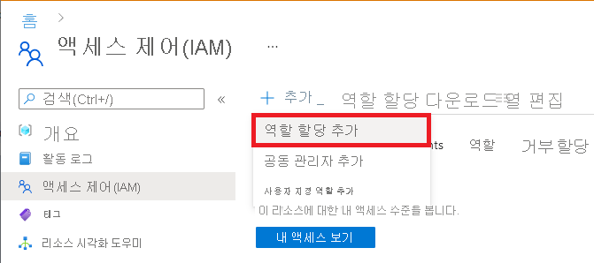

# Azure Lab Services에서 랩 작성자를 랩 계정에 추가
이 문서에서는 Azure Lab Services에서 랩 계정에 사용자를 랩 작성자로 추가하는 방법을 보여 줍니다. 그런 다음, 해당 사용자는 랩 계정에서 랩을 만들 수 있습니다. 

## Microsoft 사용자 계정을 랩 작성자 역할에 추가
랩 계정에서 클래스룸 랩을 설정하려면 사용자는 랩 계정에서 **랩 작성자** 역할의 멤버여야 합니다. 랩 계정을 만드는 데 사용한 계정이 이 역할에 자동으로 추가됩니다. 동일한 사용자 계정을 사용하여 클래스룸 랩을 만들려는 경우 이 단계를 건너뛸 수 있습니다. 다른 사용자 계정을 사용하여 클래스룸 랩을 만들려면 다음 단계를 수행합니다. 

강사가 클래스를 위한 랩을 만들 수 있도록 권한을 제공하려면 강사를 **랩 작성자** 역할에 추가합니다. 자세한 단계는 [Azure Portal을 사용하여 Azure 역할 할당](../role-based-access-control/role-assignments-portal.md)을 참조하세요.

1. **랩 계정 페이지** 에서 **액세스 제어(IAM)** 를 선택합니다.

1. **추가** > **역할 할당 추가(미리 보기)** 를 선택합니다.

    

1. **역할** 탭에서 **랩 작성자** 역할을 선택합니다.

    

1. **멤버** 탭에서 랩 작성자 역할에 추가할 사용자를 선택합니다.

1. **검토 + 할당** 탭에서 **검토 + 할당** 을 선택하여 역할을 할당합니다.

    > [!NOTE]
    > 타사 계정 사용자를 랩 작성자로 추가하는 경우에는 [타사 계정 사용자를 랩 작성자로 추가](#add-a-non-microsoft-account-user-as-a-lab-creator) 섹션을 참조하세요. 

## 타사 계정 사용자를 랩 작성자로 추가
사용자를 랩 작성자로 추가하려면 사용자의 메일 계정을 사용합니다. 다음 유형의 메일 계정을 사용할 수 있습니다.

- 대학교 AAD(Azure Active Directory)에서 제공하는 메일 계정.
- Microsoft 메일 계정(예: `@outlook.com`, `@hotmail.com`, `@msn.com` 또는 `@live.com`).
- 타사 메일 계정(예: Yahoo 또는 Google에서 제공하는 메일 계정). 그러나 이 유형의 계정은 Microsoft 계정과 연결해야 합니다.
- GitHub 계정. 이 계정은 Microsoft 계정과 연결해야 합니다.

### 타사 메일 계정 사용
랩 작성자/강사는 타사 메일 계정을 사용하여 클래스룸 랩에 등록하고 로그인할 수 있습니다.  그러나 Lab Services 포털에 로그인하려면 먼저 강사가 타사 메일 주소에 연결된 Microsoft 계정을 만들어야 합니다.

대부분의 강사는 타사 메일 주소에 연결된 Microsoft 계정이 이미 있을 수 있습니다. 예를 들어, 강사는 Microsoft의 다른 제품이나 서비스(예: Office, Skype, OneDrive 또는 Windows)에서 자신의 메일 주소를 사용한 경우 이미 Microsoft 계정이 있는 것입니다.  

강사가 Lab Services 포털에 로그인할 때 메일 주소와 암호를 묻는 메시지가 표시됩니다. 강사가 Microsoft 계정이 연결되지 않은 타사 계정으로 로그인하려고 하면 다음 오류 메시지가 표시됩니다. 

Microsoft 계정을 등록하려면 강사는 [http://signup.live.com](http://signup.live.com)으로 이동해야 합니다.  

### GitHub 계정 사용
강사는 기존 GitHub 계정을 사용하여 클래스룸 랩에 등록하고 로그인할 수도 있습니다. 강사의 Microsoft 계정이 이미 GitHub 계정에 연결되어 있으면 강사는 이전 섹션에 표시된 대로 로그인하고 암호를 제공할 수 있습니다. GitHub 계정을 Microsoft 계정에 아직 연결하지 않은 경우 **로그인 옵션** 을 선택해야 합니다.

**로그인 옵션** 페이지에서 **GitHub로 로그인** 을 선택합니다.

마지막으로, GitHub 계정에 연결된 Microsoft 계정 만들라는 메시지가 표시됩니다. 강사가 **다음** 을 선택하면 작업이 자동으로 수행됩니다.  그러면 강사가 즉시 로그인되고 클래스룸 랩에 연결됩니다.

## 다음 단계
다음 문서를 참조하세요.

- [랩 소유자 권한으로 랩 만들기 및 관리](how-to-manage-classroom-labs.md)
- [랩 소유자 권한으로 템플릿 설정 및 게시](how-to-create-manage-template.md)
- [랩 소유자 권한으로 랩 사용 구성 및 제어](how-to-configure-student-usage.md)
- [랩 사용자 권한으로 랩에 액세스](how-to-use-classroom-lab.md)
