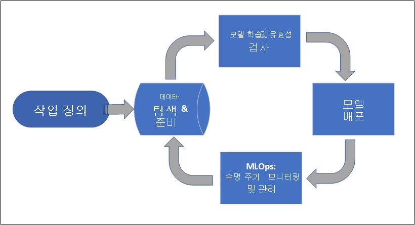
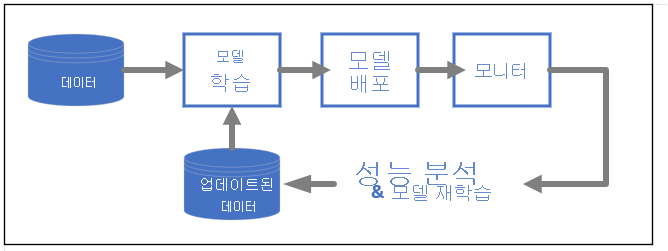

# Azure Machine Learning이란?

Azure Machine Learning은 기계 학습 프로젝트 수명 주기를 가속화하고 간편하게 관리할 수 있는 클라우드 서비스입니다. 기계 학습 전문가, 데이터 과학자 및 엔지니어는 이 서비스를 사용하여 일상적인 워크플로, 즉, 모델의 학습 및 배포와 MLOps 관리를 수행할 수 있습니다.

Azure Machine Learning에서 모델을 만들 수도 있고 Pytorch, TensorFlow 또는 scikit-learn과 같은 오픈 소스 플랫폼에서 빌드된 모델을 사용할 수도 있습니다. MLOps 도구를 사용하여 모델을 모니터링, 재학습 및 재배포할 수 있습니다. 

> [!Tip]
> **평가판!**  Azure 구독이 없는 경우 시작하기 전에 체험 계정을 만듭니다. [Azure Machine Learning 평가판 또는 유료 버전](https://azure.microsoft.com/free/machine-learning/search/)을 사용해 보세요. Azure 서비스에서 사용 가능한 크레딧을 제공합니다. 크레딧이 소진되더라도 계정이 유지되므로 [무료 Azure 서비스](https://azure.microsoft.com/free/)를 계속 사용할 수 있습니다. 설정을 명시적으로 변경하여 결제를 요청하지 않는 한 신용 카드로 결제되지 않습니다.

## Azure Machine Learning의 대상 고객은 누구입니까?

Azure Machine Learning은 조직 내에서 MLOps를 구현하는 개인과 팀을 위한 서비스이며, 안전하고 감사 가능한 프로덕션 환경에서 기계 학습 모델을 프로덕션 모드로 운영할 수 있습니다.

데이터 과학자 및 ML 엔지니어는 이 도구를 사용하여 일상적인 워크플로를 가속화하고 자동화할 수 있습니다. 애플리케이션 개발자는 모델을 애플리케이션 또는 서비스에 통합할 수 있는 도구를 찾을 것입니다. 플랫폼 개발자는 견고한 Azure Resource Manager API 지원이 제공되고 고급 ML 도구를 빌드하는 데 사용할 수 있는 강력한 도구 세트를 찾을 것입니다.

Microsoft Azure 클라우드에서 작업하는 기업은 인프라를 위한 익숙한 보안 및 RBAC(역할 기반 액세스 제어)를 찾을 것입니다. 보호된 데이터에 대한 액세스를 거부하고 작업을 선택하도록 프로젝트를 설정할 수 있습니다.

### 기계 학습 팀을 위한 협업

기계 학습 프로젝트에서는 종종 솔루션의 빌드 및 유지 관리를 위한 다양한 기술 세트를 가진 팀이 필요합니다. Azure Machine Learning에는 다음과 같은 협업이 가능한 도구가 있습니다.

- 공유 Notebook, 컴퓨팅 리소스, 데이터 및 환경
- 누가 언제 변경했는지 보여주는 추적 및 감사 기능
- 자산 버전 관리

### 개발자용 도구

개발자는 Azure Machine Learning에서 다음과 같은 친숙한 인터페이스를 찾을 수 있습니다.

- [Python SDK](/python/api/overview/azure/ml/)
- [Azure Resource Manager REST API(미리 보기)](/rest/api/azureml/)
- [CLI v2(미리 보기)](/cli/azure/ml)

### 스튜디오 UI 

[Azure Machine Learning 스튜디오](https://ml.azure.com)는 프로젝트 작업 영역에 사용되는 그래픽 사용자 인터페이스입니다. 이 스튜디오에서는 다음을 수행할 수 있습니다.

- 실행, 메트릭, 로그, 출력 등을 봅니다.
- Notebook 및 파일을 작성하고 편집합니다.
- 다음과 같은 일반 자산을 관리합니다.
    - 데이터 자격 증명
    - Compute
    - 환경
- 실행 메트릭, 결과 및 보고서를 시각화합니다.
- 개발자 인터페이스를 통해 작성된 파이프라인을 시각화합니다.
- AutoML 작업을 작성합니다.

또한 디자이너에는 모델을 학습시키고 배포할 수 있는 끌어서 놓기 인터페이스가 있습니다. 

ML Studio(클래식) 사용자인 경우 [Studio(클래식) 사용 중단 및 Azure Machine Learning 스튜디오 간의 차이점에 대해 알아보세요.](overview-what-is-machine-learning-studio.md#ml-studio-classic-vs-azure-machine-learning-studio)

## 엔터프라이즈 준비 및 보안

Azure Machine Learning은 Azure 클라우드 플랫폼과 통합되어 ML 프로젝트의 보안을 강화합니다. 

보안 통합에는 다음이 포함됩니다.

- 네트워크 보안 그룹을 사용하는 Azure VNet(가상 네트워크) 
- 스토리지 계정의 액세스 정보와 같은 보안 비밀을 저장할 수 있는 Azure Key Vault
- VNet 뒤에 설정되는 Azure Container Registry

[자습서: 보안 작업 영역 설정](tutorial-create-secure-workspace.md)을 참조하세요.

## 완전한 솔루션을 구현하는 Azure 통합

다른 서비스를 Azure 서비스와 통합하면 엔드투엔드에서 기계 학습 프로젝트가 지원됩니다. 여기에는 다음이 포함됩니다.

- Spark를 사용하여 데이터를 처리하고 스트림하는 Azure Synapse Analytics
- Kubernetes 환경에서 Azure 서비스를 실행할 수 있는 Azure Arc
- Azure SQL Database, Azure Storage Blob 등의 스토리지 및 데이터베이스 옵션
- ML 기반 앱을 배포하고 관리할 수 있는 Azure App Service

## 기계 학습 프로젝트 워크플로

일반적으로 모델은 목적 및 목표가 있는 프로젝트의 일부로 개발됩니다. 프로젝트에 여러 사람이 참가하는 경우가 많습니다. 데이터, 알고리즘 및 모델을 실험하는 개발 과정에는 반복 작업이 많습니다. 

### 프로젝트 수명 주기

프로젝트 수명 주기는 프로젝트에 따라 다를 수 있지만, 대체로 다음과 비슷합니다.

작업 영역은 프로젝트를 구성하며 공통의 목표를 달성하기 위해 일하는 여러 사용자가 작업 영역에서 협업할 수 있습니다. 작업 영역의 사용자는 스튜디오 사용자 인터페이스에서 실험한 실행 결과를 간편하게 공유하거나 환경 및 스토리지 참조와 같은 작업에 버전이 지정된 자산을 사용할 수 있습니다.

자세한 내용은 [Azure Machine Learning 작업 영역 관리](how-to-manage-workspace.md?tabs=python)를 참조하세요.

프로젝트를 운영할 준비가 되면 사용자의 작업을 기계 학습 파이프라인에서 자동화하고 일정에 따라 또는 HTTPS 요청이 있을 때 트리거할 수 있습니다.

실시간 배포 및 일괄 처리 배포 모두에서 모델을 관리형 추론 솔루션에 배포할 수 있으므로, 일반적으로 모델을 배포하는 데 필요한 인프라 관리가 사라집니다.

## 모델 학습

Azure Machine Learning은 클라우드에서 학습 스크립트를 실행할 수도 있고 모델을 처음부터 빌드할 수도 있습니다. 고객이 오픈 소스 프레임워크에서 직접 빌드하고 학습시킨 모델을 가져오는 경우가 많으므로, 이러한 모델을 클라우드에서 운영할 수 있습니다. 

### 개방성 및 상호 운용성

데이터 과학자는 다음과 같은 일반적인 Python 프레임워크에서 만든 모델을 Azure Machine Learning에서 사용할 수 있습니다. 

- PyTorch
- TensorFlow
- scikit-learn
- XGBoost
- LightGBM

다음과 같은 다른 언어 및 프레임워크도 지원됩니다. 
- R
- .NET

[Azure Machine Learning과의 오픈 소스 통합](concept-open-source.md)을 참조하세요.

### 자동 기능화 및 알고리즘 선택(AutoML)

시간이 많이 걸리는 반복적인 프로세스에서, 기존 기계 학습 과학자는 이전 경험과 직관을 사용하여 학습에 적합한 데이터 기능화 및 알고리즘을 선택합니다. 자동 ML(AutoML)은 이 프로세스를 가속화하며 스튜디오 UI 또는 Python SDK를 통해 사용할 수 있습니다.

[자동화된 Machine Learning이란?](concept-automated-ml.md)을 참조하세요.

### 하이퍼 매개 변수 최적화

하이퍼 매개 변수 최적화 또는 하이퍼 매개 변수 튜닝은 지루한 작업입니다. Azure Machine Learning은 작업 정의를 약간만 수정하면 매개 변수가 있는 임의 명령에 대해 이 작업을 자동화할 수 있습니다. 결과는 스튜디오에 시각화됩니다.

[하이퍼 매개 변수를 튜닝하는 방법](how-to-tune-hyperparameters.md)을 참조하세요.

### 다중 노드 분산 학습

딥 러닝 학습 및 경우에 따라 기존 기계 학습 작업의 효율성이 다중 노드 분산 교육을 통해 크게 향상될 수 있습니다. Azure Machine Learning 컴퓨팅 클러스터는 최신 GPU 옵션을 제공합니다.

다음과 같은 Azure Arc 연결 Kubernetes(미리 보기) 및 Azure ML 컴퓨팅 클러스터를 통해 지원됩니다.

- PyTorch
- TensorFlow
- MPI

MPI 분산은 Horovod 또는 사용자 지정 다중 노드 논리에 사용할 수 있습니다. 또한 Apache Spark는 Azure Synapse Analytics Spark 클러스터(미리 보기)를 통해 지원됩니다.

[Azure Machine Learning을 사용한 분산 학습](concept-distributed-training.md)을 참조하세요.

### 처치 곤란 병렬 학습

기계 학습 프로젝트를 스케일링하려면 처치 곤란 병렬 학습의 크기를 스케일링해야 하는 경우가 있습니다. 이 패턴은 모델이 여러 매장의 데이터를 학습해야 하는 수요 예측과 같은 시나리오에서 자주 발생합니다.

## 모델 배포

모델을 프로덕션으로 전환하기 위해 배포됩니다. Azure Machine Learning 관리 엔드포인트는 일괄 처리 또는 실시간(온라인) 모델 채점(추론) 모두에 필요한 인프라를 추상화합니다.

### 실시간 및 일괄 처리 채점(추론)

*일괄 처리 채점* 또는 *일괄 처리 추론* 에는 데이터에 대한 참조를 사용하여 엔드포인트를 호출하는 작업이 포함됩니다. 일괄 처리 엔드포인트는 작업을 비동기적으로 실행하여 컴퓨팅 클러스터에서 데이터를 병렬로 처리하고 추가 분석을 위해 데이터를 저장합니다.

*실시간 채점* 또는 *온라인 추론* 에는 하나 이상의 모델 배포를 통해 엔드포인트를 호출하고 HTTP를 통해 거의 실시간으로 응답을 수신하는 작업이 포함됩니다. 트래픽은 여러 배포에 걸쳐 분할될 수 있으며, 처음에는 트래픽의 일부만 전환하고 새 모델에 대한 신뢰가 생기면 점점 양을 늘려서 새 모델 버전을 테스트할 수 있습니다.    

참조
 - [실시간 관리 엔드포인트를 통해 모델 배포](how-to-deploy-managed-online-endpoints.md)
 - [채점에 일괄 처리 엔드포인트 사용](how-to-use-batch-endpoint.md) 

## MLOps: 기계 학습을 위한 DevOps 

MLOps라고도 하는 기계 학습 모델을 위한 DevOps는 프로덕션용 모델을 개발하는 프로세스입니다. 재현할 수 없는 경우 학습에서 배포까지 모델의 수명 주기를 감사할 수 있어야 합니다.

### ML 모델 수명 주기 

[Azure Machine Learning의 MLOps](concept-model-management-and-deployment.md)에 대해 자세히 알아보세요.

### 통합을 통해 MLOPs 지원

Azure Machine Learning은 모델 수명 주기를 염두에 두고 개발되었습니다. 모델 수명 주기를 특정 커밋 및 환경까지 감사할 수 있습니다. 

다음은 MLOps를 지원하는 주요 기능입니다.

- `git` 통합
- MLflow 통합
- 기계 학습 파이프라인 일정 예약
- 사용자 지정 트리거에 대한 Azure Event Grid 통합
- GitHub Actions 또는 Azure DevOps 같은 CI/CD 도구에서 간편하게 사용

또한 Azure Machine Learning에는 다음을 모니터링 및 감사하는 기능이 포함되어 있습니다.
- 코드 스냅샷, 로그 및 기타 출력과 같은 작업 아티팩트
- 컨테이너, 데이터 및 컴퓨팅 리소스와 같은 작업과 자산 간의 계보

## 다음 단계

다음 문서를 참조하여 Azure Machine Learning를 시작하세요.
- [Azure Machine Learning 작업 영역 설정](quickstart-create-resources.md)
- [자습서: 첫 번째 기계 학습 프로젝트 빌드](tutorial-1st-experiment-hello-world.md)
- [미리 보기: v2 CLI를 사용하여 모델 학습 작업 실행](how-to-train-cli.md)
