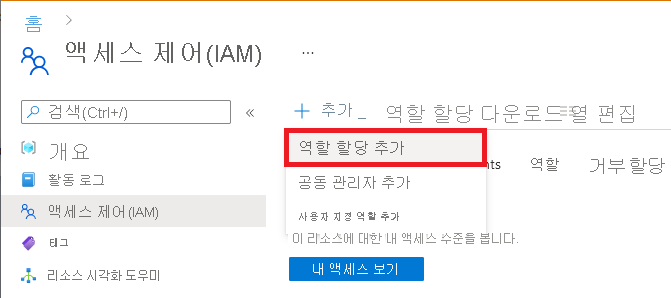

# <a name="how-to-create-a-secure-workspace"></a>보안 작업 영역을 만드는 방법

이 문서에서는 보안 Azure Machine Learning 작업 영역을 만들고 연결하는 방법을 알아봅니다. 보안 작업 영역에서는 Azure Virtual Network를 사용하여 Azure Machine Learning에서 사용하는 리소스와 관련된 보안 경계를 만듭니다. 

이 자습서에서는 다음 작업을 완료합니다.

> [!div class="checklist"]
> * __가상 네트워크의 서비스 간 통신을 보호__ 하기 위해 Azure VNet(Virtual Network)를 만듭니다.
> * VNet 뒤에 Azure Storage 계정(Blob 및 파일)을 만듭니다. 이 서비스는 __작업 영역에 대 한 기본 스토리지__ 로 사용됩니다.
> * VNet 뒤에 Azure Key Vault를 만듭니다. 이 서비스는 __작업 영역에서 사용하는 암호를 저장__ 하는 데 사용됩니다. 스토리지 계정에 액세스하는 데 필요한 보안 정보를 예로 들 수 있습니다.
> * ACR(Azure Container Registry)를 만듭니다. 이 서비스는 Docker 이미지에 대한 리포지토리로 사용됩니다. __Docker 이미지는 기계 학습 모델을 학습시키거나 학습된 모델을 엔드포인트로 배포할 때 필요한 컴퓨팅 환경을 제공합니다__.
> * Azure Machine Learning 작업 영역을 만듭니다.
> * 점프 상자를 만듭니다. 점프 상자는 VNet 뒤에 있는 Azure 가상 머신입니다. VNet은 퍼블릭 인터넷의 액세스를 제한하므로 __VNet 뒤에 있는 리소스에 연결하는 방법으로 점프 상자가 사용됩니다__.
> * VNet 뒤에서 작동하도록 Azure Machine Learning 스튜디오를 구성합니다. 이 스튜디오에서는 __Azure Machine Learning용 웹 인터페이스__ 를 제공합니다.
> * Azure Machine Learning 컴퓨팅 클러스터를 만듭니다. 컴퓨팅 클러스터는 __클라우드에서 기계 학습 모델을 학습시킬 때__ 사용됩니다. Azure Container Registry가 VNet 뒤에 있는 구성에서는 Docker 이미지를 빌드하는 데도 사용됩니다.
> * 점프 상자에 연결하고 Azure Machine Learning 스튜디오를 사용합니다.

환경이 필수 구성 요소를 충족하고 ARM 템플릿 사용에 익숙한 경우 'Azure에 배포' 단추를 선택하여 이 자습서의 처음 5단계를 완료할 수도 있습니다. [작업 영역에 연결](#connect-to-the-workspace)부터 계속 읽을 수 있습니다.

[](https://portal.azure.com/#create/Microsoft.Template/uri/https%3A%2F%2Fraw.githubusercontent.com%2FAzure%2Fazure-quickstart-templates%2Fmaster%2Fquickstarts%2Fmicrosoft.machinelearningservices%2Fmachine-learning-advanced%2Fazuredeploy.json)
[](https://portal.azure.us/#create/Microsoft.Template/uri/https%3A%2F%2Fraw.githubusercontent.com%2FAzure%2Fazure-quickstart-templates%2Fmaster%2Fquickstarts%2Fmicrosoft.machinelearningservices%2Fmachine-learning-advanced%2Fazuredeploy.json)

## <a name="prerequisites"></a>필수 구성 요소

* Azure Virtual Network 및 IP 네트워킹 사용에 대한 지식
* 이 문서의 단계 대부분은 Azure Portal 또는 Azure Machine Learning 스튜디오를 사용하지만 일부 단계에서는 Machine Learning을 위한 Azure CLI 확장을 사용합니다.

## <a name="create-a-virtual-network"></a>가상 네트워크 만들기

가상 네트워크를 만들려면 다음 단계를 사용합니다.

1. [Azure Portal](https://portal.azure.com)에서 왼쪽 위 구석에 있는 Portal 메뉴를 선택합니다. 메뉴에서 __+ 리소스 만들기__ 를 선택하고 검색 필드에 __가상 네트워크__ 를 입력합니다. __가상 네트워크__ 항목을 선택한 후 __만들기__ 를 선택합니다.


    :::image type="content" source="./media/tutorial-create-secure-workspace/create-resource-search-vnet.png" alt-text="리소스 만들기 UI 검색":::

    :::image type="content" source="./media/tutorial-create-secure-workspace/create-resource-vnet.png" alt-text="가상 네트워크 만들기":::

1. __기본 사항__ 탭에서 이 리소스에 사용할 Azure __구독__ 을 선택하고 새 __리소스 그룹__ 을 선택하거나 만듭니다. __인스턴스 정보__ 에서 가상 네트워크의 __이름__ 을 입력하고 만들 __지역__ 을 선택합니다.

    :::image type="content" source="./media/tutorial-create-secure-workspace/create-vnet-basics.png" alt-text="기본 가상 네트워크 구성 이미지":::

1. __IP 주소__ 탭을 선택합니다. 기본 설정은 다음 이미지와 비슷해야 합니다.

    :::image type="content" source="./media/tutorial-create-secure-workspace/create-vnet-ip-address-default.png" alt-text="기본 IP 주소 화면":::

    다음 단계를 사용하여 IP 주소를 구성하고 학습 및 점수 매기기 리소스에 대한 서브넷을 구성합니다.

    > [!TIP]
    > 모든 Azure ML 리소스에 대해 단일 서브넷을 사용할 수 있지만 이 문서의 단계에서는 학습 및 점수 매기기 리소스를 구분하는 두 개의 서브넷을 만드는 방법을 보여 줍니다.
    >
    > 작업 영역 및 기타 종속성 서비스는 학습 서브넷으로 이동합니다. 이러한 서비스는 점수 매기기 서브넷 등의 다른 서브넷의 리소스에서 계속 사용할 수 있습니다.

    1. 기본 __IPv4 주소 공간__ 값을 확인합니다. 스크린샷에서 이 값은 __172.17.0.0/16__ 입니다. __이 값은 사용자 환경에서 다를 수 있습니다__. 다른 값을 사용할 수 있지만 이 자습서의 나머지 단계는 172.17.0.0/16 값을 기준으로 합니다.
    1. __기본__ 서브넷을 선택하고 __서브넷 제거__ 를 선택합니다.
    
        :::image type="content" source="./media/tutorial-create-secure-workspace/delete-default-subnet.png" alt-text="기본 서브넷 삭제 스크린샷":::

    1. 작업 영역, 종속성 서비스 및 학습에 사용된 리소스를 포함하는 서브넷을 만들려면 __+서브넷 추가__ 를 선택하고 서브넷에 대해 다음 값을 사용합니다.
        * __서브넷 이름__: 학습
        * __서브넷 주소 범위__: 172.17.0.0/24
        * __서비스__: 다음 서비스를 선택합니다.
            * __Microsoft.Storage__
            * __Microsoft.KeyVault__
            * __Microsoft.ContainerRegistry__

        :::image type="content" source="./media/tutorial-create-secure-workspace/vnet-add-training-subnet.png" alt-text="학습 서브넷 스크린샷":::

    1. 모델 점수를 매기는 데 사용되는 컴퓨팅 리소스에 대한 서브넷을 만들려면 __+서브넷 추가__ 를 다시 선택하고 다음 값을 사용합니다.
        * __서브넷 이름__: 점수 매기기
        * __서브넷 주소 범위__: 172.17.1.0/24
        * __서비스__: 다음 서비스를 선택합니다.
            * __Microsoft.Storage__
            * __Microsoft.KeyVault__
            * __Microsoft.ContainerRegistry__

        :::image type="content" source="./media/tutorial-create-secure-workspace/vnet-add-scoring-subnet.png" alt-text="점수 매기기 서브넷 스크린샷":::

1. __보안__ 을 선택합니다. __BastionHost__ 에서 __사용__ 을 선택합니다. [Azure Bastion](../bastion/bastion-overview.md)은 이후 단계에서 VNet 내부에서 만들 VM 점프 상자에 액세스하는 안전한 방법을 제공합니다. 나머지 필드에 대해 다음 값을 사용합니다.

    * __Bastion 이름__: 이 Bastion 인스턴스의 고유한 이름입니다.
    * __AzureBastionSubnetAddress space__: 172.17.2.0/27
    * __공용 IP 주소__: 새 공용 IP 주소를 만듭니다.

    다른 필드는 기본값으로 둡니다.

    :::image type="content" source="./media/tutorial-create-secure-workspace/create-bastion.png" alt-text="Bastion 구성 스크린샷":::

1. __검토 + 만들기__ 를 선택합니다.

    :::image type="content" source="./media/tutorial-create-secure-workspace/create-vnet-ip-address-final.png" alt-text="검토 + 만들기 단추를 보여 주는 스크린샷":::

1. 정보가 올바른지 확인한 후 __만들기__ 를 선택합니다.

    :::image type="content" source="./media/tutorial-create-secure-workspace/create-vnet-review.png" alt-text="검토 페이지 스크린샷":::

## <a name="create-a-storage-account"></a>스토리지 계정 만들기

1. [Azure Portal](https://portal.azure.com)에서 왼쪽 위 구석에 있는 Portal 메뉴를 선택합니다. 메뉴에서 __+리소스 만들기__ 를 선택하고, __스토리지 계정__ 을 입력합니다. __스토리지 계정__ 항목을 선택하고 __만들기__ 를 선택합니다.
1. __기본 사항__ 탭에서 가상 네트워크에 대해 이전에 사용한 __구독__, __리소스 그룹__ 및 __지역__ 을 선택합니다. 고유한 __스토리지 계정 이름__ 을 입력하고 __중복성__ 을 __LRS(로컬 중복 스토리지)__ 로 설정합니다.

    :::image type="content" source="./media/tutorial-create-secure-workspace/create-storage.png" alt-text="스토리지 계정 기본 구성 이미지":::

1. __네트워킹__ 탭에서 __프라이빗 엔드포인트__ 를 선택한 다음, __+ 프라이빗 엔드포인트 추가__ 를 선택합니다.

    :::image type="content" source="./media/tutorial-create-secure-workspace/storage-enable-private-endpoint.png" alt-text="Blob 프라이빗 네트워크를 추가하는 UI":::

1. __프라이빗 엔드포인트 만들기__ 양식에서 다음 값을 사용합니다.
    * __구독__: 이전에 만든 리소스를 포함하는 동일한 Azure 구독입니다.
    * __리소스 그룹__: 이전에 만든 리소스를 포함하는 동일한 Azure 리소스 그룹입니다.
    * __위치__: 이전에 만든 리소스를 포함하는 동일한 Azure 지역입니다.
    * __이름__: 이 프라이빗 엔드포인트의 고유한 이름입니다.
    * __대상 하위 리소스__: Blob
    * __가상 네트워크__: 이전에 만든 가상 네트워크입니다.
    * __서브넷__: 학습(172.17.0.0/24)
    * __프라이빗 DNS 통합__: 예
    * __프라이빗 DNS 영역__: privatelink.blob.core.windows.net

    __확인__ 을 선택하여 프라이빗 엔드포인트를 만듭니다.

1. __검토 + 만들기__ 를 선택합니다. 정보가 올바른지 확인한 후 __만들기__ 를 선택합니다.

1. 스토리지 계정이 만들어지면 __리소스로 이동__ 을 선택합니다.

    :::image type="content" source="./media/tutorial-create-secure-workspace/storage-go-to-resource.png" alt-text="새 스토리지 리소스로 이동":::

1. 왼쪽 탐색 영역에서 __네트워킹__, __프라이빗 엔드포인트 연결__ 탭, __+ 프라이빗 엔드포인트__ 를 차례로 선택합니다.

    > [!NOTE]
    > 이전 단계에서 Blob Storage에 대한 프라이빗 엔드포인트를 만들었지만 File Storage에 대한 엔드포인트도 만들어야 합니다.

    :::image type="content" source="./media/tutorial-create-secure-workspace/storage-file-networking.png" alt-text="스토리지 계정 네트워킹용 UI":::

1. __프라이빗 엔드포인트 만들기__ 양식에서 이전 리소스에 사용한 것과 동일한 __구독__, __리소스 그룹__ 및 __지역__ 을 사용합니다. 고유한 __이름__ 을 입력합니다.

    :::image type="content" source="./media/tutorial-create-secure-workspace/storage-file-private-endpoint.png" alt-text="파일 프라이빗 엔드포인트를 추가하는 UI":::

1. __다음: 리소스__ 를 선택하고 __대상 하위 리소스__ 를 __파일__ 로 설정합니다.

    :::image type="content" source="./media/tutorial-create-secure-workspace/storage-file-private-endpoint-resource.png" alt-text="하위 리소스 '파일' 추가":::

1. __다음: 구성__ 을 선택하고 다음 값을 사용합니다.
    * __가상 네트워크__: 이전에 만든 네트워크입니다.
    * __서브넷__: 학습
    * __프라이빗 DNS 영역과 통합__: 예
    * __프라이빗 DNS 영역__: privatelink.file.core.windows.net

    :::image type="content" source="./media/tutorial-create-secure-workspace/storage-file-private-endpoint-config.png" alt-text="파일 프라이빗 엔드포인트를 구성하는 UI":::

1. __검토 + 만들기__ 를 선택합니다. 정보가 올바른지 확인한 후 __만들기__ 를 선택합니다.

## <a name="create-a-key-vault"></a>키 자격 증명 모음 만들기

1. [Azure Portal](https://portal.azure.com)에서 왼쪽 위 구석에 있는 Portal 메뉴를 선택합니다. 메뉴에서 __+리소스 만들기__ 를 선택하고 __Key Vault__ 를 입력합니다. __Key Vault__ 항목을 선택한 다음, __만들기__ 를 선택합니다.
1. __기본 사항__ 탭에서 가상 네트워크에 대해 이전에 사용한 __구독__, __리소스 그룹__ 및 __지역__ 을 선택합니다. 고유한 __Key Vault 이름__ 을 입력합니다. 다른 필드는 기본값으로 둡니다.

    :::image type="content" source="./media/tutorial-create-secure-workspace/create-key-vault.png" alt-text="새 Key Vault 만들기":::

1. __네트워킹__ 탭에서 __프라이빗 엔드포인트__ 를 선택한 다음, __+ 추가__ 를 선택합니다.

    :::image type="content" source="./media/tutorial-create-secure-workspace/key-vault-networking.png" alt-text="Key Vault 네트워킹":::

1. __프라이빗 엔드포인트 만들기__ 양식에서 다음 값을 사용합니다.
    * __구독__: 이전에 만든 리소스를 포함하는 동일한 Azure 구독입니다.
    * __리소스 그룹__: 이전에 만든 리소스를 포함하는 동일한 Azure 리소스 그룹입니다.
    * __위치__: 이전에 만든 리소스를 포함하는 동일한 Azure 지역입니다.
    * __이름__: 이 프라이빗 엔드포인트의 고유한 이름입니다.
    * __대상 하위 리소스__: 자격 증명 모음
    * __가상 네트워크__: 이전에 만든 가상 네트워크입니다.
    * __서브넷__: 학습(172.17.0.0/24)
    * __프라이빗 DNS 통합__: 예
    * __프라이빗 DNS 영역__: privatelink.vaultcore.azure.net

    __확인__ 을 선택하여 프라이빗 엔드포인트를 만듭니다.

    :::image type="content" source="./media/tutorial-create-secure-workspace/key-vault-private-endpoint.png" alt-text="Key Vault 프라이빗 엔드포인트 구성":::

1. __검토 + 만들기__ 를 선택합니다. 정보가 올바른지 확인한 후 __만들기__ 를 선택합니다.

## <a name="create-a-container-registry"></a>컨테이너 레지스트리 만들기

1. [Azure Portal](https://portal.azure.com)에서 왼쪽 위 구석에 있는 Portal 메뉴를 선택합니다. 메뉴에서 __+리소스 만들기__ 를 선택하고 __컨테이너 레지스트리__ 를 입력합니다. __컨테이너 레지스트리__ 항목을 선택한 후 __만들기__ 를 선택합니다.
1. __기본 사항__ 탭에서 가상 네트워크에 대해 이전에 사용한 __구독__, __리소스 그룹__ 및 __위치__ 를 선택합니다. 고유한 __레지스트리 이름__ 을 입력하고 __SKU__ 를 __프리미엄__ 으로 설정합니다.

    :::image type="content" source="./media/tutorial-create-secure-workspace/create-container-registry.png" alt-text="컨테이너 레지스트리 만들기":::

1. __네트워킹__ 탭에서 __프라이빗 엔드포인트__ 를 선택한 다음, __+ 추가__ 를 선택합니다.

    :::image type="content" source="./media/tutorial-create-secure-workspace/container-registry-networking.png" alt-text="컨테이너 레지스트리 네트워킹":::

1. __프라이빗 엔드포인트 만들기__ 양식에서 다음 값을 사용합니다.
    * __구독__: 이전에 만든 리소스를 포함하는 동일한 Azure 구독입니다.
    * __리소스 그룹__: 이전에 만든 리소스를 포함하는 동일한 Azure 리소스 그룹입니다.
    * __위치__: 이전에 만든 리소스를 포함하는 동일한 Azure 지역입니다.
    * __이름__: 이 프라이빗 엔드포인트의 고유한 이름입니다.
    * __대상 하위 리소스__: 레지스트리
    * __가상 네트워크__: 이전에 만든 가상 네트워크입니다.
    * __서브넷__: 학습(172.17.0.0/24)
    * __프라이빗 DNS 통합__: 예
    * __프라이빗 DNS 영역__: privatelink.azurecr.io

    __확인__ 을 선택하여 프라이빗 엔드포인트를 만듭니다.

    :::image type="content" source="./media/tutorial-create-secure-workspace/container-registry-private-endpoint.png" alt-text="컨테이너 레지스트리 프라이빗 엔드포인트 구성":::

1. __검토 + 만들기__ 를 선택합니다. 정보가 올바른지 확인한 후 __만들기__ 를 선택합니다.
1. 컨테이너 레지스트리가 만들어진 후 __리소스로 이동__ 을 선택합니다.

    :::image type="content" source="./media/tutorial-create-secure-workspace/container-registry-go-to-resource.png" alt-text="‘리소스로 이동’ 선택":::

1. 페이지 왼쪽에서 __액세스 키__ 를 선택한 다음, __관리 사용자__ 를 사용하도록 설정합니다. 이 설정은 Azure Machine Learning에사 가상 네트워크 내의 Azure Container Registry를 사용할 때 필요합니다.

    :::image type="content" source="./media/tutorial-create-secure-workspace/container-registry-admin-user.png" alt-text="관리 사용자 토글 스크린샷":::

## <a name="create-a-workspace"></a>작업 영역 만들기

1. [Azure Portal](https://portal.azure.com)에서 왼쪽 위 구석에 있는 Portal 메뉴를 선택합니다. 메뉴에서 __+리소스 만들기__ 를 선택하고 __Machine Learning__ 을 입력합니다. __Machine Learning__ 을 선택하고 __만들기__ 를 선택합니다.

    :::image type="content" source="./media/tutorial-create-secure-workspace/machine-learning-create.png" alt-text="{대체 텍스트}":::

1. __기본 사항__ 탭에서 가상 네트워크에 대해 이전에 사용한 __구독__, __리소스 그룹__ 및 __지역__ 을 선택합니다. 다른 필드에 대해 다음 값을 사용합니다.
    * __작업 영역 이름__: 작업 영역에 대한 고유한 이름입니다.
    * __스토리지 계정__: 이전에 만든 스토리지 계정을 선택합니다.
    * __Key Vault__: 이전에 만든 Key Vault를 선택합니다.
    * __Application insights__: 기본값을 사용합니다.
    * __컨테이너 레지스트리__: 이전에 만든 컨테이너 레지스트리를 사용합니다.

    :::image type="content" source="./media/tutorial-create-secure-workspace/create-machine-learning-workspace.png" alt-text="기본 작업 영역 구성":::

1. __네트워킹__ 탭에서 __프라이빗 엔드포인트__ 를 선택한 다음, __+ 추가__ 를 선택합니다.

    :::image type="content" source="./media/tutorial-create-secure-workspace/machine-learning-workspace-networking.png" alt-text="작업 영역 네트워킹":::

1. __프라이빗 엔드포인트 만들기__ 양식에서 다음 값을 사용합니다. 
    * __구독__: 이전에 만든 리소스를 포함하는 동일한 Azure 구독입니다.
    * __리소스 그룹__: 이전에 만든 리소스를 포함하는 동일한 Azure 리소스 그룹입니다.
    * __위치__: 이전에 만든 리소스를 포함하는 동일한 Azure 지역입니다.
    * __이름__: 이 프라이빗 엔드포인트의 고유한 이름입니다.
    * __대상 하위 리소스__: amlworkspace
    * __가상 네트워크__: 이전에 만든 가상 네트워크입니다.
    * __서브넷__: 학습(172.17.0.0/24)
    * __프라이빗 DNS 통합__: 예
    * __프라이빗 DNS 영역__: 두 개의 프라이빗 DNS 영역을 기본값인 __privatelink.api.azureml.ms__ 및 __privatelink.notebooks.azure.net__ 상태로 둡니다.

    __확인__ 을 선택하여 프라이빗 엔드포인트를 만듭니다.

    :::image type="content" source="./media/tutorial-create-secure-workspace/machine-learning-workspace-private-endpoint.png" alt-text="작업 영역 프라이빗 네트워크 구성 스크린샷":::

1. __검토 + 만들기__ 를 선택합니다. 정보가 올바른지 확인한 후 __만들기__ 를 선택합니다.
1. 작업 영역을 만들었으면 __리소스로 이동__ 을 선택합니다.
1. 왼쪽의 __설정__ 섹션에서 __프라이빗 엔드포인트 연결__ 을 선택한 후 __프라이빗 엔드포인트__ 열의 링크를 선택합니다.

    :::image type="content" source="./media/tutorial-create-secure-workspace/workspace-private-endpoint-connections.png" alt-text="작업 영역 프라이빗 엔드포인트 연결 스크린샷":::

1. 프라이빗 엔드포인트 정보가 표시되면 페이지 왼쪽에서 __DNS 구성__ 을 선택합니다. 나중에 사용되기 때문에 이 페이지에 IP 주소 및 FQDN(정규화된 도메인 이름) 정보를 저장합니다.

    :::image type="content" source="./media/tutorial-create-secure-workspace/workspace-private-endpoint-dns.png" alt-text="IP 및 FQDN 항목 스크린샷":::

> [!IMPORTANT]
> 작업 영역을 완전히 사용하려면 먼저 몇 가지 구성 단계가 필요합니다. 그러나 이를 위해 작업 영역에 연결해야 합니다.

## <a name="enable-studio"></a>스튜디오 사용

Azure Machine Learning 스튜디오는 작업 영역을 쉽게 관리할 수 있는 웹 기반 애플리케이션입니다. 그러나 VNet 내에서 보호되는 리소스와 함께 사용하려면 몇 가지 추가 구성이 필요합니다. 스튜디오를 사용하려면 다음 단계를 사용합니다.

1. Azure Portal에서 스토리지 계정을 선택한 다음, __액세스 제어(IAM)__ 를 선택합니다.
1. __+ 추가__ 를 선택한 다음, __역할 할당 추가(미리 보기)__ 를 선택합니다.

    

1. __역할__ 탭에서 __Storage Blob 데이터 기여자__ 를 선택합니다.

    

1. __구성원__ 탭의 __액세스 권한 할당 대상__ 에서 __사용자, 그룹 또는 서비스 주체__ 를 선택하고 __+ 구성원 선택__ 을 선택합니다. __구성원 선택__ 대화 상자에서 이름을 Azure Machine Learning 작업 영역으로 입력합니다. 작업 영역에 대한 서비스 주체를 선택한 다음, __선택__ 단추를 사용합니다.

    :::image type="content" source="./media/tutorial-create-secure-workspace/studio-select-service-principal.png" alt-text="서비스 주체 선택 스크린샷":::

1. **검토 + 할당** 탭에서 **검토 + 할당** 을 선택하여 역할을 할당합니다.

1. 프라이빗 엔드포인트가 있는 Azure Storage 계정을 사용하는 경우 작업 영역에 대한 서비스 주체를 스토리지 프라이빗 엔드포인트에 대한 __읽기 권한자__ 로 추가합니다. Azure Portal에서 스토리지 계정을 선택한 다음, __네트워킹__ 을 선택합니다. 다음으로, __프라이빗 엔드포인트 연결__ 을 선택합니다.

    :::image type="content" source="./media/tutorial-create-secure-workspace/storage-private-endpoint-select.png" alt-text="스토리지 프라이빗 엔드포인트 스크린샷":::

1. __나열된 각 프라이빗 엔드포인트__ 에 대해 다음 단계를 사용합니다.

    1. __프라이빗 엔드포인트__ 열에서 링크를 선택합니다.
    
        :::image type="content" source="./media/tutorial-create-secure-workspace/storage-private-endpoint-selected.png" alt-text="선택할 엔드포인트 스크린샷":::

    1. 왼쪽에서 __액세스 제어(IAM)__ 를 선택합니다.
    1. __+ 추가__ 를 선택한 다음, __역할 할당 추가(미리 보기)__ 를 선택합니다.

        

    1. __역할__ 탭에서 __읽기 권한자__ 를 선택합니다.

        

    1. __구성원__ 탭의 __액세스 권한 할당 대상__ 에서 __사용자, 그룹 또는 서비스 주체__ 를 선택하고 __+ 구성원 선택__ 을 선택합니다. __구성원 선택__ 대화 상자에서 이름을 Azure Machine Learning 작업 영역으로 입력합니다. 작업 영역에 대한 서비스 주체를 선택한 다음, __선택__ 단추를 사용합니다.

    1. **검토 + 할당** 탭에서 **검토 + 할당** 을 선택하여 역할을 할당합니다.

## <a name="connect-to-the-workspace"></a>작업 영역에 연결

보안 작업 영역에 연결할 수 있는 여러 가지 방법이 있습니다. 이 문서의 단계에서는 VNet의 가상 머신인 __점프 상자__ 를 사용합니다. 웹 브라우저 및 Azure Bastion을 사용하여 연결할 수 있습니다. 다음 표에는 보안 작업 영역에 연결할 수 있는 몇 가지 다른 방법이 나와 있습니다.

| 메서드 | 설명 |
| ----- | ----- |
| [Azure VPN Gateway](../vpn-gateway/vpn-gateway-about-vpngateways.md) | 프라이빗 연결을 통해 VNet에 온-프레미스 네트워크를 연결합니다. 공용 인터넷을 통해 연결됩니다. |
| [ExpressRoute](https://azure.microsoft.com/services/expressroute/) | 프라이빗 연결을 통해 온-프레미스 네트워크를 클라우드에 연결합니다. 연결 공급자를 사용하여 연결합니다. |

> [!IMPORTANT]
> __VPN Gateway__ 또는 __ExpressRoute__ 를 사용하는 경우 온-프레미스 리소스와 VNet 간에 이름 확인이 작동하는 방식을 계획해야 합니다. 자세한 내용은 [사용자 지정 DNS 서버 사용](how-to-custom-dns.md)을 참조하세요.

### <a name="create-a-jump-box-vm"></a>점프 상자(VM) 만들기

점프 상자로 사용할 Data Science Virtual Machine을 만들려면 다음 단계를 사용합니다.

1. [Azure Portal](https://portal.azure.com)에서 왼쪽 위 구석에 있는 Portal 메뉴를 선택합니다. 메뉴에서 __+리소스 만들기__ 를 선택하고 __Data Science Virtual Machine__ 을 입력합니다. __Data Science Virtual Machine – Windows__ 항목을 선택한 후 __만들기__ 를 선택합니다.
1. __기본 사항__ 탭에서 가상 네트워크에 대해 이전에 사용한 __구독__, __리소스 그룹__ 및 __지역__ 을 선택합니다. 고유한 __가상 머신 이름__, __사용자 이름__ 및 __암호__ 를 지정합니다. 다른 필드는 기본값으로 둡니다.

    :::image type="content" source="./media/tutorial-create-secure-workspace/create-virtual-machine-basic.png" alt-text="VM 기본 구성 이미지":::

1. __네트워킹__ 에서 앞서 만든 __가상 네트워크__ 를 선택합니다. 다음 정보를 사용하여 나머지 필드를 설정합니다.

    * __학습__ 서브넷을 선택합니다.
    * __공용 IP__ 를 __없음__ 으로 설정합니다.
    * 다른 필드는 기본값으로 둡니다.

    :::image type="content" source="./media/tutorial-create-secure-workspace/create-virtual-machine-network.png" alt-text="VM 네트워크 구성 이미지":::

1. __검토 + 만들기__ 를 선택합니다. 정보가 올바른지 확인한 후 __만들기__ 를 선택합니다.


### <a name="connect-to-the-jump-box"></a>점프 상자에 연결

1. 가상 머신을 만들었으면 __리소스로 이동__ 을 선택합니다.
1. 페이지 맨 위에서 __연결__ 을 선택하고 __배스천__ 을 선택합니다.

    :::image type="content" source="./media/tutorial-create-secure-workspace/virtual-machine-connect.png" alt-text="연결/배스천 UI 이미지":::

1. __Bastion 사용__ 을 선택한 다음, 가상 머신에 대한 인증 정보를 제공하면 브라우저에 대해 연결이 설정됩니다.

    :::image type="content" source="./media/tutorial-create-secure-workspace/use-bastion.png" alt-text="배스션 사용 대화 상자 이미지":::

## <a name="create-a-compute-cluster-and-compute-instance"></a>컴퓨팅 클러스터 및 컴퓨팅 인스턴스 만들기

컴퓨팅 클러스터는 학습 작업에서 사용됩니다. 컴퓨팅 인스턴스는 작업 영역에 연결된 공유 컴퓨팅 리소스에 대한 Jupyter Notebook 환경을 제공합니다.

1. 점프 상자에 대한 Azure Bastion 연결에서 원격 데스크톱의 __Microsoft Edge__ 브라우저를 엽니다.
1. 원격 브라우저 세션에서 __https://ml.azure.com__ 으로 이동합니다. 메시지가 표시되면 Azure AD 계정을 사용하여 인증합니다.
1. __스튜디오 시작__ 화면에서 앞서 만든 __Machine Learning 작업 영역__ 을 선택하고 __시작__ 을 선택합니다.

    > [!TIP]
    > Azure AD 계정에 여러 구독 또는 디렉터리에 대한 액세스 권한이 있는 경우 __디렉터리 및 구독__ 드롭다운을 사용하여 작업 영역이 포함된 항목을 사용합니다.

    :::image type="content" source="./media/tutorial-create-secure-workspace/studio-select-workspace.png" alt-text="작업 영역 선택 대화 상자 스크린샷":::

1. 스튜디오에서 __컴퓨팅__, __컴퓨팅 클러스터__, __+ 새로 만들기__ 를 차례로 선택합니다.

    :::image type="content" source="./media/tutorial-create-secure-workspace/studio-new-compute-cluster.png" alt-text="새 컴퓨팅 클러스터 워크플로 스크린샷":::

1. __가상 머신__ 대화 상자에서 __다음__ 을 선택하여 기본 가상 머신 구성을 적용합니다.

    :::image type="content" source="./media/tutorial-create-secure-workspace/studio-new-compute-vm.png" alt-text="컴퓨팅 클러스터 VM 설정 스크린샷":::
    
1. __설정 구성__ 대화 상자에서 __cpu-cluster__ 를 __컴퓨팅 이름__ 으로 입력합니다. __서브넷__ 을 __학습__ 으로 설정한 후 __만들기__ 를 선택하여 클러스터를 만듭니다.

    > [!TIP]
    > 컴퓨팅 클러스터는 필요에 따라 클러스터의 노드를 동적으로 스케일링합니다. 클러스터를 사용하지 않을 때 비용을 줄이려면 최소 노드 수를 0으로 두는 것이 좋습니다.

    :::image type="content" source="./media/tutorial-create-secure-workspace/studio-new-compute-settings.png" alt-text="새 컴퓨팅 클러스터 설정 스크린샷":::

1. 스튜디오에서 __컴퓨팅__, __컴퓨팅 인스턴스__, __+ 새로 만들기__ 를 차례로 선택합니다.

    :::image type="content" source="./media/tutorial-create-secure-workspace/create-compute-instance.png" alt-text="새 컴퓨팅 인스턴스 워크플로 스크린샷":::

1. __가상 머신__ 대화 상자에서 고유한 __컴퓨터 이름__ 을 입력하고 __다음: 고급 설정__ 을 선택합니다.

    :::image type="content" source="./media/tutorial-create-secure-workspace/create-compute-instance-vm.png" alt-text="컴퓨팅 인스턴스 VM 설정 스크린샷":::

1. __고급 설정__ 대화 상자에서 __서브넷__ 을 __학습__ 으로 설정하고 __만들기__ 를 선택합니다.

    :::image type="content" source="./media/tutorial-create-secure-workspace/create-compute-instance-settings.png" alt-text="컴퓨팅 인스턴스 설정 스크린샷":::

> [!TIP]
> 컴퓨팅 클러스터 또는 컴퓨팅 인스턴스를 만들 때 Azure Machine Learning은 NSG(네트워크 보안 그룹)를 동적으로 추가합니다. 이 NSG에는 컴퓨팅 클러스터 및 컴퓨팅 인스턴스에 해당되는 다음 규칙이 포함되어 있습니다.
> 
> * `BatchNodeManagement` 서비스 태그에서 포트 29876-29877의 인바운드 TCP 트래픽을 허용합니다.
> * `AzureMachineLearning` 서비스 태그에서 포트 44224의 인바운드 TCP 트래픽을 허용합니다.
>
> 다음 스크린샷은 이러한 규칙의 예를 보여 줍니다.
>
> :::image type="content" source="./media/how-to-secure-training-vnet/compute-instance-cluster-network-security-group.png" alt-text="NSG 스크린샷":::

Python 및 CLI를 사용하여 컴퓨팅 클러스터 및 컴퓨팅 인스턴스를 만드는 방법을 포함하여 이러한 항목을 만드는 방법에 대한 자세한 내용은 다음 문서를 참조하세요.

* [컴퓨팅 클러스터 만들기](how-to-create-attach-compute-cluster.md)
* [컴퓨팅 인스턴스 만들기](how-to-create-manage-compute-instance.md)

## <a name="configure-image-builds"></a>이미지 빌드 구성

Azure Container Registry가 가상 네트워크 뒤에 있는 경우 Azure Machine Learning은 Docker 이미지(학습 및 배포에 사용)를 직접 빌드하는 데 이 서비스를 사용할 수 없습니다. 대신, 이전에 만든 컴퓨팅 클러스터를 사용하도록 작업 영역을 구성합니다. 다음 단계를 사용하여 컴퓨팅 클러스터를 만들고, 이미지 빌드에 이 클러스터를 사용하도록 작업 영역을 구성합니다.

1. [https://shell.azure.com/](https://shell.azure.com/)으로 이동하여 Azure Cloud Shell을 엽니다.
1. Cloud Shell에서 다음 명령을 사용하여 Azure Machine Learning에 대한 1.0 CLI를 설치합니다.

    ```azurecli-interactive
    az extension add -n azure-cli-ml
    ```

1. 컴퓨팅 클러스터를 사용하여 Docker 이미지를 빌드하도록 작업 영역을 업데이트하려면 `docs-ml-rg`를 리소스 그룹으로 바꿉니다. `docs-ml-ws`를 작업 영역으로 바꿉니다. `cpu-cluster`를 사용할 컴퓨팅 클러스터로 바꿉니다.

    ```azurecli-interactive
    az ml workspace update -g docs-ml-rg -w docs-ml-ws --image-build-compute cpu-cluster
    ```

    > [!NOTE]
    > 동일한 컴퓨팅 클러스터를 사용하여 모델을 학습시키고 작업 영역에 대한 Docker 이미지를 빌드할 수 있습니다.

## <a name="use-the-workspace"></a>작업 영역 사용

이 시점에서 스튜디오를 사용하여 컴퓨팅 인스턴스에서 Notebook을 대화형으로 사용하고 컴퓨팅 클러스터에서 학습 작업을 실행할 수 있습니다. 컴퓨팅 인스턴스 및 컴퓨팅 클러스터 사용에 대한 자습서는 [Python 스크립트 실행](tutorial-1st-experiment-hello-world.md)을 참조하세요.

## <a name="stop-compute-instance-and-jump-box"></a>컴퓨팅 인스턴스 및 점프 상자 중지

> [!WARNING]
> 실행 중(시작됨)일 때 컴퓨팅 인스턴스 및 점프 상자에 대해 구독 요금이 계속 청구됩니다. 과도한 비용을 방지하려면 사용하지 않을 때 __중지__ 합니다.

컴퓨팅 클러스터는 만들 때 설정한 최소 노드 수와 최대 노드 수 사이에서 동적으로 스케일링됩니다. 기본값을 수락한 경우 최솟값은 0으로, 사용하지 않을 때 클러스터를 효과적으로 해제합니다.
### <a name="stop-the-compute-instance"></a>컴퓨팅 인스턴스 중지

스튜디오에서 __컴퓨팅__, __컴퓨팅 클러스터__ 를 선택한 다음, 컴퓨팅 인스턴스를 선택합니다. 마지막으로 페이지 위쪽에서 __중지__ 를 선택합니다.

:::image type="content" source="./media/tutorial-create-secure-workspace/compute-instance-stop.png" alt-text="컴퓨팅 인스턴스의 중지 단추 스크린샷":::
### <a name="stop-the-jump-box"></a>점프 상자 중지

가상 머신이 만들어지면 Azure Portal에서 해당 가상 머신을 선택한 다음, __중지__ 단추를 사용합니다. 다시 사용할 준비가 되면 __시작__ 단추를 사용하여 시작합니다.

:::image type="content" source="./media/tutorial-create-secure-workspace/virtual-machine-stop.png" alt-text="VM에 대한 중지 단추의 스크린샷":::

특정 시간에 자동으로 종료하도록 점프 상자를 구성할 수도 있습니다. 이렇게 하려면 __자동 종료__, __사용__ 을 선택하고 시간을 설정한 다음, __저장__ 을 선택합니다.

:::image type="content" source="./media/tutorial-create-secure-workspace/virtual-machine-auto-shutdown.png" alt-text="자동 종료 옵션 스크린샷":::

## <a name="clean-up-resources"></a>리소스 정리

보안 작업 영역 및 기타 리소스를 계속 사용하려는 경우 이 섹션을 건너뜁니다.

이 자습서에서 만든 모든 리소스를 삭제하려면 다음 단계를 사용합니다.

1. Azure Portal의 맨 왼쪽에서 __리소스 그룹__ 을 선택합니다.
1. 목록에서 이 자습서를 진행하면서 만든 리소스 그룹을 선택합니다.
1. __리소스 그룹 삭제__ 를 선택합니다.

    :::image type="content" source="./media/tutorial-create-secure-workspace/delete-resources.png" alt-text="리소스 그룹 삭제 단추 스크린샷":::

1. 리소스 그룹 이름을 입력한 다음, __삭제__ 를 선택합니다.
## <a name="next-steps"></a>다음 단계

이제 보안 작업 영역을 만들고 스튜디오에 액세스할 수 있게 했으므로 Azure Machine Learning 사용하여 [Python 스크립트 실행](tutorial-1st-experiment-hello-world.md) 방법을 알아봅니다.