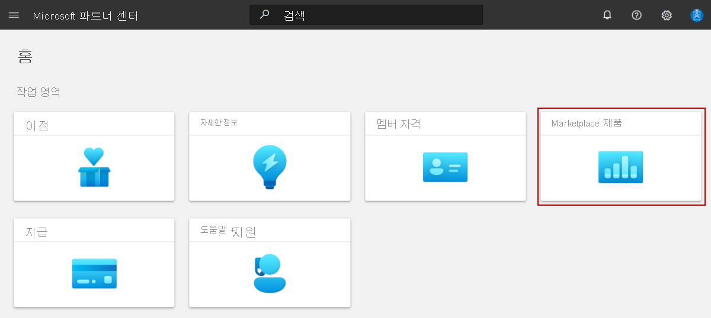

# Power BI 시각적 제안 만들기

이 문서에서는 파트너 센터를 사용 하 여 다른 사용자가 검색 하 고 사용할 수 있는 [Microsoft AppSource](https://appsource.microsoft.com) 에 Power BI 시각적 제품을 제출 하는 방법을 설명 합니다.

시작하기 전에 [파트너 센터](./create-account.md)에서 상업용 Marketplace 계정을 만들고 상업용 Marketplace 프로그램에 해당 계정이 등록되어 있는지 확인합니다.

## 시작하기 전에

[Power BI 시각적 제안 계획을](marketplace-power-bi-visual.md)검토 합니다. 이 제안에 대한 기술 요구 사항과 이 제안을 만들 때 필요한 정보 및 자산이 설명되어 있습니다.

## 새 제안 만들기

[!INCLUDE [Workspaces view note](./includes/preview-interface.md)]

#### [작업 영역 보기](#tab/workspaces-view)

1. [파트너 센터](https://partner.microsoft.com/dashboard/home)에 로그인합니다.

1. 홈 페이지에서 **Marketplace 제품** 타일을 선택 합니다.

    

1. Marketplace 제품 페이지에서 **+ 새 제품**  >  **Power BI 시각적 개체** 를 선택 합니다.

    

#### [현재 보기](#tab/current-view)

1. [파트너 센터](https://partner.microsoft.com/dashboard/home)에 로그인합니다.
1. 왼쪽 탐색 메뉴에서 **상업용 Marketplace** > **개요** 를 선택합니다.
1. 개요 페이지에서 **+ 새 제품**  >  **Power BI 시각적 개체** 를 선택 합니다.

    :::image type="content" source="media/power-bi-visual/new-offer-power-bi-visual.png" alt-text="왼쪽 창 메뉴 옵션과 ' 새 제안 ' 단추를 표시 합니다.":::

---

> [!IMPORTANT]
> 제품을 게시 한 후에는 제품을 다시 게시 한 후에 파트너 센터에서 사용자가 만든 모든 편집 내용이 AppSource에 표시 됩니다. 제안을 변경한 후에는 항상 다시 게시해야 합니다.

## 새 제안

**제품 ID** 를 입력합니다. 계정의 각 제품에 대한 고유 식별자입니다.

- 이 ID는 제안 웹 주소 및 Azure Resource Manager 템플릿(해당하는 경우)에서 고객에게 표시됩니다.
- 소문자와 숫자만 사용할 수 있습니다. ID는 하이픈 및 밑줄을 포함할 수 있지만 공백은 포함할 수 없으며, 50자로 제한됩니다. 예를 들어 게시자 ID가 `testpublisherid`이고 **test-offer-1** 을 입력하는 경우 제안 웹 주소는 `https://appsource.microsoft.com/product/dynamics-365/testpublisherid.test-offer-1`이 됩니다.
- **만들기** 를 선택한 후에는 제품 ID를 변경할 수 없습니다.
- 제품 ID는 파트너 센터의 다른 모든 Power BI 시각적 제품 목록 내에서 고유 해야 합니다.

**제품 별칭** 을 입력합니다. 파트너 센터에서 제품에 사용되는 이름입니다.

- 이 이름은 AppSource에서 사용 되지 않습니다. 고객에게 표시되는 제안 이름 및 다른 값과 다릅니다.

**만들기** 를 선택하여 제안을 생성합니다. 파트너 센터에서 **제안 설정** 페이지를 엽니다.

## 설정 정보

**추가 구매** 의 경우 제품에 서비스 또는 추가 앱 구매 구매가 필요한 지 여부를 선택 합니다.

**Power BI 인증** 의 경우 (선택 사항) 설명을 자세히 읽고 인증 Power BI를 요청 하려면 확인란을 선택 합니다. [인증](https://aka.ms/PBIvisualcertification) 된 Power BI 시각적 개체는 Microsoft Power BI 팀이 테스트 하 고 승인한 특정 코드 요구 사항을 충족 합니다. 인증 프로세스에서 제품 게시를 지연 시킬 수 있는 추가 시간이 걸리기 때문에 인증을 요청 *하기 전에* Power BI 시각적 개체를 제출 하 고 게시 하는 것이 좋습니다.

## 잠재 고객

[!INCLUDE [Connect lead management](includes/customer-leads.md)]

CRM에 연결 하는 것은 선택 사항입니다. 자세한 내용은 [상업용 Marketplace 제안의 잠재 고객](partner-center-portal/commercial-marketplace-get-customer-leads.md)을 참조하세요.

왼쪽 탐색 메뉴 **속성** 에서 다음 탭을 계속 진행하려면 **초안 저장** 을 선택하세요.

## 다음 단계

- [**제품 속성**](power-bi-visual-properties.md)
