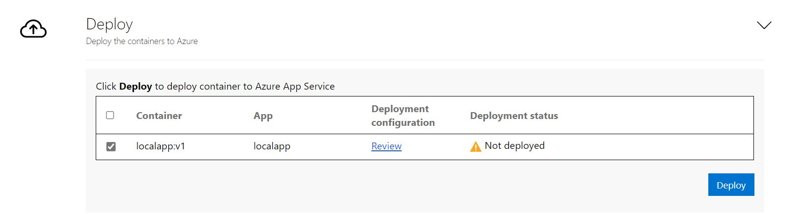

# <a name="aspnet-app-containerization-and-migration-to-azure-app-service"></a>ASP.NET 앱 컨테이너화 및 Azure App Service로 마이그레이션

이 문서에서는 Azure Migrate 앱 컨테이너화 도구를 사용하여 ASP.NET 애플리케이션을 컨테이너화하고, [Azure App Service](https://azure.microsoft.com/services/app-service/)로 마이그레이션하는 방법에 대해 알아봅니다. 컨테이너화 프로세스는 코드베이스에 액세스할 필요가 없으며 기존 애플리케이션을 컨테이너화하는 쉬운 방법을 제공합니다. 이 도구는 서버에서 애플리케이션의 실행 상태를 사용하여 애플리케이션 구성 요소를 결정합니다. 그런 다음, 컨테이너 이미지에 패키지하는 데 도움이 됩니다. 그러면 컨테이너화된 애플리케이션을 Azure App Service에 배포할 수 있습니다.

Azure Migrate 앱 컨테이너화 도구에서 현재 지원하는 작업은 다음과 같습니다.

- ASP.NET 앱을 컨테이너화하여 App Service의 Windows 컨테이너에 배포.
- ASP.NET 앱을 컨테이너화하고 AKS(Azure Kubernetes Service)의 Windows 컨테이너에 배포 [이 컨테이너화 시나리오에 대해 자세히 알아보세요.](./tutorial-app-containerization-aspnet-kubernetes.md)
- Apache Tomcat(Linux 서버)의 Java 웹앱을 컨테이너화하여 AKS의 Linux 컨테이너에 배포. [이 컨테이너화 시나리오에 대해 자세히 알아보세요.](./tutorial-app-containerization-java-kubernetes.md)
- Apache Tomcat(Linux 서버)의 Java 웹앱을 컨테이너화하여 App Service의 Linux 컨테이너에 배포. [이 컨테이너화 시나리오에 대해 자세히 알아보세요.](./tutorial-app-containerization-java-app-service.md)

앱 컨테이너화 도구를 사용하면 다음과 같은 이점이 있습니다.

- **애플리케이션 구성 요소를 검색합니다.** 이 도구는 ASP.NET 애플리케이션을 실행하는 애플리케이션 서버에 원격으로 연결하여 애플리케이션 구성 요소를 검색합니다. 애플리케이션에 대한 컨테이너 이미지를 만드는 데 사용할 수 있는 Dockerfile을 만듭니다.
- **컨테이너 이미지를 빌드합니다.** 애플리케이션 요구 사항에 따라 Dockerfile을 검사하고 추가로 사용자 지정하고, 이를 사용하여 애플리케이션 컨테이너 이미지를 빌드할 수 있습니다. 애플리케이션 컨테이너 이미지는 지정한 Azure 컨테이너 레지스트리로 푸시됩니다.
- **Azure App Service에 배포합니다.**  이 도구는 컨테이너화된 애플리케이션을 Azure App Service에 배포하는 데 필요한 배포 파일을 생성합니다.

> [!NOTE]
> Azure Migrate 앱 컨테이너화 도구를 사용하면 애플리케이션 서버에서 특정 애플리케이션 유형(Apache Tomcat의 ASP.NET 및 Java 웹앱) 및 해당 구성 요소를 검색할 수 있습니다. 온-프레미스 컴퓨터에서 실행되는 서버와 앱, 역할, 기능의 인벤토리를 검색하려면 [Azure Migrate 검색 및 평가 도구](./tutorial-discover-vmware.md)를 사용합니다.

모든 애플리케이션에서 중요한 재설계 없이 컨테이너로 직접 전환할 수 있는 이점을 활용할 수 있는 것은 아닙니다. 그러나 다시 작성하지 않고도 기존 앱을 컨테이너로 이동하면 다음과 같은 이점이 있습니다.

- **향상된 인프라 사용률.** 컨테이너를 사용하면 여러 애플리케이션이 리소스를 공유하고 동일한 인프라에서 호스트될 수 있습니다. 이를 통해 인프라를 통합하고 사용률을 향상할 수 있습니다.
- **간소화된 관리.** AKS 및 App Service와 같은 최신 관리형 플랫폼에서 애플리케이션을 호스트하면 관리 사례를 간소화할 수 있습니다. 이러한 간소화는 일반적으로 소유한 인프라를 사용하여 수행하는 인프라 유지 관리 및 관리 프로세스를 사용 중지하거나 축소하여 달성할 수 있습니다.
- **애플리케이션 이식성.** 컨테이너 사양 형식과 플랫폼의 채택 및 표준화가 증가함에 따라 애플리케이션 이식성은 더 이상 문제가 되지 않습니다.
- **DevOps를 사용하여 최신 관리 도입.** 컨테이너를 사용하면 최신 관리 및 보안 사례와 DevOps로의 전환을 채택하고 표준화할 수 있습니다.


이 자습서에서는 다음과 같은 작업을 수행하는 방법을 알아봅니다.

> [!div class="checklist"]
> * Azure 계정을 설정합니다.
> * Azure Migrate 앱 컨테이너화 도구를 설치합니다.
> * ASP.NET 애플리케이션을 검색합니다.
> * 컨테이너 이미지를 빌드합니다.
> * 컨테이너화된 애플리케이션을 App Service에 배포합니다.

> [!NOTE]
> 이러한 자습서에서는 개념 증명을 빠르게 설정할 수 있도록 시나리오에 대한 가장 간단한 배포 경로를 제공합니다. 가능한 경우 기본 옵션을 사용하며, 가능한 모든 설정과 경로를 보여 주지 않습니다.

## <a name="prerequisites"></a>필수 조건

이 자습서를 시작하기 전에 먼저 다음을 수행해야 합니다.

**요구 사항** | **세부 정보**
--- | ---
**도구를 설치할 컴퓨터 식별** | Azure Migrate 앱 컨테이너화 도구를 설치하고 실행할 Windows 컴퓨터가 필요합니다. Windows 컴퓨터는 서버(Windows Server 2016 이상) 또는 클라이언트(Windows 10) 운영 체제를 실행할 수 있습니다. (도구는 데스크톱에서 실행할 수 있습니다.) <br/><br/> 도구를 실행하는 Windows 컴퓨터에는 컨테이너화할 ASP.NET 애플리케이션을 호스트하는 서버 또는 가상 머신에 대한 네트워크 연결이 있어야 합니다.<br/><br/> Azure Migrate 앱 컨테이너화 도구를 실행하는 Windows 컴퓨터에서 6GB를 사용할 수 있어야 합니다. 이는 애플리케이션 아티팩트를 저장하기 위한 공간입니다. <br/><br/> Windows 컴퓨터에서 직접 또는 프록시를 통해 인터넷에 액세스할 수 있어야 합니다. <br/> <br/>Microsoft 웹 배포 도구가 앱 컨테이너화 도구 및 애플리케이션 서버를 실행하는 컴퓨터에 아직 설치되지 않은 경우 해당 도구를 설치합니다. [도구를 다운로드](https://aka.ms/webdeploy3.6)할 수 있습니다.
**애플리케이션 서버** | 애플리케이션 서버에서 PowerShell 원격을 사용하도록 설정합니다. 애플리케이션 서버에 로그인하고 [이러한 지침에 따라 PowerShell 원격을 설정](/powershell/module/microsoft.powershell.core/enable-psremoting)합니다. <br/><br/> 애플리케이션 서버가 Windows Server 2008 R2에서 실행되는 경우 애플리케이션 서버에 PowerShell 5.1이 설치되어 있어야 합니다. [여기의 지침에 따라 PowerShell 5.1을 애플리케이션 서버에 다운로드하고 설치](/powershell/scripting/windows-powershell/wmf/setup/install-configure)하세요. <br/><br/> Microsoft 웹 배포 도구가 앱 컨테이너화 도구 및 애플리케이션 서버를 실행하는 컴퓨터에 아직 설치되지 않은 경우 해당 도구를 설치합니다. [도구를 다운로드](https://aka.ms/webdeploy3.6)할 수 있습니다.
**ASP.NET 응용 프로그램** | 이 도구에서 현재 지원하는 항목은 다음과 같습니다. <br> <ul><li> .NET Framework 3.5 이상을 사용하는 ASP.NET 애플리케이션<br/> <li>Windows Server 2008 R2 이상을 실행하는 애플리케이션 서버 (애플리케이션 서버는 PowerShell 5.1을 실행해야 합니다.) <br/><li> 인터넷 정보 서비스 7.5 이상에서 실행되는 애플리케이션</ul> <br/><br/> 이 도구에서 현재 지원하지 않는 항목은 다음과 같습니다. <br/> <ul><li>Windows 인증을 요구하는 애플리케이션 (AKS는 현재 gMSA를 지원하지 않습니다.) <br/> <li> 인터넷 정보 서비스 외부에서 호스트되는 다른 Windows 서비스를 사용하는 애플리케이션


## <a name="prepare-an-azure-user-account"></a>Azure 사용자 계정 준비

Azure 구독이 아직 없는 경우 시작하기 전에 [무료 계정](https://azure.microsoft.com/pricing/free-trial/)을 만듭니다.

구독이 설정되면 다음이 포함된 Azure 사용자 계정이 필요합니다.
- Azure 구독에 대한 소유자 권한
- Azure Active Directory 앱을 등록할 수 있는 권한.

Azure 체험 계정을 방금 만든 경우 자신이 구독에 대한 소유자입니다. 구독 소유자가 아닌 경우 다음과 같이 소유자와 협력하여 권한을 할당합니다.

1. Azure Portal에서 "구독"을 검색합니다. **서비스** 아래에서 **구독** 을 선택합니다.

    

2. **구독** 페이지에서 Azure Migrate 프로젝트를 만들려는 구독을 선택합니다.
3. 구독의 왼쪽 창에서 **액세스 제어(IAM)** 를 선택합니다.
4. **액세스 권한 확인** 탭에서 관련 사용자 계정을 검색합니다.
5. **역할 할당 추가** 아래에서 **추가** 를 선택합니다.

    

6. **역할 할당 추가** 페이지에서 **소유자** 역할을 선택한 다음, 계정(이 예에서는 **azmigrateuser**)을 선택합니다. 그런 다음 **저장** 을 선택합니다.

    

   또한 Azure 계정에는 Azure Active Directory 앱을 등록할 수 있는 권한이 필요합니다.
8. Azure Portal에서 **Azure Active Directory** > **사용자** > **사용자 설정** 으로 차례로 이동합니다.
9. **사용자 설정** 에서 Azure AD 사용자가 애플리케이션을 등록할 수 있는지 확인합니다. (이 옵션은 기본적으로 **예** 로 설정되어 있습니다.)

      

10. **앱 등록** 옵션이 **아니요** 로 설정되는 경우 테넌트/전역 관리자에게 필요한 권한을 할당하도록 요청합니다. 또는 테넌트/전역 관리자가 애플리케이션 개발자 역할을 계정에 할당하여 Azure Active Directory 앱 등록을 허용할 수 있습니다. 자세한 내용은 [사용자에게 역할 할당](../active-directory/fundamentals/active-directory-users-assign-role-azure-portal.md)을 참조하세요.

## <a name="download-and-install-the-azure-migrate-app-containerization-tool"></a>Azure Migrate 앱 컨테이너화 도구 다운로드 및 설치

1. Windows 컴퓨터에서 [Azure Migrate 앱 컨테이너화 설치 프로그램을 다운로드](https://go.microsoft.com/fwlink/?linkid=2134571)합니다.
2. 관리자 모드에서 PowerShell을 열고, PowerShell 디렉터리를 설치 프로그램이 포함된 폴더로 변경합니다.
3. 다음 명령을 사용하여 설치 스크립트를 실행합니다.

   ```powershell
   .\AppContainerizationInstaller.ps1
   ```

## <a name="open-the-app-containerization-tool"></a>앱 컨테이너화 도구 열기

1. 앱 컨테이너화 도구를 실행하는 Windows 컴퓨터에 연결할 수 있는 모든 컴퓨터에서 브라우저를 엽니다. 도구 URL(**https://*컴퓨터 이름 또는 IP 주소*: 44369**)로 이동합니다.

   또는 앱 바로 가기를 사용하여 바탕 화면에서 앱을 열 수 있습니다.

2. 프라이빗 연결이 아니라는 경고가 표시되면 **고급** 을 선택하고 웹사이트로 이동합니다. 이 경고는 웹 인터페이스가 자체 서명된 TLS/SSL 인증서를 사용하므로 표시됩니다.
3. 로그인 화면에서 컴퓨터의 로컬 관리자 계정을 사용하여 로그인합니다.
4. 컨테이너화하려는 애플리케이션의 유형으로 **ASP.NET 웹앱** 을 선택합니다.
5. **대상 Azure 서비스** 목록에서 **Azure App Service의 컨테이너** 를 선택합니다.

   

### <a name="complete-the-tool-prerequisites"></a>도구 필수 구성 요소 완료
1. 사용 조건에 동의하고 타사 정보를 읽어봅니다.
6. 도구 웹앱 **필수 구성 요소 설정** 에서 다음 단계를 완료합니다.
   - **연결.** 이 도구는 Windows 컴퓨터에서 인터넷에 액세스할 수 있는지 확인합니다. 컴퓨터에서 프록시를 사용하는 경우:
     1. **프록시 설정** 을 클릭하여 프록시 주소(IP 주소 또는 FQDN 형식) 및 수신 대기 포트를 지정합니다.
     1. 프록시에 인증이 필요한 경우 자격 증명을 지정합니다.
       
     1. 프록시 세부 정보를 추가했거나 프록시 또는 인증을 사용하지 않도록 설정한 경우 **저장** 을 선택하여 연결 확인을 다시 트리거합니다.
     
     HTTP 프록시만 지원됩니다.
   - **업데이트 설치** 이 도구는 자동으로 최신 업데이트를 확인하고 설치합니다. [최신 버전의 도구를 수동으로 설치](https://go.microsoft.com/fwlink/?linkid=2134571)할 수도 있습니다.
   - **Microsoft 웹 배포 도구 설치.** 이 도구는 Azure Migrate 앱 컨테이너화 도구를 실행하는 Windows 컴퓨터에 Microsoft 웹 배포 도구가 설치되어 있는지 확인합니다.
   - **PowerShell 원격 사용.** 이 도구는 컨테이너화하려는 ASP.NET 애플리케이션을 실행하는 애플리케이션 서버에서 PowerShell 원격이 사용하도록 설정되어 있는지 확인하라는 메시지를 표시합니다.


## <a name="sign-in-to-azure"></a>Azure에 로그인

1. **로그인** 을 선택하여 Azure 계정에 로그인합니다.

   Azure로 인증하려면 디바이스 코드가 필요합니다. **로그인** 을 선택하면 디바이스 코드가 포함된 창이 열립니다. 창이 표시되지 않으면 브라우저에서 팝업 차단을 사용하지 않도록 설정했는지 확인합니다.
2. **코드 복사 및 로그인** 을 선택하여 디바이스 코드를 복사하고, 새 브라우저 탭에서 Azure 로그인 프롬프트를 엽니다.

    

3. 새 탭에서 디바이스 코드를 붙여넣고, Azure 계정 자격 증명을 사용하여 로그인을 완료합니다. 로그인되면 브라우저 탭을 닫고, 앱 컨테이너화 도구의 웹 인터페이스로 돌아갈 수 있습니다.
4. 사용할 **Azure 테넌트** 를 선택합니다.
5. 사용할 **Azure 구독** 을 지정합니다.

## <a name="discover-aspnet-applications"></a>ASP.NET 애플리케이션 검색

앱 컨테이너화 도구는 제공된 자격 증명을 사용하여 애플리케이션 서버에 원격으로 연결하고, 애플리케이션 서버에서 호스트되는 ASP.NET 애플리케이션에 대한 검색을 시도합니다.

1. 애플리케이션 검색을 위해 서버에 원격으로 연결하는 데 사용해야 하는 ASP.NET 애플리케이션을 실행하는 서버의 **서버 IP 주소/FQDN** 및 자격 증명을 지정합니다.
    - 애플리케이션 서버의 로컬 관리자(Windows)에 대한 자격 증명을 제공해야 합니다.
    - 도메인 계정(사용자가 애플리케이션 서버의 관리자여야 함)의 경우 도메인 이름을 *<도메인\사용자 이름>* 형식으로 사용자 이름 앞에 붙입니다.
    - 로컬 계정(사용자가 애플리케이션 서버의 관리자여야 함)의 경우 호스트 이름을 *<호스트 이름\사용자 이름>* 형식으로 사용자 이름 앞에 붙입니다.
    - 애플리케이션 검색을 한 번에 최대 5개의 서버에 대해 실행할 수 있습니다.

2. **유효성 검사** 를 선택하여 도구를 실행하는 컴퓨터에서 애플리케이션 서버에 연결할 수 있고 자격 증명이 유효한지 확인합니다. 유효성 검사에 성공하면 **상태** 열에 **매핑됨** 상태가 표시됩니다.

    

3. **계속** 을 클릭하여 선택한 애플리케이션 서버에서 애플리케이션 검색을 시작합니다.

4. 애플리케이션 검색이 완료되면 컨테이너화하려는 애플리케이션을 선택합니다.

    

6. 선택한 각 애플리케이션에 대한 대상 컨테이너 이름을 지정합니다. 컨테이너 이름을 <*이름:태그*>로 지정합니다. 여기서 *태그* 는 컨테이너 이미지에 사용됩니다. 예를 들어 대상 컨테이너 이름을 *appname:v1* 으로 지정할 수 있습니다.   

### <a name="parameterize-application-configurations"></a>애플리케이션 구성 매개 변수화
구성을 매개 변수화하면 이를 배포 시간 매개 변수로 사용할 수 있습니다. 매개 변수화를 사용하면 컨테이너 이미지의 특정 값으로 하드 코딩하는 대신 애플리케이션을 배포할 때 설정을 구성할 수 있습니다. 예를 들어 이 옵션은 데이터베이스 연결 문자열과 같은 매개 변수에 유용합니다.
1. **앱 구성** 을 선택하여 검색된 구성을 검토합니다.
2. 매개 변수화하려는 매개 변수를 선택한 다음, **적용** 을 선택합니다.

   

### <a name="externalize-file-system-dependencies"></a>파일 시스템 종속성 외부화

 애플리케이션이 사용하는 다른 폴더를 추가할 수 있습니다. 해당 폴더가 컨테이너 이미지의 일부여야 하는지, 아니면 Azure 파일 공유를 통해 영구 스토리지로 외부화해야 하는지를 지정합니다. 외부 영구 스토리지를 사용하는 것은 상태를 컨테이너 외부에 저장하거나 다른 정적 콘텐츠가 파일 시스템에 저장되는 상태 저장 애플리케이션에 적합합니다.

1. **애플리케이션 폴더** 아래에서 **편집** 을 선택하여 검색된 애플리케이션 폴더를 검토합니다. 이러한 폴더는 애플리케이션에 필요한 필수 아티팩트로 식별되었습니다. 이는 컨테이너 이미지에 복사됩니다.

2. **폴더 추가** 를 선택하고, 추가하려는 폴더 경로를 지정합니다.
3. 여러 폴더를 동일한 볼륨에 추가하려면 값을 쉼표로 구분합니다.
4. 폴더를 영구 스토리지의 컨테이너 외부에 저장하려면 스토리지 옵션으로 **Azure 파일 공유** 를 선택합니다.
5. 애플리케이션 폴더를 검토한 후 **저장** 을 선택합니다.

   

6. **계속** 을 선택하여 컨테이너 이미지 빌드 단계로 진행합니다.

## <a name="build-container-image"></a>컨테이너 이미지 만들기


1. 드롭다운 목록에서 앱에 대한 컨테이너 이미지를 빌드하고 저장하는 데 사용할 [Azure 컨테이너 레지스트리](../container-registry/index.yml)를 선택합니다. 기존 Azure 컨테이너 레지스트리를 사용하거나 **새 레지스트리 만들기** 를 선택하여 새 레지스트리를 만들 수 있습니다.

    

   > [!NOTE]
   > 관리자 계정이 사용하도록 설정된 Azure 컨테이너 레지스트리만 표시됩니다. 관리자 사용자 계정은 현재 이미지를 Azure 컨테이너 레지스트리에서 Azure App Service로 배포하는 데 필요합니다. 자세한 내용은 [Azure Container Registry로 인증](../container-registry/container-registry-authentication.md#admin-account)을 참조하세요.

2. 선택한 각 애플리케이션의 컨테이너 이미지를 빌드하는 데 필요한 Dockerfile은 빌드 단계를 시작할 때 생성됩니다. **검토** 를 선택하여 Dockerfile을 검토합니다. 검토 단계에서 Dockerfile에 필요한 사용자 지정 항목을 추가하고, 빌드 프로세스를 시작하기 전에 변경 내용을 저장할 수도 있습니다.

3. 이미지를 빌드하려는 애플리케이션을 선택한 다음, **빌드** 를 선택합니다. **빌드** 를 선택하면 각 애플리케이션에 대한 컨테이너 이미지 빌드가 시작됩니다. 이 도구는 빌드 상태를 모니터링하고, 빌드가 완료되면 다음 단계로 계속 진행할 수 있도록 합니다.

4.  상태 열 아래에서 **빌드 진행 중** 을 선택하여 빌드 진행 상황을 모니터링할 수 있습니다. 빌드 프로세스를 트리거한지 몇 분 후에 링크가 활성화됩니다.  

5. 빌드가 완료되면 **계속** 을 선택하여 배포 설정을 지정합니다.

    

## <a name="deploy-the-containerized-app-on-azure-app-service"></a>Azure App Service에 컨테이너화된 앱 배포

컨테이너 이미지가 빌드되면 다음 단계는 애플리케이션을 컨테이너로 [Azure App Service](https://azure.microsoft.com/services/app-service/)에 배포하는 것입니다.

1. 애플리케이션에서 사용해야 하는 Azure App Service 요금제를 선택합니다.

   App Service 요금제가 없거나 사용할 새 App Service 요금제를 만들려는 경우 **새 App Service 요금제 만들기** 를 선택하여 만들 수 있습니다.      
1. App Service 요금제가 선택되면 **계속** 을 선택합니다.

2. 애플리케이션 구성을 매개 변수화한 경우 애플리케이션에 사용할 비밀 저장소를 지정합니다. Azure Key Vault 또는 App Service 애플리케이션 설정을 선택하여 애플리케이션 비밀을 관리할 수 있습니다. 자세한 내용은 [연결 문자열 구성](../app-service/configure-common.md#configure-connection-strings)을 참조하세요.

     - 비밀을 관리하기 위해 App Service 애플리케이션 설정을 선택한 경우 **계속** 을 선택합니다.
     - Azure 키 자격 증명 모음을 사용하여 애플리케이션 비밀을 관리하려는 경우 사용하려는 키 자격 증명 모음을 지정합니다.     
         - Azure 키 자격 증명 모음이 없거나 새 키 자격 증명 모음을 만들려는 경우 **새 Azure Key Vault 만들기** 를 선택하여 만들 수 있습니다.
         - 이 도구는 키 자격 증명 모음을 통해 비밀을 관리하는 데 필요한 권한을 자동으로 할당합니다.

3. 폴더를 더 추가하고 영구 스토리지에 대해 Azure 파일 공유 옵션을 선택한 경우 배포 중에 앱 컨테이너화 도구에서 사용할 Azure 파일 공유를 지정합니다. 이 도구는 Azure Files에 대해 구성한 애플리케이션 폴더를 복사하고, 배포 중에 애플리케이션 컨테이너에 탑재합니다. 

   Azure 파일 공유가 없거나 새 Azure 파일 공유를 만들려는 경우 **새 스토리지 계정 및 파일 공유 만들기** 를 선택하여 만들 수 있습니다.  

4. 이제 애플리케이션에 대한 배포 구성을 지정해야 합니다. **구성** 을 선택하여 애플리케이션 배포를 사용자 지정합니다. 구성 단계에서 다음과 같은 사용자 지정을 제공할 수 있습니다.
     - **이름.** 애플리케이션에 대해 고유한 앱 이름을 지정합니다. 이 이름은 애플리케이션 URL을 생성하는 데 사용됩니다. 또한 배포의 일부로 만들어지는 다른 리소스에 대한 접두사로도 사용됩니다.
     - **애플리케이션 구성.** 매개 변수화된 애플리케이션 구성의 경우 현재 배포에 사용할 값을 제공합니다.
     - **스토리지 구성.** 영구 스토리지로 구성된 모든 애플리케이션 폴더에 대한 정보를 검토합니다.

    

5. 애플리케이션에 대한 배포 구성이 저장되면 도구에서 애플리케이션에 대한 Kubernetes 배포 YAML을 생성합니다.
     - **검토** 를 선택하여 애플리케이션에 대한 배포 구성을 검토합니다.
     - 배포하려는 애플리케이션을 선택합니다.
     - **배포** 를 선택하여 선택한 애플리케이션에 대한 배포를 시작합니다.

         

     - 애플리케이션이 배포되면 **배포 상태** 열을 선택하여 애플리케이션에 대해 배포된 리소스를 추적할 수 있습니다.


## <a name="troubleshoot-problems"></a>문제 해결

앱 컨테이너화 도구와 관련된 문제를 해결하기 위해 도구를 실행하는 Windows 컴퓨터에서 로그 파일을 살펴볼 수 있습니다. 도구에 대한 로그 파일은 *C:\ProgramData\Microsoft Azure Migrate App Containerization\Logs* 에 있습니다.

## <a name="next-steps"></a>다음 단계

- [ASP.NET 웹앱을 컨테이너화하고 AKS의 Windows 컨테이너에 배포](./tutorial-app-containerization-aspnet-kubernetes.md)
- [Apache Tomcat(Linux 서버에 있는)의 Java 웹앱을 컨테이너화하고 AKS의 Linux 컨테이너에 배포](./tutorial-app-containerization-java-kubernetes.md)
- [Apache Tomcat(Linux 서버에 있는)의 Java 웹앱을 컨테이너화하고 App Service의 Linux 컨테이너에 배포](./tutorial-app-containerization-java-app-service.md)
