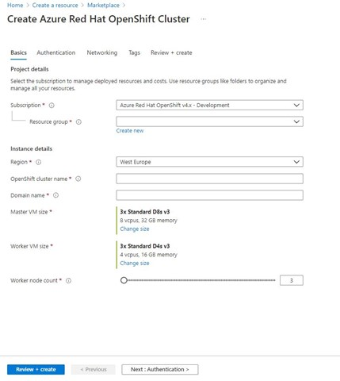
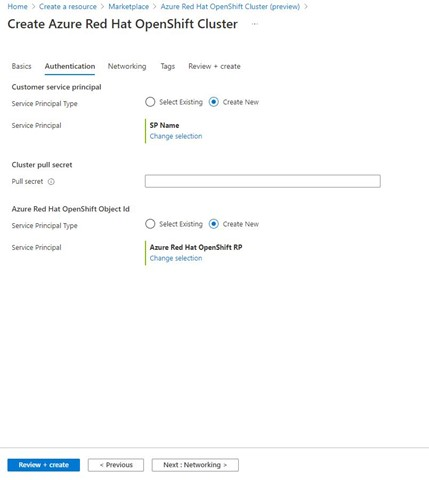
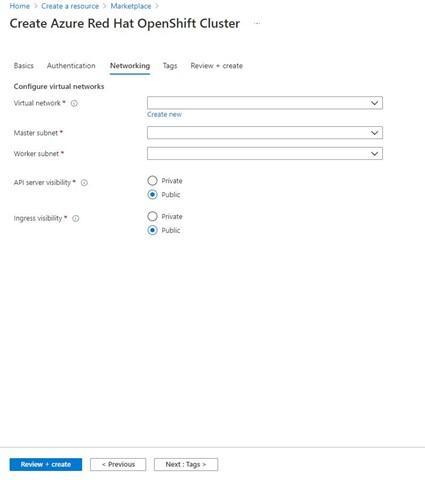
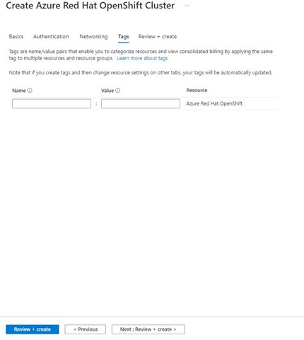
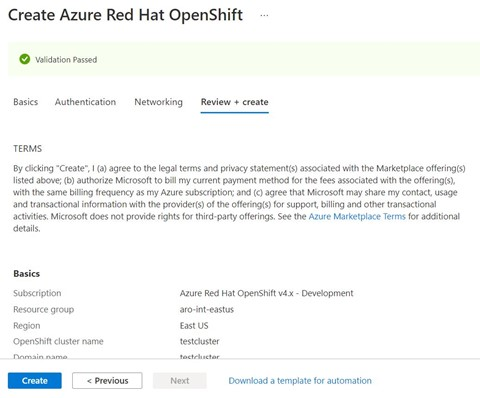

# 빠른 시작: Azure Portal을 사용하여 ARO(Azure Red Hat OpenShift) 클러스터 배포

ARO(Azure Red Hat OpenShift)는 클러스터를 신속하게 배포하고 관리할 수 있는 관리형 OpenShift 서비스입니다. 이 빠른 시작에서는 Azure Portal을 사용하여 AKS 클러스터를 배포합니다.

## 필수 구성 요소
[Azure Portal](https://portal.azure.com)에 로그인합니다.

## ARO 클러스터 만들기
1.  Azure Portal 메뉴 또는 **홈** 페이지에서 **리소스 만들기** 를 선택합니다.
2.  **컨테이너** > **Azure Red Hat OpenShift** 를 선택합니다.
3.  **기본** 페이지에서 다음 옵션을 구성합니다.
    * **프로젝트 세부 정보**:
        *   **Azure 구독** 을 선택합니다.
        *   **Azure 리소스 그룹**(예: *myResourceGroup*)을 선택하거나 만듭니다.
    * **클러스터 세부 정보**:
        * ARO 클러스터에 대한 **지역** 을 선택합니다.
        *   *myAROCluster* 같은 OpenShift **클러스터 이름** 을 입력합니다.
        *   **도메인 이름** 을 입력합니다.
        *   **마스터 VM 크기** 및 **작업자 VM 크기** 를 선택합니다.

4.  **인증 페이지** 에서 다음 옵션을 구성합니다.
    1) 서비스 주체 유형 선택기에서 **기존 항목 선택** 을 선택합니다(이미 선택한 경우 아무 작업도 필요하지 않으며 다음 단계를 계속 진행할 수 있음).
    2) Azure Red Hat Open Shift RP를 검색하고 선택합니다. 

>[!NOTE]
>"새로 만들기" 단추 및 기타 선택적 필드는 무시하세요.

5.  **네트워킹** 탭에서 다음을 구성해야 합니다.
    * 가상 네트워크
    * 마스터 서브넷
    * 작업자 서브넷
    * API 서버 표시 유형
    * 수신 표시 유형

6.  **태그** 섹션에서 태그를 추가하여 리소스를 구성합니다.

 
7.  **검토 + 만들기** 를 클릭한 후 유효성 검사가 완료되면 **만들기** 를 선택합니다.

 
8.  ARO 클러스터를 만드는 데 약 35-45분이 걸립니다. 배포가 완료되면 다음 중 하나를 수행하여 리소스로 이동합니다.
    *   **리소스로 이동** 을 클릭하거나
    *   ARO 클러스터 리소스 그룹으로 이동하고 ARO 리소스를 선택합니다.
        *   아래 클러스터 대시보드의 예: *myResourceGroup* 을 검색하고 *myAROCluster* 리소스를 선택합니다.
