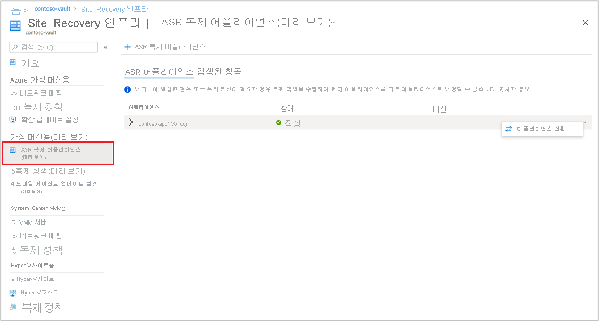

# Azure에 온-프레미스 VMware VM 재해 복구 설정 - 미리 보기

이 문서에서는 Azure로 재해 복구를 위해 [Azure Site Recovery](site-recovery-overview.md) 서비스 - 미리 보기를 사용하여 온-프레미스 VMware VM을 복제하도록 설정하는 방법을 설명합니다.

Azure Site Recovery 클래식 릴리스에서 재해 복구를 설정하는 방법에 대한 자세한 내용은 [이 자습서](vmware-azure-tutorial.md)를 참조하세요.

이 자습서는 온-프레미스 VMware VM을 Azure로 재해 복구하도록 설정하는 방법을 보여주는 자습서 시리즈 중 세 번째 자습서입니다. 이전 자습서에서는 Azure로 재해 복구하기 위한 [온-프레미스 VMware 환경을 준비](vmware-azure-tutorial-prepare-on-premises.md)했습니다.

이 자습서에서는 다음 작업 방법을 알아봅니다.

> [!div class="checklist"]
> * 원본 복제 설정을 지정합니다.
> * 복제 대상 설정 지정
> * VMware VM을 복제하도록 설정

> [!NOTE]
> 자습서는 시나리오에 맞는 가장 간단한 배포 경로를 보여줍니다. 가능한 경우 기본 옵션을 사용하고 가능한 모든 설정과 경로를 보여주지 않습니다. 자세한 내용은 Site Recovery 목차의 방법 섹션에 있는 문서를 참조하세요.

## 시작

VMware에서 Azure로 복제하려면 다음 절차가 필요합니다.

- [Azure Portal](https://portal.azure.com/)에 로그인합니다.
- 시작하려면 [Azure 미리 보기 포털](https://aka.ms/rcmcanary)로 이동합니다. 그리고 다음 섹션에 자세히 설명된 단계를 수행합니다.
- Azure 계정 준비
- 인프라 준비
- [복구 서비스 자격 증명 모음 만들기](./quickstart-create-vault-template.md?tabs=CLI)
- [Azure Site Recovery 복제 어플라이언스 배포](deploy-vmware-azure-replication-appliance-preview.md)
- 복제 사용

## Azure 계정 준비

Azure Site Recovery 복제 어플라이언스를 만들고 등록하려면 다음 권한이 있는 Azure 계정이 필요합니다.

- Azure 구독에 대한 기여자 또는 소유자 권한
- AAD(Azure Active Directory) 앱을 등록할 수 있는 권한.
- 에이전트 없는 VMware 마이그레이션 중에 사용되는 Key Vault를 만들기 위한 Azure 구독에 대한 소유자 또는 기여자 및 사용자 액세스 관리자 권한

Azure 체험 계정을 방금 만든 경우 자신이 구독에 대한 소유자입니다. 구독 소유자가 아닌 경우 필수 사용 권한에 대해 소유자에게 문의합니다.

다음 단계에 따라 필요한 권한을 할당합니다.

1. Azure Portal에서 **구독** 을 검색하고, **서비스** 아래에서 **구독** 검색 상자를 선택하여 필요한 Azure 구독을 검색합니다.

2. **구독 페이지** 에서 Recovery Services 자격 증명 모음을 만든 구독을 선택합니다.

3. 구독에서 **액세스 제어(IAM)** > **액세스 확인** 을 선택합니다. **액세스 확인** 에서 관련 사용자 계정을 검색합니다.

4. **역할 할당 추가** 에서 **추가** 를 선택하고, 기여자 또는 소유자 역할을 선택하고, 계정을 선택합니다. 그런 다음, **저장** 을 선택합니다.

5. Azure Site Recovery 복제 어플라이언스를 등록하려면 Azure 계정에 AAD 앱을 등록할 수 있는 권한이 있어야 합니다.

**다음 단계에 따라 필요한 권한을 할당합니다**.

1. Azure Portal에서 **Azure Active Directory** > **사용자** > **사용자 설정** 으로 차례로 이동합니다. **사용자 설정** 에서 Azure AD 사용자가 애플리케이션을 등록할 수 있는지 확인합니다(기본적으로 *예* 로 설정됨).

2. **앱 등록** 설정이 *아니요* 로 설정되는 경우 테넌트/전역 관리자에게 필요한 권한을 할당하도록 요청합니다. 또는 테넌트/전역 관리자가 애플리케이션 개발자 역할을 계정에 할당하여 AAD 앱 등록을 허용할 수 있습니다.

## 인프라 준비 - Azure Site Recovery 복제 어플라이언스 설정

모바일 에이전트 통신이 가능하도록 [온-프레미스 환경에서 Azure Site Recovery 복제 어플라이언스를 설정](deploy-vmware-azure-replication-appliance-preview.md)해야 합니다.

## VMware VM 복제를 사용하도록 설정

Azure Site Recovery 복제 어플라이언스가 자격 증명 모음에 추가되었으면 머신 보호를 시작할 수 있습니다.

스토리지 및 네트워킹 전반의 [필수 구성 요소](vmware-physical-azure-support-matrix.md)를 충족하는지 확인합니다.

다음 단계에 따라 복제를 사용하도록 설정합니다.

1. **시작** 섹션에서 **Site Recovery** 를 선택합니다. VMware 섹션에서 **복제 사용(미리 보기)** 을 클릭합니다.

2. Azure Site Recovery를 통해 보호하려는 머신 종류를 선택합니다.

   > [!NOTE]
   > 미리 보기에서는 가상 머신만 지원됩니다.

   

3. 가상 머신을 선택한 후에는 이 자격 증명 모음에 등록된 Azure Site Recovery 복제 어플라이언스 추가된 vCenter 서버를 선택합니다.

4. 나중에 원본 VM 이름을 검색하여 선택한 머신을 보호합니다. 선택한 VM을 검토하려면 **선택한 리소스** 를 선택합니다.

5. VM 목록을 선택한 후 **다음** 을 선택하여 원본 설정을 진행합니다. 여기서는 복제 어플라이언스 및 VM 자격 증명을 선택합니다. 이러한 자격 증명은 VM에서 구성 서버가 모바일 에이전트를 푸시하여 Azure Site Recovery 사용 설정을 완료하는 데 사용됩니다. 정확한 자격 증명을 선택해야 합니다.

   >[!NOTE]
   >Linux OS의 경우 루트 자격 증명을 제공해야 합니다. Windows OS의 경우 관리자 권한이 있는 사용자 계정을 추가해야 합니다. 이러한 자격 증명은 복제 작업을 사용하도록 설정하는 동안 Mobility Service를 원본 머신에 푸시하는 데 사용됩니다.

   

6. **다음** 을 선택하여 대상 지역 속성을 제공합니다. 기본적으로 자격 증명 모음 구독 및 자격 증명 모음 리소스 그룹이 선택됩니다. 원하는 구독 및 리소스 그룹을 선택할 수 있습니다. 나중에 장애 조치(failover)할 때 원본 머신이 이 구독 및 리소스 그룹에 배포됩니다.

   

7. 다음으로, 장애 조치(failover) 중에 사용할 기존 Azure 네트워크를 선택할 수도 있고 새 대상 네트워크를 만들 수도 있습니다. **새로 만들기** 를 선택하면 가상 네트워크 컨텍스트 블레이드를 만들도록 리디렉션되고, 주소 공간 및 서브넷 세부 정보를 제공하라는 메시지가 표시됩니다. 이 네트워크는 이전 단계에서 선택한 대상 구독 및 대상 리소스 그룹에 만들어집니다.

8. 그런 다음, 테스트 장애 조치(failover) 네트워크 세부 정보를 제공합니다.

   > [!NOTE]
   > 테스트 장애 조치(failover) 네트워크가 장애 조치(failover) 네트워크와 달라야 합니다. 이는 실제로 재해가 발생한 경우 장애 조치(failover) 네트워크를 즉시 사용할 수 있도록 하기 위한 것입니다.

9. 스토리지를 선택합니다.

    - 캐시 스토리지 계정: 이제 Azure Site Recovery에서 준비 목적으로 사용하는 캐시 스토리지 계정(관리 디스크에 변경 내용을 쓰기 전에 로그 캐싱 및 저장)을 선택합니다.

      기본적으로 자격 증명 모음에서 첫 번째 복제 작업을 사용하도록 설정할 때 Azure Site Recovery에서 새 LRS v1 유형 스토리지 계정이 만들어집니다. 후속 작업에서는 동일한 캐시 스토리지 계정이 다시 사용됩니다.
    -  관리 디스크

       기본적으로 표준 HDD 관리 디스크는 Azure에서 만들어집니다. **사용자 지정** 을 선택하여 관리 디스크 유형을 사용자 지정할 수 있습니다. 비즈니스 요구 사항에 따라 디스크 유형을 선택합니다. 원본 머신 디스크의 IOPS에 따라 [적절한 디스크 유형을 선택](../virtual-machines/disks-types.md#disk-type-comparison)해야 합니다. 가격 책정 정보는 [여기](https://azure.microsoft.com/pricing/details/managed-disks/)서 관리 디스크 가격 책정 문서를 참조하세요.

       >[!NOTE]
       > 복제를 사용하도록 설정하기 전에 Mobility Service를 수동으로 설치한 경우에는 디스크 수준에서 관리 디스크의 유형을 변경할 수 있습니다. 그렇지 않은 경우 기본적으로 머신 수준에서 하나의 관리 디스크 유형을 선택할 수 있습니다.

10. 필요하다면 새 복제 정책을 만듭니다.

     기본 복제 정책은 자격 증명 모음 아래에 생성되며 복구 지점 보존 기간은 72시간이고 앱 일치 빈도는 4시간입니다.  RPO 요구 사항에 따라 새 복제 정책을 만들 수 있습니다.

     - **새로 만들기** 를 선택합니다.

     - 이름을 입력합니다.

     - **복구 지점 보존(시간)** 을 선택합니다.

     - 비즈니스 요구 사항에 따라 **앱 일치 스냅샷 빈도(시간)** 를 선택합니다.

     - **확인** 을 클릭하여 정책을 저장합니다.

     정책이 만들어지고 선택한 원본 머신을 보호하는 데 사용할 수 있습니다.

11. 복제 정책을 선택한 후에는 **다음** 을 선택합니다. 원본 및 대상 속성을 검토합니다. **복제 사용** 을 선택하여 작업을 시작합니다.

    

    선택한 머신의 복제를 사용하도록 설정하는 작업이 만들어집니다. 진행률을 추적하려면 복구 서비스 자격 증명 모음에서 Site Recovery 작업으로 이동합니다.

## 다음 단계
복제를 설정한 후에는 모든 것이 예상대로 작동하도록 보장하기 위한 훈련을 실행합니다.
> [!div class="nextstepaction"]
> [재해 복구 훈련 실행](site-recovery-test-failover-to-azure.md)