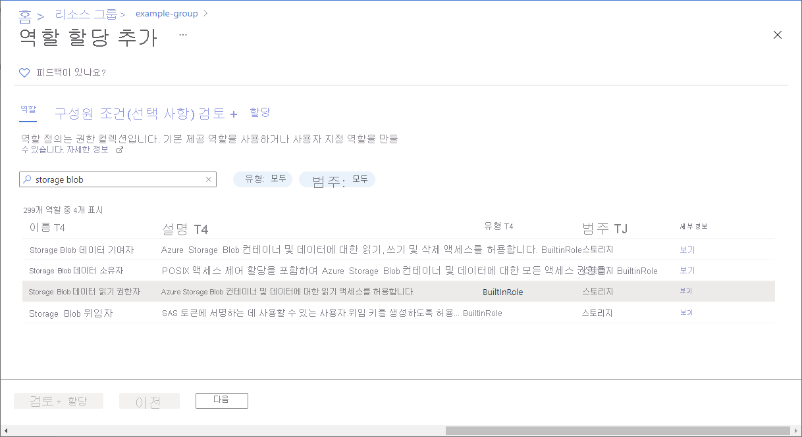

# <a name="tutorial-add-a-role-assignment-condition-to-restrict-access-to-blobs-using-the-azure-portal-preview"></a>자습서: Azure Portal을 사용하여 BLOB에 대한 액세스를 제한하는 역할 할당 조건 추가(미리 보기)

> [!IMPORTANT]
> Azure ABAC 및 Azure 역할 할당 조건은 현재 미리 보기 상태입니다.
> 이 미리 보기 버전은 서비스 수준 계약 없이 제공되며 프로덕션 워크로드에는 사용하지 않는 것이 좋습니다. 특정 기능이 지원되지 않거나 기능이 제한될 수 있습니다.
> 자세한 내용은 [Microsoft Azure Preview에 대한 추가 사용 약관](https://azure.microsoft.com/support/legal/preview-supplemental-terms/)을 참조하세요.

대부분의 경우 역할 할당은 Azure 리소스에 필요한 사용 권한을 부여합니다. 그러나 경우에 따라 역할 할당 조건을 추가하여 보다 세분화된 액세스 제어를 제공하는 것이 좋습니다.

이 자습서에서는 다음 작업 방법을 알아봅니다.

> [!div class="checklist"]
> - 역할 할당에 조건 추가
> - BLOB 인덱스 태그를 기반으로 BLOB에 대한 액세스 제한

## <a name="prerequisites"></a>사전 요구 사항

역할 할당 조건을 추가하거나 편집하기 위한 사전 요구 사항은 [조건 및 사전 요구 사항](../../role-based-access-control/conditions-prerequisites.md)을 참조하세요.

## <a name="condition"></a>조건

이 자습서에서는 특정 태그를 사용하여 BLOB에 대한 액세스를 제한합니다. 예를 들어 Chandra에서 `Project=Cascade` 태그가 있는 파일만 읽을 수 있도록 역할 할당에 조건을 추가합니다.


Chandra가 `Project=Cascade` 태그 없이 Blob을 읽으려고 하면 액세스가 허용되지 않습니다.


코드에서 조건은 다음과 같습니다.

```
(
    (
        !(ActionMatches{'Microsoft.Storage/storageAccounts/blobServices/containers/blobs/read'}
        AND
        SubOperationMatches{'Blob.Read.WithTagConditions'})
    )
    OR
    (
        @Resource[Microsoft.Storage/storageAccounts/blobServices/containers/blobs/tags:Project<$key_case_sensitive$>] StringEqualsIgnoreCase 'Cascade'
    )
)
```

## <a name="step-1-create-a-user"></a>1단계: 사용자 만들기

1. 구독 소유자로 Azure Portal에 로그인합니다.

1. **Azure Active Directory** 를 클릭합니다.

1. 사용자를 만들거나 기존 사용자를 찾습니다. 이 자습서에서는 Chandra를 예제로 사용합니다.

## <a name="step-2-set-up-storage"></a>2단계: 스토리지 설정

1. Blob 인덱스 태그 기능과 호환되는 스토리지 계정을 만듭니다. 자세한 내용은 [Blob 인덱스 태그를 사용하여 Azure Blob 데이터 관리 및 찾기](../blobs/storage-manage-find-blobs.md#regional-availability-and-storage-account-support)를 참조하세요.

1. 스토리지 계정에서 새 컨테이너를 만들고 공용 액세스 수준을 **프라이빗(익명 액세스 차단)** 으로 설정합니다.

1. 컨테이너에서 **업로드** 를 클릭하여 BLOB 업로드 창을 엽니다.

1. 업로드할 텍스트 파일을 찾습니다.

1. **고급** 을 클릭하여 창을 확장합니다.

1. **BLOB 인덱스 태그** 섹션에서 다음 BLOB 인덱스 태그를 텍스트 파일에 추가합니다.

    BLOB 인덱스 태그 섹션이 표시되지 않고 구독을 방금 등록한 경우 변경 내용이 전파될 때까지 몇 분 정도 기다려야 합니다. 자세한 내용은 [Blob 인덱스 태그를 사용하여 Azure Blob Storage 데이터 관리 및 찾기](../blobs/storage-blob-index-how-to.md)를 참조하세요.

    > [!NOTE]
    > 또한 Blob은 임의의 사용자 정의 키 값 메타데이터를 저장하는 기능을 지원합니다. 메타데이터는 Blob 인덱스 태그와 유사하지만 조건으로 Blob 인덱스 태그를 사용해야 합니다.

    | 키 | 값 |
    | --- | --- |
    | 프로젝트  | 계단식 배열 |

   

1. **업로드** 단추를 클릭하여 파일을 업로드합니다.

1. 두 번째 텍스트 파일을 업로드합니다.

1. 다음 BLOB 인덱스 태그를 두 번째 텍스트 파일에 추가합니다.

    | 키 | 값 |
    | --- | --- |
    | 프로젝트  | Baker |

## <a name="step-3-assign-a-storage-blob-data-role"></a>3단계: 스토리지 BLOB 데이터 역할 할당

1. 리소스 그룹을 엽니다.

1. **액세스 제어(IAM)** 를 클릭합니다.

1. **역할 할당** 탭을 클릭하여 관련 범위의 역할 할당을 확인합니다.

1. **추가** > **역할 할당 추가** 를 클릭합니다.

   

    역할 할당 추가 페이지가 열립니다.

1. **역할** 탭에서 [스토리지 BLOB 데이터 판독기](../../role-based-access-control/built-in-roles.md#storage-blob-data-reader) 역할을 선택합니다.

    

1. **구성원** 탭에서 이전에 만든 사용자를 선택합니다.

   

1. (선택 사항) **설명** 상자에 **Read access to blobs with the tag Project=Cascade** 를 입력합니다.

1. **다음** 을 클릭합니다.

## <a name="step-4-add-a-condition"></a>4단계: 조건 추가

1. **조건(옵션)** 탭에서 **조건 추가** 를 클릭합니다.

    

    역할 할당 조건 추가 페이지가 표시됩니다.

1. 작업 추가 섹션에서 **작업 추가** 를 클릭합니다.

    작업 선택 창이 표시됩니다. 이 창은 조건 대상이 될 역할 할당을 기준으로 데이터 작업을 필터링한 목록입니다.

    

1. 블로그 읽기에서 **태그 조건으로 BLOB의 콘텐츠 읽기** 를 클릭한 다음, **선택** 을 클릭합니다.

1. 식 작성 섹션에서 **식 추가** 를 클릭합니다.

    식 섹션이 확장됩니다.

1. 다음 식 설정을 지정합니다.

    | 설정 | 값 |
    | --- | --- |
    | 특성 원본 | 리소스 |
    | attribute | Blob 인덱스 태그 [키의 값] |
    | Key | Project |
    | 연산자 | StringEqualsIgnoreCase |
    | 값 | 계단식 배열 |

    

1. **편집기 형식** 으로 스크롤하고 **코드** 를 클릭합니다.

    조건은 코드로 표시됩니다. 이 코드 편집기에서 조건을 변경할 수 있습니다. 시각적 개체 편집기로 돌아가려면 **시각적 개체** 를 클릭합니다.

    

1. **저장** 을 클릭하여 조건을 추가하고 역할 할당 추가 페이지로 돌아갑니다.

1. **다음** 을 클릭합니다.

1. **검토 + 할당** 탭에서 **검토 + 할당** 을 클릭하여 조건으로 역할을 할당합니다.

    몇 분이 지나면 선택한 범위에서 보안 주체에 역할이 할당됩니다.

    

## <a name="step-5-assign-reader-role"></a>5단계: 리더 역할 할당

- 이전 단계를 반복하여 이전에 리소스 그룹 범위에서 만든 사용자에게 [리더](../../role-based-access-control/built-in-roles.md#reader) 역할을 할당합니다.

    > [!NOTE]
    > 일반적으로 리더 역할을 할당할 필요가 없습니다. 그러나 이 작업을 수행하면 Azure Portal을 사용하여 조건을 테스트할 수 있습니다.

## <a name="step-6-test-the-condition"></a>6단계: 조건 테스트

1. 새 창에서 [Azure Portal](https://azure.portal.com)을 엽니다.

1. 이전에 만든 사용자로 로그인합니다.

1. 만든 스토리지 계정 및 컨테이너를 엽니다.

1. 인증 방법이 **액세스 키** 가 아닌 **Azure AD 사용자 계정** 으로 설정되어 있는지 확인합니다.

    

1. Baker 텍스트 파일을 클릭합니다.

    Blob을 보거나 다운로드할 수 **없으며** 권한 부여 실패 메시지가 표시되어야 합니다.
 
1. 계단식 텍스트 파일을 클릭합니다.

    Blob을 보고 다운로드할 수 있어야 합니다.

## <a name="step-7-clean-up-resources"></a>7단계: 리소스 정리

1. 추가한 역할 할당을 제거합니다.

1. 만든 테스트 스토리지 계정을 삭제합니다.

1. 만든 사용자를 삭제합니다.

## <a name="next-steps"></a>다음 단계

- [Azure 역할 할당 조건 예제](storage-auth-abac-examples.md)
- [Azure Storage에서 Azure 역할 할당 조건에 대한 작업 및 특성(미리 보기)](storage-auth-abac-attributes.md)
- [Azure 역할 할당 조건의 형식 및 구문](../../role-based-access-control/conditions-format.md)
