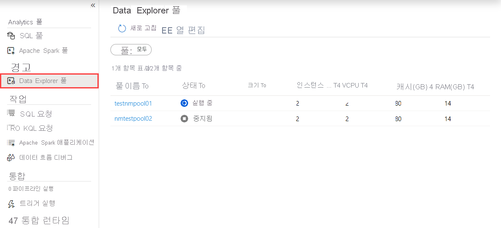
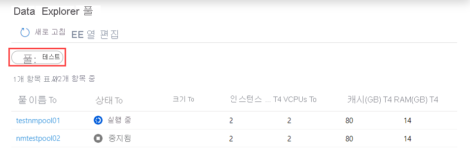
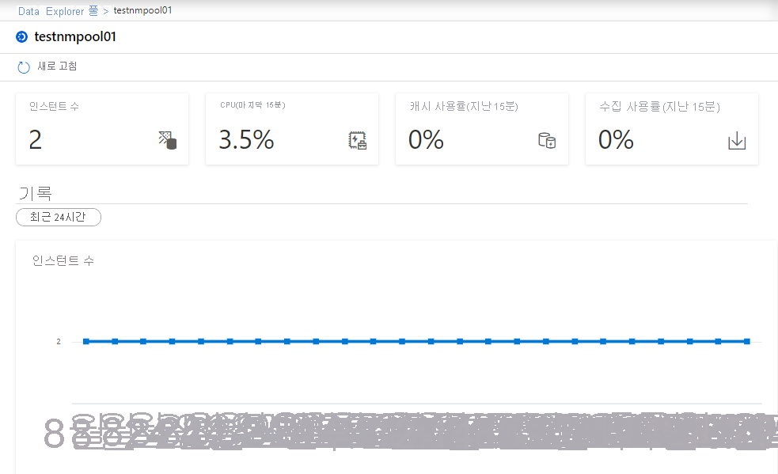

# 빠른 시작: Synapse Studio 사용하여 데이터 탐색기 풀 모니터링(미리 보기)

Azure Synapse Analytics 사용하면 데이터 탐색기를 사용하여 작업 영역의 데이터 탐색기 풀에서 쿼리, 대시보드 등을 실행할 수 있습니다.

이 문서에서는 데이터 탐색기 풀을 모니터링하여 여러 작업 영역 사용자가 사용 중인 vCore 수를 포함하여 풀의 상태를 감시하는 방법을 설명합니다.

## 데이터 탐색기 풀 목록에 액세스

작업 영역에서 데이터 탐색기 풀 목록을 보려면 먼저 [Synapse Studio 열기](https://web.azuresynapse.net/)를 수행하고 작업 영역을 선택하세요.

작업 영역을 연 후 왼쪽의 **모니터** 섹션을 선택합니다.

**데이터 탐색기 풀** 을 선택하여 데이터 탐색기 풀 목록을 봅니다.

## 데이터 탐색기 풀 필터링

데이터 탐색기 풀 목록을 관심 있는 풀로 필터링할 수 있습니다. 화면 위쪽의 필터를 사용하여 필터링할 필드를 지정할 수 있습니다.

예를 들어, 보기를 필터링하여 이름에 "test"가 포함된 데이터 탐색기 풀만 볼 수 있습니다.

## 특정 데이터 탐색기 풀에 대한 세부 정보 보기

데이터 탐색기 풀 중 하나에 대한 세부 정보를 보려면 데이터 탐색기 풀을 선택하여 세부 정보를 보세요.

