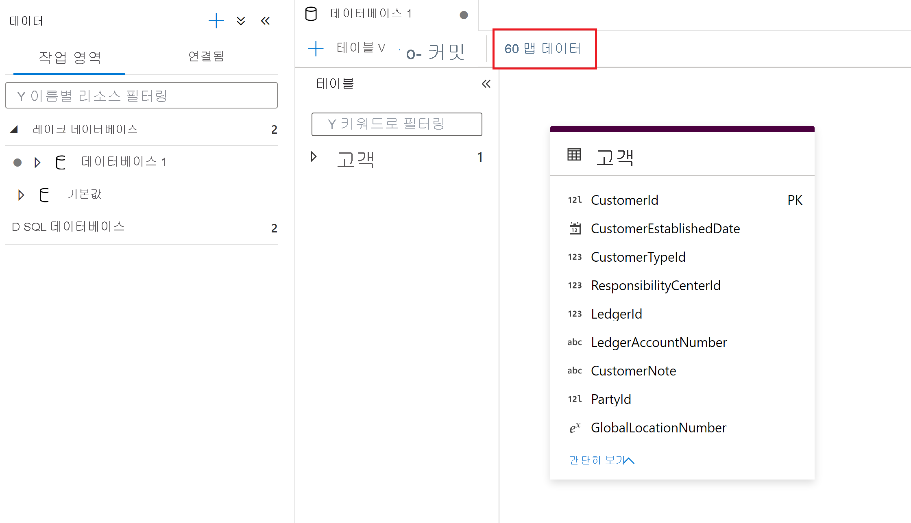
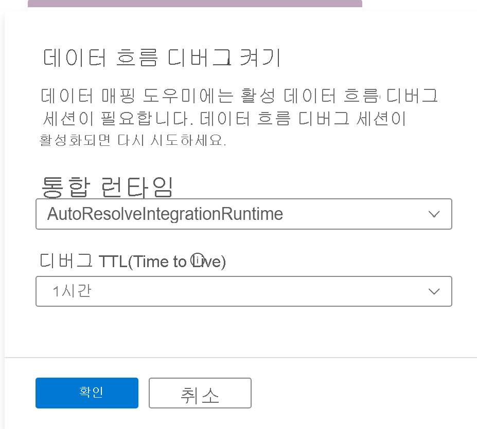
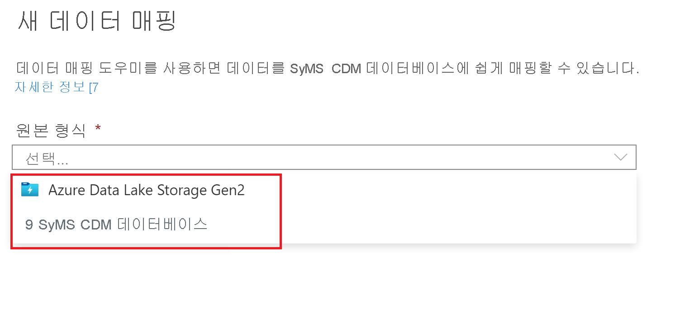
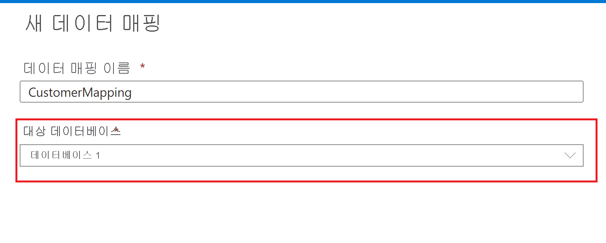
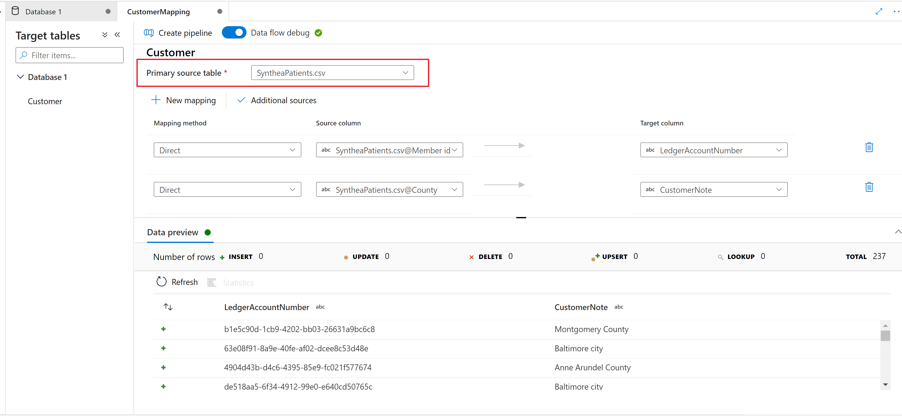

# Azure Synapse Analytics의 맵 데이터

## 맵 데이터 도구란?

맵 데이터 도구는 사용자가 코드를 작성하지 않고도 소스 데이터에서 Synapse Lake 데이터베이스 테이블로 ETL 매핑 및 매핑 데이터 흐름을 만드는 데 도움을 주는 안내 프로세스입니다. 이 프로세스는 사용자가 Synapse Lake 데이터베이스에서 대상 테이블을 선택한 다음, 소스 데이터를 이 테이블에 매핑하는 것으로 시작됩니다. 

Synapse Lake 데이터베이스에 대한 자세한 내용은 [Azure Synapse 데이터베이스 템플릿 개요 - Azure Synapse Analytics | Microsoft Docs](overview-database-templates.md)를 참조하세요.

맵 데이터는 사용자가 빈 캔버스로 시작하지 않고도 매핑 데이터 흐름을 생성하고 Synapse 파이프라인에서 실행할 수 있는 확장 가능한 매핑 데이터 흐름을 빠르게 생성할 수 있는 안내 환경을 제공합니다.

> [!NOTE] 
> Synapse Analytics 파이프라인의 데이터 맵 기능은 현재 공개 미리 보기로 제공됩니다.

## 시작

지도 데이터 도구는 Synapse lake 데이터베이스 환경에서 시작됩니다. 여기에서 맵 데이터 도구를 선택하여 프로세스를 시작할 수 있습니다. 

맵 데이터는 사용자가 데이터를 미리 보고 소스 파일의 스키마를 읽는 것을 지원하기 위해 사용 가능한 컴퓨팅이 필요합니다. 세션에서 맵 데이터를 처음 사용할 때 클러스터를 준비해야 합니다.

시작하려면 lake 데이터베이스 테이블에 매핑할 데이터 원본을 선택합니다. 현재 지원되는 데이터 원본은 Azure Data Lake Storage Gen 2 및 Synapse lake 데이터베이스입니다.

### 파일 형식 옵션
Azure Data Lake Storage Gen 2와 같은 파일 저장소를 선택할 때 다음 파일 형식이 지원됩니다.

* 공통 데이터 모델
* 구분된 텍스트
* Parquet

## 데이터 매핑 만들기
데이터 매핑의 이름을 지정하고 Synapse lake 데이터베이스 대상으로 선택합니다.

## 원본 대 대상 매핑
Synapse lake 데이터베이스 대상 테이블에 매핑할 기본 소스 테이블을 선택합니다.

### 새 매핑
새 매핑 단추를 사용하여 매핑 또는 변환을 만드는 매핑 방법을 추가합니다.

### 추가 원본
추가 원본 단추를 사용하여 매핑에 조인시키고 다른 소스를 매핑에 추가합니다.

### 데이터 미리 보기
**데이터 미리 보기** 탭은 각 변환 데이터의 대화형 스냅샷을 제공합니다. 자세한 내용은 [디버그 모드의 데이터 미리 보기](../../data-factory/concepts-data-flow-debug-mode.md#data-preview)를 참조하세요.

### 매핑 방법

다음과 같은 매핑 방법이 지원됩니다.

* [수동으로 설치](../../data-factory/data-flow-select.md)
* [서로게이트 키](../../data-factory/data-flow-surrogate-key.md)
* [조회](../../data-factory/data-flow-lookup.md)
* [피벗 해제](../../data-factory/data-flow-unpivot.md)
* [집계](../../data-factory/data-flow-aggregate.md)
    * 합계
    * 최소
    * 최대
    * 처음
    * 마지막
    * 표준 편차
    * 평균
    * 평균
* [파생 열](../../data-factory/data-flow-derived-column.md)
    * 공백 제거
    * Upper
    * 더 낮음
    * 고급 

## 파이프라인 만들기

맵 데이터 변환이 완료되면 파이프라인 만들기 단추를 선택하여 매핑 데이터 흐름을 생성하고 파이프라인을 선택하여 변환을 디버그하고 실행합니다.