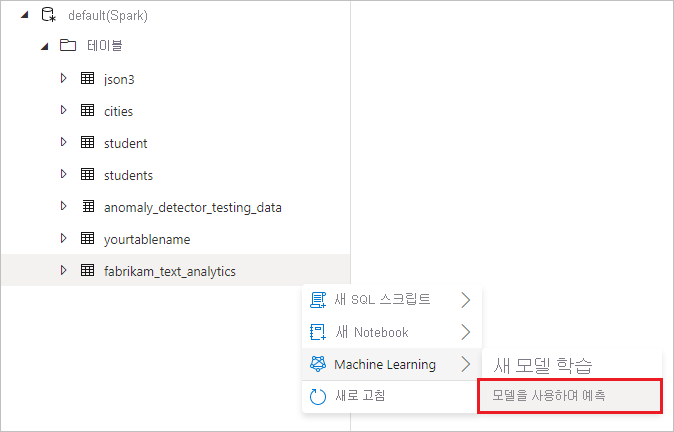
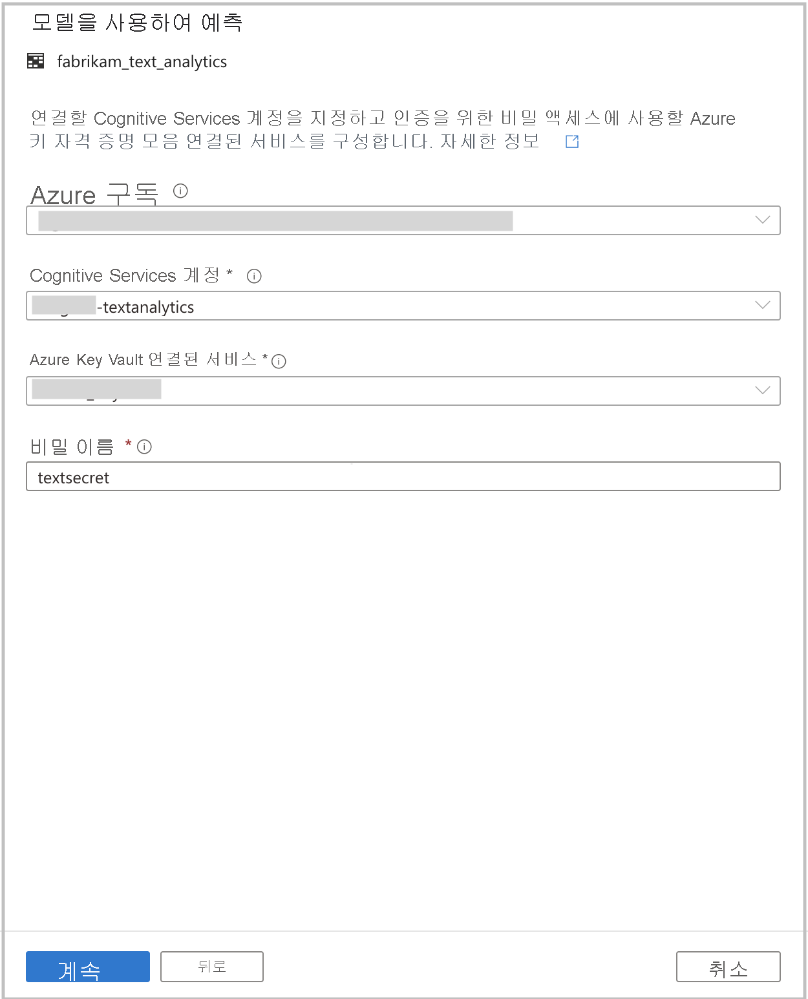

# <a name="tutorial-sentiment-analysis-with-cognitive-services-preview"></a>자습서: Cognitive Services를 사용하여 감정 분석(미리 보기)

이 자습서에서는 [Azure Cognitive Services](../../cognitive-services/index.yml)를 사용하여 Azure Synapse Analytics에서 데이터를 쉽게 보강하는 방법에 대해 알아봅니다. [Text Analytics](../../cognitive-services/text-analytics/index.yml) 기능을 사용하여 감정 분석을 수행합니다. 

Azure Synapse의 사용자는 감정을 사용하여 보강할 텍스트 열이 포함된 테이블만 선택하면 됩니다. 이러한 감정은 긍정, 부정, 혼합 또는 중립적일 수 있습니다. 확률도 반환됩니다.

이 자습서에서는 다음 내용을 다룹니다.

> [!div class="checklist"]
> - 감정 분석을 위해 텍스트 열이 포함된 Spark 테이블 데이터 세트를 가져오는 단계입니다.
> - Azure Synapse의 마법사 환경을 사용하여 Cognitive Services에서 Text Analytics를 사용하여 데이터를 보강합니다.

Azure 구독이 없는 경우 [시작하기 전에 체험 계정을 만듭니다](https://azure.microsoft.com/free/).

## <a name="prerequisites"></a>사전 요구 사항

- [Azure Synapse Analytics 작업 영역](../get-started-create-workspace.md)(기본 스토리지로 구성된 Azure Data Lake Storage Gen2 스토리지 계정이 있음). 사용하는 Data Lake Storage Gen2 파일 시스템의 *Storage Blob 데이터 기여자* 여야 합니다.
- Azure Synapse Analytics 작업 영역의 Spark 풀. 자세한 내용은 [Azure Synapse에서 Spark 풀 만들기](../quickstart-create-sql-pool-studio.md)를 참조하세요.
- [Azure Synaps에서 Cognitive Services 구성](tutorial-configure-cognitive-services-synapse.md) 자습서에서 설명하는 사전 구성 단계

## <a name="sign-in-to-the-azure-portal"></a>Azure Portal에 로그인

[Azure Portal](https://portal.azure.com/)에 로그인합니다.

## <a name="create-a-spark-table"></a>Spark 테이블 만들기

이 자습서에는 Spark 테이블이 필요합니다.

1. 텍스트 분석을 위한 데이터 세트가 포함된 [FabrikamComments.csv](https://github.com/Kaiqb/KaiqbRepo0731190208/blob/master/CognitiveServices/TextAnalytics/FabrikamComments.csv) 파일을 다운로드합니다. 

1. 파일을 Data Lake Storage Gen2의 Azure Synapse 스토리지 계정에 업로드합니다.
  
   

1. 마우스 오른쪽 단추로 파일을 클릭하고 **새 Notebook** > **Spark 테이블 만들기** 를 차례로 선택하여 .csv 파일에서 Spark 테이블을 만듭니다.

   

1. 코드 셀에 테이블 이름을 설정하고 Spark 풀에서 Notebook을 실행합니다. `header=True`를 설정해야 합니다.

   

   ```python
   %%pyspark
   df = spark.read.load('abfss://default@azuresynapsesa.dfs.core.windows.net/data/FabrikamComments.csv', format='csv'
   ## If a header exists, uncomment the line below
   , header=True
   )
   df.write.mode("overwrite").saveAsTable("default.YourTableName")
   ```

## <a name="open-the-cognitive-services-wizard"></a>Cognitive Services 마법사 열기

1. 마우스 오른쪽 단추로 이전 절차에서 만든 Spark 테이블을 클릭합니다. **Machine Learning** > **모델을 사용하여 예측** 을 선택하여 마법사를 엽니다.

   

2. 구성 패널이 표시되고, Cognitive Services 모델을 선택하라는 메시지가 표시됩니다. **Text Analytics - 감정 분석** 을 선택합니다.

   

## <a name="provide-authentication-details"></a>인증 세부 정보 제공

Cognitive Services를 인증하려면 키 자격 증명 모음에 대한 비밀을 참조해야 합니다. 다음 입력은 이 시점 이전에 완료해야 하는 [필수 구성 요소 단계](tutorial-configure-cognitive-services-synapse.md)에 따라 달라집니다.

- **Azure 구독**: Key Vault가 속한 Azure 구독을 선택합니다.
- **Cognitive Services 계정**: 연결할 Text Analytics 리소스를 입력합니다.
- **Azure Key Vault 연결된 서비스**: 필수 구성 요소 단계의 일부로 Text Analytics 리소스에 대한 연결된 서비스를 만들었습니다. 여기서 이를 선택합니다.
- **비밀 이름**: Cognitive Services 리소스를 인증하기 위한 키가 포함된 키 자격 증명 모음에 비밀 이름을 입력합니다.



## <a name="configure-sentiment-analysis"></a>감정 분석 구성

다음으로, 감정 분석을 구성합니다. 다음 세부 정보를 선택합니다.
- **언어**: 감정 분석을 수행하려는 텍스트의 언어로 **영어** 를 선택합니다.
- **텍스트 열**: 감정을 결정하기 위해 분석하려는 데이터 세트의 텍스트 열로 **주석(문자열)** 을 선택합니다.

완료되면 **Notebook 열기** 를 선택합니다. 그러면 Azure Cognitive Services를 사용하여 감정 분석을 수행하는 PySpark 코드가 포함된 Notebook이 생성됩니다.


## <a name="run-the-notebook"></a>노트북 실행

방금 연 Notebook은 [mmlspark 라이브러리](https://github.com/Azure/mmlspark)를 사용하여 Cognitive Services에 연결합니다. 제공한 Azure Key Vault 세부 정보를 사용하면 이 환경에서 비밀을 공개하지 않고도 안전하게 참조할 수 있습니다.

이제 모든 셀을 실행하여 데이터를 감정으로 보강할 수 있습니다. **모두 실행** 을 선택합니다. 

감정은 **긍정**, **부정**, **중립** 또는 **혼합** 으로 반환됩니다. 감정당 확률도 얻을 수 있습니다. [Cognitive Services의 감정 분석에 대해 자세히 알아보세요](../../cognitive-services/text-analytics/how-tos/text-analytics-how-to-sentiment-analysis.md).


## <a name="next-steps"></a>다음 단계
- [자습서: Azure Cognitive Services를 사용하여 변칙 검색](tutorial-cognitive-services-anomaly.md)
- [자습서: Azure Synapse 전용 SQL 풀에서 기계 학습 모델 점수 매기기](tutorial-sql-pool-model-scoring-wizard.md)
- [Azure Synapse Analytics의 Machine Learning 기능](what-is-machine-learning.md)
