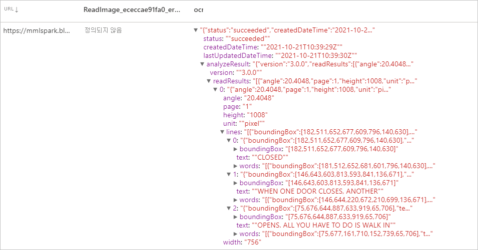
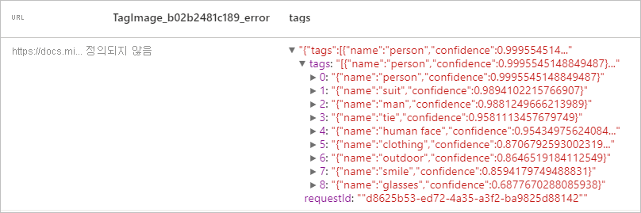
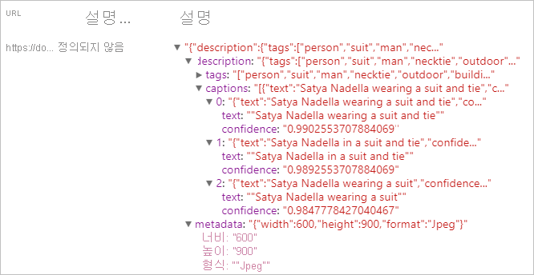
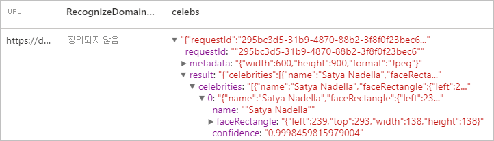

# <a name="tutorial-computer-vision-with-cognitive-service"></a>자습서: Cognitive Service를 활용한 Computer Vision

[Computer Vision](../../cognitive-services/computer-vision/index.yml)은 이미지를 처리하고 시각적 기능을 바탕으로 한 정보를 반환하는 [Azure Cognitive Service](../../cognitive-services/index.yml)입니다. 이 자습서를 통해 [Computer Vision](../../cognitive-services/computer-vision/index.yml)을 사용하여 Azure Synapse Analytics에서 이미지를 분석하는 방법에 대해 알아봅니다.

이 자습서에서는 다음 기능을 수행하기 위해 [MMLSpark](https://github.com/Azure/mmlspark)와 함께 텍스트 분석을 사용하는 방법을 보여줍니다.

> [!div class="checklist"]
> - 이미지 콘텐츠에서 시각적 기능 추출
> - 이미지 내 문자 인식(OCR)
> - 이미지 콘텐츠 분석 및 썸네일 생성
> - 이미지에서 도메인별 콘텐츠 검색 및 식별
> - 이미지와 관련된 태그 생성
> - 사람이 판독 가능한 언어 내 전체 이미지에 대한 설명 생성


## <a name="analyze-image"></a>이미지 분석
이미지 콘텐츠(예: 개체, 얼굴, 성인용 콘텐츠 및 자동 생성된 텍스트 설명)를 기반으로 다양한 시각적 기능 집합을 추출합니다. 
### <a name="example-input"></a>예제 입력


```python
# Create a dataframe with the image URLs
df = spark.createDataFrame([
        ("<replace with your file path>/dog.jpg", )
    ], ["image", ])

# Run the Computer Vision service. Analyze Image extracts infortmation from/about the images.
analysis = (AnalyzeImage()
    .setLinkedService(cognitive_service_name)
    .setVisualFeatures(["Categories","Color","Description","Faces","Objects","Tags"])
    .setOutputCol("analysis_results")
    .setImageUrlCol("image")
    .setErrorCol("error"))

# Show the results of what you wanted to pull out of the images.
display(analysis.transform(df).select("image", "analysis_results.description.tags"))

```
### <a name="expected-results"></a>예상 결과

```json
["dog","outdoor","fence","wooden","small","brown","building","sitting","front","bench","standing","table","walking","board","beach","holding","bridge"]
```

## <a name="optical-character-recognition-ocr"></a>OCR(광학 문자 인식)
청구서, 계산서, 재무 보고서, 기사 등의 문서뿐만 아니라 거리 기호 및 제품 사진과 같은 이미지에서 인쇄된 텍스트, 수기 텍스트, 숫자 및 통화 기호를 추출합니다. 여러 언어가 혼합된 텍스트를 많이 사용한 이미지 및 다중 페이지 PDF에서 텍스트를 추출하는 데 최적화되어 있습니다. 동일한 이미지나 문서에서 인쇄된 텍스트와 필기 텍스트를 모두 검색하는 것을 지원합니다.

### <a name="example-input"></a>예제 입력


```python
df = spark.createDataFrame([
        ("<replace with your file path>/ocr.jpg", )
    ], ["url", ])

ri = (ReadImage()
    .setLinkedService(cognitive_service_name)
    .setImageUrlCol("url")
    .setOutputCol("ocr"))

display(ri.transform(df))
```
### <a name="expected-results"></a>예상 결과


## <a name="generate-thumbnails"></a>미리 보기 생성
이미지의 콘텐츠를 분석하여 해당 이미지에 대한 적절한 썸네일을 생성합니다. Computer Vision은 먼저 고품질 썸네일을 생성한 다음, 이미지 내의 개체를 분석하여 ‘관심 영역’을 결정합니다. 그런 다음, Computer Vision은 관심 영역의 요구 사항에 맞게 이미지를 자릅니다. 생성된 썸네일은 필요에 따라 원래 이미지의 가로 세로 비율과 다른 가로 세로 비율을 사용하여 표시할 수 있습니다.

### <a name="example-input"></a>예제 입력


```python
df = spark.createDataFrame([
        ("<replace with your file path>/satya.jpeg", )
    ], ["url", ])

gt =  (GenerateThumbnails()
    .setLinkedService(cognitive_service_name)
    .setHeight(50)
    .setWidth(50)
    .setSmartCropping(True)
    .setImageUrlCol("url")
    .setOutputCol("thumbnails"))

thumbnails = gt.transform(df).select("thumbnails").toJSON().first()

import json
img = json.loads(thumbnails)["thumbnails"]

displayHTML("")

```

### <a name="expected-results"></a>예상 결과


## <a name="tag-image"></a>태그 이미지
제공된 이미지의 콘텐츠와 관련된 단어 목록 또는 태그를 생성합니다. 태그는 이미지에서 찾을 수 있는 수천 개의 인식 가능한 개체, 살아있는 생물, 장면 또는 동작을 기반으로 반환됩니다. 태그에는 모호성을 방지하거나 컨텍스트를 제공하기 위한 힌트가 포함될 수 있습니다. 예를 들어 "ascomycete" 태그는 "fungus" 힌트와 함께 사용될 수 있습니다.

예시로서 Satya의 이미지를 계속 사용해 보겠습니다.

```python
df = spark.createDataFrame([
        ("<replace with your file path>/satya.jpeg", )
    ], ["url", ])

ti = (TagImage()
    .setLinkedService(cognitive_service_name)
    .setImageUrlCol("url")
    .setOutputCol("tags"))

display(ti.transform(df))
```

### <a name="expected-result"></a>예상된 결과



## <a name="describe-image"></a>이미지 설명
완전한 문장을 사용하여 사람이 읽을 수 있는 언어로 전체 이미지에 대한 설명을 생성합니다. Computer Vision의 알고리즘은 이미지에서 식별된 개체에 따라 다양한 설명을 생성합니다. 설명이 각각 평가되고 신뢰도 점수가 생성됩니다. 그런 다음, 가장 높은 신뢰도 점수부터 가장 낮은 점수 순으로 정렬된 목록이 반환됩니다.

예시로서 Satya의 이미지를 계속 사용해 보겠습니다.

```python
df = spark.createDataFrame([
        ("<replace with your file path>/satya.jpeg", )
    ], ["url", ])

di = (DescribeImage()
    .setLinkedService(cognitive_service_name)
    .setMaxCandidates(3)
    .setImageUrlCol("url")
    .setOutputCol("descriptions"))

display(di.transform(df))
```
### <a name="expected-result"></a>예상된 결과


## <a name="recognize-domain-specific-content"></a>도메인별 콘텐츠 인식
도메인 모델을 사용하여 유명인 및 랜드마크와 같은 이미지의 도메인 관련 콘텐츠를 감지하고 식별합니다. 예를 들어 이미지에 사람이 포함되어있는 경우 Computer Vision은 유명인에 대한 도메인 모델을 사용하여 이미지에서 감지된 사람이 알려진 유명인과 일치하는지 확인합니다.

예시로서 Satya의 이미지를 계속 사용해 보겠습니다.

```python

df = spark.createDataFrame([
        ("<replace with your file path>/satya.jpeg", )
    ], ["url", ])

celeb =  (RecognizeDomainSpecificContent()
    .setLinkedService(cognitive_service_name)
    .setModel("celebrities")
    .setImageUrlCol("url")
    .setOutputCol("celebs"))

display(celeb.transform(df))
```

### <a name="expected-result"></a>예상된 결과


## <a name="clean-up-resources"></a>리소스 정리
Spark 인스턴스가 종료되도록 하려면 연결된 세션(Notebook)을 종료합니다. Apache Spark 풀에 지정된 **유휴 시간** 에 도달하면 풀이 종료됩니다. Notebook 오른쪽 상단에 있는 상태 표시줄에서 **세션 중지** 를 선택할 수도 있습니다.


## <a name="next-steps"></a>다음 단계

* [Synapse 샘플 Notebooks 체크 아웃](https://github.com/Azure-Samples/Synapse/tree/main/MachineLearning) 
* [MMLSpark GitHub 리포지토리](https://github.com/Azure/mmlspark)
