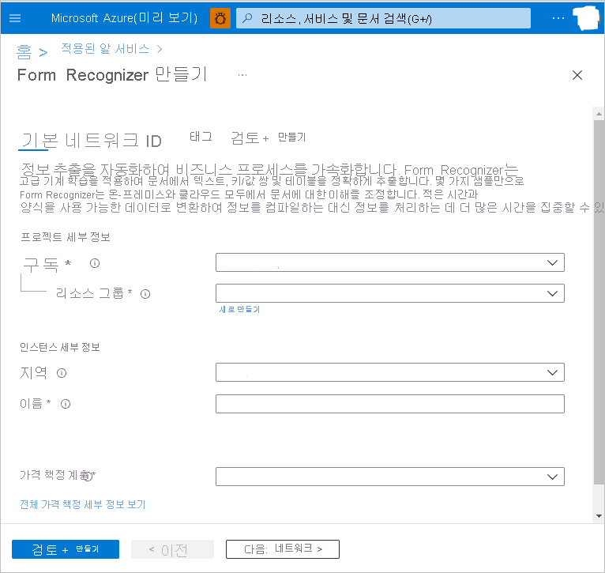
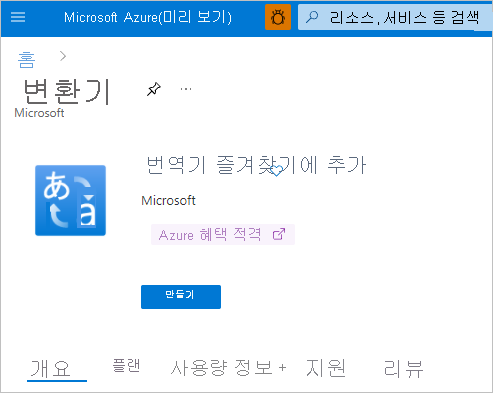
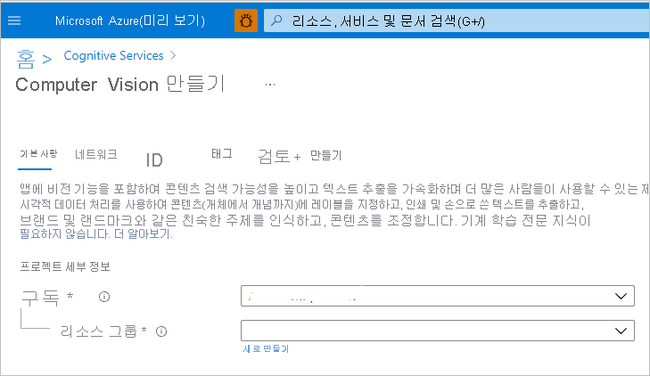
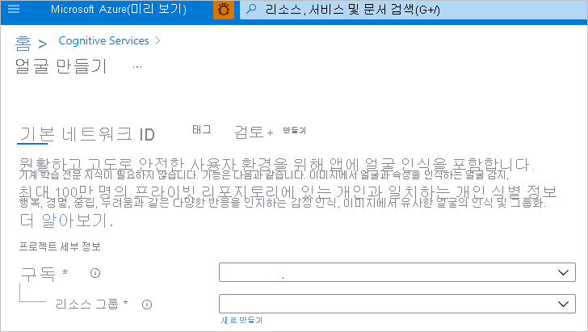
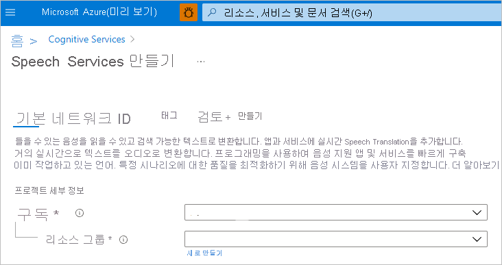
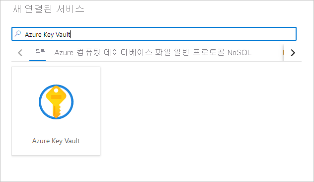
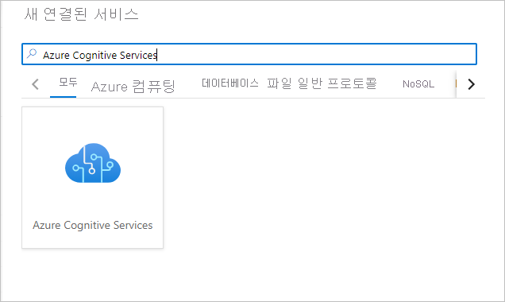

# 빠른 시작: Azure Synapse Analytics의 Cognitive Services를 사용하기 위한 필수 구성 요소 구성

이 빠른 시작에서는 Azure Synapse Analytics에서 Azure Cognitive Services를 안전하게 사용하기 위해 필수 구성 요소를 설정하는 방법을 알아봅니다. 이러한 Azure Cognitive Services를 연결하면 Synapse의 다양한 환경에서 Azure Cognitive Services를 활용할 수 있습니다.

이 빠른 시작에서 다루는 내용은 같습니다.
> [!div class="checklist"]
> - Text Analytics 또는 Anomaly Detector와 같은 Cognitive Services 리소스를 만듭니다.
> - Azure Key Vault에서 인증 키를 비밀로 Cognitive Services 리소스에 저장하고 Azure Synapse Analytics 작업 영역에 대한 액세스를 구성합니다.
> - Azure Synapse Analytics 작업 영역에서 Azure Key Vault 연결된 서비스를 만듭니다.
> - Azure Synapse Analytics 작업 영역에서 Azure Cognitive Services 연결 서비스를 만듭니다.

Azure 구독이 없는 경우 [시작하기 전에 체험 계정을 만듭니다](https://azure.microsoft.com/free/).

## 사전 요구 사항

- [Azure Synapse Analytics 작업 영역](../get-started-create-workspace.md)(기본 스토리지로 구성된 Azure Data Lake Storage Gen2 스토리지 계정이 있음). 사용하는 Azure Data Lake Storage Gen2 파일 시스템의 *Storage Blob 데이터 기여자* 여야 합니다.

## Azure Portal에 로그인

[Azure Portal](https://portal.azure.com/)에 로그인합니다.

## Cognitive Services 리소스 만들기

[Azure Cognitive Services](../../cognitive-services/index.yml)는 다양한 유형의 서비스를 포함합니다. 다음 서비스는 Azure Synapse 자습서에서 사용되는 예제입니다.

Azure Portal에서 [Text Analytics](https://ms.portal.azure.com/#create/Microsoft.CognitiveServicesTextAnalytics) 리소스를 만들 수 있습니다.

Azure Portal에서 [Anomaly Detector](https://ms.portal.azure.com/#create/Microsoft.CognitiveServicesTextAnalytics) 리소스를 만들 수 있습니다.

Azure Portal에서 [Form Recognizer](https://ms.portal.azure.com/#create/Microsoft.CognitiveServicesFormRecognizer) 리소스를 만들 수 있습니다.

Azure Portal에서 [Translator](https://ms.portal.azure.com/#create/Microsoft.CognitiveServicesTextTranslation) 리소스를 만들 수 있습니다.

Azure Portal에서 [Computer Vision](https://ms.portal.azure.com/#create/Microsoft.CognitiveServicesComputerVision) 리소스를 만들 수 있습니다.

Azure Portal에서 [Face](https://ms.portal.azure.com/#create/Microsoft.CognitiveServicesFace) 리소스를 만들 수 있습니다.

Azure Portal에서 [Speech](https://ms.portal.azure.com/#create/Microsoft.CognitiveServicesSpeechServices) 리소스를 만들 수 있습니다.

## 키 자격 증명 모음 만들기 및 비밀과 액세스 구성

1. Azure Portal에서 [키 자격 증명 모음](https://ms.portal.azure.com/#create/Microsoft.KeyVault)을 만듭니다.
2. **Key Vault** > **액세스 정책** 으로 이동하여 Azure Key Vault에서 비밀을 읽을 수 있도록 [Azure Synapse 작업 영역 MSI](../security/synapse-workspace-managed-identity.md) 권한을 부여합니다.

   > [!NOTE]
   > 정책 변경 내용을 저장했는지 확인합니다. 이 단계는 놓치기 쉽습니다.

   

3. Cognitive Services 리소스로 이동합니다. 예를 들어 **Anomaly Detector** > **키 및 엔드포인트** 로 이동합니다. 그런 다음, 두 키 중 하나를 클립보드에 복사합니다.

4. **Key Vault** > **비밀** 로 이동하여 새 비밀을 만듭니다. 비밀의 이름을 지정한 다음, 이전 단계의 키를 **값** 필드에 붙여넣습니다. 마지막으로 **만들기** 를 선택합니다.

   

   > [!IMPORTANT]
   > 이 비밀 이름을 기억하거나 적어 두어야 합니다. 나중에 Azure Cognitive Services 연결 서비스를 만들 때 사용합니다.

## Azure Synapse에서 Azure Key Vault 연결된 서비스 만들기

1. Synapse Studio에서 작업 영역을 엽니다. 
2. **관리** > **연결된 서비스** 로 이동합니다. 방금 만든 키 자격 증명 모음을 가리키는 **Azure Key Vault** 연결된 서비스를 만듭니다. 
3. **연결 테스트** 단추를 선택하여 연결을 확인합니다. 연결이 녹색이면 **만들기** 를 선택한 다음, **모두 게시** 를 선택하여 변경 내용을 저장합니다.

## Azure Synapse에서 Azure Cognitive Service 연결 서비스 만들기

1. Synapse Studio에서 작업 영역을 엽니다.
2. **관리** > **연결된 서비스** 로 이동합니다. 방금 만든 Cognitive Service를 가리켜 **Azure Cognitive Services** 연결 서비스를 만듭니다. 
3. **연결 테스트** 단추를 선택하여 연결을 확인합니다. 연결이 녹색이면 **만들기** 를 선택한 다음, **모두 게시** 를 선택하여 변경 내용을 저장합니다.

이제 Synapse Studio에서 Azure Cognitive Services 환경을 사용하기 위한 자습서 중 하나를 계속 진행할 준비가 되었습니다.

## 다음 단계

- [자습서: Azure Cognitive Services를 사용한 감정 분석](tutorial-cognitive-services-sentiment.md)
- [자습서: Azure Cognitive Services를 사용하여 변칙 검색](tutorial-cognitive-services-sentiment.md)
- [자습서: Azure Synapse 전용 SQL 풀에서 기계 학습 모델 점수 매기기](tutorial-sql-pool-model-scoring-wizard.md)
- [Azure Synapse Analytics의 Machine Learning 기능](what-is-machine-learning.md)
