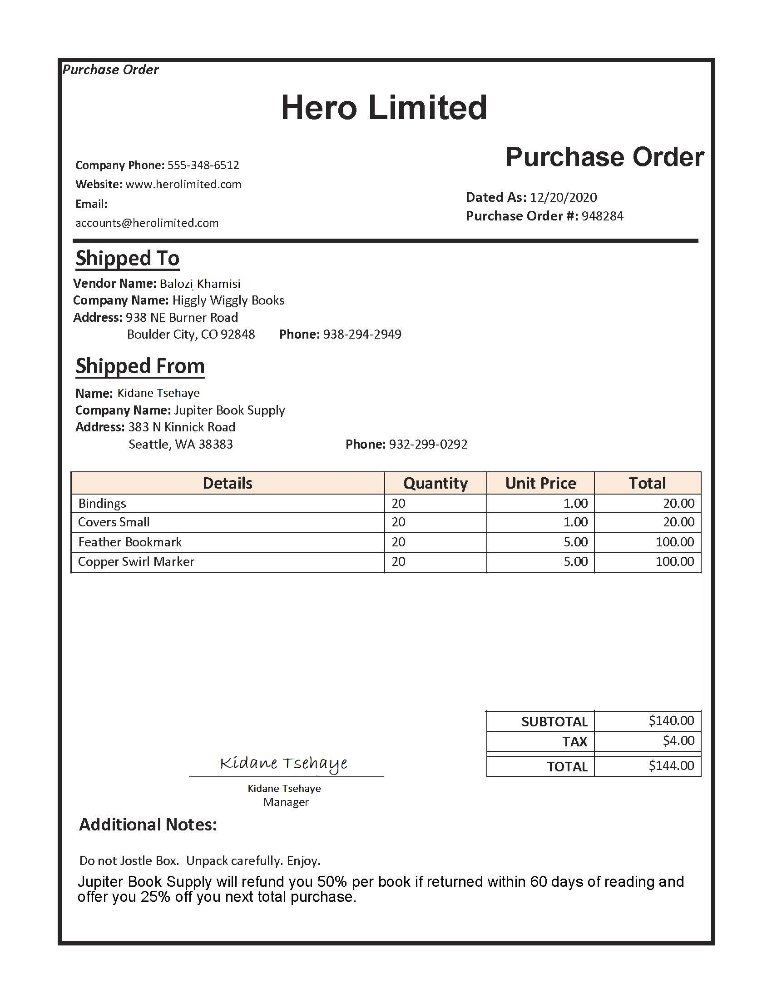
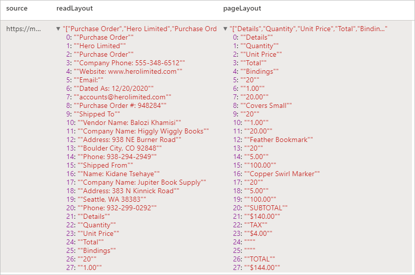
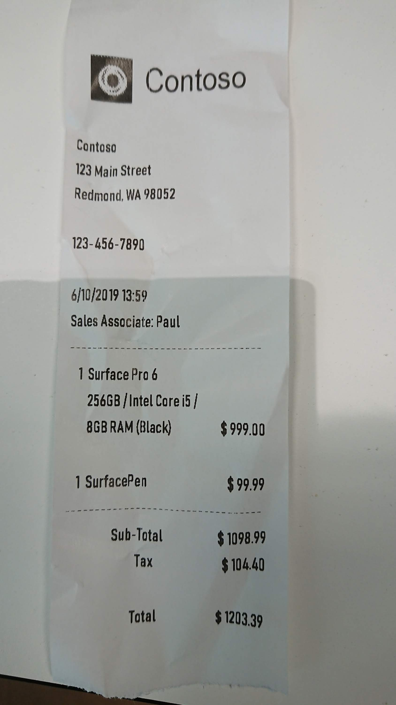
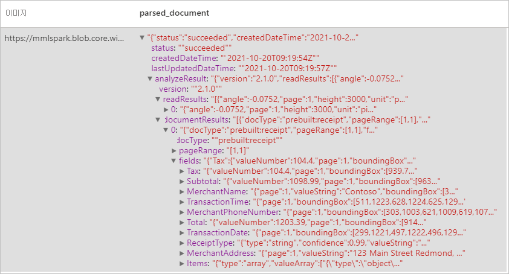
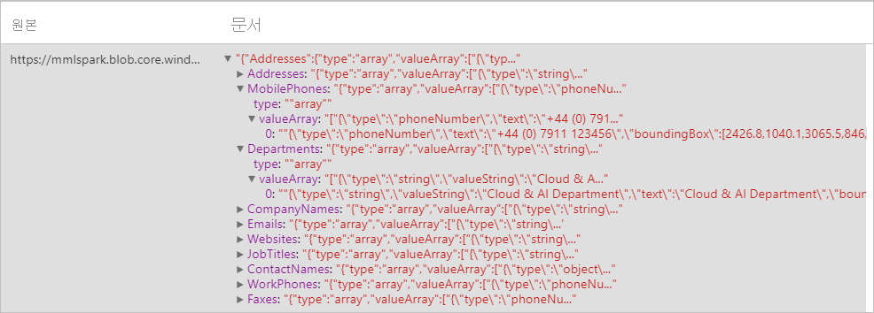
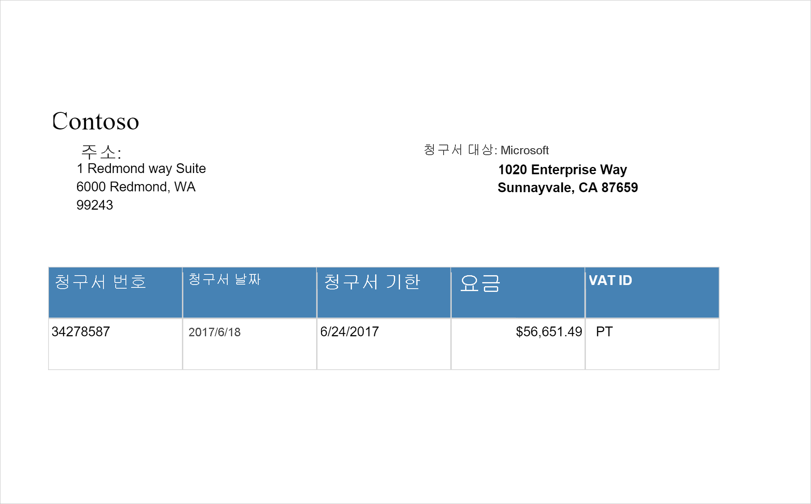
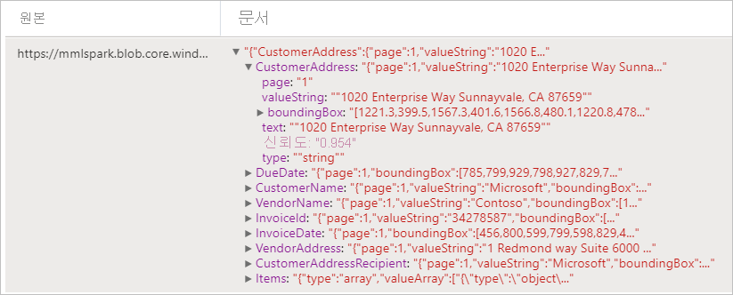
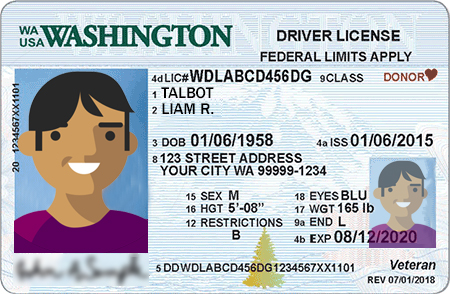
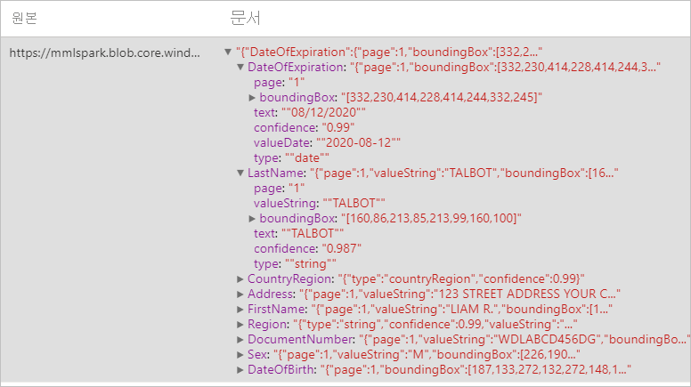

# <a name="tutorial-form-recognizer-with-applied-ai-service"></a>자습서: Applied AI Service가 포함된 Form Recognizer

[Azure Form Recognizer](../../applied-ai-services/index.yml)는 기계 학습 기술을 사용하여 자동화된 데이터 처리 애플리케이션을 빌드할 수 있게 해주는 [Azure Applied AI Services](../../applied-ai-services/form-recognizer/index.yml)입니다. 이 자습서에서는 Azure Synapse Analytics에서 데이터를 쉽게 보강하는 방법에 대해 알아봅니다. [Form Recognizer](../../applied-ai-services/form-recognizer/index.yml)는 양식과 문서를 분석하고, 텍스트와 데이터를 추출하고, 구조화된 JSON 출력을 반환합니다. 많은 수동 작업 또는 광범위한 데이터 과학 전문 지식 없이도 특정 콘텐츠에 맞게 조정된 정확한 결과를 빠르게 얻을 수 있습니다. 

이 자습서에서는 [SynapseML](https://github.com/microsoft/SynapseML)에서 Form Recognizer를 사용하여 다음을 수행하는 방법을 보여 줍니다.

> [!div class="checklist"]
> - 지정된 문서에서 텍스트 및 레이아웃 정보 추출
> - 수신 확인에서 데이터 검색 및 추출
> - 비즈니스 카드에서 데이터 검색 및 추출
> - 송장에서 데이터 검색 및 추출
> - 식별 문서에서 데이터 검색 및 추출


Azure 구독이 없는 경우 [시작하기 전에 체험 계정을 만듭니다](https://azure.microsoft.com/free/).


## <a name="prerequisites"></a>필수 구성 요소

- [Azure Synapse Analytics 작업 영역](../get-started-create-workspace.md)(기본 스토리지로 구성된 Azure Data Lake Storage Gen2 스토리지 계정이 있음). 사용하는 Data Lake Storage Gen2 파일 시스템의 *Storage Blob 데이터 기여자* 여야 합니다.
- Azure Synapse Analytics 작업 영역의 Spark 풀. 자세한 내용은 [Azure Synapse에서 Spark 풀 만들기](../quickstart-create-sql-pool-studio.md)를 참조하세요.
- [Azure Synaps에서 Cognitive Services 구성](tutorial-configure-cognitive-services-synapse.md) 자습서에서 설명하는 사전 구성 단계


## <a name="get-started"></a>시작
Synapse Studio를 열고 새 Notebook을 만듭니다. 시작하려면 [SynapseML](https://github.com/microsoft/SynapseML)을 가져옵니다. 

```python
import synapse.ml
from synapse.ml.cognitive import *
```

## <a name="configure-form-recognizer"></a>Form Recognizer 구성 

[구성 전 단계](tutorial-configure-cognitive-services-synapse.md)에서 구성한 연결된 Form Recognizer를 사용합니다. 

```python
cognitive_service_name = "<Your linked service for form recognizer>"
```


## <a name="analyze-layout"></a>레이아웃 분석

지정된 문서에서 텍스트 및 레이아웃 정보를 추출합니다. 입력 문서는 'application/pdf', 'image/jpeg', 'image/png' 또는 'image/tiff'와 같이 지원되는 콘텐츠 형식 중 하나여야 합니다.

### <a name="example-input"></a>예제 입력



```python
from pyspark.sql.functions import col, flatten, regexp_replace, explode, create_map, lit

imageDf = spark.createDataFrame([
  ("<replace with your file path>/layout.jpg",)
], ["source",])

analyzeLayout = (AnalyzeLayout()
                 .setLinkedService(cognitive_service_name)
                 .setImageUrlCol("source")
                 .setOutputCol("layout")
                 .setConcurrency(5))


display(analyzeLayout
        .transform(imageDf)
        .withColumn("lines", flatten(col("layout.analyzeResult.readResults.lines")))
        .withColumn("readLayout", col("lines.text"))
        .withColumn("tables", flatten(col("layout.analyzeResult.pageResults.tables")))
        .withColumn("cells", flatten(col("tables.cells")))
        .withColumn("pageLayout", col("cells.text"))
        .select("source", "readLayout", "pageLayout"))
```

### <a name="expected-results"></a>예상 결과



## <a name="analyze-receipts"></a>영수증 분석

OCR(광학 문자 인식) 및 영수증 모델을 통해 영수증에서 데이터를 검색하고 추출하므로 가맹점 이름, 가맹점 전화번호, 트랜잭션 날짜, 트랜잭션 합계 등과 같이 영수증에서 구조화된 데이터를 쉽게 추출할 수 있습니다.

### <a name="example-input"></a>예제 입력


```python
imageDf2 = spark.createDataFrame([
  ("<replace with your file path>/receipt1.png",)
], ["image",])

analyzeReceipts = (AnalyzeReceipts()
                 .setLinkedService(cognitive_service_name)
                 .setImageUrlCol("image")
                 .setOutputCol("parsed_document")
                 .setConcurrency(5))


results = analyzeReceipts.transform(imageDf2).cache()
display(results.select("image", "parsed_document"))
```

### <a name="expected-results"></a>예상 결과


## <a name="analyze-business-cards"></a>명함 분석
OCR(광학 문자 인식) 및 비즈니스 카드 모델을 통해 명함에서 데이터를 검색하고 추출하여 연락처 이름, 회사 이름, 전화번호, 이메일 등과 같이 명함에서 구조화된 데이터를 쉽게 추출할 수 있습니다.
### <a name="example-input"></a>예제 입력


```python
imageDf3 = spark.createDataFrame([
  ("<replace with your file path>/business_card.jpg",)
], ["source",])

analyzeBusinessCards = (AnalyzeBusinessCards()
                 .setLinkedService(cognitive_service_name)
                 .setImageUrlCol("source")
                 .setOutputCol("businessCards")
                 .setConcurrency(5))

display(analyzeBusinessCards
        .transform(imageDf3)
        .withColumn("documents", explode(col("businessCards.analyzeResult.documentResults.fields")))
        .select("source", "documents"))
```

### <a name="expected-results"></a>예상 결과



## <a name="analyze-invoices"></a>송장 분석
OCR(광학 문자 인식) 및 청구서 해석 딥 러닝 모델을 통해 청구서에서 데이터를 검색하고 추출하여 고객, 공급업체, 청구서 ID, 청구서 기한, 합계, 청구서 금액, 세금 금액, 배송지, 청구 주소, 품목 등과 같이 청구서에서 구조화된 데이터를 쉽게 추출할 수 있습니다.
### <a name="example-input"></a>예제 입력

```python
imageDf4 = spark.createDataFrame([
  ("<replace with your file path>/invoice.png",)
], ["source",])

analyzeInvoices = (AnalyzeInvoices()
                 .setLinkedService(cognitive_service_name)
                 .setImageUrlCol("source")
                 .setOutputCol("invoices")
                 .setConcurrency(5))

display(analyzeInvoices
        .transform(imageDf4)
        .withColumn("documents", explode(col("invoices.analyzeResult.documentResults.fields")))
        .select("source", "documents"))
```
### <a name="expected-results"></a>예상 결과


## <a name="analyze-id-documents"></a>ID 문서 분석
OCR(광학 문자 인식) 및 ID 문서 모델을 통해 식별 문서에서 데이터를 검색하고 추출하여 이름, 성, 생년월일, 문서 번호 등과 같이 ID 문서에서 구조화된 데이터를 쉽게 추출할 수 있습니다.
### <a name="example-input"></a>예제 입력


```python
imageDf5 = spark.createDataFrame([
  ("<replace with your file path>/id.jpg",)
], ["source",])

analyzeIDDocuments = (AnalyzeIDDocuments()
                 .setLinkedService(cognitive_service_name)
                 .setImageUrlCol("source")
                 .setOutputCol("ids")
                 .setConcurrency(5))

display(analyzeIDDocuments
        .transform(imageDf5)
        .withColumn("documents", explode(col("ids.analyzeResult.documentResults.fields")))
        .select("source", "documents"))

```
### <a name="expected-results"></a>예상 결과


## <a name="clean-up-resources"></a>리소스 정리
Spark 인스턴스가 종료되도록 하려면 연결된 세션(Notebook)을 종료합니다. Apache Spark 풀에 지정된 **유휴 시간** 에 도달하면 풀이 종료됩니다. Notebook 오른쪽 상단에 있는 상태 표시줄에서 **세션 중지** 를 선택할 수도 있습니다.


## <a name="next-steps"></a>다음 단계

* [사용자 지정 Form Recognizer 모델 학습](../../applied-ai-services/form-recognizer/label-tool.md)
* [Synapse 샘플 Notebooks 체크 아웃](https://github.com/Azure-Samples/Synapse/tree/main/MachineLearning) 
* [SynapseML GitHub 리포지토리](https://github.com/microsoft/SynapseML)
