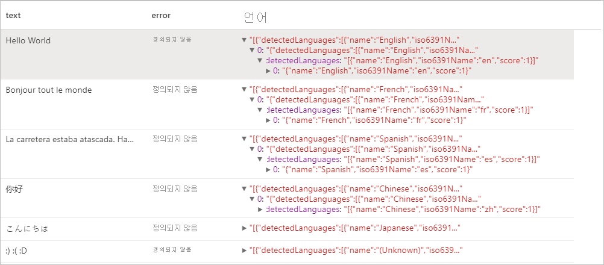
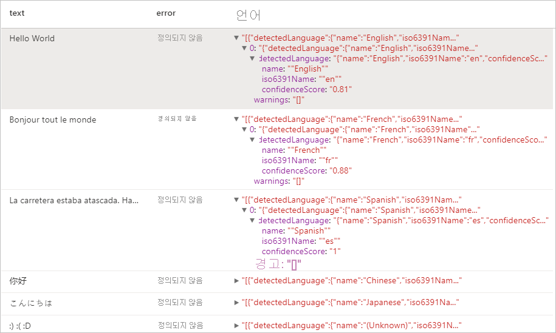
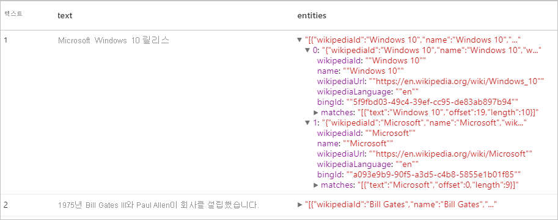
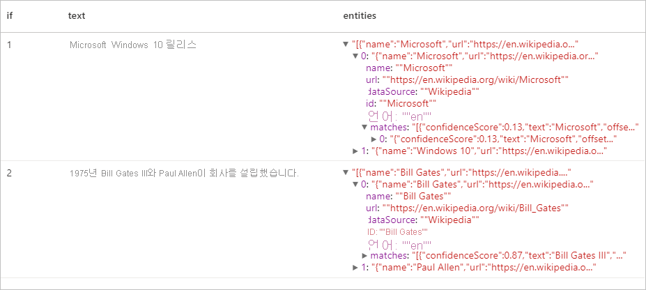
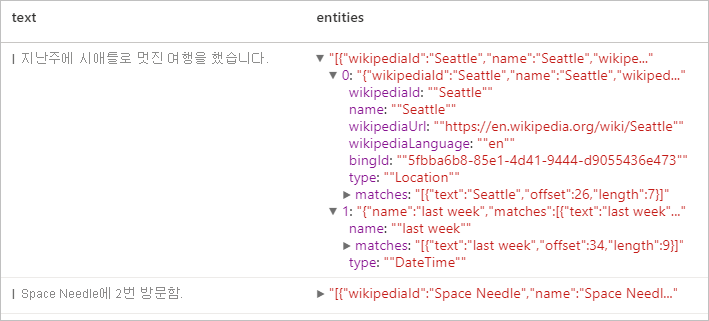
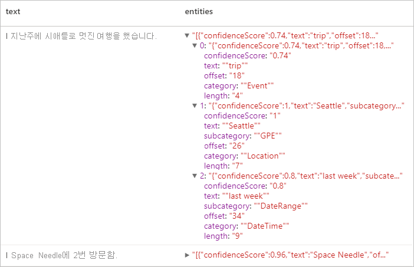
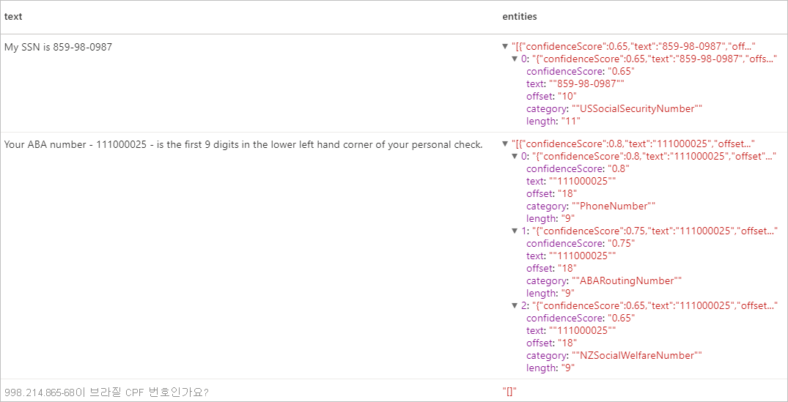

# <a name="tutorial-text-analytics-with-cognitive-service"></a>자습서: Cognitive Service를 이용한 Text Analytics

[Text Analytics](../../cognitive-services/text-analytics/index.yml)는 NLP(자연어 처리) 기능을 사용하여 텍스트 마이닝 및 텍스트 분석을 수행하는 [Azure Cognitive Service](../../cognitive-services/index.yml)입니다. 이 자습서를 통해 [Text Analytics](../../cognitive-services/text-analytics/index.yml)를 사용하여 Azure Synapse Analytics에서 구조화되지 않은 텍스트를 분석하는 방법에 대해 알아봅니다.

이 자습서에서는 다음 기능을 수행하기 위해 [MMLSpark](https://github.com/Azure/mmlspark)와 함께 텍스트 분석을 사용하는 방법을 보여줍니다.

> [!div class="checklist"]
> - 문장 또는 문서 수준의 감정 레이블 검색
> - 지정된 텍스트 입력에 대한 언어 식별
> - 잘 알려진 기술 자료 링크가 있는 텍스트에서 엔터티 인식
> - 텍스트에서 키 단계 추출
> - 텍스트에서 다른 엔터티를 식별하고 미리 정의된 클래스 또는 형식으로 분류
> - 지정된 텍스트에서 중요한 엔터티 식별 및 수정

Azure 구독이 없는 경우 [시작하기 전에 체험 계정을 만듭니다](https://azure.microsoft.com/free/).

## <a name="prerequisites"></a>사전 요구 사항

- [Azure Synapse Analytics 작업 영역](../get-started-create-workspace.md)(기본 스토리지로 구성된 Azure Data Lake Storage Gen2 스토리지 계정이 있음). 사용하는 Data Lake Storage Gen2 파일 시스템의 *Storage Blob 데이터 기여자* 여야 합니다.
- Azure Synapse Analytics 작업 영역의 Spark 풀. 자세한 내용은 [Azure Synapse에서 Spark 풀 만들기](../quickstart-create-sql-pool-studio.md)를 참조하세요.
- [Azure Synaps에서 Cognitive Services 구성](tutorial-configure-cognitive-services-synapse.md) 자습서에서 설명하는 사전 구성 단계


## <a name="get-started"></a>시작
Synapse Studio를 열고 새 Notebook을 만듭니다. 시작하려면 [MMLSpark](https://github.com/Azure/mmlspark)를 가져옵니다. 

```python
from mmlspark.cognitive import *
from pyspark.sql.functions import col
```

## <a name="configure-text-analytics"></a>텍스트 분석 구성

[사전 구성 단계](tutorial-configure-cognitive-services-synapse.md)에서 구성한 연결된 텍스트 분석을 사용합니다. 

```python
cognitive_service_name = "<Your linked service for text analytics>"
```

## <a name="text-sentiment"></a>텍스트 감정
텍스트 감정 분석을 통해 감정 레이블(예: "부정적", "중립적" 및 "긍정적")과 문장 및 문서 수준의 신뢰도 점수 검색 방법을 제공합니다. 사용 가능한 언어 목록은 [Text Analytics API에서 지원되는 언어](../../cognitive-services/text-analytics/language-support.md?tabs=sentiment-analysis)를 참조하세요.

### <a name="v2"></a>V2

```python

# Create a dataframe that's tied to it's column names
df = spark.createDataFrame([
  ("I am so happy today, its sunny!", "en-US"),
  ("I am frustrated by this rush hour traffic", "en-US"),
  ("The cognitive services on spark aint bad", "en-US"),
], ["text", "language"])

# Run the Text Analytics service with options
sentimentv2 = (TextSentimentV2()
    .setLinkedService(linked_service_name)
    .setTextCol("text")
    .setOutputCol("sentiment")
    .setErrorCol("error")
    .setLanguageCol("language"))

# Show the results of your text query in a table format
display(sentimentv2.transform(df).select("text", col("sentiment")[0].getItem("score").alias("positive score")))

```
### <a name="expected-results"></a>예상 결과

|text|긍정 점수|
|---|---|
|I am so happy today, its sunny!|0.99511755|
|I am frustrated by this rush hour traffic|0.007274598|
|The cognitive services on spark aint bad|0.9144157|

### <a name="v31"></a>V3.1

```python

# Create a dataframe that's tied to it's column names
df = spark.createDataFrame([
  ("I am so happy today, its sunny!", "en-US"),
  ("I am frustrated by this rush hour traffic", "en-US"),
  ("The cognitive services on spark aint bad", "en-US"),
], ["text", "language"])

# Run the Text Analytics service with options
sentiment = (TextSentiment()
    .setLinkedService(linked_service_name)
    .setTextCol("text")
    .setOutputCol("sentiment")
    .setErrorCol("error")
    .setLanguageCol("language"))

# Show the results of your text query in a table format
display(sentiment.transform(df).select("text", col("sentiment")[0].getItem("sentiment").alias("sentiment")))

```
### <a name="expected-results"></a>예상 결과

|text|감정|
|---|---|
|I am so happy today, its sunny!|긍정|
|I am frustrated by this rush hour traffic|부정|
|The cognitive services on spark aint bad|긍정|

---

## <a name="language-detector"></a>언어 감지기

언어 감지기는 각 문서에 대해 텍스트 입력을 평가하고, 분석 강도를 나타내는 점수가 있는 언어 식별자를 반환합니다. 이 기능은 알 수 없는 언어로 된 임의의 텍스트를 수집하는 콘텐츠 저장소에 유용합니다. 사용 가능한 언어 목록은 [Text Analytics API에서 지원되는 언어](../../cognitive-services/text-analytics/language-support.md?tabs=language-detection)를 참조하세요.

### <a name="v2"></a>V2
```python
# Create a dataframe that's tied to it's column names
df = spark.createDataFrame([
  ("Hello World",),
  ("Bonjour tout le monde",),
  ("La carretera estaba atascada. Había mucho tráfico el día de ayer.",),
  ("你好",),
  ("こんにちは",),
  (":) :( :D",)
], ["text",])

# Run the Text Analytics service with options
languagev2 = (LanguageDetectorV2()
    .setLinkedService(linked_service_name)
    .setTextCol("text")
    .setOutputCol("language")
    .setErrorCol("error"))

# Show the results of your text query in a table format
display(languagev2.transform(df))
```
### <a name="expected-results"></a>예상 결과


### <a name="v31"></a>V3.1
```python
# Create a dataframe that's tied to it's column names
df = spark.createDataFrame([
  ("Hello World",),
  ("Bonjour tout le monde",),
  ("La carretera estaba atascada. Había mucho tráfico el día de ayer.",),
  ("你好",),
  ("こんにちは",),
  (":) :( :D",)
], ["text",])

# Run the Text Analytics service with options
language = (LanguageDetector()
    .setLinkedService(linked_service_name)
    .setTextCol("text")
    .setOutputCol("language")
    .setErrorCol("error"))

# Show the results of your text query in a table format
display(language.transform(df))
```
### <a name="expected-results"></a>예상 결과
<a name="expected-results-for-language-detector-v31"></a>
---

## <a name="entity-detector"></a>엔터티 감지기
엔터티 감지기는 잘 알려진 기술 자료에 대한 링크가 있는 인식된 엔터티 목록을 반환합니다. 사용 가능한 언어 목록은 [Text Analytics API에서 지원되는 언어](../../cognitive-services/text-analytics/language-support.md?tabs=entity-linking)를 참조하세요.

### <a name="v2"></a>V2

```python
df = spark.createDataFrame([
    ("1", "Microsoft released Windows 10"),
    ("2", "In 1975, Bill Gates III and Paul Allen founded the company.")
], ["if", "text"])

entityv2 = (EntityDetectorV2()
    .setLinkedService(linked_service_name)
    .setLanguage("en")
    .setOutputCol("replies")
    .setErrorCol("error"))

display(entityv2.transform(df).select("if", "text", col("replies")[0].getItem("entities").alias("entities")))
```
### <a name="expected-results"></a>예상 결과



### <a name="v31"></a>V3.1

```python
df = spark.createDataFrame([
    ("1", "Microsoft released Windows 10"),
    ("2", "In 1975, Bill Gates III and Paul Allen founded the company.")
], ["if", "text"])

entity = (EntityDetector()
    .setLinkedService(linked_service_name)
    .setLanguage("en")
    .setOutputCol("replies")
    .setErrorCol("error"))

display(entity.transform(df).select("if", "text", col("replies")[0].getItem("entities").alias("entities")))
```
### <a name="expected-results"></a>예상 결과


---

## <a name="key-phrase-extractor"></a>핵심 구 추출

핵심 구 추출은 구조화되지 않은 텍스트를 평가하고 핵심 구 목록을 반환합니다. 이 기능은 문서 컬렉션에서 주요 지점을 빠르게 식별해야 하는 경우에 유용합니다. 사용 가능한 언어 목록은 [Text Analytics API에서 지원되는 언어](../../cognitive-services/text-analytics/language-support.md?tabs=key-phrase-extraction)를 참조하세요.

### <a name="v2"></a>V2
```python
df = spark.createDataFrame([
    ("en", "Hello world. This is some input text that I love."),
    ("fr", "Bonjour tout le monde"),
    ("es", "La carretera estaba atascada. Había mucho tráfico el día de ayer.")
], ["lang", "text"])

keyPhrasesv2 = (KeyPhraseExtractorV2()
    .setLinkedService(linked_service_name)
    .setLanguageCol("lang")
    .setOutputCol("replies")
    .setErrorCol("error"))

display(keyPhrasesv2.transform(df).select("text", col("replies")[0].getItem("keyPhrases").alias("keyPhrases")))
```

### <a name="expected-results"></a>예상 결과

|text|keyPhrases|
|---|---|
|Hello world. 이는 제가 선호하는 입력 텍스트입니다.|"["input text","world"]"|
|Bonjour tout le monde|"["monde"]"|
|La carretera estaba atascada. Había mucho tráfico el día de ayer.|"["carretera","tráfico","día"]"|


### <a name="v31"></a>V3.1

```python
df = spark.createDataFrame([
    ("en", "Hello world. This is some input text that I love."),
    ("fr", "Bonjour tout le monde"),
    ("es", "La carretera estaba atascada. Había mucho tráfico el día de ayer.")
], ["lang", "text"])

keyPhrase = (KeyPhraseExtractor()
    .setLinkedService(linked_service_name)
    .setLanguageCol("lang")
    .setOutputCol("replies")
    .setErrorCol("error"))

display(keyPhrase.transform(df).select("text", col("replies")[0].getItem("keyPhrases").alias("keyPhrases")))
```

### <a name="expected-results"></a>예상 결과

|text|keyPhrases|
|---|---|
|Hello world. 이는 제가 선호하는 입력 텍스트입니다.|"["Hello world","input text"]"|
|Bonjour tout le monde|"["Bonjour","monde"]"|
|La carretera estaba atascada. Había mucho tráfico el día de ayer.|"["mucho tráfico","día","carretera","ayer"]"|

---

## <a name="named-entity-recognition-ner"></a>NER(명명된 엔터티 인식)

NER(명명된 엔터티 인식)은 텍스트에서 다양한 엔터티를 식별하고 이를 사용자, 위치, 이벤트, 제품, 조직 등의 미리 정의된 클래스 또는 형식으로 분류하는 기능입니다. 사용 가능한 언어 목록은 [Text Analytics API에서 지원되는 언어](../../cognitive-services/text-analytics/language-support.md?tabs=named-entity-recognition)를 참조하세요.

### <a name="v2"></a>V2
```python
df = spark.createDataFrame([
    ("1", "en", "I had a wonderful trip to Seattle last week."),
    ("2", "en", "I visited Space Needle 2 times.")
], ["id", "language", "text"])

nerv2 = (NERV2()
    .setLinkedService(linked_service_name)
    .setLanguageCol("language")
    .setOutputCol("replies")
    .setErrorCol("error"))

display(nerv2.transform(df).select("text", col("replies")[0].getItem("entities").alias("entities")))
```
### <a name="expected-results"></a>예상 결과


### <a name="v31"></a>V3.1

```python
df = spark.createDataFrame([
    ("1", "en", "I had a wonderful trip to Seattle last week."),
    ("2", "en", "I visited Space Needle 2 times.")
], ["id", "language", "text"])

ner = (NER()
    .setLinkedService(linked_service_name)
    .setLanguageCol("language")
    .setOutputCol("replies")
    .setErrorCol("error"))

display(ner.transform(df).select("text", col("replies")[0].getItem("entities").alias("entities")))
```
### <a name="expected-results"></a>예상 결과


---

## <a name="personally-identifiable-information-pii-v31"></a>PII(개인 식별 정보) V3.1
PII 기능은 NER의 일부이며 전화 번호, 이메일 주소, 우편 주소, 여권 번호 등의 개별 사용자와 연결된 텍스트에서 중요한 엔터티를 식별하고 교정할 수 있습니다. 사용 가능한 언어 목록은 [Text Analytics API에서 지원되는 언어](../../cognitive-services/text-analytics/language-support.md?tabs=pii)를 참조하세요.

### <a name="v31"></a>V3.1

```python
df = spark.createDataFrame([
    ("1", "en", "My SSN is 859-98-0987"),
    ("2", "en", "Your ABA number - 111000025 - is the first 9 digits in the lower left hand corner of your personal check."),
    ("3", "en", "Is 998.214.865-68 your Brazilian CPF number?")
], ["id", "language", "text"])

pii = (PII()
    .setLinkedService(linked_service_name)
    .setLanguageCol("language")
    .setOutputCol("replies")
    .setErrorCol("error"))

display(pii.transform(df).select("text", col("replies")[0].getItem("entities").alias("entities")))
```
### <a name="expected-results"></a>예상 결과


---

## <a name="clean-up-resources"></a>리소스 정리
Spark 인스턴스가 종료되도록 하려면 연결된 세션(Notebook)을 종료합니다. Apache Spark 풀에 지정된 **유휴 시간** 에 도달하면 풀이 종료됩니다. Notebook 오른쪽 상단에 있는 상태 표시줄에서 **세션 중지** 를 선택할 수도 있습니다.


## <a name="next-steps"></a>다음 단계

* [Synapse 샘플 Notebooks 체크 아웃](https://github.com/Azure-Samples/Synapse/tree/main/MachineLearning) 
* [MMLSpark GitHub 리포지토리](https://github.com/Azure/mmlspark)
