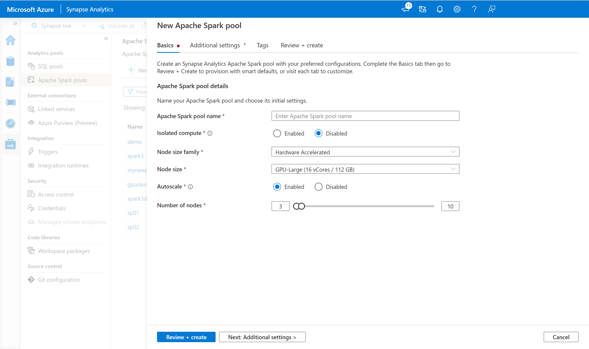
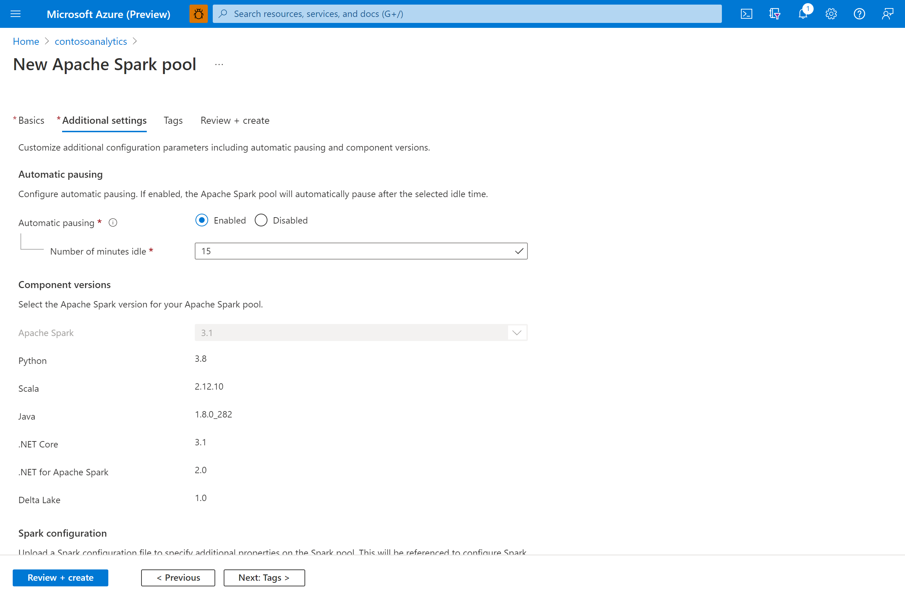
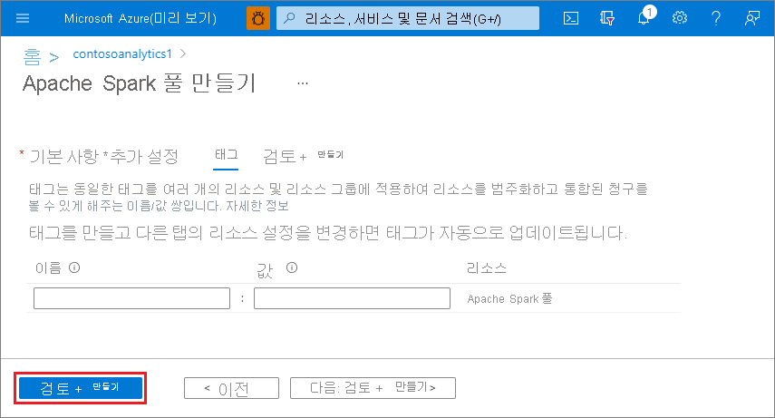
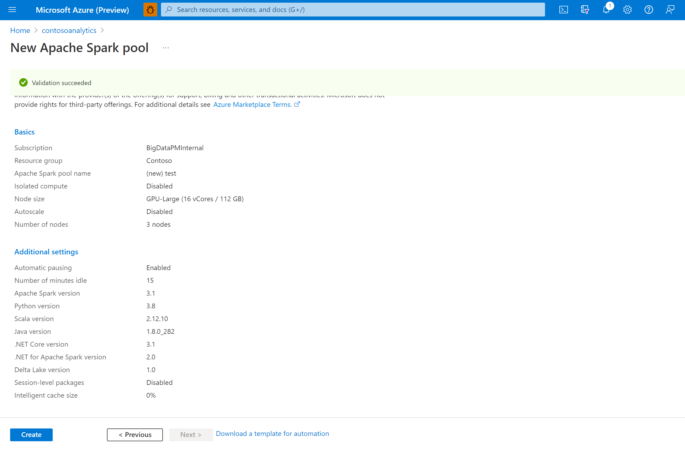
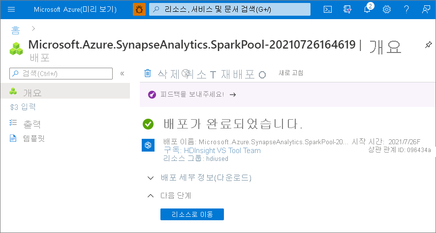
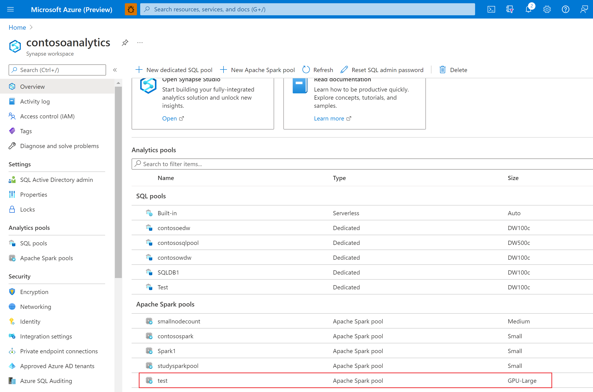

# 빠른 시작: Azure Portal을 사용하여 Azure Synapse Analytics에서 Apache Spark GPU 지원 풀 만들기

Apache Spark 풀은 더 빠른 분석 인사이트를 위해 데이터를 로드, 모델링, 처리 및 배포할 수 있는 오픈 소스 빅 데이터 컴퓨팅 기능을 제공합니다. 이제 Synapse는 백 엔드에서 GPU를 사용하여 가속화된 처리를 위해 GPU에서 Spark 워크로드를 실행하는 Apache Spark 풀을 만드는 기능을 제공합니다.

이 빠른 시작에서는 Azure Portal을 사용하여 Azure Synapse Analytics 작업 영역에서 Apache Spark GPU 지원 풀을 만드는 방법을 알아봅니다.

> [!NOTE]
> Azure Synapse GPU 사용 풀은 현재 공개 미리 보기로 제공됩니다.

Azure 구독이 없는 경우 [시작하기 전에 체험 계정을 만듭니다](https://azure.microsoft.com/free/).

## 사전 요구 사항

- Azure 구독 - [체험 구독 만들기](https://azure.microsoft.com/free/)
- [Synapse Analytics 작업 영역](quickstart-create-workspace.md)

## Azure Portal에 로그인

[Azure 포털](https://portal.azure.com/)

## Synapse 작업 영역으로 이동 
1. 검색 창에 서비스 이름(또는 리소스 이름)을 직접 입력하여 Apache Spark 풀이 생성될 때 Synapse 작업 영역으로 이동합니다.

2. 작업 영역 목록에서 열려는 작업 영역의 이름(또는 이름의 일부)을 입력합니다. 이 예제에서는 **contosoanalytics** 라는 작업 영역을 사용합니다.

## 새 Azure Synapse GPU 지원 풀 만들기

1. Apache Spark 풀을 만들려는 Synapse 작업 영역에서 **새 Apache Spark 풀** 을 선택합니다.
    
2. **기본 사항** 탭에서 다음 정보를 입력합니다.

    |설정 | 제안 값 | Description |
    | :------ | :-------------- | :---------- |
    | **Apache Spark 풀 이름** | 유효한 풀 이름 | Apache Spark 풀이 사용할 이름입니다. |
    | **노드 크기 제품군** | 하드웨어 가속 | 드롭다운 메뉴에서 하드웨어 가속을 선택합니다. |
    | **노드 크기** | 대형(16개 vCPU/110GB/1GPU) | 이 빠른 시작에서는 비용을 줄이기 위해 이 값을 가장 작은 크기로 설정합니다. |
    | **Autoscale** | 사용 안 함 | 이 빠른 시작에 자동 크기 조정이 필요하지 않습니다. |
    | **노드 수** | 3 | 이 빠른 시작에 대한 비용을 제한하려면 작은 크기를 사용합니다. |

    
    > [!IMPORTANT]
    > Apache Spark 풀이 사용할 수 있는 이름과 관련된 제한 사항이 있습니다. 이름은 문자 또는 숫자만 포함해야 하고, 15자 이하여야 하고, 문자로 시작하고 예약어를 포함하지 않아야 하고, 작업 영역에서 고유해야 합니다.

3. **다음: 추가 설정** 을 선택하고 기본 설정을 검토합니다. 기본 설정을 수정하지 마세요. GPU 풀은 **Apache Spark 3.1로만 생성** 할 수 있습니다.
    

4. **다음: 태그** 를 선택합니다. 태그를 추가하지 마세요.

    

5. **검토 + 만들기** 를 선택합니다.

6. 이전에 입력한 내용에 따라 세부 정보가 올바른지 확인하고 **만들기** 를 선택합니다.
    

7. 이제 리소스 프로비저닝 흐름이 시작되고 완료되면 표시됩니다.
    

8. 프로비전이 완료된 후 작업 영역으로 돌아가면 새로 만든 Azure Synapse GPU 지원 풀에 대한 새 항목이 표시됩니다.
    

9. 지금은 실행 중인 리소스가 없으므로 Spark 요금이 부과되지 않습니다. 여기서는 만들려는 Spark 인스턴스에 대한 메타데이터를 만들었습니다.

## 리소스 정리

작업 영역에서 Apache Spark 풀을 삭제하려면 다음 단계를 수행합니다.
> [!WARNING]
> Apache Spark 풀을 삭제하면 작업 영역에서 분석 엔진이 제거됩니다. 그러면 더 이상 풀에 연결할 수 없으며, 이 Apache Spark 풀을 사용하는 모든 쿼리, 파이프라인 및 Notebook은 더 이상 작동하지 않습니다.

Apache Spark 풀을 삭제하려면 다음을 수행합니다.

1. 작업 영역에서 Apache Spark 풀 블레이드로 이동합니다.
2. 삭제할 Apache Spark 풀을 선택합니다(여기서는 **contosospark**).
3. **삭제** 를 누릅니다.

 

4. 삭제를 확인하고 **삭제** 단추를 누릅니다.

 

5. 프로세스가 성공적으로 완료되면 Apache Spark 풀이 작업 영역 리소스에 더 이상 나열되지 않습니다.

## 다음 단계

- [빠른 시작: GPU 풀에서 실행할 Apache Spark Notebook 만들기](spark/apache-spark-rapids-gpu.md)를 참조하세요.
