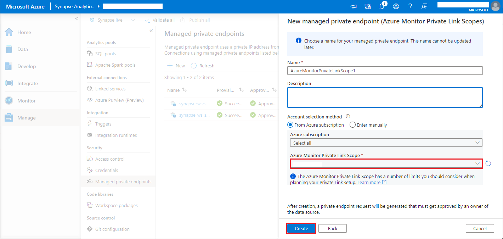

# <a name="monitor-apache-spark-applications-with-azure-log-analytics"></a>Azure Log Analytics를 사용하여 Apache Spark 애플리케이션 모니터링

이 자습서에서는 Log Analytics에 기본 제공되는 Synapse Studio 커넥터를 사용하도록 설정하는 방법을 알아봅니다. 그런 다음, Apache Spark 애플리케이션 메트릭 및 로그를 수집하여 [Log Analytics 작업 영역](../../azure-monitor/logs/quick-create-workspace.md)으로 보낼 수 있습니다. 마지막으로, Azure Monitor 통합 문서를 사용하여 메트릭과 로그를 시각화할 수 있습니다.

## <a name="configure-workspace-information"></a>작업 영역 정보 구성

다음 단계에 따라 Synapse Studio에서 필요한 정보를 구성합니다.

### <a name="step-1-create-a-log-analytics-workspace"></a>1단계: Log Analytics 작업 영역 만들기

다음 리소스 중 하나를 참조하여 이 작업 영역을 만듭니다.
- [Azure Portal에서 작업 영역 만들기](../../azure-monitor/logs/quick-create-workspace.md)
- [Azure CLI를 사용하여 작업 영역 만들기](../../azure-monitor/logs/resource-manager-workspace.md)
- [PowerShell을 사용하여 Azure Monitor에서 작업 영역 만들기 및 구성](../../azure-monitor/logs/powershell-workspace-configuration.md)

### <a name="step-2-prepare-an-apache-spark-configuration-file"></a>2단계: Apache Spark 구성 파일 준비

다음 중 원하는 옵션을 사용하여 파일을 준비합니다.

#### <a name="option-1-configure-with-log-analytics-workspace-id-and-key"></a>옵션 1: Azure Log Analytics 작업 영역 ID 및 키를 사용하여 구성 

다음 Apache Spark 구성을 복사하여 *spark_loganalytics_conf.txt* 로 저장하고, 다음 매개 변수를 채웁니다.

   - `<LOG_ANALYTICS_WORKSPACE_ID>`: Log Analytics 작업 영역 ID입니다.
   - `<LOG_ANALYTICS_WORKSPACE_KEY>`: Log Analytics 키입니다. Azure Portal에서 **Azure Log Analytics 작업 영역** > **에이전트 관리** > **기본 키** 로 이동하여 찾을 수 있습니다.

```properties
spark.synapse.logAnalytics.enabled true
spark.synapse.logAnalytics.workspaceId <LOG_ANALYTICS_WORKSPACE_ID>
spark.synapse.logAnalytics.secret <LOG_ANALYTICS_WORKSPACE_KEY>
```

#### <a name="option-2-configure-with-azure-key-vault"></a>옵션 2: Azure Key Vault로 구성

> [!NOTE]
> Apache Spark 애플리케이션을 제출하는 사용자에게 비밀 읽기 권한을 부여해야 합니다. 자세한 내용은 [Azure 역할 기반 액세스 제어를 사용하여 Key Vault 키, 인증서 및 비밀에 대한 액세스 제공](../../key-vault/general/rbac-guide.md)을 참조하세요.

작업 영역 키를 저장할 Azure Key Vault를 구성하려면 다음 단계를 수행합니다.

1. Azure Portal에서 키 자격 증명 모음을 만들고 해당 키 자격 증명 모음으로 이동합니다.
2. 키 자격 증명 모음의 설정 페이지에서 **비밀** 을 선택합니다.
3. **생성/가져오기** 를 선택합니다.
4. **비밀 만들기** 화면에서 다음 값을 선택합니다.
   - **이름**: 비밀의 이름을 입력합니다. 기본값으로 `SparkLogAnalyticsSecret`을 입력합니다.
   - **값**: 비밀의 `<LOG_ANALYTICS_WORKSPACE_KEY>`를 입력합니다.
   - 다른 값은 기본값으로 그대로 둡니다. 그런 다음 **생성** 를 선택합니다.
5. 다음 Apache Spark 구성을 복사하여 *spark_loganalytics_conf.txt* 로 저장하고, 다음 매개 변수를 채웁니다.

   - `<LOG_ANALYTICS_WORKSPACE_ID>`: Log Analytics 작업 영역 ID입니다.
   - `<AZURE_KEY_VAULT_NAME>`: 구성한 키 자격 증명 모음 이름입니다.
   - `<AZURE_KEY_VAULT_SECRET_KEY_NAME>`(선택 사항): 작업 영역 키에 대한 키 자격 증명 모음의 비밀 이름입니다. 기본값은 `SparkLogAnalyticsSecret`입니다.

```properties
spark.synapse.logAnalytics.enabled true
spark.synapse.logAnalytics.workspaceId <LOG_ANALYTICS_WORKSPACE_ID>
spark.synapse.logAnalytics.keyVault.name <AZURE_KEY_VAULT_NAME>
spark.synapse.logAnalytics.keyVault.key.secret <AZURE_KEY_VAULT_SECRET_KEY_NAME>
```

> [!NOTE]
> 작업 영역 ID를 Key Vault에 저장할 수도 있습니다. 위의 단계를 참조하여 비밀 이름 `SparkLogAnalyticsWorkspaceId`가 포함된 작업 영역 ID를 저장합니다. 또는 `spark.synapse.logAnalytics.keyVault.key.workspaceId` 구성을 사용하여 Key Vault의 작업 영역 ID 비밀 이름을 지정할 수 있습니다.

#### <a name="option-3-configure-with-a-linked-service"></a>옵션 3. 연결된 서비스를 통해 구성

> [!NOTE]
> Apache Spark 애플리케이션을 제출하는 사용자에게 비밀 읽기 권한을 부여해야 합니다. 자세한 내용은 [Azure 역할 기반 액세스 제어를 사용하여 Key Vault 키, 인증서 및 비밀에 대한 액세스 제공](../../key-vault/general/rbac-guide.md)을 참조하세요.

Synapse Studio에서 작업 영역 키를 저장할 Key Vault 연결된 서비스를 구성하려면 다음 단계를 수행합니다.

1. 이전 섹션 "옵션 2"의 모든 단계를 따릅니다.
2. Synapse Studio에서 다음과 같이 Key Vault 연결된 서비스를 만듭니다.

    a. **Synapse Studio** > **관리** > **연결된 서비스**, **새로 만들기** 로 이동합니다.

    b. 검색 상자에서 **Azure Key Vault** 를 검색합니다.

    다. 연결된 서비스의 이름을 입력합니다.

    d. 해당하는 키 자격 증명 모음을 선택하고 **만들기** 를 선택합니다.

3. `spark.synapse.logAnalytics.keyVault.linkedServiceName` 항목을 Apache Spark 구성에 추가합니다.

```properties
spark.synapse.logAnalytics.enabled true
spark.synapse.logAnalytics.workspaceId <LOG_ANALYTICS_WORKSPACE_ID>
spark.synapse.logAnalytics.keyVault.name <AZURE_KEY_VAULT_NAME>
spark.synapse.logAnalytics.keyVault.key.secret <AZURE_KEY_VAULT_SECRET_KEY_NAME>
spark.synapse.logAnalytics.keyVault.linkedServiceName <LINKED_SERVICE_NAME>
```

#### <a name="available-apache-spark-configuration"></a>사용 가능한 Apache Spark 구성

| 구성 이름 | 기본값 | Description |
| ------------------ | ------------- | ----------- |
| spark.synapse.logAnalytics.enabled | false | Spark 애플리케이션에 Log Analytics 싱크를 사용하도록 설정하려면 true를 지정합니다. 그렇지 않으면 false입니다. |
| spark.synapse.logAnalytics.workspaceId | - | 대상 Log Analytics 작업 영역 ID입니다. |
| spark.synapse.logAnalytics.secret | - | 대상 Log Analytics 작업 영역 비밀입니다. |
| spark.synapse.logAnalytics.keyVault.linkedServiceName   | - | Log Analytics 작업 영역 ID 및 키의 Key Vault 연결된 서비스 이름입니다. |
| spark.synapse.logAnalytics.keyVault.name | - | Log Analytics ID 및 키의 Key Vault 이름입니다. |
| spark.synapse.logAnalytics.keyVault.key.workspaceId | SparkLogAnalyticsWorkspaceId | Log Analytics 작업 영역 ID의 Key Vault 비밀 이름입니다. |
| spark.synapse.logAnalytics.keyVault.key.secret | SparkLogAnalyticsSecret | Log Analytics 작업 영역에 대한 Key Vault 비밀 이름입니다. |
| spark.synapse.logAnalytics.uriSuffix | ods.opinsights.azure.com | 대상 Log Analytics 작업 영역 [URI 접미사][uri_suffix]입니다. 작업 영역이 Azure 글로벌에 없는 경우 해당 클라우드에 따라 URI 접미사를 업데이트해야 합니다. |
| spark.synapse.logAnalytics.filter.eventName.match | - | 선택 사항입니다. 쉼표로 구분된 Spark 이벤트 이름이며, 수집할 이벤트를 지정할 수 있습니다. 예: `SparkListenerJobStart,SparkListenerJobEnd` |
| spark.synapse.logAnalytics.filter.loggerName.match | - | 선택 사항입니다. 쉼표로 구분된 log4j 로거 이름이며, 수집할 이벤트를 지정할 수 있습니다. 예: `org.apache.spark.SparkContext,org.example.Logger` |
| spark.synapse.logAnalytics.filter.metricName.match | - | 선택 사항입니다. 쉼표로 구분된 Spark 메트릭 이름 접미사이며, 수집할 메트릭을 지정할 수 있습니다. 예: `jvm.heap.used`|

> [!NOTE]  
> - Azure 중국의 경우 `spark.synapse.logAnalytics.uriSuffix` 매개 변수가 `ods.opinsights.azure.cn`이어야 합니다. 
> - Azure Government의 경우 `spark.synapse.logAnalytics.uriSuffix` 매개 변수가 `ods.opinsights.azure.us`여야 합니다. 

[uri_suffix]: ../../azure-monitor/logs/data-collector-api.md#request-uri


### <a name="step-3-upload-your-apache-spark-configuration-to-an-apache-spark-pool"></a>3단계: Apache Spark 풀에 Apache Spark 구성 업로드
구성 파일은 Azure Synapse Analytics Apache Spark 풀에 업로드할 수 있습니다. Synapse Studio에서 다음을 수행합니다.

   1. **관리** > **Apache Spark 풀** 을 선택합니다.
   2. Apache Spark 풀 옆에 있는 **...** 단추를 선택합니다.
   3. **Apache Spark 구성** 을 선택합니다. 
   4. **업로드** 를 클릭하고 *spark_loganalytics_conf.txt* 파일을 선택합니다.
   5. **업로드** 를 선택한 다음, **적용** 을 선택합니다.

      > [!div class="mx-imgBorder"]
      > 

> [!NOTE] 
>
> Apache Spark 풀에 제출된 모든 Apache Spark 애플리케이션은 구성 설정을 사용하여 Apache Spark 애플리케이션 메트릭과 로그를 지정된 작업 영역으로 푸시합니다.

## <a name="submit-an-apache-spark-application-and-view-the-logs-and-metrics"></a>Apache Spark 애플리케이션을 제출하고 로그 및 메트릭 보기

방법은 다음과 같습니다.

1. Apache Spark 애플리케이션을 이전 단계에서 구성한 Apache Spark 풀에 제출합니다. 다음 방법 중 하나를 사용하여 제출할 수 있습니다.
    - Synapse Studio에서 Notebook을 실행합니다. 
    - Synapse Studio에서 Apache Spark 작업 정의를 통해 Apache Spark 일괄 작업을 제출합니다.
    - Apache Spark 작업이 포함된 파이프라인을 실행합니다.

1. 지정된 Log Analytics 작업 영역으로 이동한 다음, Apache Spark 애플리케이션이 실행되기 시작할 때 애플리케이션 메트릭 및 로그를 확인합니다.

## <a name="write-custom-application-logs"></a>사용자 지정 애플리케이션 로그 작성

Apache Log4j 라이브러리를 사용하여 사용자 지정 로그를 작성할 수 있습니다.

Scala 예제:

```scala
%%spark
val logger = org.apache.log4j.LogManager.getLogger("com.contoso.LoggerExample")
logger.info("info message")
logger.warn("warn message")
logger.error("error message")
```

PySpark 예제:

```python
%%pyspark
logger = sc._jvm.org.apache.log4j.LogManager.getLogger("com.contoso.PythonLoggerExample")
logger.info("info message")
logger.warn("warn message")
logger.error("error message")
```

## <a name="use-the-sample-workbook-to-visualize-the-metrics-and-logs"></a>샘플 통합 문서를 사용하여 메트릭 및 로그 시각화

1. [통합 문서를 다운로드](https://aka.ms/SynapseSparkLogAnalyticsWorkbook)합니다.
2. 통합 문서 파일 콘텐츠를 열고 복사합니다.
3. [Azure Portal](https://portal.azure.com/)에서 **Log Analytics 작업 영역** > **통합 문서** 를 선택합니다 
4. **빈** 통합 문서를 엽니다. **</>** 아이콘을 선택하여 **고급 편집기** 모드를 사용합니다.
5. 존재하는 모든 JSON 위에 붙여넣습니다.
6. **적용** 을 선택한 다음, **편집 완료** 를 선택합니다.

    > [!div class="mx-imgBorder"]
    > 

    > [!div class="mx-imgBorder"]
    > 

그런 다음, Apache Spark 애플리케이션을 구성된 Apache Spark 풀에 제출합니다. 애플리케이션이 실행 중 상태가 되면 통합 문서 드롭다운 목록에서 실행 중인 애플리케이션을 선택합니다.

> [!div class="mx-imgBorder"]
> 

통합 문서를 사용자 지정할 수 있습니다. 예를 들어 Kusto 쿼리를 사용하고 경고를 구성할 수 있습니다.

> [!div class="mx-imgBorder"]
> 

## <a name="query-data-with-kusto"></a>Kusto를 사용하여 데이터 쿼리

다음은 Apache Spark 이벤트를 쿼리하는 예제입니다.

```kusto
SparkListenerEvent_CL
| where workspaceName_s == "{SynapseWorkspace}" and clusterName_s == "{SparkPool}" and livyId_s == "{LivyId}"
| order by TimeGenerated desc
| limit 100 
```

다음은 Apache Spark 애플리케이션 드라이버 및 실행기 로그를 쿼리하는 예제입니다.

```kusto
SparkLoggingEvent_CL
| where workspaceName_s == "{SynapseWorkspace}" and clusterName_s == "{SparkPool}" and livyId_s == "{LivyId}"
| order by TimeGenerated desc
| limit 100
```

그리고 다음은 Apache Spark 메트릭을 쿼리하는 예제입니다.

```kusto
SparkMetrics_CL
| where workspaceName_s == "{SynapseWorkspace}" and clusterName_s == "{SparkPool}" and livyId_s == "{LivyId}"
| where name_s endswith "jvm.total.used"
| summarize max(value_d) by bin(TimeGenerated, 30s), executorId_s
| order by TimeGenerated asc
```


## <a name="create-and-manage-alerts"></a>경고 만들기 및 관리

사용자는 설정된 빈도로 메트릭 및 로그를 평가하고 그 결과에 따라 경고를 발생하도록 쿼리할 수 있습니다. 자세한 내용은 [Azure Monitor를 사용하여 로그 경고 만들기, 보기 및 관리](../../azure-monitor/alerts/alerts-log.md)를 참조하세요.

## <a name="synapse-workspace-with-data-exfiltration-protection-enabled"></a>데이터 반출 보호가 사용하도록 설정된 Synapse 작업 영역

[데이터 반출 보호](../security/workspace-data-exfiltration-protection.md)가 사용하도록 설정된 Synapse 작업 영역을 만든 후입니다.

이 기능을 사용하도록 설정하려면 작업 영역의 승인된 Azure AD 테넌트에서 [AMPLS(Azure Monitor 프라이빗 링크 범위)](../../azure-monitor/logs/private-link-security.md)에 대한 관리형 프라이빗 엔드포인트 연결 요청을 만들어야 합니다.

아래 단계에 따라 AMPLS(Azure Monitor 프라이빗 링크 범위)에 대한 관리형 프라이빗 엔드포인트 연결을 만들 수 있습니다.

1. 기존 AMPLS가 없는 경우 [Azure Monitor Private Link 연결 설정](../../azure-monitor/logs/private-link-security.md)에 따라 AMPLS를 만들 수 있습니다.
2. Azure Portal의 AMPLS로 이동하고, **Azure Monitor 리소스** 페이지에서 **추가** 를 클릭하여 연결을 Azure Log Analytics 작업 영역에 추가합니다.
3. **Synapse Studio > 관리 > 관리형 프라이빗 엔드포인트** 로 차례로 이동하여 **새로 만들기** 단추를 클릭하고, **Azure Monitor 프라이빗 링크 범위**, **계속** 을 차례로 선택합니다.
   > [!div class="mx-imgBorder"]
   > 
4. 만든 Azure Monitor 프라이빗 링크 범위를 선택하고, **만들기** 단추를 클릭합니다.
   > [!div class="mx-imgBorder"]
   > 
5. 프라이빗 엔드포인트를 프로비전할 때까지 몇 분 정도 기다립니다.
6. Azure Portal에서 AMPLS로 이동하고, **프라이빗 엔드포인트 연결** 페이지에서 프로비저닝된 연결을 선택하고, **승인** 을 선택합니다.

> [!NOTE] 
>  - AMPLS 개체에는 Private Link 설정을 계획할 때 고려해야 하는 여러 제한 사항이 있습니다. 이러한 제한 사항을 자세히 검토하려면 [AMPLS 제한 사항](../../azure-monitor/logs/private-link-security.md)을 참조하세요. 
>  - 관리형 프라이빗 엔드포인트를 만들 수 있는 [적절한 권한](../security/synapse-workspace-access-control-overview.md)이 있는지 확인합니다.

## <a name="next-steps"></a>다음 단계

 - [Synapse Studio에서 서버리스 Apache Spark 풀 사용](../quickstart-create-apache-spark-pool-studio.md)
 - [Notebook에서 Spark 애플리케이션 실행](./apache-spark-development-using-notebooks.md)
 - [Synapse Studio에서 Apache Spark 작업 정의 만들기](./apache-spark-job-definitions.md)
 - [Azure Storage 계정을 사용하여 Apache Spark 애플리케이션 로그 및 메트릭 수집](./azure-synapse-diagnostic-emitters-azure-storage.md)
 - [Azure Event Hubs를 사용하여 Apache Spark 애플리케이션 로그 및 메트릭 수집](./azure-synapse-diagnostic-emitters-azure-eventhub.md)