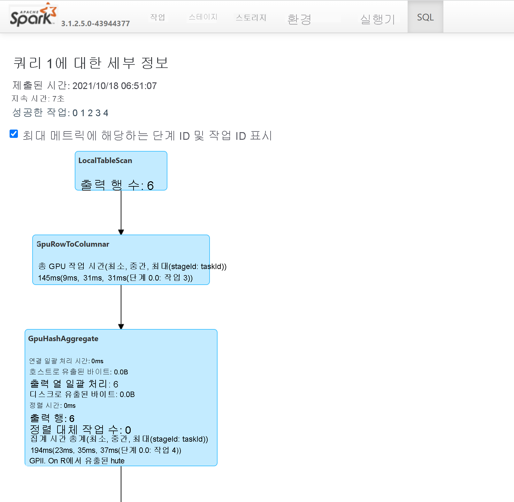

# <a name="apache-spark-gpu-accelerated-pools-in-azure-synapse-analytics"></a>Azure Synapse Analytics의 GPU 가속 풀 Apache Spark

Apache Spark는 메모리 내 처리를 지원하여 빅 데이터 분석 애플리케이션의 성능을 향상하는 병렬 처리 프레임워크입니다. Azure Synapse Analytics의 Apache Spark는 Microsoft가 구현한 클라우드의 Apache Spark 중 하나입니다. 

이제 Azure Synapse는 GPU의 방대한 병렬 처리 능력을 사용하여 처리를 가속화하는 기본 [RAPIDS 라이브러리](https://nvidia.github.io/spark-rapids/)를 통해 Spark 워크로드를 실행하는 Azure Synapse GPU 사용 풀을 만드는 기능을 제공합니다. Apache Spark용 RAPIDS 가속기를 사용하면 GPU 사용 풀로 미리 구성된 구성 설정을 사용하도록 설정하여 **코드 변경 없이** 기존 Spark 애플리케이션을 실행할 수 있습니다.
다음 구성을 설정하여 워크로드 전체 또는 일부에 대해 RAPIDS 기반 GPU 가속을 설정하거나 해제할 수 있습니다.

```
spark.conf.set('spark.rapids.sql.enabled','true/false')
```

> [!NOTE]
> Azure Synapse GPU 사용 풀은 현재 공개 미리 보기로 제공됩니다.

## <a name="rapids-accelerator-for-apache-spark"></a>Apache Spark용 RAPIDS 가속기

Spark RAPIDS 가속기는 지원되는 GPU 작업을 통해 Spark 작업의 물리적 계획을 재정의하고 GPU에서 해당 작업을 실행하여 처리를 가속화하는 데 작동하는 플러그 인입니다. 이 라이브러리는 현재 미리 보기에 있으며 모든 Spark 작업을 지원하지 않습니다(여기에는 [현재 지원되는 연산자](https://nvidia.github.io/spark-rapids/docs/supported_ops.html) 목록이 있으며 새 릴리스를 통해 추가 지원이 점진적으로 추가됨).

## <a name="cluster-configuration-options"></a>클러스터 구성 옵션

RAPIDS 가속기 플러그 인은 GPU와 실행기 간의 일대일 매핑만 지원합니다. 즉, Spark 작업은 풀 리소스에서 수용할 수 있는 실행기 및 드라이버 리소스를 요청해야 합니다(사용 가능한 GPU 및 CPU 코어 수에 따라). 이 조건을 충족하고 모든 풀 리소스를 최적으로 사용하도록 보장하려면 GPU 사용 풀에서 실행되는 Spark 애플리케이션에 대해 다음과 같은 드라이버 및 실행기를 구성해야 합니다.


|풀 크기 | 드라이버 크기 옵션 | 드라이버 코어 | 드라이버 메모리(GB) | 실행기 코어 수 | 실행기 메모리(GB) | 실행기 수 |
| :------ | :-------------- | :---------- | :------------- | :------------- | :------------------- | :------------------ |
| GPU-대형 | 소형 드라이버 | 4 | 30 | 12 | 60 | 풀의 노드 수 |
| GPU-대형 | 중간 드라이버 | 7 | 30 | 9 | 60 | 풀의 노드 수 |
| GPU-초대형 | 중간 드라이버 | 8 | 40 | 14 | 80 | 4 * 풀의 노드 수 |
| GPU-초대형 | 대형 드라이버 | 12 | 40 | 13 | 80 | 4 * 풀의 노드 수 |


위의 구성 중 하나를 충족하지 않는 워크로드는 허용되지 않습니다. 이는 Spark 작업이 풀에서 사용 가능한 모든 리소스를 활용하는 가장 효율적이고 성능이 좋은 구성으로 실행되도록 하기 위해 수행됩니다.

사용자는 워크로드를 통해 위의 구성을 설정할 수 있습니다. Notebook의 경우 사용자는 `%%configure` 매직 명령을 사용하여 아래와 같이 위 구성 중 하나를 설정할 수 있습니다.
예를 들어 세 개의 노드가 있는 대형 풀을 사용하는 경우 다음과 같습니다.

```
%%configure -f
{
    "driverMemory": "30g",
    "driverCores": 4,
    "executorMemory": "60g",
    "executorCores": 12,
    "numExecutors": 3
}
```

## <a name="run-a-sample-spark-job-through-notebook-on-an-azure-synapse-gpu-accelerated-pool"></a>Azure Synapse GPU 가속 풀에서 Notebook을 통해 샘플 Spark 작업 실행

이 섹션을 진행하기 전에 Azure Synapse Analytics에서 [Notebook을 사용하는 방법에 대한 기본 개념](apache-spark-development-using-notebooks.md)을 숙지하는 것이 좋습니다. GPU 가속을 활용하는 Spark 애플리케이션을 실행하는 단계를 살펴보겠습니다. Spark 애플리케이션은 Synapse 내에서 지원되는 4개 언어(PySpark(Python), Spark(Scala), SparkSQL 및 .NET for Spark(C#)) 모두로 작성할 수 있습니다.

1. [이 빠른 시작](../quickstart-create-apache-gpu-pool-portal.md)에서 설명한 대로 GPU 사용 풀을 만듭니다.

2. Notebook을 만들고 첫 번째 단계에서 만든 GPU 사용 풀에 연결합니다.

3. 이전 섹션에서 설명한 대로 구성을 설정합니다.

4. 아래 코드를 Notebook의 첫 번째 셀에 복사하여 샘플 데이터 프레임을 만듭니다.

### <a name="scala"></a>[Scala](#tab/scala)

```scala
import org.apache.spark.sql.types.{IntegerType, StringType, StructField, StructType}
import org.apache.spark.sql.Row
import scala.collection.JavaConversions._

val schema = StructType( Array(
  StructField("emp_id", IntegerType),
  StructField("name", StringType),
  StructField("emp_dept_id", IntegerType),
  StructField("salary", IntegerType)
))

val emp = Seq(Row(1, "Smith", 10, 100000),
    Row(2, "Rose", 20, 97600),
    Row(3, "Williams", 20, 110000),
    Row(4, "Jones", 10, 80000),
    Row(5, "Brown", 40, 60000),
    Row(6, "Brown", 30, 78000)
  )

val empDF = spark.createDataFrame(emp, schema)
```

### <a name="python"></a>[Python](#tab/python)

```python
emp = [(1, "Smith", 10, 100000),
    (2, "Rose", 20, 97600),
    (3, "Williams", 20, 110000),
    (4, "Jones", 10, 80000),
    (5, "Brown", 40, 60000),
    (6, "Brown", 30, 78000)]

empColumns = ["emp_id", "name", "emp_dept_id", "salary"]

empDF = spark.createDataFrame(data=emp, schema=empColumns)
```

### <a name="c"></a>[C#](#tab/csharp)

```csharp
using Microsoft.Spark.Sql.Types;

var emp = new List<GenericRow>
{
    new GenericRow(new object[] { 1, "Smith", 10, 100000 }),
    new GenericRow(new object[] { 2, "Rose", 20, 97600 }),
    new GenericRow(new object[] { 3, "Williams", 20, 110000 }),
    new GenericRow(new object[] { 4, "Jones", 10, 80000 }),
    new GenericRow(new object[] { 5, "Brown", 40, 60000 }),
    new GenericRow(new object[] { 6, "Brown", 30, 78000 })
};

var schema = new StructType(new List<StructField>()
{
    new StructField("emp_id", new IntegerType()),
    new StructField("name", new StringType()),
    new StructField("emp_dept_id", new IntegerType()),
    new StructField("salary", new IntegerType())
});

DataFrame empDF = spark.CreateDataFrame(emp, schema);
```
---

5. 이제 부서 ID당 최대 급여를 가져와서 집계를 수행하고 결과를 표시해 보겠습니다.

### <a name="scala"></a>[Scala](#tab/scala1)

```scala
val resultDF = empDF.groupBy("emp_dept_id").max("salary")
resultDF.show()
```

### <a name="python"></a>[Python](#tab/python1)

```python
resultDF = empDF.groupBy("emp_dept_id").max("salary")
resultDF.show()
```

### <a name="c"></a>[C#](#tab/csharp1)

```csharp
DataFrame resultDF = empDF.GroupBy("emp_dept_id").Max("salary");
resultDF.Show();
```
---

6. Spark 기록 서버를 통해 SQL 계획을 살펴보면 GPU에서 실행된 쿼리의 작업을 확인할 수 있습니다. 

## <a name="how-to-tune-your-application-for-gpus"></a>애플리케이션을 GPU용으로 튜닝하는 방법

대부분의 Spark 작업은 기본값에서 구성 설정을 튜닝하여 향상된 성능을 확인할 수 있으며, Apache Spark용 RAPIDS 가속기 플러그 인을 활용하는 작업의 경우에도 마찬가지입니다. [이 설명서](https://nvidia.github.io/spark-rapids/docs/tuning-guide.html)에서는 RAPIDS 플러그 인을 사용하여 GPU에서 실행되도록 Spark 작업을 튜닝하는 방법에 대한 지침을 제공합니다.

## <a name="quotas-and-resource-constraints-in-azure-synapse-gpu-enabled-pools"></a>Azure Synapse GPU 사용 풀의 할당량 및 리소스 제약 조건

### <a name="workspace-level"></a>작업 영역 수준

모든 Azure Synapse 작업 영역에는 GPU vCore 수가 50개인 기본 할당량이 제공됩니다. GPU 코어 할당량을 늘리려면 작업 영역 이름, 지역 및 워크로드에 필요한 총 GPU 할당량을 포함한 이메일을 AzureSynapseGPU@microsoft.com으로 보내주세요.

## <a name="next-steps"></a>다음 단계
- [Azure Synapse Analytics](../overview-what-is.md)
