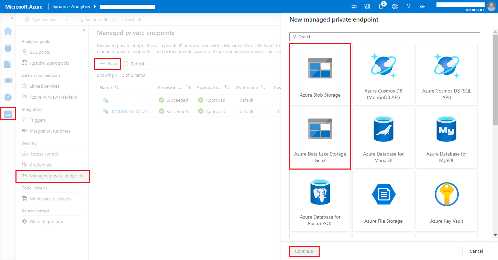
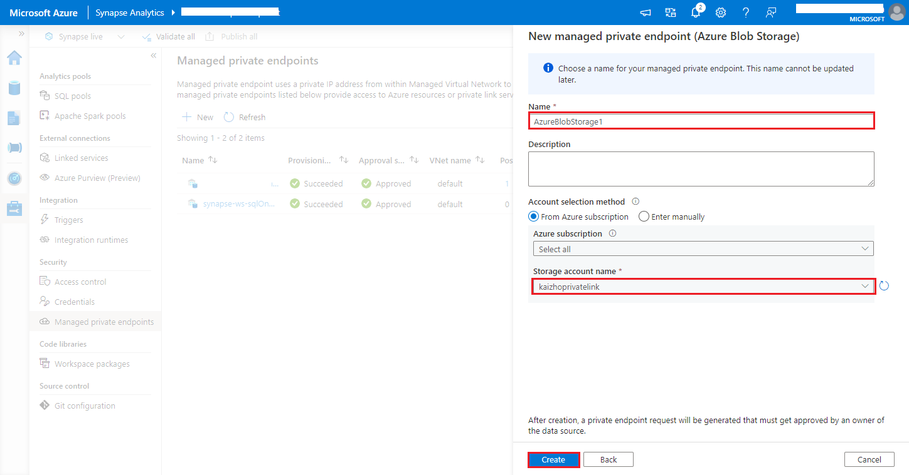

# <a name="collect-your-apache-spark-applications-logs-and-metrics-using-azure-storage-account"></a>Azure Storage 계정을 사용하여 Apache Spark 애플리케이션 로그 및 메트릭 수집

Synapse Apache Spark 진단 내보내기 확장은 Apache Spark 애플리케이션에서 로그, 이벤트 로그 및 메트릭을 Azure Log Analytics, Azure Storage 및 Azure Event Hubs를 포함한 하나 이상의 대상으로 내보낼 수 있도록 하는 라이브러리입니다. 

이 자습서에서는 Synapse Apache Spark 진단 내보내기 확장을 사용하여 Apache Spark 애플리케이션의 로그, 이벤트 로그 및 메트릭을 Azure Storage 계정으로 내보내는 방법에 대해 알아봅니다.

## <a name="collect-logs-and-metrics-to-storage-account"></a>스토리지 계정에 로그 및 메트릭 수집

### <a name="step-1-create-a-storage-account"></a>1 단계: 스토리지 계정 만들기

진단 로그 및 메트릭을 스토리지 계정에 수집하려면 기존 Azure Storage 계정을 사용할 수 있습니다. 또는 계정이 없는 경우 [Azure Blob 스토리지 계정을 만들거나](../../storage/common/storage-account-create.md) [Azure Data Lake Storage Gen2에서 사용할 스토리지 계정을 만들](../../storage/blobs/create-data-lake-storage-account.md) 수 있습니다.

### <a name="step-2-create-an-apache-spark-configuration-file"></a>2단계: Apache Spark 구성 파일 만들기

`diagnostic-emitter-azure-storage-conf.txt`를 만들고, 다음 내용을 이 파일에 복사합니다. 또는 Apache Spark 풀을 구성하기 위한 [샘플 템플릿 파일](https://go.microsoft.com/fwlink/?linkid=2169375)을 다운로드합니다.

```
spark.synapse.diagnostic.emitters MyDestination1
spark.synapse.diagnostic.emitter.MyDestination1.type AzureStorage
spark.synapse.diagnostic.emitter.MyDestination1.categories Log,EventLog,Metrics
spark.synapse.diagnostic.emitter.MyDestination1.uri https://<my-blob-storage>.blob.core.windows.net/<container-name>/<folder-name>
spark.synapse.diagnostic.emitter.MyDestination1.auth AccessKey
spark.synapse.diagnostic.emitter.MyDestination1.secret <storage-access-key>
```

구성 파일에서 `<my-blob-storage>`, `<container-name>`, `<folder-name>`, `<storage-access-key>`의 매개 변수를 입력합니다.
매개 변수에 대한 자세한 설명은 [Azure Storage 구성](#available-configurations)을 참조하세요.

### <a name="step-3-upload-the-apache-spark-configuration-file-to-spark-pool"></a>3단계: Spark 풀에 Apache Spark 구성 파일 업로드

1. Synapse Studio에서 Apache Spark 풀로 이동합니다 **(관리 -> Apache Spark 풀)** .
1. Apache Spark 풀의 오른쪽에 있는 **"..."** 단추를 클릭하고, **Apache Spark 구성** 을 선택합니다.
1. **업로드** 를 클릭하고, ".txt" 구성 파일을 선택합니다. 그리고 **적용** 을 클릭합니다.

### <a name="step-4-view-the-logs-files-in-azure-storage-account"></a>4단계: Azure 스토리지 계정에서 로그 파일 보기


작업을 구성된 Apache Spark 풀에 제출하면 대상 스토리지 계정의 로그 및 메트릭 파일을 볼 수 있습니다.
로그는 `<workspaceName>.<sparkPoolName>.<livySessionId>`의 다른 애플리케이션에 따라 해당 경로에 배치됩니다.
모든 로그 파일은 JSON 줄 형식(줄 바꿈으로 구분된 JSON, 즉 ndjson이라고도 함)으로 되어 있어 데이터 처리가 편리합니다.

## <a name="available-configurations"></a>사용 가능한 구성

| 구성 | Description |
| --- | --- |
| `spark.synapse.diagnostic.emitters`                                         | 필수 사항입니다. 쉼표로 구분된 진단 내보내기의 대상 이름입니다. 예를 들어 `MyDest1,MyDest2` |
| `spark.synapse.diagnostic.emitter.<destination>.type`                       | 필수 사항입니다. 기본 제공 대상 유형입니다. Azure 스토리지 대상을 사용하도록 설정하려면 이 필드에서 `AzureStorage`를 포함해야 합니다. |
| `spark.synapse.diagnostic.emitter.<destination>.categories`                 | 선택 사항입니다. 쉼표로 구분된 선택한 로그 범주입니다. 사용 가능한 값은 `DriverLog`, `ExecutorLog`, `EventLog`, `Metrics`입니다. 설정되지 않으면 기본값은 **모두** 범주입니다. |
| `spark.synapse.diagnostic.emitter.<destination>.auth`                       | 필수 사항입니다. `AccessKey`는 스토리지 계정 [액세스 키](../../storage/common/storage-account-keys-manage.md) 권한 부여를 사용하기 위한 것이며, `SAS`는 스토리지 계정 [공유 액세스 서명키](../../storage/common/storage-sas-overview.md) 권한 부여를 사용하기 위한 것입니다. |
| `spark.synapse.diagnostic.emitter.<destination>.uri`                        | 필수 사항입니다. 대상 Blob 컨테이너 폴더 URI입니다. `https://<my-blob-storage>.blob.core.windows.net/<container-name>/<folder-name>` 패턴과 일치해야 합니다. |
| `spark.synapse.diagnostic.emitter.<destination>.secret`                     | 선택 사항입니다. 비밀(AccessKey 또는 SAS) 콘텐츠입니다. |
| `spark.synapse.diagnostic.emitter.<destination>.secret.keyVault`            | `.secret`이 지정되지 않은 경우 필수 사항입니다. 비밀(AccessKey 또는 SAS)이 저장되는 [Azure Key Vault](../../key-vault/general/overview.md) 이름입니다. |
| `spark.synapse.diagnostic.emitter.<destination>.secret.keyVault.secretName` | `.secret.keyVault`를 지정하는 경우 필요합니다. 비밀(AccessKey 또는 SAS)이 저장되는 Azure Key Vault 비밀입니다. |
| `spark.synapse.diagnostic.emitter.<destination>.secret.keyVault.linkedService` | 선택 사항입니다. Azure Key Vault 연결된 서비스 이름입니다. Synapse 파이프라인에서 사용하도록 설정된 경우 AKV에서 비밀을 가져오는 데 필요합니다. (MSI에 AKV에 대한 읽기 권한이 있는지 확인하세요.) |
| `spark.synapse.diagnostic.emitter.<destination>.filter.eventName.match`     | 선택 사항입니다. 쉼표로 구분된 Spark 이벤트 이름이며, 수집할 이벤트를 지정할 수 있습니다. 예: `SparkListenerApplicationStart,SparkListenerApplicationEnd` |
| `spark.synapse.diagnostic.emitter.<destination>.filter.loggerName.match`    | 선택 사항입니다. 쉼표로 구분된 log4j 로거 이름이며, 수집할 이벤트를 지정할 수 있습니다. 예: `org.apache.spark.SparkContext,org.example.Logger` |
| `spark.synapse.diagnostic.emitter.<destination>.filter.metricName.match`    | 선택 사항입니다. 쉼표로 구분된 Spark 메트릭 이름 접미사이며, 수집할 메트릭을 지정할 수 있습니다. 예: `jvm.heap.used` |

## <a name="log-data-sample"></a>로그 데이터 샘플

JSON 형식의 샘플 로그 레코드는 다음과 같습니다.

```json
{
    "timestamp": "2021-01-02T12:34:56.789Z",
    "category": "Log|EventLog|Metrics",
    "workspaceName": "<my-workspace-name>",
    "sparkPool": "<spark-pool-name>",
    "livyId": "<livy-session-id>",
    "applicationId": "<application-id>",
    "applicationName": "<application-name>",
    "executorId": "<driver-or-executor-id>",
    "properties": {
        // The message properties of logs, events and metrics.
        "timestamp": "2021-01-02T12:34:56.789Z",
        "message": "Registering signal handler for TERM",
        "logger_name": "org.apache.spark.util.SignalUtils",
        "level": "INFO",
        "thread_name": "main"
        // ...
    }
}
```

## <a name="synapse-workspace-with-data-exfiltration-protection-enabled"></a>데이터 반출 보호가 사용하도록 설정된 Synapse 작업 영역

Azure Synapse Analytics 작업 영역에서는 작업 영역에 대한 데이터 반출 보호 사용을 지원합니다. 반출 보호를 사용하면 로그와 메트릭을 대상 엔드포인트로 직접 보낼 수 없습니다. 이 시나리오에서는 다른 대상 엔드포인트에 해당하는 [관리형 프라이빗 엔드포인트](../../synapse-analytics/security/synapse-workspace-managed-private-endpoints.md)를 만들거나 [IP 방화벽 규칙을 만들](../../synapse-analytics/security/synapse-workspace-ip-firewall.md) 수 있습니다.


1. **Synapse Studio > 관리 > 관리형 프라이빗 엔드포인트** 로 차례로 이동하여 **새로 만들기** 단추를 클릭하고, **Azure Blob Storage** 또는 **Azure Data Lake Storage Gen2** 를 선택하고, **계속** 을 선택합니다.
   > [!div class="mx-imgBorder"]
   > 
2. **스토리지 계정 이름** 에서 Azure Storage 계정을 선택하고, **만들기** 단추를 클릭합니다.
   > [!div class="mx-imgBorder"]
   > 
3. 프라이빗 엔드포인트를 프로비전할 때까지 몇 분 정도 기다립니다.
4. Azure Portal의 스토리지 계정으로 이동하여 **네트워킹** > **프라이빗 엔드포인트 연결** 페이지에서 프로비저닝된 연결을 선택하고, **승인** 을 선택합니다.


