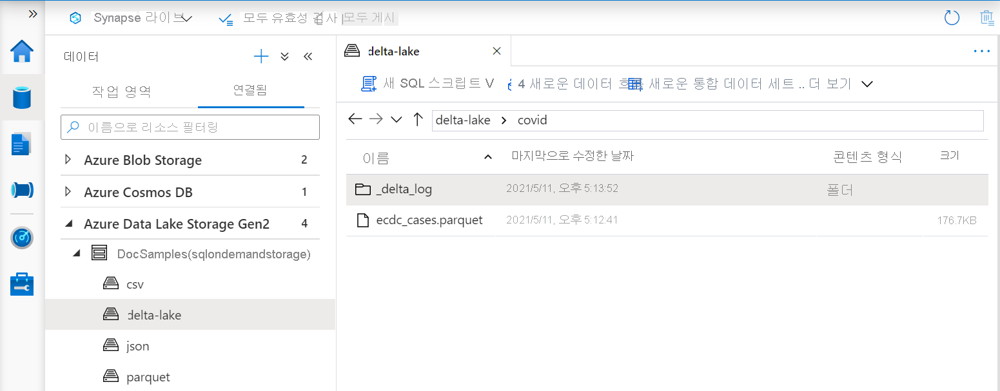

# <a name="create-and-use-native-external-tables-using-sql-pools-in-azure-synapse-analytics"></a>Azure Synapse Analytics에서 SQL 풀을 사용하여 네이티브 외부 테이블 만들기 및 사용

이 섹션에서는 Synapse SQL 풀에서 [네이티브 외부 테이블](develop-tables-external-tables.md)을 만들고 사용하는 방법을 알아봅니다. 외부 데이터 원본 정의에 `TYPE=HADOOP`가 지정된 외부 테이블보다 네이티브 외부 테이블의 성능이 더 높습니다. 네이티브 외부 테이블은 네이티브 코드를 사용하여 외부 데이터에 액세스하기 때문입니다. 

외부 테이블은 Synapse SQL 풀에서 외부 데이터에 대한 액세스를 제어하려는 경우에 유용합니다. 또한 Power BI와 같은 도구를 Synapse SQL 풀과 함께 사용하려는 경우에도 외부 테이블이 유용합니다. 외부 테이블은 두 가지 유형의 스토리지에 액세스할 수 있습니다.
- 사용자가 공용 스토리지 파일에 액세스하는 공용 스토리지입니다.
- 사용자가 SAS 자격 증명, Azure AD ID 또는 Synapse 작업 영역의 관리 ID를 사용하여 스토리지 파일에 액세스하는 보호된 스토리지입니다.

> [!NOTE]
>  전용 SQL 풀에서는 Parquet 네이티브 외부 테이블만 사용할 수 있습니다. 네이티브 Parquet 외부 테이블은 아직 일부 지역에서 사용할 수 없으므로 전용 SQL 풀에서 제한된 공개 미리 보기 상태입니다. 공개 미리 보기에 참여하여 전용 풀에서 네이티브 Parquet 외부 테이블을 사용할 수 있는지 확인하려면 Microsoft 기술 계정 관리자/클라우드 솔루션 설계자에게 문의하세요. 전용 SQL 풀에서 일반적으로 사용 가능한 기능을 사용하거나 CSV 또는 ORC 파일에 액세스해야 하는 경우에는 Hadoop 외부 테이블을 사용합니다. 네이티브 외부 테이블은 서버리스 SQL 풀에 일반 공급됩니다.
> [Synapse SQL에서 외부 테이블 사용](develop-tables-external-tables.md)에서 네이티브 외부 테이블과 Hadoop 외부 테이블의 차이점에 대해 자세히 알아보세요.

## <a name="prerequisites"></a>사전 요구 사항

첫 번째 단계는 테이블이 생성될 데이터베이스를 만드는 것입니다. 그런 다음, 이 샘플에서 사용되는 다음과 같은 개체를 만듭니다.
- SAS로 보호되는 `https://sqlondemandstorage.blob.core.windows.net` Azure 스토리지 계정에 액세스할 수 있도록 하는 데이터베이스 범위 자격 증명 `sqlondemand`.

    ```sql
    CREATE DATABASE SCOPED CREDENTIAL [sqlondemand]
    WITH IDENTITY='SHARED ACCESS SIGNATURE',  
    SECRET = 'sv=2018-03-28&ss=bf&srt=sco&sp=rl&st=2019-10-14T12%3A10%3A25Z&se=2061-12-31T12%3A10%3A00Z&sig=KlSU2ullCscyTS0An0nozEpo4tO5JAgGBvw%2FJX2lguw%3D'
    ```

- SAS 키로 보호되는 데모 스토리지 계정을 참조하는 외부 데이터 원본 `sqlondemanddemo` 및 위치 `https://azureopendatastorage.blob.core.windows.net/nyctlc/`에서 공개적으로 사용 가능한 Azure 스토리지 계정을 참조하는 외부 데이터 원본 `nyctlc`.

    ```sql
    CREATE EXTERNAL DATA SOURCE SqlOnDemandDemo WITH (
        LOCATION = 'https://sqlondemandstorage.blob.core.windows.net',
        CREDENTIAL = sqlondemand
    );
    GO
    CREATE EXTERNAL DATA SOURCE nyctlc
    WITH ( LOCATION = 'https://azureopendatastorage.blob.core.windows.net/nyctlc/')
    GO
    CREATE EXTERNAL DATA SOURCE DeltaLakeStorage
    WITH ( location = 'https://sqlondemandstorage.blob.core.windows.net/delta-lake/' );
    ```

- CSV 및 Parquet 파일 형식을 설명하는 파일 형식 `QuotedCSVWithHeaderFormat` 및 `ParquetFormat`.

    ```sql
    CREATE EXTERNAL FILE FORMAT QuotedCsvWithHeaderFormat
    WITH (  
        FORMAT_TYPE = DELIMITEDTEXT,
        FORMAT_OPTIONS ( FIELD_TERMINATOR = ',', STRING_DELIMITER = '"', FIRST_ROW = 2   )
    );
    GO
    CREATE EXTERNAL FILE FORMAT ParquetFormat WITH (  FORMAT_TYPE = PARQUET );
    GO
    CREATE EXTERNAL FILE FORMAT DeltaLakeFormat WITH (  FORMAT_TYPE = DELTA );
    GO
    ```

이 문서의 쿼리는 샘플 데이터베이스에서 실행되며 이러한 개체를 사용합니다. 

## <a name="external-table-on-a-file"></a>파일의 외부 테이블

Azure AD ID 또는 SAS 키가 있는 사용자에게 액세스를 허용하는 Azure 스토리지 계정에서 데이터에 액세스하는 외부 테이블을 만들 수 있습니다. 일반 SQL Server 외부 테이블을 만드는 것과 같은 방법으로 외부 테이블을 만들 수 있습니다. 

다음 쿼리는 `sqlondemanddemo` 데이터 원본을 사용하여 참조되고 `sqlondemand`라는 데이터베이스 범위 자격 증명을 사용하여 보호되는 SynapseSQL 데모 Azure 스토리지 계정에서 *population.csv* 파일을 읽는 외부 테이블을 만듭니다. 

데이터 원본 및 데이터베이스 범위 자격 증명은 [설치 스크립트](https://github.com/Azure-Samples/Synapse/blob/master/SQL/Samples/LdwSample/SampleDB.sql)에 생성됩니다.

> [!NOTE]
> 쿼리의 첫 번째 줄(예: [mydbname])을 변경하여 사용자가 만든 데이터베이스를 사용합니다. 

```sql
USE [mydbname];
GO
CREATE EXTERNAL TABLE populationExternalTable
(
    [country_code] VARCHAR (5) COLLATE Latin1_General_BIN2,
    [country_name] VARCHAR (100) COLLATE Latin1_General_BIN2,
    [year] smallint,
    [population] bigint
)
WITH (
    LOCATION = 'csv/population/population.csv',
    DATA_SOURCE = sqlondemanddemo,
    FILE_FORMAT = QuotedCSVWithHeaderFormat
);
```

네이티브 CSV 테이블은 현재 서버리스 SQL 풀에서만 사용할 수 있습니다.

## <a name="external-table-on-a-set-of-files"></a>파일 집합의 외부 테이블

Azure Storage에 저장된 파일 집합에서 데이터를 읽는 외부 테이블을 만들 수 있습니다.

```sql
CREATE EXTERNAL TABLE Taxi (
     vendor_id VARCHAR(100) COLLATE Latin1_General_BIN2, 
     pickup_datetime DATETIME2, 
     dropoff_datetime DATETIME2,
     passenger_count INT,
     trip_distance FLOAT,
     fare_amount FLOAT,
     tip_amount FLOAT,
     tolls_amount FLOAT,
     total_amount FLOAT
) WITH (
         LOCATION = 'yellow/puYear=*/puMonth=*/*.parquet',
         DATA_SOURCE = nyctlc,
         FILE_FORMAT = ParquetFormat
);
```

외부 테이블에서 참조하기 위해 파일이 충족해야 하는 패턴을 지정할 수 있습니다. 패턴은 Parquet 및 CSV 테이블에만 필요합니다. Delta Lake 형식을 사용하는 경우 루트 폴더만 지정하면 외부 테이블이 자동으로 패턴을 찾습니다.

> [!NOTE]
> 테이블은 분할된 폴더 구조에 생성되지만 일부 파티션 제거를 활용할 수 없습니다. 일부 기준(이 경우 특정 연도 또는 월)을 충족하지 않는 파일을 건너뛰어 성능을 향상하려면 [외부 데이터에 대한 뷰](create-use-views.md#partitioned-views)를 사용합니다.

## <a name="external-table-on-appendable-files"></a>추가 가능한 파일의 외부 테이블

쿼리가 실행되는 동안 외부 테이블에서 참조하는 파일을 변경하면 안 됩니다. 장기 실행 쿼리에서 SQL 풀은 읽기를 재시도하거나 파일의 일부를 읽거나 여러 번 파일을 읽을 수도 있습니다. 파일 내용을 변경하면 잘못된 결과가 발생할 수 있습니다. 따라서 쿼리 실행 중에 파일의 수정 시간 변경이 감지하면 SQL 풀은 쿼리에 실패합니다.
일부 시나리오에서는 지속적으로 추가되는 파일에 대한 테이블을 만들 수 있습니다. 지속적으로 추가되는 파일로 인한 쿼리 실패를 방지하려면 `TABLE_OPTIONS` 설정을 사용하여 외부 테이블이 잠재적으로 일치하지 않는 읽기를 무시하도록 지정할 수 있습니다.


```sql
CREATE EXTERNAL TABLE populationExternalTable
(
    [country_code] VARCHAR (5) COLLATE Latin1_General_BIN2,
    [country_name] VARCHAR (100) COLLATE Latin1_General_BIN2,
    [year] smallint,
    [population] bigint
)
WITH (
    LOCATION = 'csv/population/population.csv',
    DATA_SOURCE = sqlondemanddemo,
    FILE_FORMAT = QuotedCSVWithHeaderFormat,
    TABLE_OPTIONS = N'{"READ_OPTIONS":["ALLOW_INCONSISTENT_READS"]}'
);
```

`ALLOW_INCONSISTENT_READS` 읽기 옵션은 쿼리 수명 주기 동안 파일 수정 시간 확인을 사용하지 않고 외부 테이블에서 참조하는 파일에서 사용 가능한 모든 것을 읽습니다. 추가 가능한 파일에서 기존 내용은 업데이트되지 않고 새 행만 추가됩니다. 따라서 업데이트 가능한 파일에 비해 결과가 잘못될 가능성이 최소화됩니다. 이 옵션을 사용하면 오류를 처리하지 않고 자주 추가되는 파일을 읽을 수 있습니다.

이 옵션은 CSV 파일 형식으로 만들어진 외부 테이블에서만 사용할 수 있습니다.

> [!NOTE]
> 옵션 이름에서 알 수 있듯이 테이블 작성자는 결과가 일관되지 않을 수 있는 위험을 감수합니다. 추가 가능한 파일에서 테이블을 셀프 조인하여 기본 파일을 강제로 여러 번 읽으면 잘못된 결과를 얻을 수 있습니다. 대부분의 "클래식" 쿼리에서 외부 테이블은 쿼리가 실행되는 동안 추가된 일부 행을 무시합니다.

## <a name="delta-lake-external-table"></a>Delta Lake 외부 테이블

Delta Lake 폴더를 기반으로 외부 테이블을 만들 수 있습니다. [단일 파일](#external-table-on-a-file) 또는 [파일 집합](#external-table-on-a-set-of-files)에서 만든 외부 테이블과 Delta Lake 형식으로 만든 외부 테이블의 유일한 차이점은 Delta Lake 외부 테이블에서 Delta Lake 구조체가 포함된 폴더를 참조해야 한다는 것입니다.

> [!div class="mx-imgBorder"]
>

Delta Lake 폴더에서 만든 테이블 정의의 예는 다음과 같습니다.

```sql
CREATE EXTERNAL TABLE Covid (
     date_rep date,
     cases int,
     geo_id varchar(6)
) WITH (
        LOCATION = 'covid', --> the root folder containing the Delta Lake files
        data_source = DeltaLakeStorage,
        FILE_FORMAT = DeltaLakeFormat
);
```

Delta Lake는 퍼블릭 미리 보기 상태이며 몇 가지 알려진 와 제한 사항이 있습니다. [Synapse 서버리스 SQL 풀 자가 진단 페이지](resources-self-help-sql-on-demand.md#delta-lake)에서 알려진 문제를 검토합니다.

## <a name="use-an-external-table"></a>외부 테이블 사용

SQL Server 쿼리에서 사용하는 것과 동일한 방식으로 사용자 쿼리에서 [외부 테이블](develop-tables-external-tables.md)을 사용할 수 있습니다.

다음 쿼리에서는 이전 섹션에서 만든 *population* 외부 테이블을 사용하는 방법을 설명합니다. 2019년의 인구를 기준으로 내림차순으로 국가/지역 이름을 반환합니다.

> [!NOTE]
> 쿼리의 첫 번째 줄(예: [mydbname])을 변경하여 사용자가 만든 데이터베이스를 사용합니다.

```sql
USE [mydbname];
GO

SELECT
    country_name, population
FROM populationExternalTable
WHERE
    [year] = 2019
ORDER BY
    [population] DESC;
```

이 쿼리의 성능은 지역에 따라 달라질 수 있습니다. 작업 영역이 이러한 샘플에서 사용되는 Azure Storage 계정과 동일한 지역에 배치되지 않을 수 있습니다. 프로덕션 워크로드의 경우 Synapse 작업 영역과 Azure Storage를 동일한 지역에 저장하세요.

## <a name="next-steps"></a>다음 단계

스토리지에 쿼리 결과를 저장하는 방법에 대한 자세한 내용은 [쿼리 결과를 스토리지에 저장](../sql/create-external-table-as-select.md) 문서를 참조하세요.
