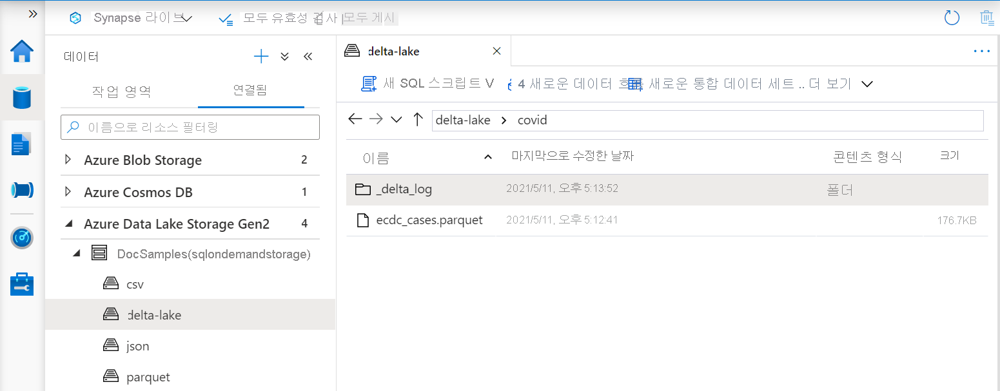
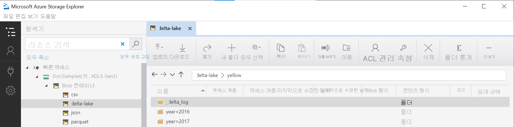

# <a name="create-and-use-views-using-serverless-sql-pool-in-azure-synapse-analytics"></a>Azure Synapse Analytics에서 서버리스 SQL 풀을 사용하여 뷰 만들기 및 사용

이 섹션에서는 뷰를 만들고 사용하여 서버리스 SQL 풀 쿼리를 래핑하는 방법을 알아봅니다. 뷰를 사용하면 해당 쿼리를 다시 사용할 수 있습니다. Power BI와 같은 도구를 서버리스 SQL 풀과 함께 사용하려는 경우에도 뷰가 필요합니다.

## <a name="prerequisites"></a>필수 구성 요소

첫 번째 단계는 보기가 생성되는 데이터베이스를 만들고 해당 데이터베이스에서 [설치 스크립트](https://github.com/Azure-Samples/Synapse/blob/master/SQL/Samples/LdwSample/SampleDB.sql)를 실행하여 Azure 스토리지에 인증하는 데 필요한 개체를 초기화하는 것입니다. 이 문서의 모든 쿼리는 샘플 데이터베이스에서 실행됩니다.

## <a name="views-over-external-data"></a>외부 데이터에 대한 뷰

일반 SQL Server 뷰를 만드는 것과 동일한 방법으로 뷰를 만들 수 있습니다. 다음 쿼리는 *population.csv* 파일을 읽는 뷰를 만듭니다.

> [!NOTE]
> 쿼리의 첫 번째 줄(예: [mydbname])을 변경하여 사용자가 만든 데이터베이스를 사용합니다.

```sql
USE [mydbname];
GO

DROP VIEW IF EXISTS populationView;
GO

CREATE VIEW populationView AS
SELECT * 
FROM OPENROWSET(
        BULK 'csv/population/population.csv',
        DATA_SOURCE = 'SqlOnDemandDemo',
        FORMAT = 'CSV', 
        FIELDTERMINATOR =',', 
        ROWTERMINATOR = '\n'
    )
WITH (
    [country_code] VARCHAR (5) COLLATE Latin1_General_BIN2,
    [country_name] VARCHAR (100) COLLATE Latin1_General_BIN2,
    [year] smallint,
    [population] bigint
) AS [r];
```

뷰는 스토리지의 루트 URL과 `EXTERNAL DATA SOURCE`를 `DATA_SOURCE`로 사용하고 파일에 상대 파일 경로를 추가합니다.

### <a name="delta-lake-views"></a>Delta Lake 보기

Delta Lake 폴더를 기반으로 하는 보기를 만드는 경우 파일 경로를 지정하는 대신 `BULK` 옵션 뒤에 루트 폴더의 위치를 지정해야 합니다.

> [!div class="mx-imgBorder"]
>

Delta Lake 폴더에서 데이터를 읽는 `OPENROWSET` 함수는 폴더 구조를 검사하고 파일 위치를 자동으로 식별합니다.

```sql
create or alter view CovidDeltaLake
as
select *
from openrowset(
           bulk 'covid',
           data_source = 'DeltaLakeStorage',
           format = 'delta'
    ) with (
           date_rep date,
           cases int,
           geo_id varchar(6)
           ) as rows
```

Delta Lake는 퍼블릭 미리 보기 상태이며 몇 가지 알려진 와 제한 사항이 있습니다. [Synapse 서버리스 SQL 풀 자가 진단 페이지](resources-self-help-sql-on-demand.md#delta-lake)에서 알려진 문제를 검토합니다.

## <a name="partitioned-views"></a>분할 뷰

계층 폴더 구조로 분할된 파일 세트가 있는 경우 파일 경로에 와일드 카드를 사용하여 파티션 패턴을 설명할 수 있습니다. `FILEPATH` 함수를 사용하여 폴더 경로의 일부를 분할 열로 노출합니다.

```sql
CREATE VIEW TaxiView
AS SELECT *, nyc.filepath(1) AS [year], nyc.filepath(2) AS [month]
FROM
    OPENROWSET(
        BULK 'parquet/taxi/year=*/month=*/*.parquet',
        DATA_SOURCE = 'sqlondemanddemo',
        FORMAT='PARQUET'
    ) AS nyc
```

분할 열의 필터를 사용하여 이 뷰를 쿼리하는 경우 파티션된 뷰는 폴더 파티션 제거를 수행합니다. 이렇게 하면 쿼리 성능이 향상될 수 있습니다.

### <a name="delta-lake-partitioned-views"></a>Delta Lake 분할 뷰

Delta Lake 스토리지 위에 분할 뷰를 만드는 경우 루트 Delta Lake 폴더만 지정할 수 있으며 `FILEPATH` 함수를 사용하여 분할 열을 명시적으로 노출할 필요가 없습니다.

```sql
CREATE OR ALTER VIEW YellowTaxiView
AS SELECT *
FROM  
    OPENROWSET(
        BULK 'yellow',
        DATA_SOURCE = 'DeltaLakeStorage',
        FORMAT='DELTA'
    ) nyc
```

`OPENROWSET` 함수는 기본 Delta Lake 폴더의 구조를 검사하고, 분할 열을 자동으로 식별하고, 노출합니다. 파티션 제거는 쿼리의 `WHERE` 절에 분할 열을 배치하면 자동으로 수행됩니다.

`DeltaLakeStorage` 데이터 원본에 정의된 `LOCATION` URI와 연결된 `OPENROWSET` 함수의 폴더 이름(이 예제의 `yellow`)은 `_delta_log`라는 하위 폴더를 포함하는 루트 Delta Lake 폴더를 참조해야 합니다.

> [!div class="mx-imgBorder"]
>

Delta Lake는 퍼블릭 미리 보기 상태이며 몇 가지 알려진 와 제한 사항이 있습니다. [Synapse 서버리스 SQL 풀 자가 진단 페이지](resources-self-help-sql-on-demand.md#delta-lake)에서 알려진 문제를 검토합니다.

## <a name="json-views"></a>JSON 보기

보기는 파일에서 페치되는 결과 집합 위에 추가 처리를 수행해야 하는 경우에 적합합니다. 한 가지 예제는 JSON 문서에서 값을 추출하기 위해 JSON 함수를 적용해야 하는 JSON 파일을 구문 분석하는 것입니다.

```sql
CREATE OR ALTER VIEW CovidCases
AS 
select
    *
from openrowset(
        bulk 'latest/ecdc_cases.jsonl',
        data_source = 'covid',
        format = 'csv',
        fieldterminator ='0x0b',
        fieldquote = '0x0b'
    ) with (doc nvarchar(max)) as rows
    cross apply openjson (doc)
        with (  date_rep datetime2,
                cases int,
                fatal int '$.deaths',
                country varchar(100) '$.countries_and_territories')
```

`OPENJSON` 함수는 텍스트 형식의 줄당 하나의 JSON 문서를 포함하는 JSONL 파일에서 각 줄을 구문 분석합니다.

## <a name="cosmosdb-view"></a>CosmosDB 보기

CosmosDB 분석 스토리지가 컨테이너에서 활성화된 경우 Azure CosmosDB 컨테이너 위에 보기를 만들 수 있습니다. CosmosDB 계정 이름, 데이터베이스 이름 및 컨테이너 이름을 뷰의 일부로 추가해야 하며 읽기 전용 액세스 키는 뷰가 참조하는 데이터베이스 범위 자격 증명에 배치되어야 합니다.

```sql
CREATE DATABASE SCOPED CREDENTIAL MyCosmosDbAccountCredential
WITH IDENTITY = 'SHARED ACCESS SIGNATURE', SECRET = 's5zarR2pT0JWH9k8roipnWxUYBegOuFGjJpSjGlR36y86cW0GQ6RaaG8kGjsRAQoWMw1QKTkkX8HQtFpJjC8Hg==';
GO
CREATE OR ALTER VIEW Ecdc
AS SELECT *
FROM OPENROWSET(
      PROVIDER = 'CosmosDB',
      CONNECTION = 'Account=synapselink-cosmosdb-sqlsample;Database=covid',
      OBJECT = 'Ecdc',
      CREDENTIAL = 'MyCosmosDbAccountCredential'
    ) with ( date_rep varchar(20), cases bigint, geo_id varchar(6) ) as rows
```

[여기에서 Synapse Link를 사용하여 CosmosDB 컨테이너 쿼리](query-cosmos-db-analytical-store.md)에 대해 자세히 알아보세요.

## <a name="use-a-view"></a>뷰 사용

SQL Server 쿼리에서 뷰를 사용하는 것과 동일한 방식으로 쿼리에서 뷰를 사용할 수 있습니다.

다음 쿼리에서는 [뷰 만들기](#views-over-external-data)에서 만든 *population_csv* 뷰를 사용하는 방법을 보여줍니다. 2019년의 인구를 기준으로 내림차순으로 국가/지역 이름을 반환합니다.

> [!NOTE]
> 쿼리의 첫 번째 줄(예: [mydbname])을 변경하여 사용자가 만든 데이터베이스를 사용합니다.

```sql
USE [mydbname];
GO

SELECT
    country_name, population
FROM populationView
WHERE
    [year] = 2019
ORDER BY
    [population] DESC;
```

## <a name="next-steps"></a>다음 단계

다른 파일 형식을 쿼리하는 방법에 대한 자세한 내용은 [단일 CSV 파일 쿼리](query-single-csv-file.md), [Parquet 파일 쿼리](query-parquet-files.md) 및 [JSON 파일 쿼리](query-json-files.md) 문서를 참조하세요.
