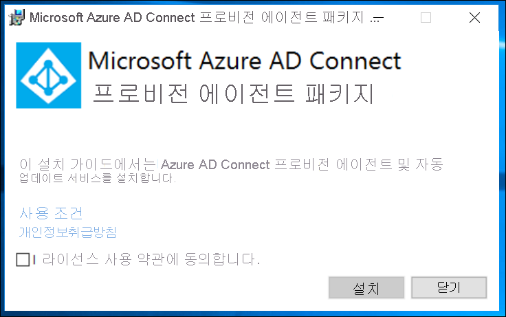
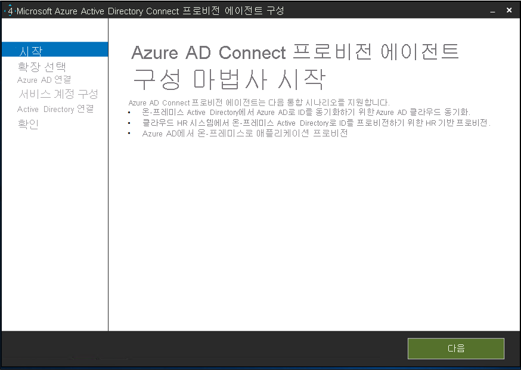
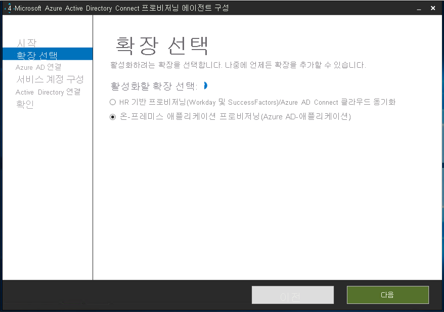
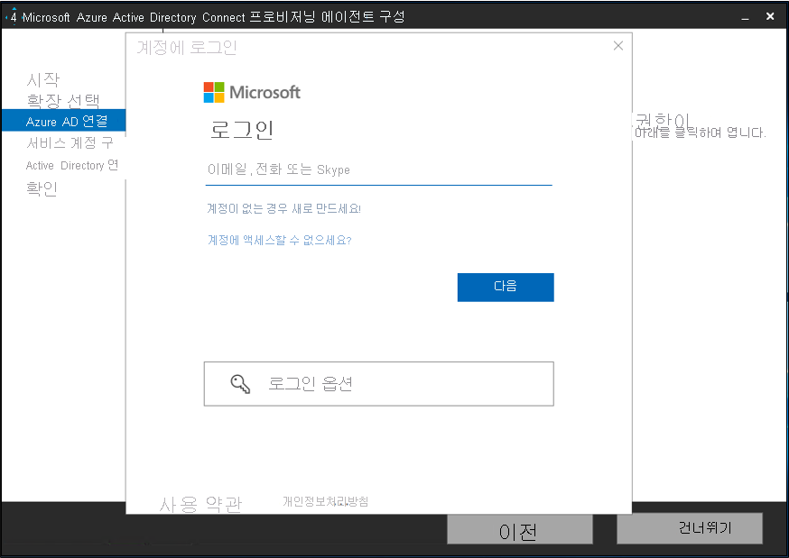
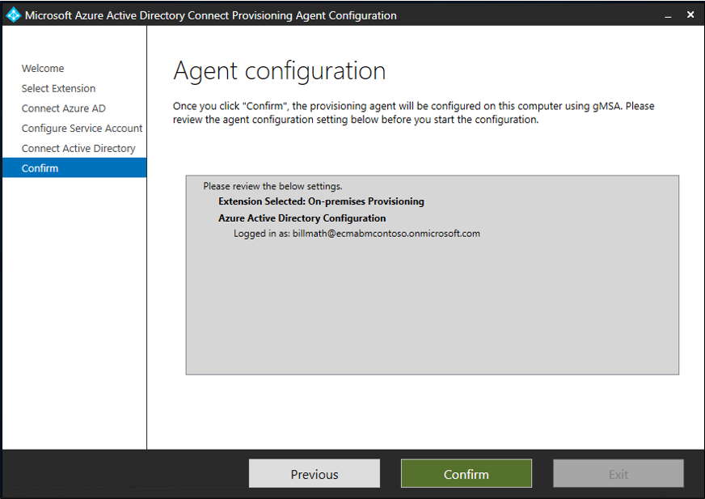

이 문서에서는 사용자를 자동으로 Azure AD(Azure Active Directory)에서 LDAP 디렉터리로 프로비전 및 프로비전 해제하기 위해 수행해야 하는 단계에 대해 설명합니다. 이 문서는 AD LDS에 중점을 두고 있지만 아래에서 설명하는 지원되는 모든 LDAP 디렉터리에 프로비전할 수 있습니다. 이 솔루션을 통해 사용자를 Active Directory Domain Services에 프로비전하는 것은 지원되지 않습니다. 
 
이 서비스의 기능, 작동 방법 및 질문과 대답에 대한 중요한 내용은 [Azure Active Directory를 사용하여 SaaS 애플리케이션의 사용자를 자동으로 프로비저닝 및 프로비저닝 해제](../articles/active-directory/app-provisioning/user-provisioning.md)를 참조하세요.

## <a name="prerequisites-for-provisioning-users-into-an-ldap-directory"></a>사용자를 LDAP 디렉터리에 프로비전하기 위한 필수 구성 요소

>[!IMPORTANT]
> 온-프레미스 프로비저닝 미리 보기는 현재 초대 전용 미리 보기로 제공됩니다. 기능에 대한 액세스를 요청하려면 [액세스 요청 양식](https://aka.ms/onpremprovisioningpublicpreviewaccess)을 사용하세요. 일반 공급을 준비하면서 향후 몇 개월 동안 더 많은 고객과 커넥터에 미리 보기를 공개할 예정입니다. 사용자를 Active Directory Domain Services에 프로비전하는 것은 이 미리 보기를 통해 지원되지 않습니다. 


### <a name="on-premises-prerequisites"></a>온-프레미스 필수 조건

 - 사용자를 만들고, 업데이트하고, 삭제할 수 있는 AD LDS(Active Directory Lightweight Services)와 같은 대상 시스템. 이 AD LDS 인스턴스는 Azure AD Connect를 사용하여 루프를 만들 수 있으므로 사용자를 Azure AD에 프로비전하는 데 사용하면 안 됩니다. 
 - 인터넷에 액세스할 수 있는 TCP/IP 주소를 사용하는 Windows Server 2016 이상 컴퓨터, 대상 시스템에 대한 연결 및 login.microsoftonline.com에 대한 아웃바운드 연결. 예를 들어 Azure IaaS 또는 프록시 뒤에서 호스트되는 Windows Server 2016 가상 머신이 있습니다. 이 서버에는 3GB 이상의 RAM이 있어야 합니다.
 - .NET Framework 4.7.1이 설치된 컴퓨터.
 - 선택 사항: 필수는 아니지만 [Windows Server용 Microsoft Edge](https://www.microsoft.com/en-us/edge?r=1)를 다운로드하여 Internet Explorer 대신 사용하는 것이 좋습니다.

선택한 옵션에 따라 일부 마법사 화면을 사용하지 못할 수 있으며 정보가 약간 다를 수도 있습니다. 이 구성의 목적에 맞게 사용자 개체 형식이 사용됩니다. 다음 정보를 사용하여 구성 작업을 수행합니다. 

#### <a name="supported-systems"></a>지원되는 시스템
* OpenLDAP
* Microsoft Active Directory Lightweight Directory Services
* 389 디렉터리 서버
* Apache 디렉터리 서버
* IBM Tivoli DS
* Isode 디렉터리
* NetIQ eDirectory
* Novell eDirectory
* DJ 열기
* DS 열기
* LDAP 열기(openldap.org)
* Oracle(이전에 Sun) 디렉터리 서버 Enterprise Edition
* RadiantOne 가상 디렉터리 서버(VDS)
* Sun One 디렉터리 서버


### <a name="cloud-requirements"></a>클라우드 요구 사항

 - Azure AD Premium P1 또는 Premium P2(또는 EMS E3 또는 E5)를 사용하는 Azure AD 테넌트. 
 
    [!INCLUDE [active-directory-p1-license.md](active-directory-p1-license.md)]
 - Azure Portal에서 프로비저닝을 구성하기 위한 프로비저닝 에이전트와 애플리케이션 관리자 또는 클라우드 관리자 역할을 구성하기 위한 하이브리드 관리자 역할입니다.

### <a name="more-recommendations-and-limitations"></a>추가 권장 사항 및 제한 사항
다음 글머리 기호 항목은 추가 권장 사항 및 제한 사항입니다.
- 클라우드 동기화 및 온-프레미스 앱 프로비전에 동일한 에이전트를 사용하지 않는 것이 좋습니다.  Microsoft는 클라우드 동기화 및 온-프레미스 앱 프로비전에 각각 별도의 에이전트를 사용하도록 권장합니다.
- 현재 AD LDS의 경우 사용자에게 암호를 프로비전할 수 없습니다.  따라서 AD LDS에 대한 암호 정책을 사용하지 않도록 설정하거나 사용하지 않도록 설정된 상태에서 사용자를 프로비전해야 합니다.
- 사용자를 Azure Active Directory에서 Active Directory Domains Services로 프로비전하는 것은 지원되지 않습니다.
- 사용자를 LDAP에서 Azure AD로 프로비전하는 것은 지원되지 않습니다.

## <a name="prepare-the-ldap-directory"></a>LDAP 디렉터리 준비
테스트 AD LDS 환경을 만드는 데 도움이 되기 위해 제공되는 정보는 다음과 같습니다.  이 설치에서는 응답 파일과 함께 PowerShell 및 ADAMInstall.exe를 사용합니다.  이 문서에서는 AD LDS에 대한 정보를 자세히 다루지 않습니다.  자세한 내용은 [Active Directory Lightweight Directory Services](/previous-versions/windows/it-pro/windows-server-2012-r2-and-2012/hh831593(v=ws.11))를 참조하세요. 

테스트 환경에 이미 AD LDS가 설치되어 있는 경우 다음 섹션을 건너뛰고 ECMA 호스트 커넥터 설치 섹션으로 이동할 수 있습니다.

### <a name="create-an-ssl-certificate-a-test-directory-and-install-ad-lds"></a>SSL 인증서, 테스트 디렉터리 만들기 및 AD LDS 설치
[부록 A](#appendix-a---install-ad-lds-powershell-script)의 PowerShell 스크립트를 사용합니다. 이 스크립트에서 수행하는 작업은 다음과 같습니다.
  - LDAP 커넥터에서 사용할 자체 서명된 인증서를 만듭니다.
  - 기능 설치 로그에 대한 디렉터리를 만듭니다.
  - 개인 저장소의 인증서를 디렉터리로 내보냅니다.
  - 인증서를 로컬 컴퓨터의 신뢰할 수 있는 루트로 가져옵니다.
  - 가상 머신에 AD LDS 역할을 설치합니다. 

Windows Server 가상 머신에서 관리자 권한으로 Windows PowerShell을 사용하여 스크립트를 실행하는 LDAP 커넥터를 테스트하는 데 사용합니다.  

### <a name="create-an-instance-of-ad-lds"></a>AD LDS의 인스턴스 만들기
이제 역할이 설치되었으므로 AD LDS의 인스턴스를 만들어야 합니다.  인스턴스를 만들려면 아래에 제공된 응답 파일을 사용할 수 있습니다.  이 파일은 UI를 사용하지 않고 인스턴스를 자동으로 설치합니다.

[부록 B](#appendix-b---answer-file)의 내용을 메모장에 복사하고, 이를 **answer.txt** 로 **"C:\Windows\ADAM"** 에 저장합니다.

이제 관리자 권한으로 cmd 프롬프트를 열고, 다음 실행 파일을 실행합니다.

```
C:\Windows\ADAM> ADAMInstall.exe /answer:answer.txt
```

### <a name="create-containers-and-a-service-account-for-ad-lds"></a>AD LDS에 대한 컨테이너 및 서비스 계정 만들기
[부록 C](#appendix-c---populate-ad-lds-powershell-script)의 PowerShell 스크립트를 사용합니다. 이 스크립트에서 수행하는 작업은 다음과 같습니다.
  - LDAP 커넥터에서 사용할 서비스 계정에 대한 컨테이너를 만듭니다.
  - 클라우드 사용자에 대한 컨테이너를 만듭니다.  이 컨테이너는 사용자가 프로비전되는 위치입니다.
  - AD LDS에서 서비스 계정을 만듭니다.
  - 서비스 계정을 사용하도록 설정합니다.
  - 서비스 계정을 AD LDS 관리자 역할에 추가합니다.

Windows Server 가상 머신에서 관리자 권한으로 Windows PowerShell을 사용하여 스크립트를 실행하는 LDAP 커넥터를 테스트하는 데 사용합니다.  

## <a name="grant-the-network-service-read-permissions-to-the-ssl-cert"></a>네트워크 서비스에 SSL 인증서에 대한 읽기 권한 부여
SSL이 작동하도록 하려면 새로 만든 인증서에 대한 읽기 권한을 네트워크 서비스에 부여해야 합니다.  권한을 부여하려면 다음 단계를 사용합니다.

 1. **C:\Program Data\Microsoft\Crypto\Keys** 로 이동합니다.
 2. 마우스 오른쪽 단추로 여기에 있는 시스템 파일을 클릭합니다.  guid가 됩니다.  이 컨테이너는 인증서를 저장하고 있습니다.
    a. 속성 선택
    b. 위쪽에서 **보안** 탭을 선택합니다. c. **편집** 을 선택합니다.
    d. **추가** 를 클릭합니다.
    e. 상자에서 **네트워크 서비스** 를 입력하고, **이름 확인** 을 선택합니다.
    f. 목록에서 **네트워크 서비스** 를 선택하고, **확인** 을 클릭합니다.
    g. **확인** 을 클릭합니다.
    h. 네트워크 서비스 계정에 읽기 및 읽기/실행 권한이 있는지 확인하고, **적용** 및 **확인** 을 클릭합니다.

## <a name="verify-ssl-connectivity-with-ad-lds"></a>AD LDS를 사용하여 SSL 연결 확인
이제 인증서를 구성하고 네트워크 서비스 계정 권한을 부여했으므로 연결을 테스트하여 작동하는지 확인합니다.
 1. 서버 관리자를 열고, 왼쪽에서 AD LDS를 선택합니다.
 2. 마우스 오른쪽 단추로 AD LDS 인스턴스를 클릭하고, 팝업에서 ldp.exe를 선택합니다.
   [](media/active-directory-app-provisioning-ldap/ldp-1.png#lightbox)</br>
 3. ldp.exe의 위쪽에서 **연결** 및 **연결** 을 차례로 선택합니다.
 4. 다음 정보를 입력하고, **확인** 을 클릭합니다.
    - 서버: APP3
    - 포트: 636
    - SSL 상자를 선택합니다. [</br>
 5.  아래 스크린샷과 비슷한 응답이 표시됩니다.
   ](media/active-directory-app-provisioning-ldap/ldp-3.png#lightbox)</br>
 6.  위쪽의 **연결** 아래에서 **바인딩** 을 선택합니다.
 7. 기본값을 그대로 두고, **확인** 을 클릭합니다.
   [](media/active-directory-app-provisioning-ldap/ldp-4.png#lightbox)</br>
 8. 이제 인스턴스에 성공적으로 바인딩됩니다.
   [](media/active-directory-app-provisioning-ldap/ldp-5.png#lightbox)</br>


## <a name="download-install-and-configure-the-azure-ad-connect-provisioning-agent-package"></a>Azure AD Connect 프로비전 에이전트 패키지 다운로드, 설치 및 구성

 1. Azure Portal에 로그인합니다.
 2. **엔터프라이즈 애플리케이션** > **새 애플리케이션 추가** 로 이동합니다.
 3. **온-프레미스 ECMA 앱** 애플리케이션을 검색하여 테넌트에 추가합니다.
 4. 추가된 **온-프레미스 ECMA 앱** 을 선택합니다.
 5. **시작** 아래의 **3. 사용자 계정 프로비전** 상자에서 **시작** 을 선택합니다.
 6. 위쪽의 드롭다운에서 프로비전을 **자동** 으로 변경합니다.  이 작업을 수행하면 아래에 **온-프레미스 연결** 이 표시됩니다.
 7. **온-프레미스 연결** 아래에서 에이전트 설치 프로그램을 다운로드합니다.
 8. Azure AD Connect 프로비저닝 설치 관리자 **AADConnectProvisioningAgentSetup.msi** 를 실행합니다.
 9. **Microsoft Azure AD Connect 프로비저닝 에이전트 패키지** 화면에서 사용 조건에 동의하고 **설치** 를 선택합니다.
     [](media/active-directory-app-provisioning-sql/install-1.png#lightbox)</br>
 10. 이 작업이 완료되면 구성 마법사가 시작됩니다. **다음** 을 선택합니다.
     [](media/active-directory-app-provisioning-sql/install-2.png#lightbox)</br>
 11. **확장 선택** 화면에서 **온-프레미스 애플리케이션 프로비저닝(Azure AD에서 애플리케이션으로)** 을 선택합니다. **다음** 을 선택합니다.
     [](media/active-directory-app-provisioning-sql/install-3.png#lightbox)</br>
 12. 전역 관리자 계정을 사용하여 Azure AD에 로그인합니다.
     [](media/active-directory-app-provisioning-sql/install-4.png#lightbox)</br>
 13. **에이전트 구성** 화면에서 **확인** 을 선택합니다.
     [](media/active-directory-app-provisioning-sql/install-5.png#lightbox)</br>
 14. 설치가 완료되면 마법사 아래쪽에 메시지가 표시됩니다. **끝내기** 를 선택합니다.
     [](media/active-directory-app-provisioning-sql/install-6.png#lightbox)</br>
 15. Azure Portal에서 **온-프레미스 ECMA 앱** 애플리케이션 아래의 **프로비전 편집** 으로 돌아갑니다.
 16. **프로비전** 페이지에서 모드를 **자동** 으로 변경합니다.
     [](.\media\active-directory-app-provisioning-sql\configure-7.png#lightbox)</br>
 17. **온-프레미스 연결** 섹션에서 방금 배포한 에이전트를 선택하고, **에이전트 할당** 을 선택합니다.
     [](.\media\active-directory-app-provisioning-ldap\assign-1.png#lightbox)</br>
     >[!NOTE]
     >에이전트를 추가한 후 등록이 완료될 때까지 10분 동안 기다립니다. 연결 테스트는 등록이 완료될 때까지 작동하지 않습니다.
     >
     >또는 서버에서 프로비저닝 에이전트를 다시 시작하여 에이전트 등록을 강제로 완료할 수 있습니다. 서버로 이동하고, Windows 검색 창에서 **서비스** 를 검색하고, **Azure AD Connect 프로비전 에이전트 서비스** 를 식별하고, 마우스 오른쪽 단추로 해당 서비스를 클릭하고, 다시 시작합니다.

 ## <a name="configure-the-azure-ad-ecma-connector-host-certificate"></a>Azure AD ECMA 커넥터 호스트 인증서 구성
 1. 바탕 화면에서 ECMA 바로 가기를 선택합니다.
 2. ECMA 커넥터 호스트 구성이 시작되면 기본 **8585** 포트를 그대로 두고, **생성** 을 선택하여 인증서를 생성합니다. 자동 생성된 인증서는 신뢰할 수 있는 루트의 일부로 자체 서명됩니다. SAN은 호스트 이름과 일치합니다.
     [](.\media\active-directory-app-provisioning-sql\configure-1.png#lightbox)
 3. **저장** 을 선택합니다.


## <a name="configure-a-generic-ldap-connector"></a>일반 LDAP 커넥터 구성
 1. 바탕 화면에서 ECMA 커넥터 호스트 바로 가기를 선택합니다.
 2. **새 커넥터** 를 선택합니다.
     [](.\media\active-directory-app-provisioning-sql\sql-3.png#lightbox)</br>
 3. **속성** 페이지에서 상자를 이미지 뒤에 나오는 표에 지정된 값으로 채우고, **다음** 을 선택합니다.
     [](.\media\active-directory-app-provisioning-ldap\create-1.png#lightbox)

     |속성|값|
     |-----|-----|
     |이름|LDAP|
     |자동 동기화 타이머(분)|120|
     |비밀 토큰|여기에 사용자 고유의 키를 입력합니다. 12자 이상이어야 합니다.|
     |확장 DLL|일반 LDAP 커넥터의 경우 **Microsoft.IAM.Connector.GenericLdap.dll** 을 선택합니다.|
4. **연결** 페이지에서 상자를 이미지 뒤에 나오는 표에 지정된 값으로 채우고, **다음** 을 선택합니다.
     [](.\media\active-directory-app-provisioning-ldap\create-2.png#lightbox)</br>
     
     |속성|값|
     |-----|-----|
     |호스트|APP3|
     |포트|636|
     |연결 제한 시간|180|
     |바인딩|SSL|
     |사용자 이름|CN=svcAccount,CN=ServiceAccounts,CN=App,DC=contoso,DC=lab|
     |암호|지정된 사용자 이름의 암호|

     >[!NOTE]
     >연결을 시도하는 데 문제가 발생하는 경우 AD LDS의 서비스 계정이 사용하도록 설정되어 있는지 확인하세요. 
     
 5. **전체** 페이지에서 **다음** 을 선택합니다.
 6. **파티션** 페이지에서 기본값을 유지하고, **다음** 을 선택합니다.
 7. **실행 프로필** 페이지에서 **내보내기** 확인란을 선택한 상태로 유지합니다. **전체 가져오기** 확인란을 선택하고, **다음** 을 선택합니다.
     [](.\media\active-directory-app-provisioning-ldap\create-3.png#lightbox)</br>
     
     |속성|설명|
     |-----|-----|
     |내보내기|데이터를 SQL로 내보내는 실행 프로필입니다. 이 실행 프로필은 필수입니다.|
     |전체 가져오기|이전에 지정한 SQL 원본에서 모든 데이터를 가져오는 실행 프로필입니다.|
     |델타 가져오기|마지막 전체 또는 델타 가져오기 이후의 변경 내용만 SQL에서 가져오는 실행 프로필입니다.|
 12. **내보내기** 페이지에서 기본값을 그대로 두고, **다음** 을 클릭합니다. 
 13. **전체 가져오기** 페이지에서 기본값을 그대로 두고, **다음** 을 클릭합니다. 
 14. **개체 형식** 페이지에서 상자를 채우고, **다음** 을 선택합니다. 개별 상자에 대한 지침은 이미지 뒤에 나오는 표를 사용합니다.
      - **대상 개체**: 이 개체는 LDAP 디렉터리에 있는 대상 개체입니다.
      - **앵커**: 이 특성은 대상 시스템에서 고유해야 합니다. Azure AD 프로비전 서비스는 초기 주기 후에 이 특성을 사용하여 ECMA 호스트를 쿼리합니다. 이 앵커 값은 스키마 3의 앵커 값과 동일해야 합니다.
      - **쿼리 특성**: ECMA 호스트에서 메모리 내 캐시를 쿼리하는 데 사용됩니다. 이 특성은 고유해야 합니다.
      - **DN**: 대상 개체의 distinguishedName입니다.
     [](.\media\active-directory-app-provisioning-ldap\create-4.png#lightbox)</br>
     
     |속성|Description|
     |-----|-----|
     |대상 개체|사용자|
     |앵커|objectGUID|
     |쿼리 특성|_distingusishedName|
     |DN|dn|
     |Autogenerated|unchecked|      
 15. ECMA 호스트는 대상 시스템에서 지원하는 특성을 검색합니다. 해당 특성 중에서 Azure AD에 노출할 특성을 선택할 수 있습니다. 그런 다음, 프로비전을 위해 Azure Portal에서 이러한 특성을 구성할 수 있습니다. **특성 선택** 페이지의 드롭다운 목록에서 모든 특성을 추가하고, **다음** 을 선택합니다.
     [](.\media\active-directory-app-provisioning-ldap\create-5.png#lightbox)</br>
      **특성** 드롭다운 목록에는 대상 시스템에서 검색되었지만 이전 **특성 선택** 페이지에서 선택하지 *않은* 속성이 표시됩니다. 
 
 16. **프로비전 해제** 페이지의 **흐름 사용 안 함** 아래에서 **삭제** 를 선택합니다. 이전 페이지에서 선택한 특성은 [프로비전 해제] 페이지에서 선택할 수 없습니다. **마침** 을 선택합니다.

## <a name="ensure-ecma2host-service-is-running"></a>ECMA2Host 서비스가 실행되고 있는지 확인
 1. Azure AD ECMA 커넥터 호스트를 실행하는 서버에서 **시작** 을 선택합니다.
 2. 상자에서 **run**, **services.msc** 를 차례로 입력합니다.
 3. **서비스** 목록에서 **Microsoft ECMA2Host** 가 있고 실행 중인지 확인합니다. 그렇지 않은 경우 **시작** 을 선택합니다.
     [](.\media\active-directory-app-provisioning-sql\configure-2.png#lightbox)


## <a name="test-the-application-connection"></a>애플리케이션 연결 테스트
 1. Azure Portal에 로그인합니다.
 2. **엔터프라이즈 애플리케이션** 및 **온-프레미스 ECMA 앱** 애플리케이션으로 이동합니다.
 3. **프로비전 편집** 으로 이동합니다.
 4. 10분 후 **관리자 자격 증명** 섹션에서 다음 URL을 입력합니다. `connectorName` 부분을 ECMA 호스트의 커넥터 이름으로 바꿉니다. 또한 `localhost`를 호스트 이름으로 바꿀 수도 있습니다.

    |속성|값|
    |-----|-----|
    |테넌트 URL|https://localhost:8585/ecma2host_connectorName/scim|
 
 5. 커넥터를 만들 때 정의한 **비밀 토큰** 값을 입력합니다.
 6. **연결 테스트** 를 선택하고, 1분 동안 기다립니다.
     [](.\media\active-directory-app-provisioning-ldap\test-1.png#lightbox)
 7. 연결 테스트가 성공하면 **저장** 을 선택합니다.</br>
     [](.\media\active-directory-app-provisioning-sql\configure-9.png#lightbox)
## <a name="assign-users-to-an-application"></a>애플리케이션에 사용자 할당
이제 Azure AD와 통신하는 Azure AD ECMA 커넥터 호스트가 있으므로 프로비전 범위에 있는 사용자를 구성하기 위해 이동할 수 있습니다. 

 1. Azure Portal에서 **엔터프라이즈 애플리케이션** 을 선택합니다.
 2. **온-프레미스 프로비전** 애플리케이션을 선택합니다.
 3. 왼쪽의 **관리** 아래에서 **사용자 및 그룹** 을 선택합니다.
 4. **사용자/그룹 추가** 를 선택합니다.
     [](.\media\active-directory-app-provisioning-sql\app-2.png#lightbox)
5. **사용자** 아래에서 **선택된 항목 없음** 을 선택합니다.
     [](.\media\active-directory-app-provisioning-sql\app-3.png#lightbox)
 6. 오른쪽에서 사용자를 선택하고, **선택** 단추를 선택합니다.</br>
     [](.\media\active-directory-app-provisioning-sql\app-4.png#lightbox)
 7. 이제 **할당** 을 선택합니다.
     [](.\media\active-directory-app-provisioning-sql\app-5.png#lightbox)


#### <a name="configure-attribute-mapping"></a>특성 매핑 구성
 1. Azure AD 포털의 **엔터프라이즈 애플리케이션** 에서 **프로비전** 페이지를 선택합니다.
 2. **시작** 을 선택합니다.
 3. **매핑** 을 펼치고, **Azure Active Directory 사용자 프로비전** 을 선택합니다.
 4. **새 매핑 추가** 를 선택합니다.
 5. 원본 및 대상 특성을 지정하고, 다음 표에 있는 모든 매핑을 추가합니다.

     |매핑 유형|원본 특성|대상 특성|
     |-----|-----|-----|
     |직접|userPrincipalName|urn:ietf:params:scim:schemas:extension:ECMA2Host:2.0:User:userPrincipalName|
     |식|Join("", "CN=", Word([userPrincipalName], 1, "@"), ",CN=CloudUsers,CN=App,DC=Contoso,DC=lab")|urn:ietf:params:scim:schemas:extension:ECMA2Host:2.0:User:-dn-|
     |직접|isSoftDeleted|urn:ietf:params:scim:schemas:extension:ECMA2Host:2.0:User:msDS-UserAccountDisabled|
     |직접|displayName|urn:ietf:params:scim:schemas:extension:ECMA2Host:2.0:User:displayName|
     |직접|objectId|urn:ietf:params:scim:schemas:extension:ECMA2Host:2.0:User:objectGUID|
  
     [](.\media\active-directory-app-provisioning-ldap\map-1.png#lightbox)
 
 6. **저장** 을 선택합니다.

## <a name="disable-the-local-password-policy"></a>로컬 암호 정책 사용 안 함
현재 LDAP 커넥터는 사용자에게 빈 암호를 프로비전합니다.  이 프로비전은 서버의 로컬 암호 정책을 충족하지 않으므로 테스트 목적으로 사용하지 않도록 설정합니다.  암호 복잡성을 사용하지 않도록 설정하려면 다음 단계를 사용합니다.

>[!IMPORTANT]
>진행 중인 암호 동기화는 온-프레미스 LDAP 프로비전의 기능이 아니므로 Microsoft는 AD DS와 함께 사용하거나 AD LDS 인스턴스에서 기존 사용자를 업데이트할 때 특히 페더레이션된 애플리케이션에서 AD LDS를 사용하도록 권장합니다.
 
 1. 서버에서 **시작**, **실행**, **gpedit.msc** 를 차례로 클릭합니다.
 2. **로컬 그룹 정책 편집기** 에서 컴퓨터 구성 > Windows 설정 > 보안 설정 > 계정 정책 > 암호 정책으로 차례로 이동합니다.
 3. 오른쪽에서 **암호는 복잡성 요구 사항을 충족해야 함** 을 두 번 클릭하고, **사용 안 함** 을 선택합니다.
  [](.\media\active-directory-app-provisioning-ldap\local-1.png#lightbox)</br>
 5. **적용** 및 **확인** 을 클릭합니다.
 6. 로컬 그룹 정책 편집기를 닫습니다.
 
## <a name="test-provisioning"></a>프로비저닝 테스트
이제 특성이 매핑되었으므로 사용자 중 한 명과 주문형 프로비전을 테스트할 수 있습니다.
 
 1. Azure Portal에서 **엔터프라이즈 애플리케이션** 을 선택합니다.
 2. **온-프레미스 프로비전** 애플리케이션을 선택합니다.
 3. 왼쪽에서 **프로비전** 을 선택합니다.
 4. **주문형 프로비전** 을 선택합니다.
 5. 테스트 사용자 중 한 명을 검색하고, **프로비전** 을 선택합니다.
 [](.\media\active-directory-app-provisioning-ldap\test-2.png#lightbox)</br>

## <a name="start-provisioning-users"></a>사용자 프로비저닝 시작
 1. 주문형 프로비전이 성공하면 프로비전 구성 페이지로 다시 변경합니다. 범위가 할당된 사용자 및 그룹으로만 설정되어 있는지 확인하고, 프로비전을 **켜기** 로 설정하고, **저장** 을 선택합니다.
 
 2. 프로비전이 시작될 때까지 몇 분 정도 기다립니다. 최대 40분이 걸릴 수 있습니다. 프로비전 작업이 완료되면 다음 섹션에서 설명한 대로 프로비전 상태를 **끄기** 로 변경하고, **저장** 을 선택할 수 있습니다. 이 작업은 나중에 프로비전 서비스의 실행을 중지합니다.

## <a name="check-that-users-were-successfully-provisioned"></a>사용자가 성공적으로 프로비전되었는지 확인
기다린 후에 AD LDS를 확인하여 사용자가 프로비전되고 있는지 확인합니다.

 1. 서버 관리자를 열고, 왼쪽에서 AD LDS를 선택합니다.
 2. 마우스 오른쪽 단추로 AD LDS 인스턴스를 클릭하고, 팝업에서 ldp.exe를 선택합니다.
   [](media/active-directory-app-provisioning-ldap/ldp-1.png#lightbox)</br>
 3. ldp.exe의 위쪽에서 **연결** 및 **연결** 을 차례로 선택합니다.
 4. 다음 정보를 입력하고, **확인** 을 클릭합니다.
   - 서버: APP3
   - 포트: 636
   - SSL 상자를 선택합니다. [](media/active-directory-app-provisioning-ldap/ldp-2.png#lightbox)</br>
 5. 위쪽의 **연결** 아래에서 **바인딩** 을 선택합니다.
 6. 기본값을 그대로 두고, **확인** 을 클릭합니다.
 7. 위쪽에서 **보기** 및 **트리** 를 선택합니다.
 8. BaseDN에 대해 **CN=App,DC=contoso,DC=lab** 을 입력하고, **확인** 을 클릭합니다.
 9. 왼쪽에서 DN을 펼치고, **CN=CloudUsers,CN=App,DC=contoso,DC=lab** 을 클릭합니다.  클라우드 사용자가 표시됩니다.
  [](media/active-directory-app-provisioning-ldap/test-3.png#lightbox)</br>

## <a name="appendix-a---install-ad-lds-powershell-script"></a>부록 A - AD LDS PowerShell 스크립트 설치
Active Directory Lightweight Directory Services 설치를 자동화하는 PowerShell 스크립트입니다.


```powershell
# Filename:    1_SetupADLDS.ps1
# Description: Creates a certificate that will be used for SSL and installs Active Directory Lighetweight Directory Services.
#
# DISCLAIMER:
# Copyright (c) Microsoft Corporation. All rights reserved. This 
# script is made available to you without any express, implied or 
# statutory warranty, not even the implied warranty of 
# merchantability or fitness for a particular purpose, or the 
# warranty of title or non-infringement. The entire risk of the 
# use or the results from the use of this script remains with you.
#
#
#
#
#Declare variables
$DNSName = 'APP3'
$CertLocation = 'cert:\LocalMachine\MY'
$logpath = "c:\" 
$dirname = "test"
$dirtype = "directory"
$featureLogPath = "c:\test\featurelog.txt" 

#Create a new self-signed certificate
New-SelfSignedCertificate -DnsName $DNSName -CertStoreLocation $CertLocation

#Create directory
New-Item -Path $logpath -Name $dirname -ItemType $dirtype

#Export the certifcate from the local machine personal store
Get-ChildItem -Path cert:\LocalMachine\my | Export-Certificate -FilePath c:\test\allcerts.sst -Type SST

#Import the certificate in to the trusted root
Import-Certificate -FilePath "C:\test\allcerts.sst" -CertStoreLocation cert:\LocalMachine\Root


#Install AD LDS
start-job -Name addFeature -ScriptBlock { 
Add-WindowsFeature -Name "ADLDS" -IncludeAllSubFeature -IncludeManagementTools 
 } 
Wait-Job -Name addFeature 
Get-WindowsFeature | Where installed >>$featureLogPath


 ```

## <a name="appendix-b---answer-file"></a>부록 B - 응답 파일
이 파일은 AD LDS의 인스턴스를 자동화하고 만드는 데 사용됩니다.

>[!IMPORTANT]
> 이 스크립트는 AD LDS 서비스 계정에 대해 로컬 관리자를 사용하며, 해당 암호는 응답에 하드 코딩되어 있습니다.  이 작업은 **테스트 전용** 이며 프로덕션 환경에서 사용하면 안 됩니다.

```
 [ADAMInstall]
 InstallType=Unique
 InstanceName=AD-APP-LDAP
 LocalLDAPPortToListenOn=51300
 LocalSSLPortToListenOn=51301
 NewApplicationPartitionToCreate=CN=App,DC=contoso,DC=lab
 DataFilesPath=C:\Program Files\Microsoft ADAM\AD-APP-LDAP\data
 LogFilesPath=C:\Program Files\Microsoft ADAM\AD-APP-LDAP\data
 ServiceAccount=APP3\Administrator
 ServicePassword=Pa$$Word1
 AddPermissionsToServiceAccount=Yes
 Administrator=APP3\Administrator
 ImportLDIFFiles="MS-User.LDF"
 SourceUserName=APP3\Administrator
 SourcePassword=Pa$$Word1
 ```
## <a name="appendix-c---populate-ad-lds-powershell-script"></a>부록 C - AD LDS PowerShell 스크립트 채우기
AD LDS를 컨테이너 및 서비스 계정으로 채우는 PowerShell 스크립트입니다.


```powershell
# Filename:    2_PopulateADLDS.ps1
# Description: Populates our AD LDS environment with 2 containers and a service account

# DISCLAIMER:
# Copyright (c) Microsoft Corporation. All rights reserved. This 
# script is made available to you without any express, implied or 
# statutory warranty, not even the implied warranty of 
# merchantability or fitness for a particular purpose, or the 
# warranty of title or non-infringement. The entire risk of the 
# use or the results from the use of this script remains with you.
#
#
#
#
# Create service accounts container
New-ADObject -Name "ServiceAccounts" -Type "container" -Path "CN=App,DC=contoso,DC=lab" -Server "APP3:389"
Write-Output "Creating ServiceAccounts container"

# Create cloud users container
New-ADObject -Name "CloudUsers" -Type "container" -Path "CN=App,DC=contoso,DC=lab" -Server "APP3:389"
Write-Output "Creating CloudUsers container"

# Create a new service account
New-ADUser -name "svcAccountLDAP" -accountpassword  (ConvertTo-SecureString -AsPlainText 'Pa$$1Word' -Force) -Displayname "LDAP Service Account" -server 'APP3:389' -path "CN=ServiceAccounts,CN=App,DC=contoso,DC=lab"
Write-Output "Creating service account"

# Enable the new service account
Enable-ADAccount -Identity "CN=svcAccountLDAP,CN=ServiceAccounts,CN=App,DC=contoso,DC=lab" -Server "APP3:389"
Write-Output "Enabling service account"

# Add the service account to the Administrators role
Get-ADGroup -Server "APP3:389" -SearchBase "CN=Administrators,CN=Roles,CN=App,DC=contoso,DC=lab" -Filter "name -like 'Administrators'" | Add-ADGroupMember -Members "CN=svcAccountLDAP,CN=ServiceAccounts,CN=App,DC=contoso,DC=lab"
Write-Output "Adding service accounnt to Administrators role"


 ```
