이 문서에서는 사용자를 Azure AD(Azure Active Directory)에서 SQL 데이터베이스로 자동으로 프로비전 및 프로비전 해제하기 위해 수행해야 하는 단계에 대해 설명합니다.  Azure AD ECMA 커넥터 호스트를 통해 일반 SQL 커넥터를 설정하고 사용하는 방법을 설명합니다. 
 
이 서비스의 기능, 작동 방법 및 질문과 대답에 대한 중요한 내용은 [Azure Active Directory를 사용하여 SaaS 애플리케이션의 사용자를 자동으로 프로비저닝 및 프로비저닝 해제](../articles/active-directory/app-provisioning/user-provisioning.md)를 참조하세요.

## <a name="prerequisites-for-the-azure-ad-ecma-connector-host"></a>Azure AD ECMA 커넥터 호스트의 필수 구성 요소

>[!IMPORTANT]
> 온-프레미스 프로비저닝 미리 보기는 현재 초대 전용 미리 보기로 제공됩니다. 기능에 대한 액세스를 요청하려면 [액세스 요청 양식](https://aka.ms/onpremprovisioningpublicpreviewaccess)을 사용하세요. 일반 공급을 준비하면서 향후 몇 개월 동안 더 많은 고객과 커넥터에 미리 보기를 공개할 예정입니다.


### <a name="on-premises-prerequisites"></a>온-프레미스 필수 조건

 - 사용자가 만들고, 업데이트하고, 삭제할 수 있는 SQL 데이터베이스와 같은 대상 시스템입니다.
 - 내보내기, 스키마 검색 및 선택적으로 전체 가져오기 또는 델타 가져오기 작업을 지원하는 대상 시스템에 대한 ECMA 2.0 이상 커넥터입니다. 구성하는 동안 ECMA 커넥터가 준비되지 않은 경우 환경에 SQL Server가 있고 일반 SQL 커넥터를 사용하는 경우 엔드투엔드 흐름의 유효성을 검사할 수 있습니다.
 - 인터넷에 액세스할 수 있는 TCP/IP 주소를 사용하는 Windows Server 2016 이상 컴퓨터, 대상 시스템에 대한 연결 및 login.microsoftonline.com에 대한 아웃바운드 연결. 예를 들어 Azure IaaS 또는 프록시 뒤에서 호스트되는 Windows Server 2016 가상 머신이 있습니다. 이 서버에는 3GB 이상의 RAM이 있어야 합니다.
 - .NET Framework 4.7.1이 설치된 컴퓨터.

선택한 옵션에 따라 일부 마법사 화면을 사용하지 못할 수 있으며 정보가 약간 다를 수도 있습니다. 이 구성의 목적에 맞게 사용자 개체 형식이 사용됩니다. 다음 정보를 사용하여 구성 작업을 수행합니다. 

#### <a name="supported-systems"></a>지원되는 시스템
* Microsoft SQL Server 및 Azure SQL
* IBM DB2 10.x
* IBM DB2 9.x
* Oracle 10 및 11g
* Oracle 12c 및 18c
* MySQL 5.x

참고: 일반 SQL 커넥터를 사용하려면 열 이름이 대/소문자를 구분하지 않아야 합니다. MySQL은 Linux에서 대/소문자를 구분하며, Postgres는 플랫폼에서 대/소문자를 구분합니다. 따라서 현재 지원되지 않습니다. 

### <a name="cloud-requirements"></a>클라우드 요구 사항

 - Azure AD Premium P1 또는 Premium P2(또는 EMS E3 또는 E5)를 사용하는 Azure AD 테넌트. 
 
    [!INCLUDE [active-directory-p1-license.md](active-directory-p1-license.md)]
 - Azure Portal에서 프로비저닝을 구성하기 위한 프로비저닝 에이전트와 애플리케이션 관리자 또는 클라우드 관리자 역할을 구성하기 위한 하이브리드 관리자 역할입니다.

## <a name="prepare-the-sample-database"></a>샘플 데이터베이스 준비
SQL Server를 실행하는 서버에서 [부록 A](#appendix-a)에 있는 SQL 스크립트를 실행합니다. 이 스크립트는 CONTOSO라는 샘플 데이터베이스를 만듭니다. 이 데이터베이스는 사용자를 프로비전할 데이터베이스입니다.


## <a name="create-the-dsn-connection-file"></a>DSN 연결 파일 만들기
일반 SQL 커넥터는 SQL 서버에 연결하기 위한 DSN 파일입니다. 먼저 ODBC 연결 정보가 포함된 파일을 만들어야 합니다.

 1. 서버에서 ODBC 관리 유틸리티를 시작합니다.
     </br>
 2. **파일 DSN** 탭, **추가** 를 차례로 선택합니다. 
     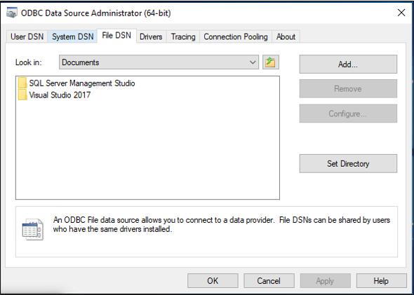</br>
 3. **SQL Server Native Client 11.0**, **다음** 을 차례로 선택합니다. 
     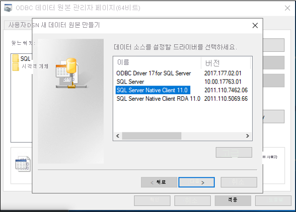</br>
 4. **GenericSQL** 과 같은 파일 이름을 지정하고, **다음** 을 선택합니다. 
     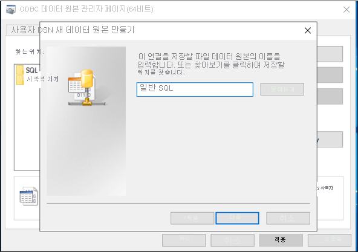</br>
 5. **마침** 을 선택합니다. 
     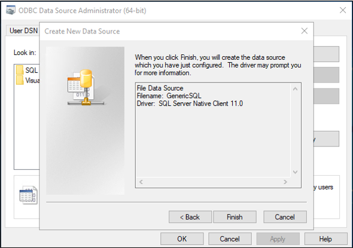</br>
 6. 이제 연결을 구성합니다. 서버 이름에 대해 **APP1** 을 입력하고, **다음** 을 선택합니다.
     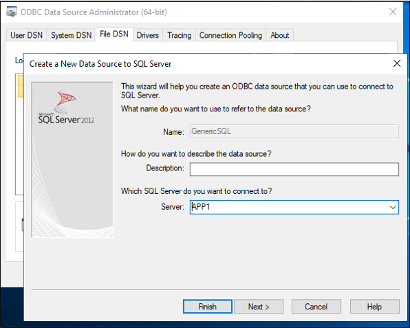</br>
 7. Windows 인증을 유지하고, **다음** 을 선택합니다.
     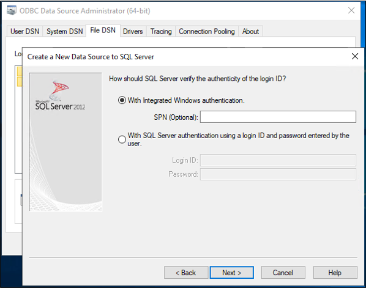</br>
 8. 샘플 데이터베이스의 이름(**CONTOSO**)을 입력합니다.
     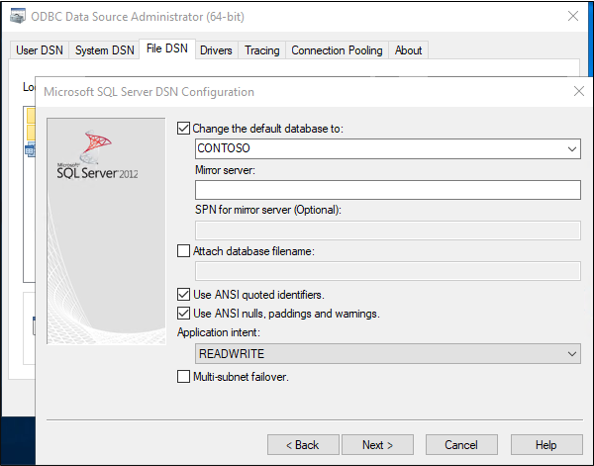
 9. 이 화면에서 모든 항목을 기본값으로 유지하고, **마침** 을 선택합니다.
     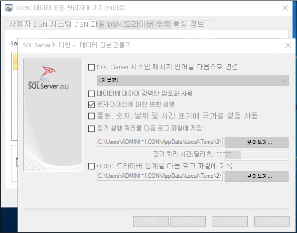</br>
 10. 모든 항목이 예상대로 작동하는지 확인하려면 **데이터 원본 테스트** 를 선택합니다. 
     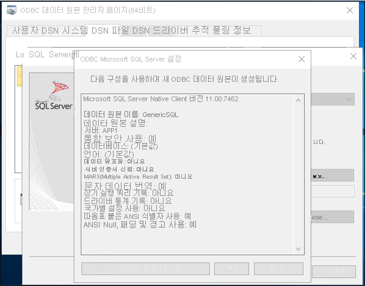</br>
 11. 테스트에 성공했는지 확인합니다.
     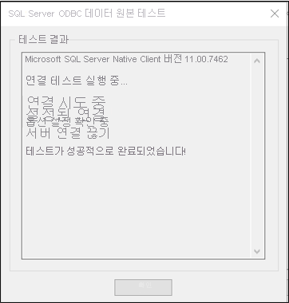</br>
 12. **확인** 을 두 번 선택합니다. ODBC 데이터 원본 관리자를 닫습니다.


## <a name="download-install-and-configure-the-azure-ad-connect-provisioning-agent-package"></a>Azure AD Connect 프로비전 에이전트 패키지 다운로드, 설치 및 구성

 1. Azure Portal에 로그인합니다.
 2. **엔터프라이즈 애플리케이션** > **새 애플리케이션 추가** 로 이동합니다.
 3. **온-프레미스 ECMA 앱** 애플리케이션을 검색하여 테넌트 이미지에 추가합니다.
 4. 추가된 **온-프레미스 ECMA 앱** 을 선택합니다.
 5. **시작** 아래의 **3. 사용자 계정 프로비전** 상자에서 **시작** 을 선택합니다.
 6. 위쪽에서 **프로비전 편집** 을 선택합니다.
 7. **온-프레미스 연결** 아래에서 에이전트 설치 관리자를 다운로드합니다.
 8. Azure AD Connect 프로비저닝 설치 관리자 **AADConnectProvisioningAgentSetup.msi** 를 실행합니다.
 9. **Microsoft Azure AD Connect 프로비저닝 에이전트 패키지** 화면에서 사용 조건에 동의하고 **설치** 를 선택합니다.
     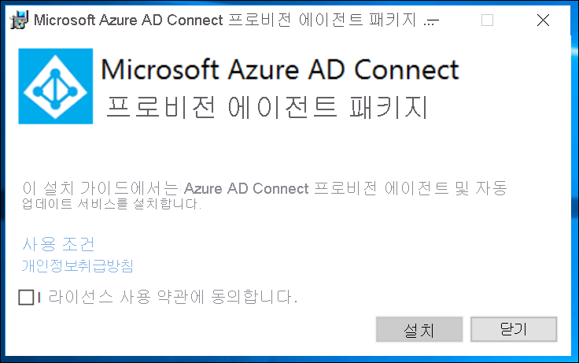</br>
 10. 이 작업이 완료되면 구성 마법사가 시작됩니다. **다음** 을 선택합니다.
     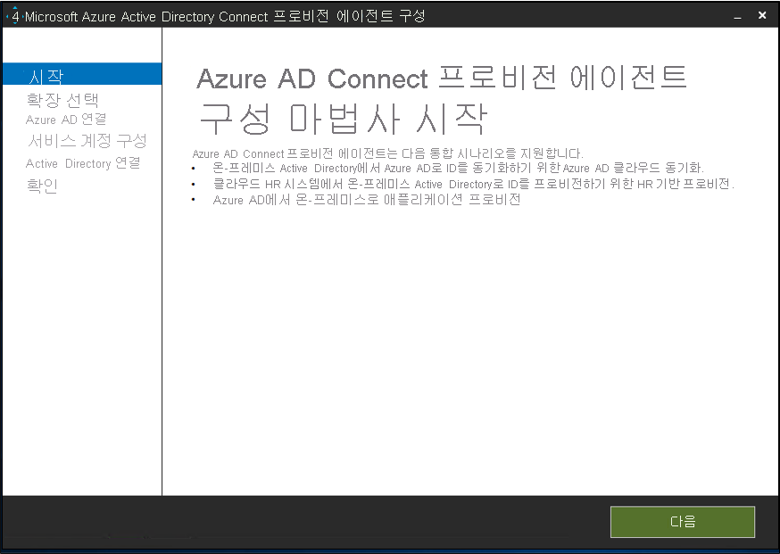</br>
 11. **확장 선택** 화면에서 **온-프레미스 애플리케이션 프로비저닝(Azure AD에서 애플리케이션으로)** 을 선택합니다. **다음** 을 선택합니다.
     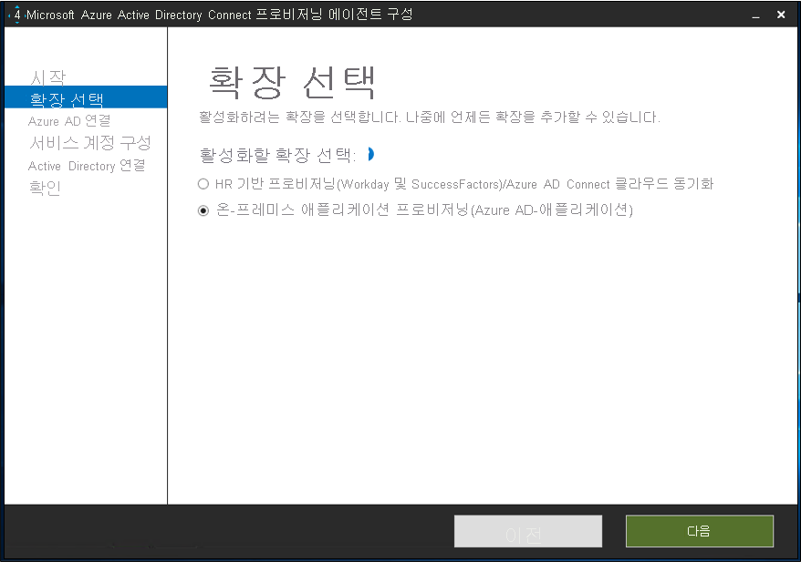</br>
 12. 전역 관리자 계정을 사용하여 Azure AD에 로그인합니다.
     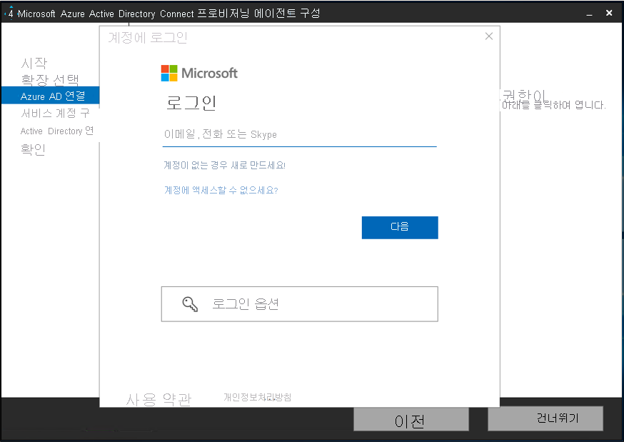</br>
 13. **에이전트 구성** 화면에서 **확인** 을 선택합니다.
     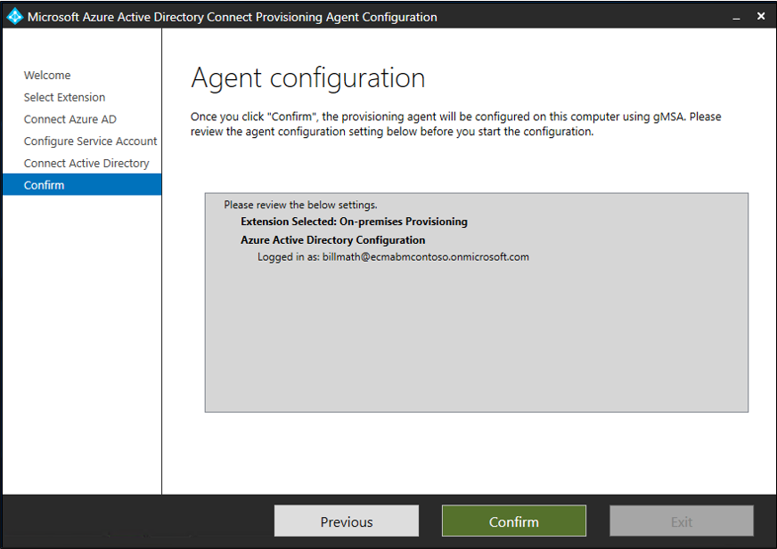</br>
 14. 설치가 완료되면 마법사 아래쪽에 메시지가 표시됩니다. **끝내기** 를 선택합니다.
     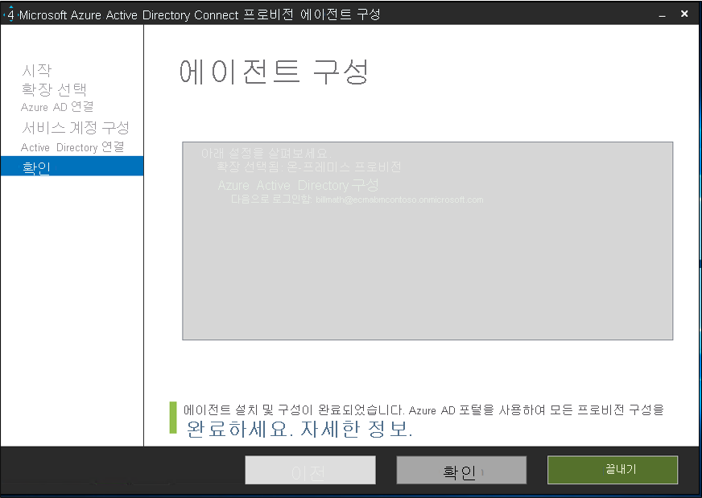</br>
 15. Azure Portal에서 **온-프레미스 ECMA 앱** 애플리케이션 아래의 **프로비전 편집** 으로 돌아갑니다.
 16. **프로비전** 페이지에서 모드를 **자동** 으로 변경합니다.
     </br>
 17. **온-프레미스 연결** 섹션에서 방금 배포한 에이전트를 선택하고, **에이전트 할당** 을 선택합니다.
     </br>
     >[!NOTE]
     >에이전트를 추가한 후 등록이 완료될 때까지 10분 동안 기다립니다. 연결 테스트는 등록이 완료될 때까지 작동하지 않습니다.
     >
     >또는 서버에서 프로비저닝 에이전트를 다시 시작하여 에이전트 등록을 강제로 완료할 수 있습니다. 서버로 이동하고, Windows 검색 창에서 **서비스** 를 검색하고, **Azure AD Connect 프로비전 에이전트 서비스** 를 식별하고, 마우스 오른쪽 단추로 해당 서비스를 클릭하고, 다시 시작합니다.

  
 ## <a name="configure-the-azure-ad-ecma-connector-host-certificate"></a>Azure AD ECMA 커넥터 호스트 인증서 구성
 1. 바탕 화면에서 ECMA 바로 가기를 선택합니다.
 2. ECMA 커넥터 호스트 구성이 시작되면 기본 **8585** 포트를 그대로 두고, **생성** 을 선택하여 인증서를 생성합니다. 자동 생성된 인증서는 신뢰할 수 있는 루트의 일부로 자체 서명됩니다. SAN은 호스트 이름과 일치합니다.
     
 3. **저장** 을 선택합니다.

## <a name="create-a-generic-sql-connector"></a>일반 SQL 커넥터 만들기
 1. 바탕 화면에서 ECMA 커넥터 호스트 바로 가기를 선택합니다.
 2. **새 커넥터** 를 선택합니다.
     </br>
 3. **속성** 페이지에서 상자를 이미지 뒤에 나오는 표에 지정된 값으로 채우고, **다음** 을 선택합니다.
     

     |속성|값|
     |-----|-----|
     |속성|SQL|
     |자동 동기화 타이머(분)|120|
     |비밀 토큰|여기에 사용자 고유의 키를 입력합니다. 12자 이상이어야 합니다.|
     |확장 DLL|일반 SQL 커넥터의 경우 **Microsoft.IAM.Connector.GenericSql.dll** 을 선택합니다.|
4. **연결** 페이지에서 상자를 이미지 뒤에 나오는 표에 지정된 값으로 채우고, **다음** 을 선택합니다.
     </br>
     
     |속성|설명|
     |-----|-----|
     |DSN 파일|SQL Server 인스턴스에 연결하는 데 사용되는 데이터 원본 이름 파일입니다.|
     |사용자 이름|SQL Server 인스턴스에 대한 권한이 있는 개인의 사용자 이름입니다. 독립 실행형 서버의 경우 hostname\sqladminaccount 형식, 도메인 구성원 서버의 경우 domain\sqladminaccount 형식이어야 합니다.|
     |암호|제공한 사용자 이름의 암호입니다.|
     |DN이 앵커입니다.|환경에 필요한 설정이 아닌 경우 **DN이 앵커입니다.** 및 **내보내기 형식:개체 바꾸기** 확인란을 선택하지 않습니다.|
 5. **스키마 1** 페이지에서 상자를 이미지 뒤에 나오는 표에 지정된 값으로 채우고, **다음** 을 선택합니다.
     </br>

     |속성|값|
     |-----|-----|
     |개체 형식 검색 방법|고정 값|
     |고정 값 목록/테이블/보기/SP|사용자|
 6. **스키마 2** 페이지에서 상자를 이미지 뒤에 나오는 표에 지정된 값으로 채우고, **다음** 을 선택합니다.
     </br>
 
     |속성|값|
     |-----|-----|
     |사용자:특성 검색|테이블|
     |사용자:테이블/보기/SP|Employees|
 7. **스키마 3** 페이지에서 상자를 이미지 뒤에 나오는 표에 지정된 값으로 채우고, **다음** 을 선택합니다.
     

     |속성|Description|
     |-----|-----|
     |사용자에 대한 앵커 선택|User:ContosoLogin|
     |사용자에 대한 DN 특성 선택|AzureID|
8. **스키마 4** 페이지에서 기본값을 그대로 두고, **다음** 을 선택합니다.
     </br>
 9. **전체** 페이지에서 상자를 채우고, **다음** 을 선택합니다. 개별 상자에 대한 지침은 이미지 뒤에 나오는 표를 사용합니다.
     </br>
     
     |속성|Description|
     |-----|-----|
     |데이터 원본 날짜 시간 형식|yyyy-MM-dd HH:mm:ss|
 10. **파티션** 페이지에서 **다음** 을 선택합니다.
     </br>
 11. **실행 프로필** 페이지에서 **내보내기** 확인란을 선택한 상태로 유지합니다. **전체 가져오기** 확인란을 선택하고, **다음** 을 선택합니다.
     </br>
     
     |속성|설명|
     |-----|-----|
     |내보내기|데이터를 SQL로 내보내는 실행 프로필입니다. 이 실행 프로필은 필수입니다.|
     |전체 가져오기|이전에 지정한 SQL 원본에서 모든 데이터를 가져오는 실행 프로필입니다.|
     |델타 가져오기|마지막 전체 또는 델타 가져오기 이후의 변경 내용만 SQL에서 가져오는 실행 프로필입니다.|
 12. **내보내기** 페이지에서 상자를 채우고, **다음** 을 선택합니다. 개별 상자에 대한 지침은 이미지 뒤에 나오는 표를 사용합니다. 
     </br>
     
     |속성|Description|
     |-----|-----|
     |작업 방법|테이블|
     |테이블/보기/SP|Employees|
 13. **전체 가져오기** 페이지에서 상자를 채우고, **다음** 을 선택합니다. 개별 상자에 대한 지침은 이미지 뒤에 나오는 표를 사용합니다. 
     </br>
     
     |속성|Description|
     |-----|-----|
     |작업 방법|테이블|
     |테이블/보기/SP|Employees|
 14. **개체 형식** 페이지에서 상자를 채우고, **다음** 을 선택합니다. 개별 상자에 대한 지침은 이미지 뒤에 나오는 표를 사용합니다.   
      - **앵커**: 이 특성은 대상 시스템에서 고유해야 합니다. Azure AD 프로비전 서비스는 초기 주기 후에 이 특성을 사용하여 ECMA 호스트를 쿼리합니다. 이 앵커 값은 스키마 3의 앵커 값과 동일해야 합니다.
      - **쿼리 특성**: ECMA 호스트에서 메모리 내 캐시를 쿼리하는 데 사용됩니다. 이 특성은 고유해야 합니다.
      - **DN**: 대부분의 경우 **자동 생성됨** 옵션을 선택해야 합니다. 선택되지 않은 경우 DN 특성이 DN을 CN = anchorValue, Object = objectType 형식으로 저장하는 Azure AD의 특성에 매핑되었는지 확인합니다.  앵커 및 DN에 대한 자세한 내용은 [앵커 특성 및 고유 이름 정보](../articles/active-directory/app-provisioning/on-premises-application-provisioning-architecture.md#about-anchor-attributes-and-distinguished-names)를 참조하세요.
     </br>
     
     |속성|Description|
     |-----|-----|
     |대상 개체|사용자|
     |앵커|ContosoLogin|
     |쿼리 특성|AzureID|
     |DN|AzureID|
     |Autogenerated|선택됨|      
 15. ECMA 호스트는 대상 시스템에서 지원하는 특성을 검색합니다. 해당 특성 중에서 Azure AD에 노출할 특성을 선택할 수 있습니다. 그런 다음, 프로비전을 위해 Azure Portal에서 이러한 특성을 구성할 수 있습니다. **특성 선택** 페이지의 드롭다운 목록에서 모든 특성을 추가하고, **다음** 을 선택합니다. 
     </br>
      **특성** 드롭다운 목록에는 대상 시스템에서 검색되었지만 이전 **특성 선택** 페이지에서 선택하지 *않은* 속성이 표시됩니다. 
 
 16. **프로비전 해제** 페이지의 **흐름 사용 안 함** 아래에서 **삭제** 를 선택합니다. 이전 페이지에서 선택한 특성은 [프로비전 해제] 페이지에서 선택할 수 없습니다. **마침** 을 선택합니다.
     </br>


## <a name="ensure-ecma2host-service-is-running"></a>ECMA2Host 서비스가 실행되고 있는지 확인
 1. Azure AD ECMA 커넥터 호스트를 실행하는 서버에서 **시작** 을 선택합니다.
 2. 상자에서 **run**, **services.msc** 를 차례로 입력합니다.
 3. **서비스** 목록에서 **Microsoft ECMA2Host** 가 있고 실행 중인지 확인합니다. 그렇지 않은 경우 **시작** 을 선택합니다.
     


## <a name="test-the-application-connection"></a>애플리케이션 연결 테스트
 1. Azure Portal에 로그인합니다.
 2. **엔터프라이즈 애플리케이션** 및 **온-프레미스 ECMA 앱** 애플리케이션으로 이동합니다.
 3. **프로비전 편집** 으로 이동합니다.
 4. 10분 후 **관리자 자격 증명** 섹션에서 다음 URL을 입력합니다. `connectorName` 부분을 ECMA 호스트의 커넥터 이름으로 바꿉니다. 또한 `localhost`를 호스트 이름으로 바꿀 수도 있습니다.

 |속성|값|
 |-----|-----|
 |테넌트 URL|https://localhost:8585/ecma2host_connectorName/scim|
 
 5. 커넥터를 만들 때 정의한 **비밀 토큰** 값을 입력합니다.
 6. **연결 테스트** 를 선택하고, 1분 동안 기다립니다.
     
 7. 연결 테스트가 성공하면 **저장** 을 선택합니다.</br>
     
## <a name="assign-users-to-an-application"></a>애플리케이션에 사용자 할당
이제 Azure AD와 통신하는 Azure AD ECMA 커넥터 호스트가 있으므로 프로비전 범위에 있는 사용자를 구성하기 위해 이동할 수 있습니다. 

 1. Azure Portal에서 **엔터프라이즈 애플리케이션** 을 선택합니다.
 2. **온-프레미스 프로비전** 애플리케이션을 선택합니다.
 3. 왼쪽의 **관리** 아래에서 **사용자 및 그룹** 을 선택합니다.
 4. **사용자/그룹 추가** 를 선택합니다.
     
5. **사용자** 아래에서 **선택된 항목 없음** 을 선택합니다.
     
 6. 오른쪽에서 사용자를 선택하고, **선택** 단추를 선택합니다.</br>
     
 7. 이제 **할당** 을 선택합니다.
     

## <a name="configure-attribute-mappings"></a>특성 매핑 구성
이제 온-프레미스 애플리케이션과 SQL 서버 간에 특성을 매핑해야 합니다.

#### <a name="configure-attribute-mapping"></a>특성 매핑 구성
 1. Azure AD 포털의 **엔터프라이즈 애플리케이션** 에서 **프로비전** 페이지를 선택합니다.
 2. **시작** 을 선택합니다.
 3. **매핑** 을 펼치고, **Azure Active Directory 사용자 프로비전** 을 선택합니다.
     </br>
4. **새 매핑 추가** 를 선택합니다.
     </br>
 5. 원본 및 대상 특성을 지정하고, 다음 표에 있는 모든 매핑을 추가합니다.
     </br>
     
     |매핑 유형|원본 특성|대상 특성|
     |-----|-----|-----|
     |직접|userPrincipalName|urn:ietf:params:scim:schemas:extension:ECMA2Host:2.0:User:ContosoLogin|
     |직접|objectID|urn:ietf:params:scim:schemas:extension:ECMA2Host:2.0:User:AzureID|
     |직접|mail|urn:ietf:params:scim:schemas:extension:ECMA2Host:2.0:User:Email|
     |직접|givenName|urn:ietf:params:scim:schemas:extension:ECMA2Host:2.0:User:FirstName|
     |직접|surName|urn:ietf:params:scim:schemas:extension:ECMA2Host:2.0:User:LastName|
     |직접|mailNickname|urn:ietf:params:scim:schemas:extension:ECMA2Host:2.0:User:textID|
 
 6. **저장** 을 선택합니다.
     
## <a name="test-provisioning"></a>프로비저닝 테스트
이제 특성이 매핑되었으므로 사용자 중 한 명과 주문형 프로비전을 테스트할 수 있습니다.
 
 1. Azure Portal에서 **엔터프라이즈 애플리케이션** 을 선택합니다.
 2. **온-프레미스 프로비전** 애플리케이션을 선택합니다.
 3. 왼쪽에서 **프로비전** 을 선택합니다.
 4. **주문형 프로비전** 을 선택합니다.
 5. 테스트 사용자 중 한 명을 검색하고, **프로비전** 을 선택합니다.
     

## <a name="start-provisioning-users"></a>사용자 프로비저닝 시작
 1. 주문형 프로비전이 성공하면 프로비전 구성 페이지로 다시 변경합니다. 범위가 할당된 사용자 및 그룹으로만 설정되어 있는지 확인하고, 프로비전을 **켜기** 로 설정하고, **저장** 을 선택합니다.
 
    
2. 프로비전이 시작될 때까지 몇 분 정도 기다립니다. 최대 40분이 걸릴 수 있습니다. 프로비전 작업이 완료되면 다음 섹션에서 설명한 대로 프로비전 상태를 **끄기** 로 변경하고, **저장** 을 선택할 수 있습니다. 이 작업은 나중에 프로비전 서비스의 실행을 중지합니다.

## <a name="check-that-users-were-successfully-provisioned"></a>사용자가 성공적으로 프로비전되었는지 확인
기다린 후에 SQL 데이터베이스를 확인하여 사용자가 프로비전되었는지 확인합니다.

 

## <a name="appendix-a"></a>부록 A
다음 SQL 스크립트를 사용하여 샘플 데이터베이스를 만듭니다.

```SQL
---Creating the Database---------
Create Database CONTOSO
Go
-------Using the Database-----------
Use [CONTOSO]
Go
-------------------------------------

/****** Object:  Table [dbo].[Employees]    Script Date: 1/6/2020 7:18:19 PM ******/
SET ANSI_NULLS ON
GO

SET QUOTED_IDENTIFIER ON
GO

CREATE TABLE [dbo].[Employees](
    [ContosoLogin] [nvarchar](128) NULL,
    [FirstName] [nvarchar](50) NOT NULL,
    [LastName] [nvarchar](50) NOT NULL,
    [Email] [nvarchar](128) NULL,
    [InternalGUID] [uniqueidentifier] NULL,
    [AzureID] [uniqueidentifier] NULL,
    [textID] [nvarchar](128) NULL
) ON [PRIMARY]
GO

ALTER TABLE [dbo].[Employees] ADD  CONSTRAINT [DF_Employees_InternalGUID]  DEFAULT (newid()) FOR [InternalGUID]
GO

```


