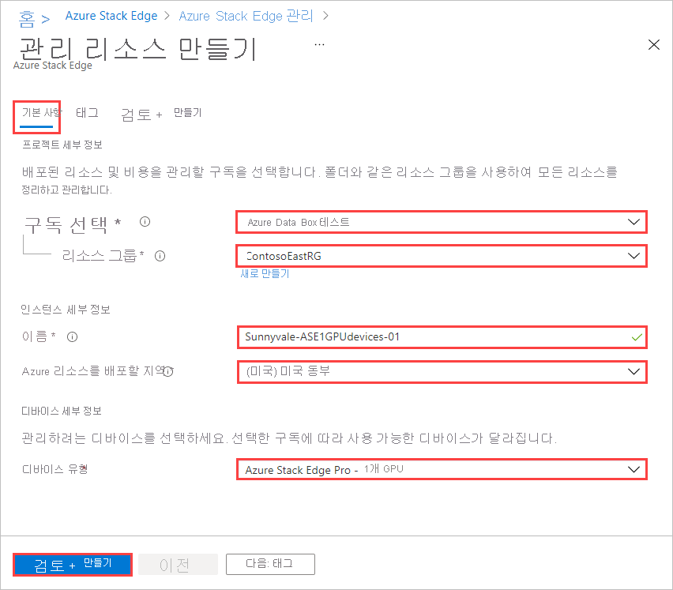
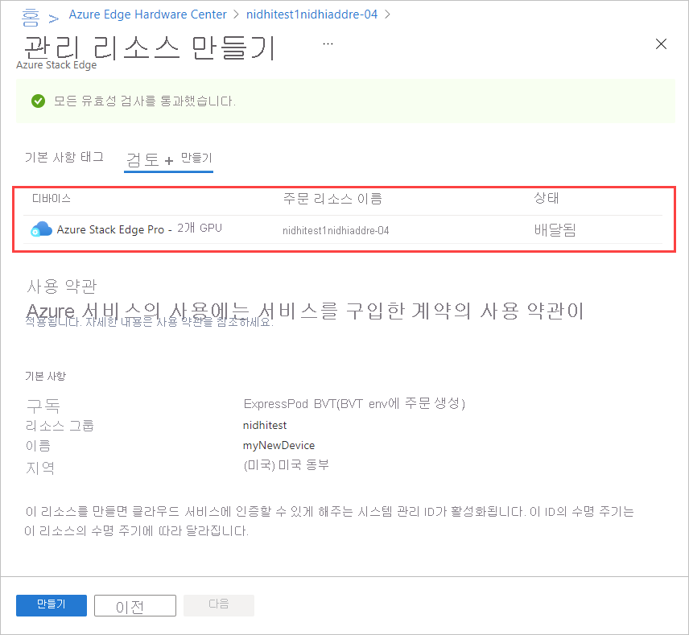
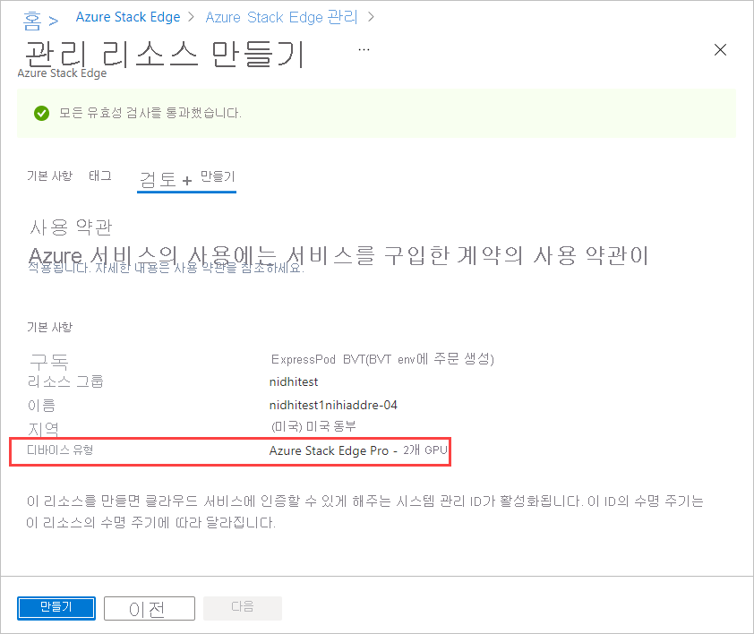

Azure Edge Hardware Center를 통해 주문된 디바이스의 관리 리소스를 만들려면 다음 단계를 수행합니다.

1. Microsoft Azure 자격 증명을 사용하여 [https://portal.azure.com](https://portal.azure.com) URL에서 Azure Portal에 로그인합니다.

1. 새 관리 리소스 만들기를 시작하려면 두 가지 방법이 있습니다.

    - Azure Edge Hardware Center를 통해 **Azure Edge Hardware Center** 를 검색하고 선택합니다. Hardware Center에서 **모든 주문 항목** 을 표시합니다. **이름** 항목을 클릭합니다. **개요** 항목에서 **하드웨어 구성** 을 선택합니다.
    
       디바이스가 배송된 후 **하드웨어 구성** 옵션이 표시됩니다. 

        
    
    - Azure Stack Edge에서 **Azure Stack Edge** 를 검색하고 선택합니다. **+ 만들기** 를 선택합니다. 그런 다음, **관리 리소스 만들기** 를 선택합니다.
    
        

    **관리 리소스 만들기** 마법사가 열립니다.

1. **기본 사항** 탭에서 다음 설정을 입력합니다.

    |설정                                  |값                                                                                       |
    |-----------------------------------------|--------------------------------------------------------------------------------------------|
    |**구독 선택**1    |관리 리소스에 사용할 구독을 선택합니다.                                 |
    |**리소스 그룹**1           |관리 리소스에 사용할 리소스 그룹을 선택합니다. |
    |**이름**                                 |관리 리소스의 이름을 제공합니다.                                                 |
    |**다음에 Azure 리소스 배포**             |관리 리소스의 메타데이터가 저장될 국가 또는 지역을 선택합니다. 메타데이터는 물리적 디바이스와 다른 위치에 저장될 수 있습니다. |
    |**디바이스 유형**2              |디바이스 유형을 선택합니다. 이 옵션은 Azure Edge Hardware Center 주문에서 하드웨어 제품으로 선택된 구성에 해당합니다. 예를 들어 Azure Stack Edge Pro - GPU 디바이스의 경우 디바이스 유형은 **Azure Stack Edge Pro - 1 GPU** 또는 **Azure Stack Edge Pro - 1 GPU** 입니다.|       

    1 조직은 다른 구독 및 리소스 그룹을 사용하여 관리에 사용되는 것과 다른 디바이스를 주문할 수 있습니다.

    2 주문 항목에서 **하드웨어 구성** 을 사용할 때 주문 항목에서 디바이스 유형을 가져오고 **디바이스 세부 정보** 가 표시되지 않습니다. 

    

    **검토 + 만들기** 를 선택하여 계속 진행합니다.

5. **검토 + 만들기** 탭에서 관리 리소스의 기본 설정 및 사용 약관을 검토합니다. 그런 다음 **생성** 를 선택합니다.

    - Azure Edge Hardware Center 주문에서 배달된 항목에 대해 **하드웨어 구성** 을 클릭하여 이 절차를 시작한 경우, 디바이스, 주문 리소스 이름 및 주문 상태가 화면 위쪽에 나열됩니다. 

      

    - Azure Stack Edge에서 시작한 경우 디바이스 주문 정보 대신 디바이스 유형이 **기본** 에 나열됩니다. 

        

    **만들기** 단추는 모든 유효성 검사가 통과할 때까지 사용할 수 없습니다.

6. 프로세스가 완료되면 새 리소스의 개요 창이 열립니다.

     
